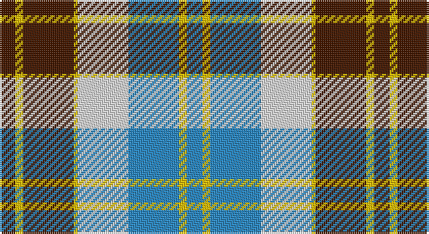

This page is one **sett** — a single exact thread-count. It belongs to the [tartan](/setts/do4ly2do13ly1w13t13ly2t4/)
(the same proportion at any scale), whose colour order is pattern [BYBWYBYB](/stripes/bybwybyb/).

Sourced from register-of-tartans.  It is a [8 stripe tartan](/stripes/stripes8/).

Original link https://www.tartanregister.gov.uk/tartanDetails.aspx?ref=206

## Also known as

This cloth is also recorded under:

- Bannockbane, Tan

2 attestations — the source records this cloth was collapsed from (oldest owns this page)

<ul>
<li>01/01/1975 — Bannockbane Tan (register-of-tartans, <a href="https://www.tartanregister.gov.uk/tartanDetails.aspx?ref=206">record</a>)</li>
<li>pre 1975 — Bannockbane, Tan (Fashion) (tartans-authority, <a href="http://www.tartansauthority.com/tartan-ferret/display/669/">record</a>)</li>
</ul>

## Register references

External register numbers recorded for this tartan.

- Scottish Register of Tartans: [206](https://www.tartanregister.gov.uk/tartanDetails.aspx?ref=206)
- Scottish Tartans Authority (ITI): 669
- Scottish Tartans World Register: 669

## Thread count
DR/8 Y4 DR26 Y2 LN26 B26 Y4 B/8

One full sett is **192 threads**.

## Palette

Palette: <strong>Tartan Register</strong>
<table><thead><tr><th>Colour</th><th>Threads</th><th>Shade</th><th>Base</th><th>OKLCh</th></tr></thead><tbody><tr><td>DR/</td><td style="text-align:right;font-variant-numeric:tabular-nums">8</td><td><code style="background-color:#441800;">#441800</code> <small style="color:#888">#441800</small></td><td>B <code style="background-color:#2A418A;">#2A418A</code></td><td><small style="color:#888">oklch(27.3% 0.076 46.3)</small></td></tr><tr><td>Y</td><td style="text-align:right;font-variant-numeric:tabular-nums">4</td><td><code style="background-color:#E8C000;">#E8C000</code> <small style="color:#888">#E8C000</small></td><td>Y <code style="background-color:#F2BF00;">#F2BF00</code></td><td><small style="color:#888">oklch(81.9% 0.168 93.7)</small></td></tr><tr><td>DR</td><td style="text-align:right;font-variant-numeric:tabular-nums">26</td><td><code style="background-color:#441800;">#441800</code> <small style="color:#888">#441800</small></td><td>B <code style="background-color:#2A418A;">#2A418A</code></td><td><small style="color:#888">oklch(27.3% 0.076 46.3)</small></td></tr><tr><td>Y</td><td style="text-align:right;font-variant-numeric:tabular-nums">2</td><td><code style="background-color:#E8C000;">#E8C000</code> <small style="color:#888">#E8C000</small></td><td>Y <code style="background-color:#F2BF00;">#F2BF00</code></td><td><small style="color:#888">oklch(81.9% 0.168 93.7)</small></td></tr><tr><td>LN</td><td style="text-align:right;font-variant-numeric:tabular-nums">26</td><td><code style="background-color:#E0E0E0;">#E0E0E0</code> <small style="color:#888">#E0E0E0</small></td><td>W <code style="background-color:#F7F7F7;">#F7F7F7</code></td><td><small style="color:#888">oklch(90.7% 0.000 89.9)</small></td></tr><tr><td>B</td><td style="text-align:right;font-variant-numeric:tabular-nums">26</td><td><code style="background-color:#2888C4;">#2888C4</code> <small style="color:#888">#2888C4</small></td><td>B <code style="background-color:#2A418A;">#2A418A</code></td><td><small style="color:#888">oklch(60.1% 0.125 241.5)</small></td></tr><tr><td>Y</td><td style="text-align:right;font-variant-numeric:tabular-nums">4</td><td><code style="background-color:#E8C000;">#E8C000</code> <small style="color:#888">#E8C000</small></td><td>Y <code style="background-color:#F2BF00;">#F2BF00</code></td><td><small style="color:#888">oklch(81.9% 0.168 93.7)</small></td></tr><tr><td>B/</td><td style="text-align:right;font-variant-numeric:tabular-nums">8</td><td><code style="background-color:#2888C4;">#2888C4</code> <small style="color:#888">#2888C4</small></td><td>B <code style="background-color:#2A418A;">#2A418A</code></td><td><small style="color:#888">oklch(60.1% 0.125 241.5)</small></td></tr></tbody></table>

# Sample pattern

## Nearest tartans

The nearest existing variants by ΔTartan distance, with this tartan at the top so the swatches line up against it.

ΔTartan

Tartan

Sett

—

<a href="/ttd/edit/#slug=do4ly2do13ly1w13t13ly2t4~x2">Bannockbane Tan</a> <a class="nn-out" href="/variants/s8/do4ly2do13ly1w13t13ly2t4~x2/" title="open its dictionary page">↗</a>

0.61

<a href="/ttd/edit/#slug=dr4ly2dr13ly1w8t13ly2t4~x2&amp;base=do4ly2do13ly1w13t13ly2t4~x2">Bannockbane, Dark Tan</a> <a class="nn-out" href="/variants/s8/dr4ly2dr13ly1w8t13ly2t4~x2/" title="open its dictionary page">↗</a>

0.72

<a href="/ttd/edit/#slug=k4ly2k13ly1w8o13ly2o4~x2&amp;base=do4ly2do13ly1w13t13ly2t4~x2">Bannockbane Grey #1</a> <a class="nn-out" href="/variants/s8/k4ly2k13ly1w8o13ly2o4~x2/" title="open its dictionary page">↗</a>

0.74

<a href="/ttd/edit/#slug=dg3o2dg14o1w10y14o2y3~x2&amp;base=do4ly2do13ly1w13t13ly2t4~x2">Bannockbane Hunting (MacBean and Bishop)</a> <a class="nn-out" href="/variants/s8/dg3o2dg14o1w10y14o2y3~x2/" title="open its dictionary page">↗</a>

0.95

<a href="/ttd/edit/#slug=db24r4g24r4w20r10g3w4~x2&amp;base=do4ly2do13ly1w13t13ly2t4~x2">Robertson Dress (Dalgleish) #2</a> <a class="nn-out" href="/variants/s8/db24r4g24r4w20r10g3w4~x2/" title="open its dictionary page">↗</a>

1.00

<a href="/ttd/edit/#slug=r5w36dp14r9g28r8dp2~x2&amp;base=do4ly2do13ly1w13t13ly2t4~x2">MacKintosh (Artefact)</a> <a class="nn-out" href="/variants/s7/r5w36dp14r9g28r8dp2~x2/" title="open its dictionary page">↗</a>

1.01

<a href="/ttd/edit/#slug=db4dy3db21dy2w14o22dy3o4~x2&amp;base=do4ly2do13ly1w13t13ly2t4~x2">Bannock Bane M.407</a> <a class="nn-out" href="/variants/s8/db4dy3db21dy2w14o22dy3o4~x2/" title="open its dictionary page">↗</a>

1.01

<a href="/ttd/edit/#slug=db24r4g24r4db4w20r10g3w4~x2&amp;base=do4ly2do13ly1w13t13ly2t4~x2">Robertson, dress</a> <a class="nn-out" href="/variants/s9/db24r4g24r4db4w20r10g3w4~x2/" title="open its dictionary page">↗</a>

1.03

<a href="/ttd/edit/#slug=dt8w22dt5w4k24r6k2r6~x2&amp;base=do4ly2do13ly1w13t13ly2t4~x2">Unidentified (ex Tony Murray)</a> <a class="nn-out" href="/variants/s8/dt8w22dt5w4k24r6k2r6~x2/" title="open its dictionary page">↗</a>

1.09

<a href="/ttd/edit/#slug=g5ly2t20w2k20w20k2w5~x2&amp;base=do4ly2do13ly1w13t13ly2t4~x2">Alexander Brothers - 2007? (Corp.)</a> <a class="nn-out" href="/variants/s8/g5ly2t20w2k20w20k2w5~x2/" title="open its dictionary page">↗</a>

1.10

<a href="/ttd/edit/#slug=dg2dr8dg8o3dr1w12dg2dr1~x2&amp;base=do4ly2do13ly1w13t13ly2t4~x2">National Trust</a> <a class="nn-out" href="/variants/s8/dg2dr8dg8o3dr1w12dg2dr1~x2/" title="open its dictionary page">↗</a>

## Neighbour map

Every grey dot is one of 14360 variants placed by the first two principal components of the ΔTartan feature space (44% of its variance). Red is this tartan; blue dots are its nearest — click one to open its page.

<svg viewBox="0 0 640 380" role="img" style="max-width:100%;height:auto;border:1px solid #e0e0e0;border-radius:4px;display:block" xmlns="http://www.w3.org/2000/svg"><image href="/nn/cloud.v1.png" width="640" height="380"/><a href="/variants/s8/dr4ly2dr13ly1w8t13ly2t4~x2/"><circle cx="163.3" cy="171.8" r="4" fill="#3465a4"><title>Bannockbane, Dark Tan</title></circle></a><a href="/variants/s8/k4ly2k13ly1w8o13ly2o4~x2/"><circle cx="151.5" cy="167.9" r="4" fill="#3465a4"><title>Bannockbane Grey #1</title></circle></a><a href="/variants/s8/dg3o2dg14o1w10y14o2y3~x2/"><circle cx="167.2" cy="168.1" r="4" fill="#3465a4"><title>Bannockbane Hunting (MacBean and Bishop)</title></circle></a><a href="/variants/s8/db24r4g24r4w20r10g3w4~x2/"><circle cx="105.6" cy="189.9" r="4" fill="#3465a4"><title>Robertson Dress (Dalgleish) #2</title></circle></a><a href="/variants/s7/r5w36dp14r9g28r8dp2~x2/"><circle cx="166.1" cy="157.4" r="4" fill="#3465a4"><title>MacKintosh (Artefact)</title></circle></a><a href="/variants/s8/db4dy3db21dy2w14o22dy3o4~x2/"><circle cx="158.8" cy="167.8" r="4" fill="#3465a4"><title>Bannock Bane M.407</title></circle></a><a href="/variants/s9/db24r4g24r4db4w20r10g3w4~x2/"><circle cx="110.0" cy="183.4" r="4" fill="#3465a4"><title>Robertson, dress</title></circle></a><a href="/variants/s8/dt8w22dt5w4k24r6k2r6~x2/"><circle cx="139.6" cy="165.6" r="4" fill="#3465a4"><title>Unidentified (ex Tony Murray)</title></circle></a><a href="/variants/s8/g5ly2t20w2k20w20k2w5~x2/"><circle cx="120.1" cy="154.5" r="4" fill="#3465a4"><title>Alexander Brothers - 2007? (Corp.)</title></circle></a><a href="/variants/s8/dg2dr8dg8o3dr1w12dg2dr1~x2/"><circle cx="143.4" cy="169.9" r="4" fill="#3465a4"><title>National Trust</title></circle></a><circle cx="141.7" cy="168.9" r="5" fill="#c00000"/></svg>

ID: /variants/s8/do4ly2do13ly1w13t13ly2t4~x2/
