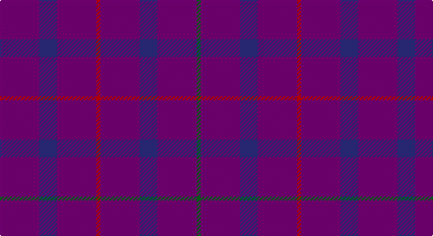

This page is one **sett** — a single exact thread-count. It belongs to the [tartan](/setts/dp20db9dp20r2dp20db9dp20g2/)
(the same proportion at any scale), whose colour order is pattern [BBBRBBBG](/stripes/bbbrbbbg/).

Part of the [Scottish Netball Association](/tartans/scottish-netball-association/) tartan — the named design grouping this sett with its other cloths.

Sourced from register-of-tartans.  It is a [8 stripe tartan](/stripes/stripes8/).

Original link https://www.tartanregister.gov.uk/tartanDetails.aspx?ref=3734

## Also known as

This cloth is also recorded under:

- Scottish Netball

## Register references

External register numbers recorded for this tartan.

- Scottish Register of Tartans: [3734](https://www.tartanregister.gov.uk/tartanDetails.aspx?ref=3734)
- Scottish Tartans Authority (ITI): 689
- Scottish Tartans World Register: 689

## Thread count
P/40 DB18 P40 R4 P40 DB18 P40 G/4

One full sett is **364 threads**.

## Palette

Palette: <strong>Tartan Register</strong>
<table><thead><tr><th>Colour</th><th>Threads</th><th>Shade</th><th>Base</th><th>OKLCh</th></tr></thead><tbody><tr><td>P/</td><td style="text-align:right;font-variant-numeric:tabular-nums">40</td><td><code style="background-color:#780078;">#780078</code> <small style="color:#888">#780078</small></td><td>B <code style="background-color:#2A418A;">#2A418A</code></td><td><small style="color:#888">oklch(40.2% 0.185 328.4)</small></td></tr><tr><td>DB</td><td style="text-align:right;font-variant-numeric:tabular-nums">18</td><td><code style="background-color:#2C2C80;">#2C2C80</code> <small style="color:#888">#2C2C80</small></td><td>B <code style="background-color:#2A418A;">#2A418A</code></td><td><small style="color:#888">oklch(35.0% 0.138 276.6)</small></td></tr><tr><td>P</td><td style="text-align:right;font-variant-numeric:tabular-nums">40</td><td><code style="background-color:#780078;">#780078</code> <small style="color:#888">#780078</small></td><td>B <code style="background-color:#2A418A;">#2A418A</code></td><td><small style="color:#888">oklch(40.2% 0.185 328.4)</small></td></tr><tr><td>R</td><td style="text-align:right;font-variant-numeric:tabular-nums">4</td><td><code style="background-color:#C80000;">#C80000</code> <small style="color:#888">#C80000</small></td><td>R <code style="background-color:#CC0000;">#CC0000</code></td><td><small style="color:#888">oklch(52.3% 0.215 29.2)</small></td></tr><tr><td>P</td><td style="text-align:right;font-variant-numeric:tabular-nums">40</td><td><code style="background-color:#780078;">#780078</code> <small style="color:#888">#780078</small></td><td>B <code style="background-color:#2A418A;">#2A418A</code></td><td><small style="color:#888">oklch(40.2% 0.185 328.4)</small></td></tr><tr><td>DB</td><td style="text-align:right;font-variant-numeric:tabular-nums">18</td><td><code style="background-color:#2C2C80;">#2C2C80</code> <small style="color:#888">#2C2C80</small></td><td>B <code style="background-color:#2A418A;">#2A418A</code></td><td><small style="color:#888">oklch(35.0% 0.138 276.6)</small></td></tr><tr><td>P</td><td style="text-align:right;font-variant-numeric:tabular-nums">40</td><td><code style="background-color:#780078;">#780078</code> <small style="color:#888">#780078</small></td><td>B <code style="background-color:#2A418A;">#2A418A</code></td><td><small style="color:#888">oklch(40.2% 0.185 328.4)</small></td></tr><tr><td>G/</td><td style="text-align:right;font-variant-numeric:tabular-nums">4</td><td><code style="background-color:#006818;">#006818</code> <small style="color:#888">#006818</small></td><td>G <code style="background-color:#006100;">#006100</code></td><td><small style="color:#888">oklch(45.0% 0.142 145.0)</small></td></tr></tbody></table>

# Sample pattern

## Compared to the master

This cloth is one sett of its design; the master sett (the exemplar the design is anchored on) is below for comparison.

<figure style="margin:0"><figcaption style="color:#888;font-size:smaller">this sett</figcaption></figure>
<figure style="margin:0"><figcaption style="color:#888;font-size:smaller"><a href="/setts/dp3g14m2dp10g2m14dp3/">master sett →</a></figcaption></figure>

## Nearest tartans

The nearest existing variants by ΔTartan distance, with this tartan at the top so the swatches line up against it.

ΔTartan

Tartan

Sett

—

<a href="/ttd/edit/#slug=dp20db9dp20r2dp20db9dp20g2~x2">Scottish Netball Association (1987)</a> <a class="nn-out" href="/variants/s8/dp20db9dp20r2dp20db9dp20g2~x2/" title="open its dictionary page">↗</a>

1.59

<a href="/ttd/edit/#slug=r2dp20db9dp20g2~x2&amp;base=dp20db9dp20r2dp20db9dp20g2~x2">Scottish Netball (1987) (Corporate)</a> <a class="nn-out" href="/variants/s5/r2dp20db9dp20g2~x2/" title="open its dictionary page">↗</a>

1.87

<a href="/ttd/edit/#slug=dp30db10m5db10dp30db3dpi5db3dp30~x2&amp;base=dp20db9dp20r2dp20db9dp20g2~x2">Meanwood McMain (Personal)</a> <a class="nn-out" href="/variants/s9/dp30db10m5db10dp30db3dpi5db3dp30~x2/" title="open its dictionary page">↗</a>

1.89

<a href="/ttd/edit/#slug=r2p20db9p20g2~x2&amp;base=dp20db9dp20r2dp20db9dp20g2~x2">Scottish Netball Association</a> <a class="nn-out" href="/variants/s5/r2p20db9p20g2~x2/" title="open its dictionary page">↗</a>

3.09

<a href="/ttd/edit/#slug=db4dr16o6dr16o6dr16db8dr6db4dr16db2o1~x2&amp;base=dp20db9dp20r2dp20db9dp20g2~x2">Thomas Blake Glover</a> <a class="nn-out" href="/variants/s12/db4dr16o6dr16o6dr16db8dr6db4dr16db2o1~x2/" title="open its dictionary page">↗</a>

3.11

<a href="/variants/s16/dp30db10m5db10dp30db3dpi5db3dp30~x2/">Meanwood McMain Personal Tartan</a>

3.17

<a href="/ttd/edit/#slug=db16m4db3r1~x2&amp;base=dp20db9dp20r2dp20db9dp20g2~x2">Elliot</a> <a class="nn-out" href="/variants/s4/db16m4db3r1~x2/" title="open its dictionary page">↗</a>

3.33

<a href="/ttd/edit/#slug=db16dr4db3r1~x6&amp;base=dp20db9dp20r2dp20db9dp20g2~x2">Elliot Clan Tartan</a> <a class="nn-out" href="/variants/s4/db16dr4db3r1~x6/" title="open its dictionary page">↗</a>

3.35

<a href="/ttd/edit/#slug=dp5g2dp19r5~x2&amp;base=dp20db9dp20r2dp20db9dp20g2~x2">Highland Spring Corporate Tartan</a> <a class="nn-out" href="/variants/s4/dp5g2dp19r5~x2/" title="open its dictionary page">↗</a>

3.39

<a href="/ttd/edit/#slug=db44dy12db9r3~x2&amp;base=dp20db9dp20r2dp20db9dp20g2~x2">Elliot (Clan)</a> <a class="nn-out" href="/variants/s4/db44dy12db9r3~x2/" title="open its dictionary page">↗</a>

3.44

<a href="/ttd/edit/#slug=db9dy12db44dy12db9r3~x2&amp;base=dp20db9dp20r2dp20db9dp20g2~x2">Elliot</a> <a class="nn-out" href="/variants/s6/db9dy12db44dy12db9r3~x2/" title="open its dictionary page">↗</a>

## Neighbour map

Every grey dot is one of 14360 variants placed by the first two principal components of the ΔTartan feature space (44% of its variance). Red is this tartan; blue dots are its nearest — click one to open its page.

<svg viewBox="0 0 640 380" role="img" style="max-width:100%;height:auto;border:1px solid #e0e0e0;border-radius:4px;display:block" xmlns="http://www.w3.org/2000/svg"><image href="/nn/cloud.v1.png" width="640" height="380"/><a href="/variants/s5/r2dp20db9dp20g2~x2/"><circle cx="555.3" cy="281.7" r="4" fill="#3465a4"><title>Scottish Netball (1987) (Corporate)</title></circle></a><a href="/variants/s9/dp30db10m5db10dp30db3dpi5db3dp30~x2/"><circle cx="539.3" cy="272.9" r="4" fill="#3465a4"><title>Meanwood McMain (Personal)</title></circle></a><a href="/variants/s5/r2p20db9p20g2~x2/"><circle cx="542.8" cy="273.5" r="4" fill="#3465a4"><title>Scottish Netball Association</title></circle></a><a href="/variants/s12/db4dr16o6dr16o6dr16db8dr6db4dr16db2o1~x2/"><circle cx="502.1" cy="246.3" r="4" fill="#3465a4"><title>Thomas Blake Glover</title></circle></a><a href="/variants/s16/dp30db10m5db10dp30db3dpi5db3dp30~x2/"><circle cx="457.4" cy="234.4" r="4" fill="#3465a4"><title>Meanwood McMain Personal Tartan</title></circle></a><a href="/variants/s4/db16m4db3r1~x2/"><circle cx="626.0" cy="291.5" r="4" fill="#3465a4"><title>Elliot</title></circle></a><a href="/variants/s4/db16dr4db3r1~x6/"><circle cx="626.0" cy="305.6" r="4" fill="#3465a4"><title>Elliot Clan Tartan</title></circle></a><a href="/variants/s4/dp5g2dp19r5~x2/"><circle cx="560.6" cy="272.3" r="4" fill="#3465a4"><title>Highland Spring Corporate Tartan</title></circle></a><a href="/variants/s4/db44dy12db9r3~x2/"><circle cx="611.5" cy="290.9" r="4" fill="#3465a4"><title>Elliot (Clan)</title></circle></a><a href="/variants/s6/db9dy12db44dy12db9r3~x2/"><circle cx="532.0" cy="267.8" r="4" fill="#3465a4"><title>Elliot</title></circle></a><circle cx="584.8" cy="294.6" r="5" fill="#c00000"/></svg>

ID: /variants/s8/dp20db9dp20r2dp20db9dp20g2~x2/
