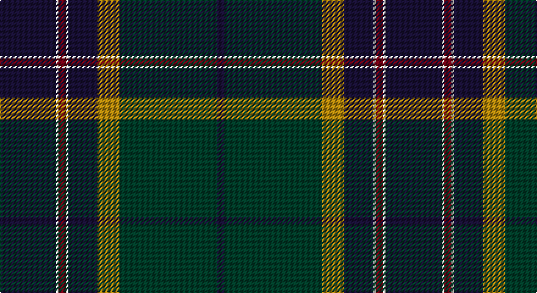

This page is one **sett** — a single exact thread-count. It belongs to the [tartan](/setts/dp23w1o3w1dp12lo9dg40dp3/)
(the same proportion at any scale), whose colour order is pattern [BGYBWRWB](/stripes/bgybwrwb/).

Sourced from register-of-tartans.  It is a [8 stripe tartan](/stripes/stripes8/).

Original link https://www.tartanregister.gov.uk/tartanDetails.aspx?ref=3334

2 attestations — the source records this cloth was collapsed from (oldest owns this page)

<ul>
<li>01/02/2007 — Pictou County (register-of-tartans, <a href="https://www.tartanregister.gov.uk/tartanDetails.aspx?ref=3334">record</a>)</li>
<li>Feb.2007 — Pictou County (District) (tartans-authority, <a href="http://www.tartansauthority.com/tartan-ferret/display/7113/">record</a>)</li>
</ul>

## Register references

External register numbers recorded for this tartan.

- Scottish Register of Tartans: [3334](https://www.tartanregister.gov.uk/tartanDetails.aspx?ref=3334)
- Scottish Tartans Authority (ITI): 7113

## Thread count
DBa/46 W2 DR6 W2 DBa24 DY18 DG80 DB/6

One full sett is **316 threads**.

## Palette

Palette: <strong>custom</strong>
<table><thead><tr><th>Colour</th><th>Threads</th><th>Shade</th><th>Base</th><th>OKLCh</th></tr></thead><tbody><tr><td>DBa/</td><td style="text-align:right;font-variant-numeric:tabular-nums">46</td><td><code style="background-color:#181034;">#181034</code> <small style="color:#888">#181034</small></td><td>B <code style="background-color:#2A418A;">#2A418A</code></td><td><small style="color:#888">oklch(20.7% 0.068 289.4)</small></td></tr><tr><td>W</td><td style="text-align:right;font-variant-numeric:tabular-nums">2</td><td><code style="background-color:#FCF8EC;">#FCF8EC</code> <small style="color:#888">#FCF8EC</small></td><td>W <code style="background-color:#F7F7F7;">#F7F7F7</code></td><td><small style="color:#888">oklch(97.9% 0.016 91.5)</small></td></tr><tr><td>DR</td><td style="text-align:right;font-variant-numeric:tabular-nums">6</td><td><code style="background-color:#700014;">#700014</code> <small style="color:#888">#700014</small></td><td>R <code style="background-color:#CC0000;">#CC0000</code></td><td><small style="color:#888">oklch(34.4% 0.139 22.1)</small></td></tr><tr><td>W</td><td style="text-align:right;font-variant-numeric:tabular-nums">2</td><td><code style="background-color:#FCF8EC;">#FCF8EC</code> <small style="color:#888">#FCF8EC</small></td><td>W <code style="background-color:#F7F7F7;">#F7F7F7</code></td><td><small style="color:#888">oklch(97.9% 0.016 91.5)</small></td></tr><tr><td>DBa</td><td style="text-align:right;font-variant-numeric:tabular-nums">24</td><td><code style="background-color:#181034;">#181034</code> <small style="color:#888">#181034</small></td><td>B <code style="background-color:#2A418A;">#2A418A</code></td><td><small style="color:#888">oklch(20.7% 0.068 289.4)</small></td></tr><tr><td>DY</td><td style="text-align:right;font-variant-numeric:tabular-nums">18</td><td><code style="background-color:#B0840C;">#B0840C</code> <small style="color:#888">#B0840C</small></td><td>Y <code style="background-color:#F2BF00;">#F2BF00</code></td><td><small style="color:#888">oklch(63.9% 0.128 84.4)</small></td></tr><tr><td>DG</td><td style="text-align:right;font-variant-numeric:tabular-nums">80</td><td><code style="background-color:#003C28;">#003C28</code> <small style="color:#888">#003C28</small></td><td>G <code style="background-color:#006100;">#006100</code></td><td><small style="color:#888">oklch(31.5% 0.067 163.7)</small></td></tr><tr><td>DB/</td><td style="text-align:right;font-variant-numeric:tabular-nums">6</td><td><code style="background-color:#181034;">#181034</code> <small style="color:#888">#181034</small></td><td>B <code style="background-color:#2A418A;">#2A418A</code></td><td><small style="color:#888">oklch(20.7% 0.068 289.4)</small></td></tr></tbody></table>

# Sample pattern

## Nearest tartans

The nearest existing variants by ΔTartan distance, with this tartan at the top so the swatches line up against it.

ΔTartan

Tartan

Sett

—

<a href="/ttd/edit/#slug=dp23w1o3w1dp12lo9dg40dp3~x2">Pictou County</a> <a class="nn-out" href="/variants/s8/dp23w1o3w1dp12lo9dg40dp3~x2/" title="open its dictionary page">↗</a>

0.92

<a href="/ttd/edit/#slug=g1dt28k11r5w1r5k11lr1k2g1~x2&amp;base=dp23w1o3w1dp12lo9dg40dp3~x2">Scragg Moran (Personal)</a> <a class="nn-out" href="/variants/s10/g1dt28k11r5w1r5k11lr1k2g1~x2/" title="open its dictionary page">↗</a>

1.06

<a href="/ttd/edit/#slug=db4w1k2db25k12b1k2g16k2r1~x2&amp;base=dp23w1o3w1dp12lo9dg40dp3~x2">Sidey Family Tartan (Name)</a> <a class="nn-out" href="/variants/s10/db4w1k2db25k12b1k2g16k2r1~x2/" title="open its dictionary page">↗</a>

1.08

<a href="/ttd/edit/#slug=db3t3g30db25dp4r3ly2dp1~x2&amp;base=dp23w1o3w1dp12lo9dg40dp3~x2">Young</a> <a class="nn-out" href="/variants/s8/db3t3g30db25dp4r3ly2dp1~x2/" title="open its dictionary page">↗</a>

1.10

<a href="/ttd/edit/#slug=k45r4k4do4lo16do76dt8lo6dt2w4&amp;base=dp23w1o3w1dp12lo9dg40dp3~x2">Highland Gathering (Fashion?)</a> <a class="nn-out" href="/variants/s10/k45r4k4do4lo16do76dt8lo6dt2w4/" title="open its dictionary page">↗</a>

1.12

<a href="/ttd/edit/#slug=k2g30k3db4k2dbi18t1k3r2~x2&amp;base=dp23w1o3w1dp12lo9dg40dp3~x2">Lusk (Personal)</a> <a class="nn-out" href="/variants/s9/k2g30k3db4k2dbi18t1k3r2~x2/" title="open its dictionary page">↗</a>

1.15

<a href="/ttd/edit/#slug=dt47ly1do27lr4dg5ly1lr8t1do1~x2&amp;base=dp23w1o3w1dp12lo9dg40dp3~x2">Brighton Mac Dermotte</a> <a class="nn-out" href="/variants/s9/dt47ly1do27lr4dg5ly1lr8t1do1~x2/" title="open its dictionary page">↗</a>

1.20

<a href="/ttd/edit/#slug=db9dg2dpi2dp2dg18dpi2k2dg1k19db33w2~x2&amp;base=dp23w1o3w1dp12lo9dg40dp3~x2">Highland Pride of Scotland (Fashion)</a> <a class="nn-out" href="/variants/s11/db9dg2dpi2dp2dg18dpi2k2dg1k19db33w2~x2/" title="open its dictionary page">↗</a>

1.20

<a href="/ttd/edit/#slug=ly3dt1k2dg26dt28w1dt1r2~x2&amp;base=dp23w1o3w1dp12lo9dg40dp3~x2">Johnston, Diana Hunting (Personal)</a> <a class="nn-out" href="/variants/s8/ly3dt1k2dg26dt28w1dt1r2~x2/" title="open its dictionary page">↗</a>

1.23

<a href="/ttd/edit/#slug=ly2dr4dg11k30r2db16w1~x2&amp;base=dp23w1o3w1dp12lo9dg40dp3~x2">Buschke (Skye) (Personal)</a> <a class="nn-out" href="/variants/s7/ly2dr4dg11k30r2db16w1~x2/" title="open its dictionary page">↗</a>

1.25

<a href="/ttd/edit/#slug=dbi3db3dbi1g26dbi10n1dbi3dp5db4lo2~x2&amp;base=dp23w1o3w1dp12lo9dg40dp3~x2">Rikaco Heirloom (Fashion)</a> <a class="nn-out" href="/variants/s10/dbi3db3dbi1g26dbi10n1dbi3dp5db4lo2~x2/" title="open its dictionary page">↗</a>

## Neighbour map

Every grey dot is one of 14360 variants placed by the first two principal components of the ΔTartan feature space (44% of its variance). Red is this tartan; blue dots are its nearest — click one to open its page.

<svg viewBox="0 0 640 380" role="img" style="max-width:100%;height:auto;border:1px solid #e0e0e0;border-radius:4px;display:block" xmlns="http://www.w3.org/2000/svg"><image href="/nn/cloud.v1.png" width="640" height="380"/><a href="/variants/s10/g1dt28k11r5w1r5k11lr1k2g1~x2/"><circle cx="276.2" cy="116.5" r="4" fill="#3465a4"><title>Scragg Moran (Personal)</title></circle></a><a href="/variants/s10/db4w1k2db25k12b1k2g16k2r1~x2/"><circle cx="275.0" cy="130.1" r="4" fill="#3465a4"><title>Sidey Family Tartan (Name)</title></circle></a><a href="/variants/s8/db3t3g30db25dp4r3ly2dp1~x2/"><circle cx="268.4" cy="117.6" r="4" fill="#3465a4"><title>Young</title></circle></a><a href="/variants/s10/k45r4k4do4lo16do76dt8lo6dt2w4/"><circle cx="299.1" cy="91.1" r="4" fill="#3465a4"><title>Highland Gathering (Fashion?)</title></circle></a><a href="/variants/s9/k2g30k3db4k2dbi18t1k3r2~x2/"><circle cx="290.8" cy="120.6" r="4" fill="#3465a4"><title>Lusk (Personal)</title></circle></a><a href="/variants/s9/dt47ly1do27lr4dg5ly1lr8t1do1~x2/"><circle cx="322.3" cy="85.4" r="4" fill="#3465a4"><title>Brighton Mac Dermotte</title></circle></a><a href="/variants/s11/db9dg2dpi2dp2dg18dpi2k2dg1k19db33w2~x2/"><circle cx="296.9" cy="120.0" r="4" fill="#3465a4"><title>Highland Pride of Scotland (Fashion)</title></circle></a><a href="/variants/s8/ly3dt1k2dg26dt28w1dt1r2~x2/"><circle cx="318.8" cy="125.9" r="4" fill="#3465a4"><title>Johnston, Diana Hunting (Personal)</title></circle></a><a href="/variants/s7/ly2dr4dg11k30r2db16w1~x2/"><circle cx="252.9" cy="126.7" r="4" fill="#3465a4"><title>Buschke (Skye) (Personal)</title></circle></a><a href="/variants/s10/dbi3db3dbi1g26dbi10n1dbi3dp5db4lo2~x2/"><circle cx="276.0" cy="124.3" r="4" fill="#3465a4"><title>Rikaco Heirloom (Fashion)</title></circle></a><circle cx="294.1" cy="124.6" r="5" fill="#c00000"/></svg>

ID: /variants/s8/dp23w1o3w1dp12lo9dg40dp3~x2/
