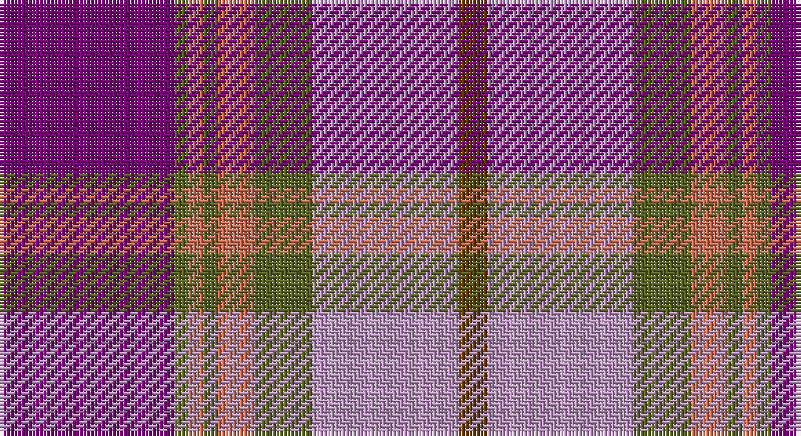

This page is one **sett** — a single exact thread-count. It belongs to the [tartan](/setts/dp24y2o2y2o5y8lr20dy4/)
(the same proportion at any scale), whose colour order is pattern [BGRGRGYG](/stripes/bgrgrgyg/).

Part of the [Glen Shee](/tartans/glen-shee-2/) tartan — the named design grouping this sett with its other cloths.

Sourced from register-of-tartans.  It is a [8 stripe tartan](/stripes/stripes8/).

Original link https://www.tartanregister.gov.uk/tartanDetails.aspx?ref=1397

## Also known as

This cloth is also recorded under:

- Glen Shee #2
- Glen Shee Plaid

2 attestations — the source records this cloth was collapsed from (oldest owns this page)

<ul>
<li>01/01/1978 — Glen Shee (register-of-tartans, <a href="https://www.tartanregister.gov.uk/tartanDetails.aspx?ref=1397">record</a>)</li>
<li>pre 1978 — Glen Shee #2 (Fashion) (tartans-authority, <a href="http://www.tartansauthority.com/tartan-ferret/display/5023/">record</a>)</li>
</ul>

## Register references

External register numbers recorded for this tartan.

- Scottish Register of Tartans: [1397](https://www.tartanregister.gov.uk/tartanDetails.aspx?ref=1397)
- Scottish Tartans Authority (ITI): 5023

## Thread count
P/48 G4 DO4 G4 DO10 G16 LP40 T/8

One full sett is **212 threads**.

## Palette

Palette: <strong>Tartan Register</strong> <small style="color:#888">(3 of 5 colours)</small>
<table><thead><tr><th>Colour</th><th>Threads</th><th>Shade</th><th>Base</th><th>OKLCh</th></tr></thead><tbody><tr><td>P/</td><td style="text-align:right;font-variant-numeric:tabular-nums">48</td><td><code style="background-color:#780078;">#780078</code> <small style="color:#888">#780078</small></td><td>B <code style="background-color:#2A418A;">#2A418A</code></td><td><small style="color:#888">oklch(40.2% 0.185 328.4)</small></td></tr><tr><td>G</td><td style="text-align:right;font-variant-numeric:tabular-nums">4</td><td><code style="background-color:#5C6428;">#5C6428</code> <small style="color:#888">#5C6428</small></td><td>G <code style="background-color:#006100;">#006100</code></td><td><small style="color:#888">oklch(48.3% 0.084 116.0)</small></td></tr><tr><td>DO</td><td style="text-align:right;font-variant-numeric:tabular-nums">4</td><td><code style="background-color:#C87058;">#C87058</code> <small style="color:#888">#C87058</small></td><td>R <code style="background-color:#CC0000;">#CC0000</code></td><td><small style="color:#888">oklch(63.9% 0.117 36.1)</small></td></tr><tr><td>G</td><td style="text-align:right;font-variant-numeric:tabular-nums">4</td><td><code style="background-color:#5C6428;">#5C6428</code> <small style="color:#888">#5C6428</small></td><td>G <code style="background-color:#006100;">#006100</code></td><td><small style="color:#888">oklch(48.3% 0.084 116.0)</small></td></tr><tr><td>DO</td><td style="text-align:right;font-variant-numeric:tabular-nums">10</td><td><code style="background-color:#C87058;">#C87058</code> <small style="color:#888">#C87058</small></td><td>R <code style="background-color:#CC0000;">#CC0000</code></td><td><small style="color:#888">oklch(63.9% 0.117 36.1)</small></td></tr><tr><td>G</td><td style="text-align:right;font-variant-numeric:tabular-nums">16</td><td><code style="background-color:#5C6428;">#5C6428</code> <small style="color:#888">#5C6428</small></td><td>G <code style="background-color:#006100;">#006100</code></td><td><small style="color:#888">oklch(48.3% 0.084 116.0)</small></td></tr><tr><td>LP</td><td style="text-align:right;font-variant-numeric:tabular-nums">40</td><td><code style="background-color:#B894BC;">#B894BC</code> <small style="color:#888">#B894BC</small></td><td>Y <code style="background-color:#F2BF00;">#F2BF00</code></td><td><small style="color:#888">oklch(71.3% 0.070 323.0)</small></td></tr><tr><td>T/</td><td style="text-align:right;font-variant-numeric:tabular-nums">8</td><td><code style="background-color:#603800;">#603800</code> <small style="color:#888">#603800</small></td><td>G <code style="background-color:#006100;">#006100</code></td><td><small style="color:#888">oklch(38.1% 0.084 66.7)</small></td></tr></tbody></table>

# Sample pattern

## Nearest tartans

The nearest existing variants by ΔTartan distance, with this tartan at the top so the swatches line up against it.

ΔTartan

Tartan

Sett

—

<a href="/ttd/edit/#slug=dp24y2o2y2o5y8lr20dy4~x2">Glen Shee</a> <a class="nn-out" href="/variants/s8/dp24y2o2y2o5y8lr20dy4~x2/" title="open its dictionary page">↗</a>

1.37

<a href="/ttd/edit/#slug=dp12n3r13dp4r10w2lb18n22r4~x2&amp;base=dp24y2o2y2o5y8lr20dy4~x2">Wild Rose (Commemorative)</a> <a class="nn-out" href="/variants/s9/dp12n3r13dp4r10w2lb18n22r4~x2/" title="open its dictionary page">↗</a>

1.43

<a href="/ttd/edit/#slug=dy2r11db1r1db1r1db4dbi6dy1dbi1ly1~x4&amp;base=dp24y2o2y2o5y8lr20dy4~x2">NHK Asaichi</a> <a class="nn-out" href="/variants/s11/dy2r11db1r1db1r1db4dbi6dy1dbi1ly1~x4/" title="open its dictionary page">↗</a>

1.44

<a href="/ttd/edit/#slug=n5dp40n5lr5n32lr5n5lr40dp7w5&amp;base=dp24y2o2y2o5y8lr20dy4~x2">Intelligent Finance</a> <a class="nn-out" href="/variants/s10/n5dp40n5lr5n32lr5n5lr40dp7w5/" title="open its dictionary page">↗</a>

1.46

<a href="/ttd/edit/#slug=db5t2db11g2db2g6r17lo9db1r1~x2&amp;base=dp24y2o2y2o5y8lr20dy4~x2">Clarks No. 1 (Fashion)</a> <a class="nn-out" href="/variants/s10/db5t2db11g2db2g6r17lo9db1r1~x2/" title="open its dictionary page">↗</a>

1.46

<a href="/ttd/edit/#slug=ri15r98dp72t25dp8w15&amp;base=dp24y2o2y2o5y8lr20dy4~x2">Afternoon Tea / Assam</a> <a class="nn-out" href="/variants/s6/ri15r98dp72t25dp8w15/" title="open its dictionary page">↗</a>

1.49

<a href="/ttd/edit/#slug=m21r3m3r3m3db19g22t3~x2&amp;base=dp24y2o2y2o5y8lr20dy4~x2">Akins (Clan)</a> <a class="nn-out" href="/variants/s8/m21r3m3r3m3db19g22t3~x2/" title="open its dictionary page">↗</a>

1.56

<a href="/ttd/edit/#slug=db30ly3dy11ly3o33r6~x2&amp;base=dp24y2o2y2o5y8lr20dy4~x2">Balfour Family Tartan</a> <a class="nn-out" href="/variants/s6/db30ly3dy11ly3o33r6~x2/" title="open its dictionary page">↗</a>

1.58

<a href="/ttd/edit/#slug=dp2t9dp3r7ri19ly2~x2&amp;base=dp24y2o2y2o5y8lr20dy4~x2">Stevens #3</a> <a class="nn-out" href="/variants/s6/dp2t9dp3r7ri19ly2~x2/" title="open its dictionary page">↗</a>

1.58

<a href="/ttd/edit/#slug=p26w2p3db15o26r2o3db4~x2&amp;base=dp24y2o2y2o5y8lr20dy4~x2">Scottish Highlander Dress (Fashion)</a> <a class="nn-out" href="/variants/s8/p26w2p3db15o26r2o3db4~x2/" title="open its dictionary page">↗</a>

1.58

<a href="/ttd/edit/#slug=y4w2y2w3y20db6r3db2r2db2r17db3~x2&amp;base=dp24y2o2y2o5y8lr20dy4~x2">Eidart, Scotch House</a> <a class="nn-out" href="/variants/s12/y4w2y2w3y20db6r3db2r2db2r17db3~x2/" title="open its dictionary page">↗</a>

## Neighbour map

Every grey dot is one of 14360 variants placed by the first two principal components of the ΔTartan feature space (44% of its variance). Red is this tartan; blue dots are its nearest — click one to open its page.

<svg viewBox="0 0 640 380" role="img" style="max-width:100%;height:auto;border:1px solid #e0e0e0;border-radius:4px;display:block" xmlns="http://www.w3.org/2000/svg"><image href="/nn/cloud.v1.png" width="640" height="380"/><a href="/variants/s9/dp12n3r13dp4r10w2lb18n22r4~x2/"><circle cx="134.9" cy="173.3" r="4" fill="#3465a4"><title>Wild Rose (Commemorative)</title></circle></a><a href="/variants/s11/dy2r11db1r1db1r1db4dbi6dy1dbi1ly1~x4/"><circle cx="230.2" cy="139.5" r="4" fill="#3465a4"><title>NHK Asaichi</title></circle></a><a href="/variants/s10/n5dp40n5lr5n32lr5n5lr40dp7w5/"><circle cx="201.3" cy="182.3" r="4" fill="#3465a4"><title>Intelligent Finance</title></circle></a><a href="/variants/s10/db5t2db11g2db2g6r17lo9db1r1~x2/"><circle cx="183.1" cy="144.8" r="4" fill="#3465a4"><title>Clarks No. 1 (Fashion)</title></circle></a><a href="/variants/s6/ri15r98dp72t25dp8w15/"><circle cx="236.5" cy="179.3" r="4" fill="#3465a4"><title>Afternoon Tea / Assam</title></circle></a><a href="/variants/s8/m21r3m3r3m3db19g22t3~x2/"><circle cx="179.9" cy="195.3" r="4" fill="#3465a4"><title>Akins (Clan)</title></circle></a><a href="/variants/s6/db30ly3dy11ly3o33r6~x2/"><circle cx="198.6" cy="188.4" r="4" fill="#3465a4"><title>Balfour Family Tartan</title></circle></a><a href="/variants/s6/dp2t9dp3r7ri19ly2~x2/"><circle cx="244.9" cy="195.0" r="4" fill="#3465a4"><title>Stevens #3</title></circle></a><a href="/variants/s8/p26w2p3db15o26r2o3db4~x2/"><circle cx="213.0" cy="163.9" r="4" fill="#3465a4"><title>Scottish Highlander Dress (Fashion)</title></circle></a><a href="/variants/s12/y4w2y2w3y20db6r3db2r2db2r17db3~x2/"><circle cx="238.1" cy="160.2" r="4" fill="#3465a4"><title>Eidart, Scotch House</title></circle></a><circle cx="203.0" cy="162.3" r="5" fill="#c00000"/></svg>

ID: /variants/s8/dp24y2o2y2o5y8lr20dy4~x2/
