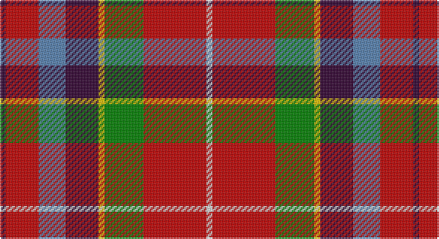

This page is one **sett** — a single exact thread-count. It belongs to the [tartan](/setts/dp2r11t9dp11ly2g13r21w2/)
(the same proportion at any scale), whose colour order is pattern [BRBBYGRW](/stripes/brbbygrw/).

Sourced from weddslist.  It is a [8 stripe tartan](/stripes/stripes8/).

Original link http://www.weddslist.com/cgi-bin/tartans/pg.pl?source=sts

## Thread count
DP/4 R22 B18 DP22 Y4 G26 R42 LN/4

One full sett is **276 threads**.

## Palette

Palette: <strong>Tartan Dictionary</strong> <small style="color:#888">(1 of 6 colours)</small>
<table><thead><tr><th>Colour</th><th>Threads</th><th>Shade</th><th>Base</th><th>OKLCh</th></tr></thead><tbody><tr><td>DP/</td><td style="text-align:right;font-variant-numeric:tabular-nums">4</td><td><code style="background-color:#300030;">#300030</code> <small style="color:#888">#300030</small></td><td>B <code style="background-color:#2A418A;">#2A418A</code></td><td><small style="color:#888">oklch(21.7% 0.100 328.4)</small></td></tr><tr><td>R</td><td style="text-align:right;font-variant-numeric:tabular-nums">22</td><td><code style="background-color:#C00000;">#C00000</code> <small style="color:#888">#C00000</small></td><td>R <code style="background-color:#CC0000;">#CC0000</code></td><td><small style="color:#888">oklch(50.7% 0.208 29.2)</small></td></tr><tr><td>B</td><td style="text-align:right;font-variant-numeric:tabular-nums">18</td><td><code style="background-color:#5480B0;">#5480B0</code> <small style="color:#888">#5480B0</small></td><td>B <code style="background-color:#2A418A;">#2A418A</code></td><td><small style="color:#888">oklch(58.8% 0.089 251.5)</small></td></tr><tr><td>DP</td><td style="text-align:right;font-variant-numeric:tabular-nums">22</td><td><code style="background-color:#300030;">#300030</code> <small style="color:#888">#300030</small></td><td>B <code style="background-color:#2A418A;">#2A418A</code></td><td><small style="color:#888">oklch(21.7% 0.100 328.4)</small></td></tr><tr><td>Y</td><td style="text-align:right;font-variant-numeric:tabular-nums">4</td><td><code style="background-color:#F0C000;">#F0C000</code> <small style="color:#888">#F0C000</small></td><td>Y <code style="background-color:#F2BF00;">#F2BF00</code></td><td><small style="color:#888">oklch(82.7% 0.169 90.5)</small></td></tr><tr><td>G</td><td style="text-align:right;font-variant-numeric:tabular-nums">26</td><td><code style="background-color:#008000;">#008000</code> <small style="color:#888">#008000</small></td><td>G <code style="background-color:#006100;">#006100</code></td><td><small style="color:#888">oklch(52.0% 0.177 142.5)</small></td></tr><tr><td>R</td><td style="text-align:right;font-variant-numeric:tabular-nums">42</td><td><code style="background-color:#C00000;">#C00000</code> <small style="color:#888">#C00000</small></td><td>R <code style="background-color:#CC0000;">#CC0000</code></td><td><small style="color:#888">oklch(50.7% 0.208 29.2)</small></td></tr><tr><td>LN/</td><td style="text-align:right;font-variant-numeric:tabular-nums">4</td><td><code style="background-color:#E0E0E0;">#E0E0E0</code> <small style="color:#888">#E0E0E0</small></td><td>W <code style="background-color:#F7F7F7;">#F7F7F7</code></td><td><small style="color:#888">oklch(90.7% 0.000 89.9)</small></td></tr></tbody></table>

# Sample pattern

## Nearest tartans

The nearest existing variants by ΔTartan distance, with this tartan at the top so the swatches line up against it.

ΔTartan

Tartan

Sett

—

<a href="/ttd/edit/#slug=dp2r11t9dp11ly2g13r21w2~x2">Wilson's, No 2</a> <a class="nn-out" href="/variants/s8/dp2r11t9dp11ly2g13r21w2~x2/" title="open its dictionary page">↗</a>

0.74

<a href="/ttd/edit/#slug=r6w1r6db2r6dg12ly1db8t4r4~x2&amp;base=dp2r11t9dp11ly2g13r21w2~x2">Unidentified No 57</a> <a class="nn-out" href="/variants/s10/r6w1r6db2r6dg12ly1db8t4r4~x2/" title="open its dictionary page">↗</a>

0.86

<a href="/ttd/edit/#slug=dp2o9g8o4ly1o4db10w2~x4&amp;base=dp2r11t9dp11ly2g13r21w2~x2">De Maynard (Personal)</a> <a class="nn-out" href="/variants/s8/dp2o9g8o4ly1o4db10w2~x4/" title="open its dictionary page">↗</a>

0.94

<a href="/ttd/edit/#slug=w4k2r15k2r5y7dg7k2ly4~x2&amp;base=dp2r11t9dp11ly2g13r21w2~x2">Thirkill</a> <a class="nn-out" href="/variants/s9/w4k2r15k2r5y7dg7k2ly4~x2/" title="open its dictionary page">↗</a>

0.97

<a href="/ttd/edit/#slug=r6w1r6db2r6g12ly1db8t4r4~x2&amp;base=dp2r11t9dp11ly2g13r21w2~x2">Unnamed No 57</a> <a class="nn-out" href="/variants/s10/r6w1r6db2r6g12ly1db8t4r4~x2/" title="open its dictionary page">↗</a>

1.04

<a href="/ttd/edit/#slug=y3r10g7db10r15k1w2~x2&amp;base=dp2r11t9dp11ly2g13r21w2~x2">East Kilbride</a> <a class="nn-out" href="/variants/s7/y3r10g7db10r15k1w2~x2/" title="open its dictionary page">↗</a>

1.08

<a href="/ttd/edit/#slug=db8ly1dg12r10o2r6o2r4~x4&amp;base=dp2r11t9dp11ly2g13r21w2~x2">Indiana &quot;Cardinal&quot;</a> <a class="nn-out" href="/variants/s8/db8ly1dg12r10o2r6o2r4~x4/" title="open its dictionary page">↗</a>

1.08

<a href="/ttd/edit/#slug=r30db12k6dg12ly2dg3w2~x2&amp;base=dp2r11t9dp11ly2g13r21w2~x2">Hewitt</a> <a class="nn-out" href="/variants/s7/r30db12k6dg12ly2dg3w2~x2/" title="open its dictionary page">↗</a>

1.11

<a href="/ttd/edit/#slug=ly3r10g7db10r15k1w2~x2&amp;base=dp2r11t9dp11ly2g13r21w2~x2">East Kilbride (Original) District Tartan</a> <a class="nn-out" href="/variants/s7/ly3r10g7db10r15k1w2~x2/" title="open its dictionary page">↗</a>

1.16

<a href="/ttd/edit/#slug=lo3r10dg7db10r15k1w2~x2&amp;base=dp2r11t9dp11ly2g13r21w2~x2">East Kilbride</a> <a class="nn-out" href="/variants/s7/lo3r10dg7db10r15k1w2~x2/" title="open its dictionary page">↗</a>

1.18

<a href="/ttd/edit/#slug=r21t9k2t2k2t9k18ly3g21r13k3r13w2r13~x2&amp;base=dp2r11t9dp11ly2g13r21w2~x2">Caledonia</a> <a class="nn-out" href="/variants/s14/r21t9k2t2k2t9k18ly3g21r13k3r13w2r13~x2/" title="open its dictionary page">↗</a>

## Neighbour map

Every grey dot is one of 14360 variants placed by the first two principal components of the ΔTartan feature space (44% of its variance). Red is this tartan; blue dots are its nearest — click one to open its page.

<svg viewBox="0 0 640 380" role="img" style="max-width:100%;height:auto;border:1px solid #e0e0e0;border-radius:4px;display:block" xmlns="http://www.w3.org/2000/svg"><image href="/nn/cloud.v1.png" width="640" height="380"/><a href="/variants/s10/r6w1r6db2r6dg12ly1db8t4r4~x2/"><circle cx="172.8" cy="158.6" r="4" fill="#3465a4"><title>Unidentified No 57</title></circle></a><a href="/variants/s8/dp2o9g8o4ly1o4db10w2~x4/"><circle cx="140.5" cy="163.1" r="4" fill="#3465a4"><title>De Maynard (Personal)</title></circle></a><a href="/variants/s9/w4k2r15k2r5y7dg7k2ly4~x2/"><circle cx="120.2" cy="158.3" r="4" fill="#3465a4"><title>Thirkill</title></circle></a><a href="/variants/s10/r6w1r6db2r6g12ly1db8t4r4~x2/"><circle cx="176.6" cy="163.0" r="4" fill="#3465a4"><title>Unnamed No 57</title></circle></a><a href="/variants/s7/y3r10g7db10r15k1w2~x2/"><circle cx="238.0" cy="160.3" r="4" fill="#3465a4"><title>East Kilbride</title></circle></a><a href="/variants/s8/db8ly1dg12r10o2r6o2r4~x4/"><circle cx="211.4" cy="182.5" r="4" fill="#3465a4"><title>Indiana &quot;Cardinal&quot;</title></circle></a><a href="/variants/s7/r30db12k6dg12ly2dg3w2~x2/"><circle cx="206.9" cy="131.8" r="4" fill="#3465a4"><title>Hewitt</title></circle></a><a href="/variants/s7/ly3r10g7db10r15k1w2~x2/"><circle cx="229.1" cy="153.5" r="4" fill="#3465a4"><title>East Kilbride (Original) District Tartan</title></circle></a><a href="/variants/s7/lo3r10dg7db10r15k1w2~x2/"><circle cx="240.8" cy="159.8" r="4" fill="#3465a4"><title>East Kilbride</title></circle></a><a href="/variants/s14/r21t9k2t2k2t9k18ly3g21r13k3r13w2r13~x2/"><circle cx="165.1" cy="133.9" r="4" fill="#3465a4"><title>Caledonia</title></circle></a><circle cx="170.0" cy="160.4" r="5" fill="#c00000"/></svg>

ID: /variants/s8/dp2r11t9dp11ly2g13r21w2~x2/
