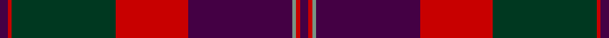

This is one **variant** — a specific cloth: this exact thread count and colourway, with its own
provenance below. It is one weaving of the [sett](/setts/dp2r1dg26r18dp26y1r1dp2/) (the scale-free proportion — the
same cloth at any scale or shade), whose colour order is pattern [BRGBRGRB](/stripes/brgbrgrb/).

Part of the [Robb Dress](/tartans/r/ro/robb-dress/) tartan — the named design grouping this sett with its other cloths.

Sourced from tartans-authority.  It is a [8 stripe tartan](/stripes/stripes8/).

Original link [https://www.tartanregister.gov.uk/tartanDetails.aspx?ref=3158](https://www.tartanregister.gov.uk/tartanDetails.aspx?ref=3158)

## Provenance

Earliest known date: 1994 Designed by Peter MacDonald for Martin Robb of Carroglen, Comrie, Perthshire, Scotland. Can be worn by anyone of the name but Martin Robb would appreciate being advised.

3 attestations — the source records this cloth was collapsed from (oldest owns this page)

<ul>
<li>1994 — Robb Dress (Personal) (tartans-authority, <a href="https://www.tartanregister.gov.uk/tartanDetails.aspx?ref=3158">record</a>)  <em>Designed by Peter MacDonald for Martin Robb of Carroglen, Comrie, Perthshire, Scotland. Can be worn by anyone of the name but Martin Robb would appreciate being advised.</em></li>
<li>1994 — Robb Red (Personal) Personal Tartan (house-of-tartan, <a href="http://www.house-of-tartan.scotland.net/house/TartanViewjs.asp?colr=Def&tnam=3158">record</a>) </li>
<li>undated — Robb Red (Personal) (register-of-tartans, <a href="https://www.tartanregister.gov.uk/tartanDetails.aspx?ref=4850">record</a>)  <em>Designed by Peter MacDonald for Martin Robb of Carroglen, Comrie, Perthshire, Scotland. Can be worn by anyone of the name but Martin Robb would appreciate being advised.</em></li>
</ul>

Dataset <small>— provenance for this record, inherited from the source manifest</small>

<dl class="dataset-prov">
<dt>source</dt><dd><a href="/sources/tartans-authority/">Scottish Tartans Authority</a></dd>
<dt>data captured from</dt><dd><a href="https://github.com/thetartan/tartan-database/blob/master/data/tartans-authority/data.csv">https://github.com/thetartan/tartan-database/blob/master/data/tartans-authority/data.csv</a></dd>
<dt>data date</dt><dd>1994 <small>(this record)</small></dd>
<dt>licence</dt><dd><a href="https://creativecommons.org/licenses/by-nc-nd/4.0/">CC BY-NC-ND 4.0</a></dd>
</dl>

Capture chain <small>— the hands this data passed through, oldest first; each capture carries its own licence</small>

<ol class="capture-chain">
<li><a href="https://www.tartansauthority.com/">Scottish Tartans Authority</a> <small>the heritage body's archive — its tartan-ferret record browser is retired (links repaired to the SRT, above)</small></li>
<li><a href="https://github.com/thetartan/tartan-database">thetartan/tartan-database</a> <small>2016-2017</small> · <a href="https://creativecommons.org/licenses/by-nc-nd/4.0/">CC BY-NC-ND 4.0</a> <small>Levko Kravets's frozen compilation — the capture we vendored, and where its CC licence text came from</small></li>
<li>this dictionary <small>captured 2026-06-10 · commit 5bf86c7566</small> <small>each re-capture is a git commit to data/sources</small></li>
</ol>

## Register references

External register numbers recorded for this tartan.

- Scottish Register of Tartans: [4850](https://www.tartanregister.gov.uk/tartanDetails.aspx?ref=4850)
- Scottish Tartans Authority (ITI): 3158

## Thread count
DP/4 R2 DG52 R36 DP52 Y2 R2 DP/4

One full sett is **300 threads**.

## Palette
<table><thead><tr><th>Colour</th><th>Shade</th><th>OKLCh</th></tr></thead><tbody><tr><td>DG</td><td><code style="background-color:#053819;">#053819</code> <small style="color:#888">#053819</small></td><td><small style="color:#888">oklch(30.0% 0.075 151.3)</small></td></tr><tr><td>DP</td><td><code style="background-color:#4B0B4F;">#4B0B4F</code> <small style="color:#888">#4B0B4F</small></td><td><small style="color:#888">oklch(30.1% 0.125 325.4)</small></td></tr><tr><td>Y</td><td><code style="background-color:#8B6E00;">#8B6E00</code> <small style="color:#888">#8B6E00</small></td><td><small style="color:#888">oklch(55.1% 0.113 90.4)</small></td></tr><tr><td>R</td><td><code style="background-color:#D60020;">#D60020</code> <small style="color:#888">#D60020</small></td><td><small style="color:#888">oklch(55.2% 0.224 25.5)</small></td></tr></tbody></table>

# Sample pattern

## Nearest tartan variants

The nearest existing variants by ΔTartan distance, with this cloth at the top so the swatches line up against it.

ΔTartan

Threads

Variant

Sett

—

300

<a href="/variants/s8/dp2r1dg26r18dp26y1r1dp2~x2/">Robb Dress (Personal)</a>

<a href="/ttd/edit/#slug=dg28r4dp25r22dg27r4dp2~x2&amp;base=dp2r1dg26r18dp26y1r1dp2~x2" title="compare in the TTD">2.07</a>

388

<a href="/variants/s7/dg28r4dp25r22dg27r4dp2~x2/">Glasgow, Ciity of (District)</a>

<a href="/ttd/edit/#slug=dp9r4dp1r4g15ri4dp1~x2~r2208029-ri2209032&amp;base=dp2r1dg26r18dp26y1r1dp2~x2" title="compare in the TTD">2.12</a>

132

<a href="/variants/s7/dp9r4dp1r4g15ri4dp1~x2~r2208029-ri2209032/">Logan Light</a>

<a href="/ttd/edit/#slug=dg28r4dp25w5r22dg27r4dp2~x2&amp;base=dp2r1dg26r18dp26y1r1dp2~x2" title="compare in the TTD">2.54</a>

408

<a href="/variants/s8/dg28r4dp25w5r22dg27r4dp2~x2/">New Glasgow (Canada)</a>

<a href="/ttd/edit/#slug=dp8r3y1r3dg14r3y1~x4&amp;base=dp2r1dg26r18dp26y1r1dp2~x2" title="compare in the TTD">2.78</a>

228

<a href="/variants/s7/dp8r3y1r3dg14r3y1~x4/">Logan - 1819 (with yellow)</a>

<a href="/ttd/edit/#slug=r4n4dt2n24lb1dt14n2r18n4dt3~x4&amp;base=dp2r1dg26r18dp26y1r1dp2~x2" title="compare in the TTD">2.89</a>

580

<a href="/variants/s10/r4n4dt2n24lb1dt14n2r18n4dt3~x4/">Marshall</a>

<a href="/ttd/edit/#slug=o13dg16g4dp4g4dp34y1dp1~x2&amp;base=dp2r1dg26r18dp26y1r1dp2~x2" title="compare in the TTD">3.25</a>

280

<a href="/variants/s8/o13dg16g4dp4g4dp34y1dp1~x2/">Heather Mead (Personal)</a>

<a href="/ttd/edit/#slug=dp9b4dp1b4dg15r4dp1~x2&amp;base=dp2r1dg26r18dp26y1r1dp2~x2" title="compare in the TTD">3.48</a>

132

<a href="/variants/s7/dp9b4dp1b4dg15r4dp1~x2/">Logan, Light</a>

<a href="/ttd/edit/#slug=ri4r2ri1dg16r2ri11r1ri1r2~x2~ri2109032-r2109013&amp;base=dp2r1dg26r18dp26y1r1dp2~x2" title="compare in the TTD">3.79</a>

148

<a href="/variants/s9/ri4r2ri1dg16r2ri11r1ri1r2~x2~ri2109032-r2109013/">Valdres, Kvam &amp; Vang</a>

<a href="/ttd/edit/#slug=g5dr1r4db2r20g12db16r4dr1~x2&amp;base=dp2r1dg26r18dp26y1r1dp2~x2" title="compare in the TTD">3.84</a>

248

<a href="/variants/s9/g5dr1r4db2r20g12db16r4dr1~x2/">Diana Princess of Wales</a>

<a href="/ttd/edit/#slug=dg20db2dg2db2dg2db8r24db2r3~x2&amp;base=dp2r1dg26r18dp26y1r1dp2~x2" title="compare in the TTD">3.85</a>

214

<a href="/variants/s9/dg20db2dg2db2dg2db8r24db2r3~x2/">Lindsay Clan Tartan</a>

## Neighbour map

Every grey dot is one of 13621 variants placed by the first two principal components of the ΔTartan feature space (42% of its variance). Red is this tartan; blue dots are its nearest — click one to open its page.

<svg viewBox="0 0 640 380" role="img" style="max-width:100%;height:auto;border:1px solid #e0e0e0;border-radius:4px;display:block" xmlns="http://www.w3.org/2000/svg"><image href="/nn/cloud.v1.png" width="640" height="380"/><a href="/variants/s7/dg28r4dp25r22dg27r4dp2~x2/"><circle cx="326.4" cy="230.3" r="4" fill="#3465a4"><title>Glasgow, Ciity of (District)</title></circle></a><a href="/variants/s7/dp9r4dp1r4g15ri4dp1~x2~r2208029-ri2209032/"><circle cx="243.4" cy="196.5" r="4" fill="#3465a4"><title>Logan Light</title></circle></a><a href="/variants/s8/dg28r4dp25w5r22dg27r4dp2~x2/"><circle cx="263.2" cy="196.4" r="4" fill="#3465a4"><title>New Glasgow (Canada)</title></circle></a><a href="/variants/s7/dp8r3y1r3dg14r3y1~x4/"><circle cx="285.8" cy="196.8" r="4" fill="#3465a4"><title>Logan - 1819 (with yellow)</title></circle></a><a href="/variants/s10/r4n4dt2n24lb1dt14n2r18n4dt3~x4/"><circle cx="348.3" cy="171.0" r="4" fill="#3465a4"><title>Marshall</title></circle></a><a href="/variants/s8/o13dg16g4dp4g4dp34y1dp1~x2/"><circle cx="349.5" cy="138.6" r="4" fill="#3465a4"><title>Heather Mead (Personal)</title></circle></a><a href="/variants/s7/dp9b4dp1b4dg15r4dp1~x2/"><circle cx="273.0" cy="207.6" r="4" fill="#3465a4"><title>Logan, Light</title></circle></a><a href="/variants/s9/ri4r2ri1dg16r2ri11r1ri1r2~x2~ri2109032-r2109013/"><circle cx="336.5" cy="177.5" r="4" fill="#3465a4"><title>Valdres, Kvam &amp; Vang</title></circle></a><a href="/variants/s9/g5dr1r4db2r20g12db16r4dr1~x2/"><circle cx="260.8" cy="163.7" r="4" fill="#3465a4"><title>Diana Princess of Wales</title></circle></a><a href="/variants/s9/dg20db2dg2db2dg2db8r24db2r3~x2/"><circle cx="291.2" cy="184.2" r="4" fill="#3465a4"><title>Lindsay Clan Tartan</title></circle></a><circle cx="318.0" cy="156.4" r="5" fill="#c00000"/><text x="320" y="376" text-anchor="middle" font-size="11" fill="#999">ground</text><text x="11" y="190" text-anchor="middle" font-size="11" fill="#999" transform="rotate(-90 11 190)">complexity</text></svg>

ID: /variants/s8/dp2r1dg26r18dp26y1r1dp2~x2/
