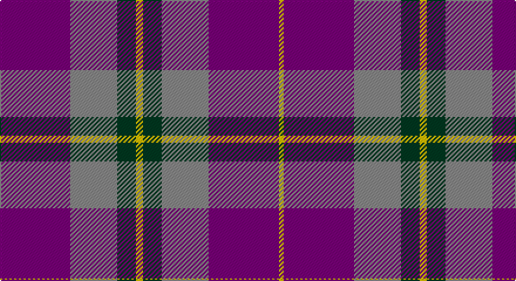

This page is one **sett** — a single exact thread-count. It belongs to the [tartan](/setts/dp30o20dg8ly3dg8o20dp30ly2/)
(the same proportion at any scale), whose colour order is pattern [BRGYGRBY](/stripes/brgygrby/).

Part of the [Wicks](/tartans/wicks/) tartan — the named design grouping this sett with its other cloths.

Sourced from register-of-tartans.  It is a [8 stripe tartan](/stripes/stripes8/).

Original link https://www.tartanregister.gov.uk/tartanDetails.aspx?ref=4622

## Provenance

Earliest known date: 2003 A tartan for the occasion of the marriage of Christopher Wicks and Nicola Bundle, in Aberdeen 2003.

## Also known as

This cloth is also recorded under:

- Wicks Personal

2 attestations — the source records this cloth was collapsed from (oldest owns this page)

<ul>
<li>01/10/2003 — Wicks (Personal) (register-of-tartans, <a href="https://www.tartanregister.gov.uk/tartanDetails.aspx?ref=4622">record</a>)</li>
<li>undated — Wicks Personal Tartan (house-of-tartan, <a href="http://www.house-of-tartan.scotland.net/house/TartanViewjs.asp?colr=Def&tnam=5968">record</a>)</li>
</ul>

## Register references

External register numbers recorded for this tartan.

- Scottish Register of Tartans: [4622](https://www.tartanregister.gov.uk/tartanDetails.aspx?ref=4622)
- Scottish Tartans Authority (ITI): 5968

## Thread count
P/60 N40 DG16 Y6 DG16 N40 P60 Y/4

One full sett is **420 threads**.

## Palette

Palette: <strong>Tartan Register</strong>
<table><thead><tr><th>Colour</th><th>Threads</th><th>Shade</th><th>Base</th><th>OKLCh</th></tr></thead><tbody><tr><td>P/</td><td style="text-align:right;font-variant-numeric:tabular-nums">60</td><td><code style="background-color:#780078;">#780078</code> <small style="color:#888">#780078</small></td><td>B <code style="background-color:#2A418A;">#2A418A</code></td><td><small style="color:#888">oklch(40.2% 0.185 328.4)</small></td></tr><tr><td>N</td><td style="text-align:right;font-variant-numeric:tabular-nums">40</td><td><code style="background-color:#888888;">#888888</code> <small style="color:#888">#888888</small></td><td>R <code style="background-color:#CC0000;">#CC0000</code></td><td><small style="color:#888">oklch(62.7% 0.000 89.9)</small></td></tr><tr><td>DG</td><td style="text-align:right;font-variant-numeric:tabular-nums">16</td><td><code style="background-color:#003820;">#003820</code> <small style="color:#888">#003820</small></td><td>G <code style="background-color:#006100;">#006100</code></td><td><small style="color:#888">oklch(30.0% 0.070 158.3)</small></td></tr><tr><td>Y</td><td style="text-align:right;font-variant-numeric:tabular-nums">6</td><td><code style="background-color:#E8C000;">#E8C000</code> <small style="color:#888">#E8C000</small></td><td>Y <code style="background-color:#F2BF00;">#F2BF00</code></td><td><small style="color:#888">oklch(81.9% 0.168 93.7)</small></td></tr><tr><td>DG</td><td style="text-align:right;font-variant-numeric:tabular-nums">16</td><td><code style="background-color:#003820;">#003820</code> <small style="color:#888">#003820</small></td><td>G <code style="background-color:#006100;">#006100</code></td><td><small style="color:#888">oklch(30.0% 0.070 158.3)</small></td></tr><tr><td>N</td><td style="text-align:right;font-variant-numeric:tabular-nums">40</td><td><code style="background-color:#888888;">#888888</code> <small style="color:#888">#888888</small></td><td>R <code style="background-color:#CC0000;">#CC0000</code></td><td><small style="color:#888">oklch(62.7% 0.000 89.9)</small></td></tr><tr><td>P</td><td style="text-align:right;font-variant-numeric:tabular-nums">60</td><td><code style="background-color:#780078;">#780078</code> <small style="color:#888">#780078</small></td><td>B <code style="background-color:#2A418A;">#2A418A</code></td><td><small style="color:#888">oklch(40.2% 0.185 328.4)</small></td></tr><tr><td>Y/</td><td style="text-align:right;font-variant-numeric:tabular-nums">4</td><td><code style="background-color:#E8C000;">#E8C000</code> <small style="color:#888">#E8C000</small></td><td>Y <code style="background-color:#F2BF00;">#F2BF00</code></td><td><small style="color:#888">oklch(81.9% 0.168 93.7)</small></td></tr></tbody></table>

# Sample pattern

## Nearest tartans

The nearest existing variants by ΔTartan distance, with this tartan at the top so the swatches line up against it.

ΔTartan

Tartan

Sett

—

<a href="/ttd/edit/#slug=dp30o20dg8ly3dg8o20dp30ly2~x2">Wicks (Personal)</a> <a class="nn-out" href="/variants/s8/dp30o20dg8ly3dg8o20dp30ly2~x2/" title="open its dictionary page">↗</a>

1.19

<a href="/ttd/edit/#slug=ly3dg8o20dp30ly2~x2&amp;base=dp30o20dg8ly3dg8o20dp30ly2~x2">Wicks (Personal)</a> <a class="nn-out" href="/variants/s5/ly3dg8o20dp30ly2~x2/" title="open its dictionary page">↗</a>

1.25

<a href="/ttd/edit/#slug=r25g10db30w4db30g10r25w2~x2&amp;base=dp30o20dg8ly3dg8o20dp30ly2~x2">Highland Spring Dress (2004)</a> <a class="nn-out" href="/variants/s8/r25g10db30w4db30g10r25w2~x2/" title="open its dictionary page">↗</a>

1.25

<a href="/ttd/edit/#slug=dg8db5k1db17r10db2r10o2~x2&amp;base=dp30o20dg8ly3dg8o20dp30ly2~x2">Harrower, John Anthony (Personal)</a> <a class="nn-out" href="/variants/s8/dg8db5k1db17r10db2r10o2~x2/" title="open its dictionary page">↗</a>

1.26

<a href="/ttd/edit/#slug=dp6ly1dp20db6g19dp2~x4&amp;base=dp30o20dg8ly3dg8o20dp30ly2~x2">Discover Islay (District)</a> <a class="nn-out" href="/variants/s6/dp6ly1dp20db6g19dp2~x4/" title="open its dictionary page">↗</a>

1.40

<a href="/ttd/edit/#slug=k4r37db37r2db37g37r37k4~x2&amp;base=dp30o20dg8ly3dg8o20dp30ly2~x2">Skene of Cromar - 1950 (Clan)</a> <a class="nn-out" href="/variants/s8/k4r37db37r2db37g37r37k4~x2/" title="open its dictionary page">↗</a>

1.41

<a href="/ttd/edit/#slug=k1r7k1r7db16g1~x4&amp;base=dp30o20dg8ly3dg8o20dp30ly2~x2">Robinson Dress (Pendleton) #1</a> <a class="nn-out" href="/variants/s6/k1r7k1r7db16g1~x4/" title="open its dictionary page">↗</a>

1.42

<a href="/ttd/edit/#slug=db9r1db2r1r4w1~x12&amp;base=dp30o20dg8ly3dg8o20dp30ly2~x2">McIntosh, Georgina (Personal)</a> <a class="nn-out" href="/variants/s6/db9r1db2r1r4w1~x12/" title="open its dictionary page">↗</a>

1.46

<a href="/ttd/edit/#slug=dg8b5k1b17r10b2r10lb2~x2&amp;base=dp30o20dg8ly3dg8o20dp30ly2~x2">Harrower, John Anthony (Personal)</a> <a class="nn-out" href="/variants/s8/dg8b5k1b17r10b2r10lb2~x2/" title="open its dictionary page">↗</a>

1.47

<a href="/ttd/edit/#slug=k1r7k1r7db16g1~x2&amp;base=dp30o20dg8ly3dg8o20dp30ly2~x2">Robinson, dress</a> <a class="nn-out" href="/variants/s6/k1r7k1r7db16g1~x2/" title="open its dictionary page">↗</a>

1.51

<a href="/ttd/edit/#slug=r10db4r6db30k10db5w2~x2&amp;base=dp30o20dg8ly3dg8o20dp30ly2~x2">Heritage of Wales (Fashion)</a> <a class="nn-out" href="/variants/s7/r10db4r6db30k10db5w2~x2/" title="open its dictionary page">↗</a>

## Neighbour map

Every grey dot is one of 14360 variants placed by the first two principal components of the ΔTartan feature space (44% of its variance). Red is this tartan; blue dots are its nearest — click one to open its page.

<svg viewBox="0 0 640 380" role="img" style="max-width:100%;height:auto;border:1px solid #e0e0e0;border-radius:4px;display:block" xmlns="http://www.w3.org/2000/svg"><image href="/nn/cloud.v1.png" width="640" height="380"/><a href="/variants/s5/ly3dg8o20dp30ly2~x2/"><circle cx="279.8" cy="195.4" r="4" fill="#3465a4"><title>Wicks (Personal)</title></circle></a><a href="/variants/s8/r25g10db30w4db30g10r25w2~x2/"><circle cx="231.0" cy="198.0" r="4" fill="#3465a4"><title>Highland Spring Dress (2004)</title></circle></a><a href="/variants/s8/dg8db5k1db17r10db2r10o2~x2/"><circle cx="247.3" cy="175.7" r="4" fill="#3465a4"><title>Harrower, John Anthony (Personal)</title></circle></a><a href="/variants/s6/dp6ly1dp20db6g19dp2~x4/"><circle cx="336.7" cy="196.1" r="4" fill="#3465a4"><title>Discover Islay (District)</title></circle></a><a href="/variants/s8/k4r37db37r2db37g37r37k4~x2/"><circle cx="234.4" cy="191.1" r="4" fill="#3465a4"><title>Skene of Cromar - 1950 (Clan)</title></circle></a><a href="/variants/s6/k1r7k1r7db16g1~x4/"><circle cx="328.3" cy="182.9" r="4" fill="#3465a4"><title>Robinson Dress (Pendleton) #1</title></circle></a><a href="/variants/s6/db9r1db2r1r4w1~x12/"><circle cx="285.0" cy="202.3" r="4" fill="#3465a4"><title>McIntosh, Georgina (Personal)</title></circle></a><a href="/variants/s8/dg8b5k1b17r10b2r10lb2~x2/"><circle cx="213.8" cy="153.6" r="4" fill="#3465a4"><title>Harrower, John Anthony (Personal)</title></circle></a><a href="/variants/s6/k1r7k1r7db16g1~x2/"><circle cx="324.1" cy="182.0" r="4" fill="#3465a4"><title>Robinson, dress</title></circle></a><a href="/variants/s7/r10db4r6db30k10db5w2~x2/"><circle cx="339.5" cy="188.0" r="4" fill="#3465a4"><title>Heritage of Wales (Fashion)</title></circle></a><circle cx="282.0" cy="195.3" r="5" fill="#c00000"/></svg>

ID: /variants/s8/dp30o20dg8ly3dg8o20dp30ly2~x2/
