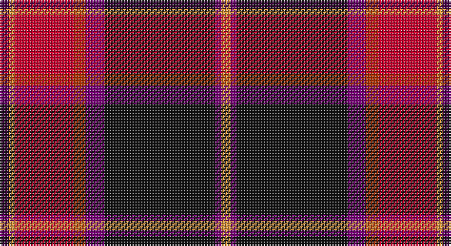

This page is one **sett** — a single exact thread-count. It belongs to the [tartan](/setts/dp3lo2r19ri4dpi6k36dpi2lo3/)
(the same proportion at any scale), whose colour order is pattern [BYRRBKBY](/stripes/byrrbkby/).

Sourced from tartans-authority.  It is a [8 stripe tartan](/stripes/stripes8/).

Original link http://www.tartansauthority.com/tartan-ferret/display/3829/

## Register references

External register numbers recorded for this tartan.

- Scottish Tartans Authority (ITI): 3829

## Thread count
DP/6 O4 R38 Ra8 P12 K72 P4 O/6

One full sett is **288 threads**.

## Palette

Palette: <strong>Tartan Register</strong>
<table><thead><tr><th>Colour</th><th>Threads</th><th>Shade</th><th>Base</th><th>OKLCh</th></tr></thead><tbody><tr><td>DP/</td><td style="text-align:right;font-variant-numeric:tabular-nums">6</td><td><code style="background-color:#440044;">#440044</code> <small style="color:#888">#440044</small></td><td>B <code style="background-color:#2A418A;">#2A418A</code></td><td><small style="color:#888">oklch(27.1% 0.125 328.4)</small></td></tr><tr><td>O</td><td style="text-align:right;font-variant-numeric:tabular-nums">4</td><td><code style="background-color:#DC943C;">#DC943C</code> <small style="color:#888">#DC943C</small></td><td>Y <code style="background-color:#F2BF00;">#F2BF00</code></td><td><small style="color:#888">oklch(72.3% 0.133 67.9)</small></td></tr><tr><td>R</td><td style="text-align:right;font-variant-numeric:tabular-nums">38</td><td><code style="background-color:#C8002C;">#C8002C</code> <small style="color:#888">#C8002C</small></td><td>R <code style="background-color:#CC0000;">#CC0000</code></td><td><small style="color:#888">oklch(52.6% 0.212 22.0)</small></td></tr><tr><td>Ra</td><td style="text-align:right;font-variant-numeric:tabular-nums">8</td><td><code style="background-color:#B03000;">#B03000</code> <small style="color:#888">#B03000</small></td><td>R <code style="background-color:#CC0000;">#CC0000</code></td><td><small style="color:#888">oklch(50.3% 0.171 36.3)</small></td></tr><tr><td>P</td><td style="text-align:right;font-variant-numeric:tabular-nums">12</td><td><code style="background-color:#780078;">#780078</code> <small style="color:#888">#780078</small></td><td>B <code style="background-color:#2A418A;">#2A418A</code></td><td><small style="color:#888">oklch(40.2% 0.185 328.4)</small></td></tr><tr><td>K</td><td style="text-align:right;font-variant-numeric:tabular-nums">72</td><td><code style="background-color:#101010;">#101010</code> <small style="color:#888">#101010</small></td><td>K <code style="background-color:#000000;">#000000</code></td><td><small style="color:#888">oklch(17.3% 0.000 89.9)</small></td></tr><tr><td>P</td><td style="text-align:right;font-variant-numeric:tabular-nums">4</td><td><code style="background-color:#780078;">#780078</code> <small style="color:#888">#780078</small></td><td>B <code style="background-color:#2A418A;">#2A418A</code></td><td><small style="color:#888">oklch(40.2% 0.185 328.4)</small></td></tr><tr><td>O/</td><td style="text-align:right;font-variant-numeric:tabular-nums">6</td><td><code style="background-color:#DC943C;">#DC943C</code> <small style="color:#888">#DC943C</small></td><td>Y <code style="background-color:#F2BF00;">#F2BF00</code></td><td><small style="color:#888">oklch(72.3% 0.133 67.9)</small></td></tr></tbody></table>

# Sample pattern

## Nearest tartans

The nearest existing variants by ΔTartan distance, with this tartan at the top so the swatches line up against it.

ΔTartan

Tartan

Sett

—

<a href="/ttd/edit/#slug=dp3lo2r19ri4dpi6k36dpi2lo3~x2">Hyland Evening (Personal)</a> <a class="nn-out" href="/variants/s8/dp3lo2r19ri4dpi6k36dpi2lo3~x2/" title="open its dictionary page">↗</a>

1.04

<a href="/ttd/edit/#slug=gi18g2db5r45lbi3db18lbi3r8lb2~x2&amp;base=dp3lo2r19ri4dpi6k36dpi2lo3~x2">MacNiven</a> <a class="nn-out" href="/variants/s9/gi18g2db5r45lbi3db18lbi3r8lb2~x2/" title="open its dictionary page">↗</a>

1.10

<a href="/ttd/edit/#slug=r72g16k8ly4db8w3k50~x2&amp;base=dp3lo2r19ri4dpi6k36dpi2lo3~x2">Stewart, Anthony C (Personal)</a> <a class="nn-out" href="/variants/s7/r72g16k8ly4db8w3k50~x2/" title="open its dictionary page">↗</a>

1.12

<a href="/ttd/edit/#slug=r60k40ly3pi5p3dg12~x2&amp;base=dp3lo2r19ri4dpi6k36dpi2lo3~x2">Rei Okamoto (Personal)</a> <a class="nn-out" href="/variants/s6/r60k40ly3pi5p3dg12~x2/" title="open its dictionary page">↗</a>

1.13

<a href="/ttd/edit/#slug=g18gi2dbi5r45db3dbi18db3r5w2&amp;base=dp3lo2r19ri4dpi6k36dpi2lo3~x2">MacNiven</a> <a class="nn-out" href="/variants/s9/g18gi2dbi5r45db3dbi18db3r5w2/" title="open its dictionary page">↗</a>

1.14

<a href="/ttd/edit/#slug=gi18g2db5r45dbi3db18dbi3r5w2&amp;base=dp3lo2r19ri4dpi6k36dpi2lo3~x2">MacNiven Family Tartan</a> <a class="nn-out" href="/variants/s9/gi18g2db5r45dbi3db18dbi3r5w2/" title="open its dictionary page">↗</a>

1.14

<a href="/ttd/edit/#slug=k2dbi2r16db2ly1db13w2~x2&amp;base=dp3lo2r19ri4dpi6k36dpi2lo3~x2">Wishart Dress Family Tartan</a> <a class="nn-out" href="/variants/s7/k2dbi2r16db2ly1db13w2~x2/" title="open its dictionary page">↗</a>

1.17

<a href="/ttd/edit/#slug=r4ly2r34db10y4db4t4db23w3~x2&amp;base=dp3lo2r19ri4dpi6k36dpi2lo3~x2">Heirloom Red Alba (Fashion)</a> <a class="nn-out" href="/variants/s9/r4ly2r34db10y4db4t4db23w3~x2/" title="open its dictionary page">↗</a>

1.18

<a href="/variants/s14/dp3lo2r19ri4dpi6k36dpi2lo3~x2/">Hyland Evening (Personal)</a>

1.19

<a href="/ttd/edit/#slug=k7dbi4r31db3ly2db27lb4~x2&amp;base=dp3lo2r19ri4dpi6k36dpi2lo3~x2">Wishart Dress (Clan)</a> <a class="nn-out" href="/variants/s7/k7dbi4r31db3ly2db27lb4~x2/" title="open its dictionary page">↗</a>

1.21

<a href="/ttd/edit/#slug=k5db5k2r47k18w2k5dg9db7w3~x2&amp;base=dp3lo2r19ri4dpi6k36dpi2lo3~x2">Rikaco Holiday (Fashion)</a> <a class="nn-out" href="/variants/s10/k5db5k2r47k18w2k5dg9db7w3~x2/" title="open its dictionary page">↗</a>

## Neighbour map

Every grey dot is one of 14360 variants placed by the first two principal components of the ΔTartan feature space (44% of its variance). Red is this tartan; blue dots are its nearest — click one to open its page.

<svg viewBox="0 0 640 380" role="img" style="max-width:100%;height:auto;border:1px solid #e0e0e0;border-radius:4px;display:block" xmlns="http://www.w3.org/2000/svg"><image href="/nn/cloud.v1.png" width="640" height="380"/><a href="/variants/s9/gi18g2db5r45lbi3db18lbi3r8lb2~x2/"><circle cx="280.2" cy="110.3" r="4" fill="#3465a4"><title>MacNiven</title></circle></a><a href="/variants/s7/r72g16k8ly4db8w3k50~x2/"><circle cx="247.4" cy="109.1" r="4" fill="#3465a4"><title>Stewart, Anthony C (Personal)</title></circle></a><a href="/variants/s6/r60k40ly3pi5p3dg12~x2/"><circle cx="273.9" cy="127.0" r="4" fill="#3465a4"><title>Rei Okamoto (Personal)</title></circle></a><a href="/variants/s9/g18gi2dbi5r45db3dbi18db3r5w2/"><circle cx="256.4" cy="94.7" r="4" fill="#3465a4"><title>MacNiven</title></circle></a><a href="/variants/s9/gi18g2db5r45dbi3db18dbi3r5w2/"><circle cx="273.3" cy="100.0" r="4" fill="#3465a4"><title>MacNiven Family Tartan</title></circle></a><a href="/variants/s7/k2dbi2r16db2ly1db13w2~x2/"><circle cx="225.4" cy="125.0" r="4" fill="#3465a4"><title>Wishart Dress Family Tartan</title></circle></a><a href="/variants/s9/r4ly2r34db10y4db4t4db23w3~x2/"><circle cx="252.0" cy="124.3" r="4" fill="#3465a4"><title>Heirloom Red Alba (Fashion)</title></circle></a><a href="/variants/s14/dp3lo2r19ri4dpi6k36dpi2lo3~x2/"><circle cx="255.9" cy="95.6" r="4" fill="#3465a4"><title>Hyland Evening (Personal)</title></circle></a><a href="/variants/s7/k7dbi4r31db3ly2db27lb4~x2/"><circle cx="199.4" cy="127.5" r="4" fill="#3465a4"><title>Wishart Dress (Clan)</title></circle></a><a href="/variants/s10/k5db5k2r47k18w2k5dg9db7w3~x2/"><circle cx="263.3" cy="100.0" r="4" fill="#3465a4"><title>Rikaco Holiday (Fashion)</title></circle></a><circle cx="253.7" cy="113.6" r="5" fill="#c00000"/></svg>

ID: /variants/s8/dp3lo2r19ri4dpi6k36dpi2lo3~x2/
