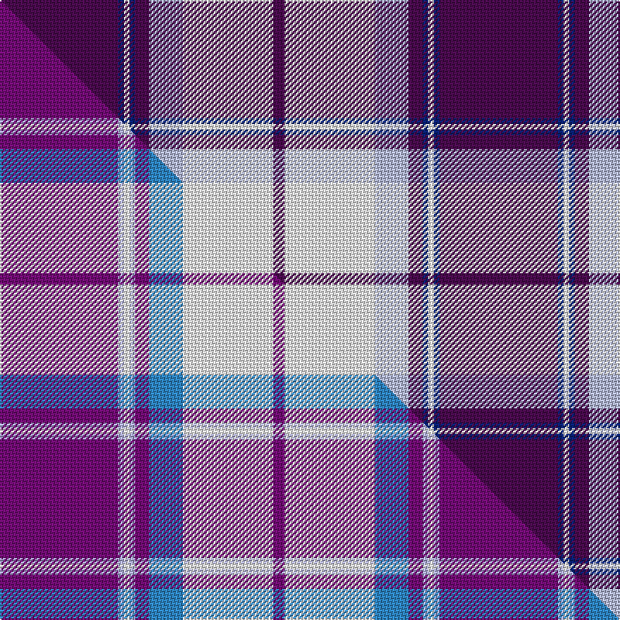

This is one **variant** — a specific cloth: this exact thread count and colourway, with its own
provenance below. It is one weaving of the [sett](/setts/dp42db2w2db2dp5lb12w32dp4/) (the scale-free proportion — the
same cloth at any scale or shade), whose colour order is pattern [BBWBBWWB](/stripes/bbwbbwwb/).

Part of the [Longniddry Dress](/tartans/l/lo/longniddry-dress-2/) tartan — the named design grouping this sett with its other cloths.

Sourced from house-of-tartan.  It is a [8 stripe tartan](/stripes/stripes8/).

Original link [http://www.house-of-tartan.scotland.net/house/TartanViewjs.asp?colr=Def&tnam=88](http://www.house-of-tartan.scotland.net/house/TartanViewjs.asp?colr=Def&tnam=88)

## Provenance

Earliest known date: pre 2003 A dancers tartan from D.C. Dalgleish weavers of Selkirk

Dataset <small>— provenance for this record, inherited from the source manifest</small>

<dl class="dataset-prov">
<dt>source</dt><dd><a href="/sources/house-of-tartan/">House of Tartan</a></dd>
<dt>data captured from</dt><dd><a href="https://github.com/thetartan/tartan-database/blob/master/data/house-of-tartan/data.csv">https://github.com/thetartan/tartan-database/blob/master/data/house-of-tartan/data.csv</a></dd>
<dt>data date</dt><dd>pre 2003 <small>(this record)</small></dd>
<dt>licence</dt><dd><a href="https://creativecommons.org/licenses/by-nc-nd/4.0/">CC BY-NC-ND 4.0</a></dd>
</dl>

Capture chain <small>— the hands this data passed through, oldest first; each capture carries its own licence</small>

<ol class="capture-chain">
<li><a href="http://www.house-of-tartan.scotland.net/">House of Tartan</a> <small>the weaver/retailer's database — the site is now offline; the URL is kept as the ultimate source's identity</small></li>
<li><a href="https://github.com/thetartan/tartan-database">thetartan/tartan-database</a> <small>2016-2017</small> · <a href="https://creativecommons.org/licenses/by-nc-nd/4.0/">CC BY-NC-ND 4.0</a> <small>Levko Kravets's frozen compilation — the capture we vendored, and where its CC licence text came from</small></li>
<li>this dictionary <small>captured 2026-06-10 · commit 5bf86c7566</small> <small>each re-capture is a git commit to data/sources</small></li>
</ol>

## Thread count
DP/84 DB4 W4 DB4 DP10 LB24 W64 DP/8

One full sett is **312 threads**.

## Palette
<table><thead><tr><th>Colour</th><th>Shade</th><th>OKLCh</th></tr></thead><tbody><tr><td>LB</td><td><code style="background-color:#B5BBDE;">#B5BBDE</code> <small style="color:#888">#B5BBDE</small></td><td><small style="color:#888">oklch(79.9% 0.050 277.6)</small></td></tr><tr><td>DB</td><td><code style="background-color:#082077;">#082077</code> <small style="color:#888">#082077</small></td><td><small style="color:#888">oklch(30.0% 0.149 265.1)</small></td></tr><tr><td>W</td><td><code style="background-color:#F7F7F7;">#F7F7F7</code> <small style="color:#888">#F7F7F7</small></td><td><small style="color:#888">oklch(97.6% 0.000 89.9)</small></td></tr><tr><td>DP</td><td><code style="background-color:#4B0B4F;">#4B0B4F</code> <small style="color:#888">#4B0B4F</small></td><td><small style="color:#888">oklch(30.1% 0.125 325.4)</small></td></tr></tbody></table>

# Sample pattern

## Compared to the master

This cloth is one sett of its design; the master sett (the exemplar the design is anchored on) is below for comparison.

Its **ΔTartan distance** from the master is **1.20** — the same measure the nearest-tartans table ranks by (0 is identical; a re-scale of the same cloth is near 0, a recolour or a different proportion further).

<figure class="master-compare" style="margin:0">

this sett
master sett ★

<figcaption style="color:#888;font-size:smaller">One weave of this sett against the <a href="/setts/dp42lb2w2lb2dp5t12w32dp4/">master sett ★</a>, split on the diagonal: a shared proportion runs seamlessly across it with only the shades shifting; a different proportion breaks on it.</figcaption>
</figure>

## Nearest tartan variants

The nearest existing variants by ΔTartan distance, with this cloth at the top so the swatches line up against it.

ΔTartan

Threads

Variant

Sett

—

312

<a href="/variants/s8/dp42db2w2db2dp5lb12w32dp4~x2/">Longniddry Dress District Tartan</a>

<a href="/ttd/edit/#slug=dp42db2w2db2dp5b12w32dp4~x2&amp;base=dp42db2w2db2dp5lb12w32dp4~x2" title="compare in the TTD">0.07</a>

312

<a href="/variants/s8/dp42db2w2db2dp5b12w32dp4~x2/">Longniddry, dress</a>

<a href="/ttd/edit/#slug=dp42lb2w2lb2dp5t12w32dp4~x2~lb3103284-t2405244&amp;base=dp42db2w2db2dp5lb12w32dp4~x2" title="compare in the TTD">1.20</a>

312

<a href="/variants/s8/dp42lb2w2lb2dp5t12w32dp4~x2~lb3103284-t2405244/">Longniddry Purple</a>

<a href="/ttd/edit/#slug=dp42lb2w2lb2dp5t12w32dp4~x2~dp1607327-lb3103284-t2405244&amp;base=dp42db2w2db2dp5lb12w32dp4~x2" title="compare in the TTD">1.20</a>

312

<a href="/variants/s8/dp42lb2w2lb2dp5t12w32dp4~x2~dp1607327-lb3103284-t2405244/">Longniddry Dress (Dance)</a>

<a href="/ttd/edit/#slug=w20dbi14dp14w4db2lb2dp7~x2~dbi1405255-db0906265&amp;base=dp42db2w2db2dp5lb12w32dp4~x2" title="compare in the TTD">1.99</a>

198

<a href="/variants/s7/w20dbi14dp14w4db2lb2dp7~x2~dbi1405255-db0906265/">Earl of St. Andrews Dress</a>

<a href="/ttd/edit/#slug=lr12dr3lr3db4lr16ly3lr3ly3lr3ly16db52lr4&amp;base=dp42db2w2db2dp5lb12w32dp4~x2" title="compare in the TTD">2.80</a>

228

<a href="/variants/s12/lr12dr3lr3db4lr16ly3lr3ly3lr3ly16db52lr4/">Carsaig</a>

<a href="/ttd/edit/#slug=dt42lb2lr2lb2dt5db12lr32dt4~x2~dt1204274-lb3103284-lr3200000-db1404245&amp;base=dp42db2w2db2dp5lb12w32dp4~x2" title="compare in the TTD">3.14</a>

312

<a href="/variants/s8/db42lb2lbi2lb2db5dbi12lbi32db4~x2~db1204274-lb3103284-lbi3200000-dbi1404245/">Longniddry Eildon Blue Dress Fancy Tartan</a>

<a href="/ttd/edit/#slug=db14w2db3w2dr10w32dr10db10w2db3~x2&amp;base=dp42db2w2db2dp5lb12w32dp4~x2" title="compare in the TTD">3.21</a>

318

<a href="/variants/s10/db14w2db3w2dr10w32dr10db10w2db3~x2/">Fraser Arisaid Clan Tartan</a>

<a href="/ttd/edit/#slug=dr25lb2dr3ly2dr3lb11w13ly1~x2&amp;base=dp42db2w2db2dp5lb12w32dp4~x2" title="compare in the TTD">3.21</a>

188

<a href="/variants/s8/dr25lb2dr3ly2dr3lb11w13ly1~x2/">Citylink Gold (Corporate)</a>

<a href="/ttd/edit/#slug=dp6w2dp29w29dp2w6~x2&amp;base=dp42db2w2db2dp5lb12w32dp4~x2" title="compare in the TTD">3.23</a>

272

<a href="/variants/s6/dp6w2dp29w29dp2w6~x2/">Erskine Purple (Dance) Fashion Tartan</a>

<a href="/ttd/edit/#slug=w4db2lo8db2n2db2n2db23lo10db2lo7db2~x2&amp;base=dp42db2w2db2dp5lb12w32dp4~x2" title="compare in the TTD">3.33</a>

252

<a href="/variants/s12/w4db2lo8db2n2db2n2db23lo10db2lo7db2~x2/">Auld Lang Syne Brown Tartan</a>

## Neighbour map

Every grey dot is one of 13621 variants placed by the first two principal components of the ΔTartan feature space (42% of its variance). Red is this tartan; blue dots are its nearest — click one to open its page.

<svg viewBox="0 0 640 380" role="img" style="max-width:100%;height:auto;border:1px solid #e0e0e0;border-radius:4px;display:block" xmlns="http://www.w3.org/2000/svg"><image href="/nn/cloud.v1.png" width="640" height="380"/><a href="/variants/s8/dp42db2w2db2dp5b12w32dp4~x2/"><circle cx="322.9" cy="165.4" r="4" fill="#3465a4"><title>Longniddry, dress</title></circle></a><a href="/variants/s8/dp42lb2w2lb2dp5t12w32dp4~x2~lb3103284-t2405244/"><circle cx="323.7" cy="166.7" r="4" fill="#3465a4"><title>Longniddry Purple</title></circle></a><a href="/variants/s8/dp42lb2w2lb2dp5t12w32dp4~x2~dp1607327-lb3103284-t2405244/"><circle cx="335.7" cy="167.8" r="4" fill="#3465a4"><title>Longniddry Dress (Dance)</title></circle></a><a href="/variants/s7/w20dbi14dp14w4db2lb2dp7~x2~dbi1405255-db0906265/"><circle cx="194.2" cy="223.6" r="4" fill="#3465a4"><title>Earl of St. Andrews Dress</title></circle></a><a href="/variants/s12/lr12dr3lr3db4lr16ly3lr3ly3lr3ly16db52lr4/"><circle cx="303.2" cy="154.3" r="4" fill="#3465a4"><title>Carsaig</title></circle></a><a href="/variants/s8/db42lb2lbi2lb2db5dbi12lbi32db4~x2~db1204274-lb3103284-lbi3200000-dbi1404245/"><circle cx="342.0" cy="176.9" r="4" fill="#3465a4"><title>Longniddry Eildon Blue Dress Fancy Tartan</title></circle></a><a href="/variants/s10/db14w2db3w2dr10w32dr10db10w2db3~x2/"><circle cx="277.7" cy="194.9" r="4" fill="#3465a4"><title>Fraser Arisaid Clan Tartan</title></circle></a><a href="/variants/s8/dr25lb2dr3ly2dr3lb11w13ly1~x2/"><circle cx="324.3" cy="169.3" r="4" fill="#3465a4"><title>Citylink Gold (Corporate)</title></circle></a><a href="/variants/s6/dp6w2dp29w29dp2w6~x2/"><circle cx="381.4" cy="234.4" r="4" fill="#3465a4"><title>Erskine Purple (Dance) Fashion Tartan</title></circle></a><a href="/variants/s12/w4db2lo8db2n2db2n2db23lo10db2lo7db2~x2/"><circle cx="299.5" cy="181.1" r="4" fill="#3465a4"><title>Auld Lang Syne Brown Tartan</title></circle></a><circle cx="321.5" cy="164.9" r="5" fill="#c00000"/><text x="320" y="376" text-anchor="middle" font-size="11" fill="#999">ground</text><text x="11" y="190" text-anchor="middle" font-size="11" fill="#999" transform="rotate(-90 11 190)">complexity</text></svg>

ID: /variants/s8/dp42db2w2db2dp5lb12w32dp4~x2/
