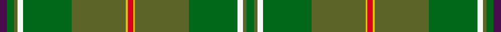

This page is one **sett** — a single exact thread-count. It belongs to the [tartan](/setts/dp4dg4g2w3dg27g30ly1r3/)
(the same proportion at any scale), whose colour order is pattern [BGGWGGYRYGGWGG](/stripes/bggwggyryggwgg/).

Part of the [Hannigan of Dirleton](/tartans/hannigan-of-dirleton/) tartan — the named design grouping this sett with its other cloths.

Sourced from register-of-tartans.  It is a [14 stripe tartan](/stripes/stripes14/).

Original link https://www.tartanregister.gov.uk/tartanDetails.aspx?ref=1590

## Register references

External register numbers recorded for this tartan.

- Scottish Register of Tartans: [1590](https://www.tartanregister.gov.uk/tartanDetails.aspx?ref=1590)
- Scottish Tartans Authority (ITI): 2685
- Scottish Tartans World Register: 2685

## Thread count
DP/8 DG8 G4 W6 DG54 G60 LY2 R6 LY2 G60 DG54 W6 G4 DG/8

One full sett is **548 threads**.

## Palette
<table><thead><tr><th>Colour</th><th>Shade</th><th>OKLCh</th></tr></thead><tbody><tr><td>G</td><td><code style="background-color:#5C6428;">#5C6428</code> <small style="color:#888">#5C6428</small></td><td><small style="color:#888">oklch(48.3% 0.084 116.0)</small></td></tr><tr><td>DG</td><td><code style="background-color:#006818;">#006818</code> <small style="color:#888">#006818</small></td><td><small style="color:#888">oklch(45.0% 0.142 145.0)</small></td></tr><tr><td>Y</td><td><code style="background-color:#789484;">#789484</code> <small style="color:#888">#789484</small></td><td><small style="color:#888">oklch(64.0% 0.040 160.0)</small></td></tr><tr><td>W</td><td><code style="background-color:#F7F7F7;">#F7F7F7</code> <small style="color:#888">#F7F7F7</small></td><td><small style="color:#888">oklch(97.6% 0.000 89.9)</small></td></tr><tr><td>M</td><td><code style="background-color:#CA047B;">#CA047B</code> <small style="color:#888">#CA047B</small></td><td><small style="color:#888">oklch(55.0% 0.225 353.8)</small></td></tr><tr><td>DP</td><td><code style="background-color:#4B0B4F;">#4B0B4F</code> <small style="color:#888">#4B0B4F</small></td><td><small style="color:#888">oklch(30.1% 0.125 325.4)</small></td></tr><tr><td>R</td><td><code style="background-color:#D60020;">#D60020</code> <small style="color:#888">#D60020</small></td><td><small style="color:#888">oklch(55.2% 0.224 25.5)</small></td></tr><tr><td>LY</td><td><code style="background-color:#E8C000;">#E8C000</code> <small style="color:#888">#E8C000</small></td><td><small style="color:#888">oklch(81.9% 0.168 93.7)</small></td></tr></tbody></table>

# Sample pattern

## Nearest tartan variants

The nearest existing variants by ΔTartan distance, with this cloth at the top so the swatches line up against it.

ΔTartan

Threads

Variant

Sett

—

548

<a href="/variants/s8/dp4dg4g2w3dg27g30ly1r3~x2~dg1806142-g1903114-ly3307090/">Hannigan of Dirleton (Personal)</a>

<a href="/ttd/edit/#slug=dp4dg4g2w3dg27g30y1r3~x2~dg1806142-g1903114&amp;base=dp4dg4g2w3dg27g30ly1r3~x2~dg1806142-g1903114-ly3307090" title="compare in the TTD">0.01</a>

282

<a href="/variants/s8/dp4dg4g2w3dg27g30y1r3~x2~dg1806142-g1903114/">Hannigan of Dirleton (Personal)</a>

<a href="/ttd/edit/#slug=y15r3y3r1y35g5w2db2g35r1g3r3g15y5w2db2~x2&amp;base=dp4dg4g2w3dg27g30ly1r3~x2~dg1806142-g1903114-ly3307090" title="compare in the TTD">3.45</a>

494

<a href="/variants/s16/y15r3y3r1y35g5w2db2g35r1g3r3g15y5w2db2~x2/">Keilar (2013)</a>

<a href="/ttd/edit/#slug=dgi6g2dr2dgi30y2g4y2dg2y1dg20y1g2dr4~x2~dgi1806142-g2408144&amp;base=dp4dg4g2w3dg27g30ly1r3~x2~dg1806142-g1903114-ly3307090" title="compare in the TTD">3.78</a>

292

<a href="/variants/s13/dgi6g2dr2dgi30y2g4y2dg2y1dg20y1g2dr4~x2~dgi1806142-g2408144/">All Ireland Green (Fashion)</a>

<a href="/ttd/edit/#slug=dgi6g2dr2dgi30n2g4n2dg2n1dg20n1g2dr4~x2~dgi1806142-g2408144&amp;base=dp4dg4g2w3dg27g30ly1r3~x2~dg1806142-g1903114-ly3307090" title="compare in the TTD">3.86</a>

292

<a href="/variants/s13/dgi6g2dr2dgi30n2g4n2dg2n1dg20n1g2dr4~x2~dgi1806142-g2408144/">All Ireland Green</a>

## Neighbour map

Every grey dot is one of 13620 variants placed by the first two principal components of the ΔTartan feature space (42% of its variance). Red is this tartan; blue dots are its nearest — click one to open its page.

<svg viewBox="0 0 640 380" role="img" style="max-width:100%;height:auto;border:1px solid #e0e0e0;border-radius:4px;display:block" xmlns="http://www.w3.org/2000/svg"><image href="/nn/cloud.v1.png" width="640" height="380"/><a href="/variants/s8/dp4dg4g2w3dg27g30y1r3~x2~dg1806142-g1903114/"><circle cx="374.8" cy="157.0" r="4" fill="#3465a4"><title>Hannigan of Dirleton (Personal)</title></circle></a><a href="/variants/s16/y15r3y3r1y35g5w2db2g35r1g3r3g15y5w2db2~x2/"><circle cx="386.3" cy="126.9" r="4" fill="#3465a4"><title>Keilar (2013)</title></circle></a><a href="/variants/s13/dgi6g2dr2dgi30y2g4y2dg2y1dg20y1g2dr4~x2~dgi1806142-g2408144/"><circle cx="412.1" cy="159.4" r="4" fill="#3465a4"><title>All Ireland Green (Fashion)</title></circle></a><a href="/variants/s13/dgi6g2dr2dgi30n2g4n2dg2n1dg20n1g2dr4~x2~dgi1806142-g2408144/"><circle cx="418.6" cy="162.0" r="4" fill="#3465a4"><title>All Ireland Green</title></circle></a><circle cx="393.1" cy="146.8" r="5" fill="#c00000"/><text x="320" y="376" text-anchor="middle" font-size="11" fill="#999">ground</text><text x="11" y="190" text-anchor="middle" font-size="11" fill="#999" transform="rotate(-90 11 190)">complexity</text></svg>

ID: /variants/s8/dp4dg4g2w3dg27g30ly1r3~x2~dg1806142-g1903114-ly3307090/
