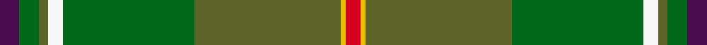

This is one **variant** — a specific cloth: this exact thread count and colourway, with its own
provenance below. It is one weaving of the [sett](/tartans/h/ha/hannigan-of-dirleton/) (the scale-free proportion — the
same cloth at any scale or shade), whose colour order is pattern [BGGWGGYR](/stripes/bggwggyr/).

Part of the [Hannigan of Dirleton](/tartans/h/ha/hannigan-of-dirleton/) tartan — the named design grouping this sett with its other cloths.

Sourced from register-of-tartans.  It is a [8 stripe tartan](/stripes/stripes8/).

Original link [https://www.tartanregister.gov.uk/tartanDetails.aspx?ref=1590](https://www.tartanregister.gov.uk/tartanDetails.aspx?ref=1590)

Dataset <small>— provenance for this record, inherited from the source manifest</small>

<dl class="dataset-prov">
<dt>source</dt><dd><a href="/sources/register-of-tartans/">Scottish Register of Tartans</a></dd>
<dt>data captured from</dt><dd><a href="https://github.com/thetartan/tartan-database/blob/master/data/register-of-tartans/data.csv">https://github.com/thetartan/tartan-database/blob/master/data/register-of-tartans/data.csv</a></dd>
<dt>data date</dt><dd>01/07/1998 <small>(this record)</small></dd>
<dt>licence</dt><dd><a href="https://www.tartanregister.gov.uk/copyright">Crown copyright</a></dd>
</dl>

Capture chain <small>— the hands this data passed through, oldest first; each capture carries its own licence</small>

<ol class="capture-chain">
<li><a href="https://www.tartanregister.gov.uk/">Scottish Register of Tartans</a> · <a href="https://www.tartanregister.gov.uk/copyright">Crown copyright</a> <small>the living register — still published by National Records of Scotland</small></li>
<li><a href="https://github.com/thetartan/tartan-database">thetartan/tartan-database</a> <small>2016-2017</small> · <a href="https://creativecommons.org/licenses/by-nc-nd/4.0/">CC BY-NC-ND 4.0</a> <small>Levko Kravets's frozen compilation — the capture we vendored, and where its CC licence text came from</small></li>
<li>this dictionary <small>captured 2026-06-10 · commit 5bf86c7566</small> <small>each re-capture is a git commit to data/sources</small></li>
</ol>

## Register references

External register numbers recorded for this tartan.

- Scottish Register of Tartans: [1590](https://www.tartanregister.gov.uk/tartanDetails.aspx?ref=1590)
- Scottish Tartans Authority (ITI): 2685
- Scottish Tartans World Register: 2685

## Thread count
DP/8 DG8 G4 W6 DG54 G60 LY2 R/6

One full sett is **282 threads**.

The source recorded this cloth as DP/8 DG8 G4 W6 DG54 G60 LY2 R6 LY2 G60 DG54 W6 G4 DG/8 — 548 threads; it folds to the canonical 282-thread sett above.

## Palette
<table><thead><tr><th>Colour</th><th>Shade</th><th>OKLCh</th></tr></thead><tbody><tr><td>G</td><td><code style="background-color:#5C6428;">#5C6428</code> <small style="color:#888">#5C6428</small></td><td><small style="color:#888">oklch(48.3% 0.084 116.0)</small></td></tr><tr><td>DG</td><td><code style="background-color:#006818;">#006818</code> <small style="color:#888">#006818</small></td><td><small style="color:#888">oklch(45.0% 0.142 145.0)</small></td></tr><tr><td>Y</td><td><code style="background-color:#789484;">#789484</code> <small style="color:#888">#789484</small></td><td><small style="color:#888">oklch(64.0% 0.040 160.0)</small></td></tr><tr><td>W</td><td><code style="background-color:#F7F7F7;">#F7F7F7</code> <small style="color:#888">#F7F7F7</small></td><td><small style="color:#888">oklch(97.6% 0.000 89.9)</small></td></tr><tr><td>M</td><td><code style="background-color:#CA047B;">#CA047B</code> <small style="color:#888">#CA047B</small></td><td><small style="color:#888">oklch(55.0% 0.225 353.8)</small></td></tr><tr><td>DP</td><td><code style="background-color:#4B0B4F;">#4B0B4F</code> <small style="color:#888">#4B0B4F</small></td><td><small style="color:#888">oklch(30.1% 0.125 325.4)</small></td></tr><tr><td>R</td><td><code style="background-color:#D60020;">#D60020</code> <small style="color:#888">#D60020</small></td><td><small style="color:#888">oklch(55.2% 0.224 25.5)</small></td></tr><tr><td>LY</td><td><code style="background-color:#E8C000;">#E8C000</code> <small style="color:#888">#E8C000</small></td><td><small style="color:#888">oklch(81.9% 0.168 93.7)</small></td></tr></tbody></table>

# Sample pattern

## Nearest tartan variants

The nearest existing variants by ΔTartan distance, with this cloth at the top so the swatches line up against it.

ΔTartan

Threads

Variant

Sett

—

548

<a href="/variants/s8/dp4dg4g2w3dg27g30ly1r3~x2~dg4514144-g4808117-ly8117093/">Hannigan of Dirleton (Personal)</a>

<a href="/ttd/edit/#slug=dp4dg4g2w3dg27g30y1r3~x2~dg4514144-g4808117&amp;base=dp4dg4g2w3dg27g30ly1r3~x2~dg4514144-g4808117-ly8117093" title="compare in the TTD">0.01</a>

282

<a href="/variants/s8/dp4dg4g2w3dg27g30y1r3~x2~dg4514144-g4808117/">Hannigan of Dirleton (Personal)</a>

<a href="/ttd/edit/#slug=y15r3y3r1y35g5w2db2g35r1g3r3g15y5w2db2~x2&amp;base=dp4dg4g2w3dg27g30ly1r3~x2~dg4514144-g4808117-ly8117093" title="compare in the TTD">3.45</a>

494

<a href="/variants/s16/y15r3y3r1y35g5w2db2g35r1g3r3g15y5w2db2~x2/">Keilar (2013)</a>

<a href="/ttd/edit/#slug=dgi6g2dr2dgi30y2g4y2dg2y1dg20y1g2dr4~x2~dgi4514144-g6019141&amp;base=dp4dg4g2w3dg27g30ly1r3~x2~dg4514144-g4808117-ly8117093" title="compare in the TTD">3.78</a>

292

<a href="/variants/s13/dgi6g2dr2dgi30y2g4y2dg2y1dg20y1g2dr4~x2~dgi4514144-g6019141/">All Ireland Green (Fashion)</a>

<a href="/ttd/edit/#slug=dgi6g2dr2dgi30n2g4n2dg2n1dg20n1g2dr4~x2~dgi4514144-g6019141&amp;base=dp4dg4g2w3dg27g30ly1r3~x2~dg4514144-g4808117-ly8117093" title="compare in the TTD">3.86</a>

292

<a href="/variants/s13/dgi6g2dr2dgi30n2g4n2dg2n1dg20n1g2dr4~x2~dgi4514144-g6019141/">All Ireland Green</a>

## Neighbour map

Every grey dot is one of 13662 variants placed by the first two principal components of the ΔTartan feature space (42% of its variance). Red is this tartan; blue dots are its nearest — click one to open its page. The map is a flat projection of a many-dimensional space — [how to read it](/posts/neighbourhood-maps/).

<svg viewBox="0 0 640 380" role="img" style="max-width:100%;height:auto;border:1px solid #e0e0e0;border-radius:4px;display:block" xmlns="http://www.w3.org/2000/svg"><image href="/nn/cloud.v1.png" width="640" height="380"/><a href="/variants/s8/dp4dg4g2w3dg27g30y1r3~x2~dg4514144-g4808117/"><circle cx="374.7" cy="157.4" r="4" fill="#3465a4"><title>Hannigan of Dirleton (Personal)</title></circle></a><a href="/variants/s16/y15r3y3r1y35g5w2db2g35r1g3r3g15y5w2db2~x2/"><circle cx="386.4" cy="127.3" r="4" fill="#3465a4"><title>Keilar (2013)</title></circle></a><a href="/variants/s13/dgi6g2dr2dgi30y2g4y2dg2y1dg20y1g2dr4~x2~dgi4514144-g6019141/"><circle cx="411.9" cy="160.1" r="4" fill="#3465a4"><title>All Ireland Green (Fashion)</title></circle></a><a href="/variants/s13/dgi6g2dr2dgi30n2g4n2dg2n1dg20n1g2dr4~x2~dgi4514144-g6019141/"><circle cx="418.4" cy="162.6" r="4" fill="#3465a4"><title>All Ireland Green</title></circle></a><circle cx="393.1" cy="147.4" r="5" fill="#c00000"/><text x="320" y="376" text-anchor="middle" font-size="11" fill="#999">ground</text><text x="11" y="190" text-anchor="middle" font-size="11" fill="#999" transform="rotate(-90 11 190)">complexity</text></svg>

ID: /variants/s8/dp4dg4g2w3dg27g30ly1r3~x2~dg4514144-g4808117-ly8117093/
