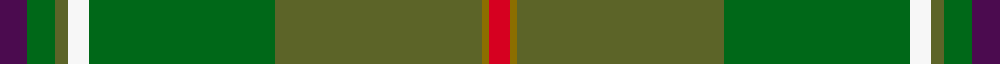
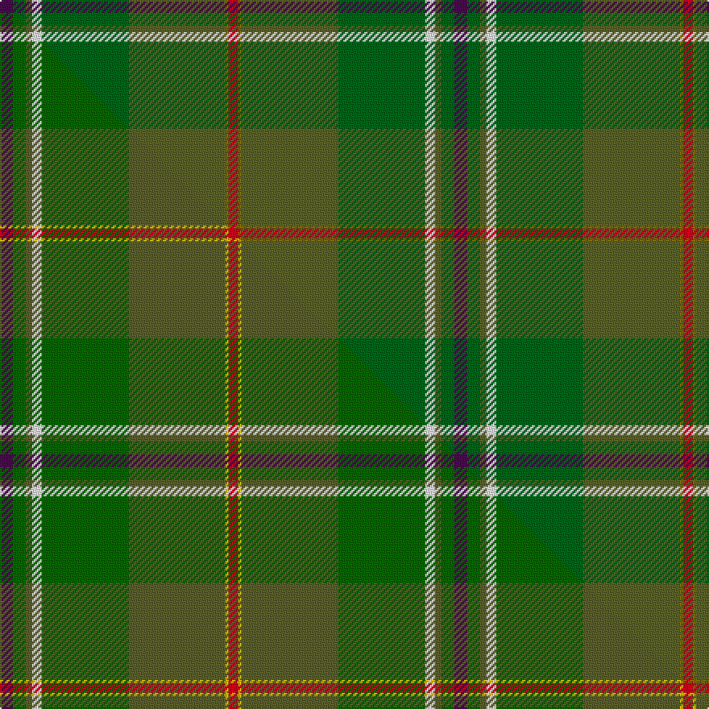

This page is one **sett** — a single exact thread-count. It belongs to the [tartan](/setts/dp4dg4g2w3dg27g30y1r3/)
(the same proportion at any scale), whose colour order is pattern [BGGWGGGR](/stripes/bggwgggr/).

Part of the [Hannigan of Dirleton](/tartans/hannigan-of-dirleton/) tartan — the named design grouping this sett with its other cloths.

Sourced from tartans-authority.  It is a [8 stripe tartan](/stripes/stripes8/).

Original link https://www.tartanregister.gov.uk/tartanDetails.aspx?ref=2685

Dataset <small>— provenance for this record, inherited from the source manifest</small>

<dl class="dataset-prov">
<dt>source</dt><dd><a href="/sources/tartans-authority/">Scottish Tartans Authority</a></dd>
<dt>data captured from</dt><dd><a href="https://github.com/thetartan/tartan-database/blob/master/data/tartans-authority/data.csv">https://github.com/thetartan/tartan-database/blob/master/data/tartans-authority/data.csv</a></dd>
<dt>data date</dt><dd>Jul. 1998 <small>(this record)</small></dd>
<dt>licence</dt><dd><a href="https://creativecommons.org/licenses/by-nc-nd/4.0/">CC BY-NC-ND 4.0</a></dd>
</dl>

Capture chain <small>— the hands this data passed through, oldest first; each capture carries its own licence</small>

<ol class="capture-chain">
<li><a href="https://www.tartansauthority.com/">Scottish Tartans Authority</a> <small>the heritage body's archive — its tartan-ferret record browser is retired (links repaired to the SRT, above)</small></li>
<li><a href="https://github.com/thetartan/tartan-database">thetartan/tartan-database</a> <small>2016-2017</small> · <a href="https://creativecommons.org/licenses/by-nc-nd/4.0/">CC BY-NC-ND 4.0</a> <small>Levko Kravets's frozen compilation — the capture we vendored, and where its CC licence text came from</small></li>
<li>this dictionary <small>captured 2026-06-10 · commit 5bf86c7566</small> <small>each re-capture is a git commit to data/sources</small></li>
</ol>

## Register references

External register numbers recorded for this tartan.

- Scottish Tartans Authority (ITI): 2685

## Thread count
DP/8 DG8 G4 W6 DG54 G60 Y2 R/6

One full sett is **282 threads**.

## Palette
<table><thead><tr><th>Colour</th><th>Shade</th><th>OKLCh</th></tr></thead><tbody><tr><td>DG</td><td><code style="background-color:#006818;">#006818</code> <small style="color:#888">#006818</small></td><td><small style="color:#888">oklch(45.0% 0.142 145.0)</small></td></tr><tr><td>G</td><td><code style="background-color:#5C6428;">#5C6428</code> <small style="color:#888">#5C6428</small></td><td><small style="color:#888">oklch(48.3% 0.084 116.0)</small></td></tr><tr><td>W</td><td><code style="background-color:#F7F7F7;">#F7F7F7</code> <small style="color:#888">#F7F7F7</small></td><td><small style="color:#888">oklch(97.6% 0.000 89.9)</small></td></tr><tr><td>DP</td><td><code style="background-color:#4B0B4F;">#4B0B4F</code> <small style="color:#888">#4B0B4F</small></td><td><small style="color:#888">oklch(30.1% 0.125 325.4)</small></td></tr><tr><td>R</td><td><code style="background-color:#D60020;">#D60020</code> <small style="color:#888">#D60020</small></td><td><small style="color:#888">oklch(55.2% 0.224 25.5)</small></td></tr><tr><td>Y</td><td><code style="background-color:#8B6E00;">#8B6E00</code> <small style="color:#888">#8B6E00</small></td><td><small style="color:#888">oklch(55.1% 0.113 90.4)</small></td></tr></tbody></table>

# Sample pattern

## Compared to the master

This cloth is one sett of its design; the master sett (the exemplar the design is anchored on) is below for comparison.

Its **ΔTartan distance** from the master is **2.32** — the same measure the nearest-tartans table ranks by (0 is identical; a re-scale of the same cloth is near 0, a recolour or a different proportion further).

<figure class="master-compare" style="margin:0">

this sett
master sett ★

<figcaption style="color:#888;font-size:smaller">One weave of this sett against the <a href="/setts/dp4dg4g2w3dg27g30ly1r3/">master sett ★</a>, split on the diagonal: a shared proportion runs seamlessly across it with only the shades shifting; a different proportion breaks on it.</figcaption>
</figure>

## Nearest tartan variants

The nearest existing variants by ΔTartan distance, with this cloth at the top so the swatches line up against it.

ΔTartan

Threads

Variant

Sett

—

282

<a href="/variants/s8/dp4dg4g2w3dg27g30y1r3~x2~dg1806142-g1903114/">Hannigan of Dirleton (Personal)</a>

<a href="/ttd/edit/#slug=dp4dg4g2w3dg27g30ly1r3~x2~dg1806142-g1903114-ly3307090&amp;base=dp4dg4g2w3dg27g30y1r3~x2~dg1806142-g1903114" title="compare in the TTD">0.01</a>

282

<a href="/variants/s8/dp4dg4g2w3dg27g30ly1r3~x2~dg1806142-g1903114-ly3307090/">Hannigan of Dirleton (Personal)</a>

<a href="/ttd/edit/#slug=dpi10k2dg10dp30dg30dgi55k4dr8~dpi1607327-dp1105325-dgi1605139&amp;base=dp4dg4g2w3dg27g30y1r3~x2~dg1806142-g1903114" title="compare in the TTD">3.36</a>

280

<a href="/variants/s8/dpi10k2dg10dp30dg30dgi55k4dr8~dpi1607327-dp1105325-dgi1605139/">Batten of Argyll (Baddenach)</a>

<a href="/ttd/edit/#slug=dg30g1dg3dr30k1y3~x2~dg1806142-g2408144&amp;base=dp4dg4g2w3dg27g30y1r3~x2~dg1806142-g1903114" title="compare in the TTD">3.68</a>

206

<a href="/variants/s6/dg30g1dg3dr30k1y3~x2~dg1806142-g2408144/">Abadia Da Cova (Corporate)</a>

## Neighbour map

Every grey dot is one of 13620 variants placed by the first two principal components of the ΔTartan feature space (42% of its variance). Red is this tartan; blue dots are its nearest — click one to open its page.

<svg viewBox="0 0 640 380" role="img" style="max-width:100%;height:auto;border:1px solid #e0e0e0;border-radius:4px;display:block" xmlns="http://www.w3.org/2000/svg"><image href="/nn/cloud.v1.png" width="640" height="380"/><a href="/variants/s8/dp4dg4g2w3dg27g30ly1r3~x2~dg1806142-g1903114-ly3307090/"><circle cx="393.1" cy="146.8" r="4" fill="#3465a4"><title>Hannigan of Dirleton (Personal)</title></circle></a><a href="/variants/s8/dpi10k2dg10dp30dg30dgi55k4dr8~dpi1607327-dp1105325-dgi1605139/"><circle cx="266.2" cy="156.1" r="4" fill="#3465a4"><title>Batten of Argyll (Baddenach)</title></circle></a><a href="/variants/s6/dg30g1dg3dr30k1y3~x2~dg1806142-g2408144/"><circle cx="384.7" cy="151.0" r="4" fill="#3465a4"><title>Abadia Da Cova (Corporate)</title></circle></a><circle cx="374.8" cy="157.0" r="5" fill="#c00000"/><text x="320" y="376" text-anchor="middle" font-size="11" fill="#999">ground</text><text x="11" y="190" text-anchor="middle" font-size="11" fill="#999" transform="rotate(-90 11 190)">complexity</text></svg>

ID: /variants/s8/dp4dg4g2w3dg27g30y1r3~x2~dg1806142-g1903114/
