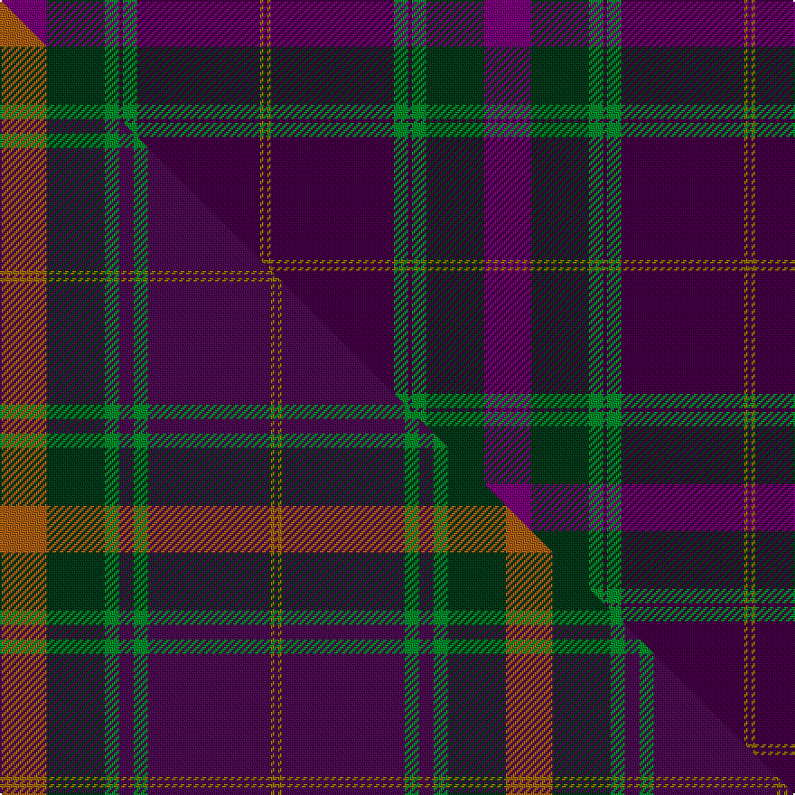

This is one **variant** — a specific cloth: this exact thread count and colourway, with its own
provenance below. It is one weaving of the [sett](/tartans/h/he/heather-mead/) (the scale-free proportion — the
same cloth at any scale or shade), whose colour order is pattern [BGBGBGGB](/stripes/bgbgbggb/).

Part of the [Heather Mead](/tartans/h/he/heather-mead/) tartan — the named design grouping this sett with its other cloths.

Sourced from tartans-authority.  It is a [8 stripe tartan](/stripes/stripes8/).

Original link <code>http://www.tartansauthority.com/tartan-ferret/display/10967/</code> — retired · [Internet Archive copy](https://web.archive.org/web/*/http://www.tartansauthority.com/tartan-ferret/display/10967/*)

Dataset <small>— provenance for this record, inherited from the source manifest</small>

<dl class="dataset-prov">
<dt>source</dt><dd><a href="/sources/tartans-authority/">Scottish Tartans Authority</a></dd>
<dt>data captured from</dt><dd><a href="https://github.com/thetartan/tartan-database/blob/master/data/tartans-authority/data.csv">https://github.com/thetartan/tartan-database/blob/master/data/tartans-authority/data.csv</a></dd>
<dt>data date</dt><dd>2013 <small>(this record)</small></dd>
<dt>licence</dt><dd><a href="https://creativecommons.org/licenses/by-nc-nd/4.0/">CC BY-NC-ND 4.0</a></dd>
</dl>

Capture chain <small>— the hands this data passed through, oldest first; each capture carries its own licence</small>

<ol class="capture-chain">
<li><a href="https://www.tartansauthority.com/">Scottish Tartans Authority</a> <small>the heritage body’s archive — its tartan-ferret record browser is retired; dead record links are shown unlinked, with an Internet Archive copy (ITI numbers are not SRT references)</small></li>
<li><a href="https://github.com/thetartan/tartan-database">thetartan/tartan-database</a> <small>2016-2017</small> · <a href="https://creativecommons.org/licenses/by-nc-nd/4.0/">CC BY-NC-ND 4.0</a> <small>Levko Kravets's frozen compilation — the capture we vendored, and where its CC licence text came from</small></li>
<li>this dictionary <small>captured 2026-06-10 · commit 5bf86c7566</small> <small>each re-capture is a git commit to data/sources</small></li>
</ol>

## Register references

External register numbers recorded for this tartan.

- Scottish Register of Tartans: [10967](https://www.tartanregister.gov.uk/tartanDetails?ref=10967)
- Scottish Tartans Authority (ITI): 10967

## Thread count
DPi/26 DG32 G8 DP2 G8 DP68 Y2 DP/2

One full sett is **268 threads**.

## Palette
<table><thead><tr><th>Colour</th><th>Shade</th><th>OKLCh</th></tr></thead><tbody><tr><td>DG</td><td><code style="background-color:#053819;">#053819</code> <small style="color:#888">#053819</small></td><td><small style="color:#888">oklch(30.0% 0.075 151.3)</small></td></tr><tr><td>DP</td><td><code style="background-color:#440044;">#440044</code> <small style="color:#888">#440044</small></td><td><small style="color:#888">oklch(27.1% 0.125 328.4)</small></td></tr><tr><td>G</td><td><code style="background-color:#008B2A;">#008B2A</code> <small style="color:#888">#008B2A</small></td><td><small style="color:#888">oklch(55.4% 0.170 145.9)</small></td></tr><tr><td>DP</td><td><code style="background-color:#780078;">#780078</code> <small style="color:#888">#780078</small></td><td><small style="color:#888">oklch(40.2% 0.185 328.4)</small></td></tr><tr><td>Y</td><td><code style="background-color:#8B6E00;">#8B6E00</code> <small style="color:#888">#8B6E00</small></td><td><small style="color:#888">oklch(55.1% 0.113 90.4)</small></td></tr></tbody></table>

# Sample pattern

## Compared to the master

This cloth is one sett of its design; the master sett (the exemplar the design is anchored on) is below for comparison.

Its **ΔTartan distance** from the master is **1.12** — the same measure the nearest-tartans table ranks by (0 is identical; a re-scale of the same cloth is near 0, a recolour or a different proportion further).

<figure class="master-compare" style="margin:0">

this sett
master sett ★

<figcaption style="color:#888;font-size:smaller">One weave of this sett against the <a href="/setts/o13dg16g4dp4g4dp34y1dp1/">master sett ★</a>, split on the diagonal: a shared proportion runs seamlessly across it with only the shades shifting; a different proportion breaks on it.</figcaption>
</figure>

## Nearest tartan variants

The nearest existing variants by ΔTartan distance, with this cloth at the top so the swatches line up against it.

ΔTartan

Threads

Variant

Sett

—

268

<a href="/variants/s8/dpi13dg16g4dp1g4dp34y1dp1~x2~dpi1607327-dp1105325/">Heather Mead (Personal)</a>

<a href="/ttd/edit/#slug=o13dg16g4dp4g4dp34y1dp1~x2&amp;base=dpi13dg16g4dp1g4dp34y1dp1~x2~dpi1607327-dp1105325" title="compare in the TTD">1.12</a>

280

<a href="/variants/s8/o13dg16g4dp4g4dp34y1dp1~x2/">Heather Mead (Personal)</a>

<a href="/ttd/edit/#slug=dr26w1db10w1dg32dr11db8lb3w1~x2&amp;base=dpi13dg16g4dp1g4dp34y1dp1~x2~dpi1607327-dp1105325" title="compare in the TTD">3.15</a>

318

<a href="/variants/s9/dr26w1db10w1dg32dr11db8lb3w1~x2/">Spens/Spence (Clan)</a>

<a href="/ttd/edit/#slug=dg4dpi48dp10lb3dp16lb3n30lb3db2~x2~dpi1507327-dp1105325&amp;base=dpi13dg16g4dp1g4dp34y1dp1~x2~dpi1607327-dp1105325" title="compare in the TTD">3.41</a>

464

<a href="/variants/s9/dg4dpi48dp10lb3dp16lb3n30lb3db2~x2~dpi1507327-dp1105325/">Heather (NSPCC) (Corporate)</a>

<a href="/ttd/edit/#slug=g9db2dp2g2dp18g2db2g1db19dr33g2~x2&amp;base=dpi13dg16g4dp1g4dp34y1dp1~x2~dpi1607327-dp1105325" title="compare in the TTD">3.53</a>

346

<a href="/variants/s11/g9db2dp2g2dp18g2db2g1db19dr33g2~x2/">Pride of Scotland Autumn</a>

<a href="/ttd/edit/#slug=dr32r2g2db30dr1db2ly1~x2&amp;base=dpi13dg16g4dp1g4dp34y1dp1~x2~dpi1607327-dp1105325" title="compare in the TTD">3.59</a>

214

<a href="/variants/s7/dr32r2g2db30dr1db2ly1~x2/">Highland Prince (Fashion)</a>

<a href="/ttd/edit/#slug=y2dg4db1dr3db3dg3g1dr32db14w3y2~x2&amp;base=dpi13dg16g4dp1g4dp34y1dp1~x2~dpi1607327-dp1105325" title="compare in the TTD">3.77</a>

264

<a href="/variants/s11/y2dg4db1dr3db3dg3g1dr32db14w3y2~x2/">Banause-Zunft zu Olte</a>

<a href="/ttd/edit/#slug=lb2dg2db1dg30n10db20dg1db2lo1~x2&amp;base=dpi13dg16g4dp1g4dp34y1dp1~x2~dpi1607327-dp1105325" title="compare in the TTD">3.88</a>

270

<a href="/variants/s9/lb2dg2db1dg30n10db20dg1db2lo1~x2/">Scottish Borderland (Fashion)</a>

<a href="/ttd/edit/#slug=lr3db28dt12dr22dg1~x2&amp;base=dpi13dg16g4dp1g4dp34y1dp1~x2~dpi1607327-dp1105325" title="compare in the TTD">3.90</a>

256

<a href="/variants/s5/lr3db28dt12dr22dg1~x2/">Diaspora (Fashion)</a>

<a href="/ttd/edit/#slug=db5n4r6ly1r9dbi35db5ly1db12w1~x2~db1004274-dbi1406275-w3600000&amp;base=dpi13dg16g4dp1g4dp34y1dp1~x2~dpi1607327-dp1105325" title="compare in the TTD">3.93</a>

304

<a href="/variants/s10/db5n4r6ly1r9dbi35db5ly1db12w1~x2~db1004274-dbi1406275-w3600000/">University of Dundee</a>

<a href="/ttd/edit/#slug=dg18g2db5dr45lb3db18lb3dr8lr2~x2~dg1806142-g2408144-lb3103284-lr3200000&amp;base=dpi13dg16g4dp1g4dp34y1dp1~x2~dpi1607327-dp1105325" title="compare in the TTD">3.96</a>

376

<a href="/variants/s9/dg18g2db5dr45lb3db18lb3dr8lbi2~x2~dg1806142-g2408144-lb3103284-lbi3200000/">MacNiven</a>

## Neighbour map

Every grey dot is one of 13656 variants placed by the first two principal components of the ΔTartan feature space (42% of its variance). Red is this tartan; blue dots are its nearest — click one to open its page. The map is a flat projection of a many-dimensional space — [how to read it](/posts/neighbourhood-maps/).

<svg viewBox="0 0 640 380" role="img" style="max-width:100%;height:auto;border:1px solid #e0e0e0;border-radius:4px;display:block" xmlns="http://www.w3.org/2000/svg"><image href="/nn/cloud.v1.png" width="640" height="380"/><a href="/variants/s8/o13dg16g4dp4g4dp34y1dp1~x2/"><circle cx="349.4" cy="138.6" r="4" fill="#3465a4"><title>Heather Mead (Personal)</title></circle></a><a href="/variants/s9/dr26w1db10w1dg32dr11db8lb3w1~x2/"><circle cx="320.4" cy="161.6" r="4" fill="#3465a4"><title>Spens/Spence (Clan)</title></circle></a><a href="/variants/s9/dg4dpi48dp10lb3dp16lb3n30lb3db2~x2~dpi1507327-dp1105325/"><circle cx="316.1" cy="153.3" r="4" fill="#3465a4"><title>Heather (NSPCC) (Corporate)</title></circle></a><a href="/variants/s11/g9db2dp2g2dp18g2db2g1db19dr33g2~x2/"><circle cx="328.1" cy="158.2" r="4" fill="#3465a4"><title>Pride of Scotland Autumn</title></circle></a><a href="/variants/s7/dr32r2g2db30dr1db2ly1~x2/"><circle cx="404.9" cy="139.9" r="4" fill="#3465a4"><title>Highland Prince (Fashion)</title></circle></a><a href="/variants/s11/y2dg4db1dr3db3dg3g1dr32db14w3y2~x2/"><circle cx="347.4" cy="103.9" r="4" fill="#3465a4"><title>Banause-Zunft zu Olte</title></circle></a><a href="/variants/s9/lb2dg2db1dg30n10db20dg1db2lo1~x2/"><circle cx="393.4" cy="158.7" r="4" fill="#3465a4"><title>Scottish Borderland (Fashion)</title></circle></a><a href="/variants/s5/lr3db28dt12dr22dg1~x2/"><circle cx="364.4" cy="220.0" r="4" fill="#3465a4"><title>Diaspora (Fashion)</title></circle></a><a href="/variants/s10/db5n4r6ly1r9dbi35db5ly1db12w1~x2~db1004274-dbi1406275-w3600000/"><circle cx="300.8" cy="108.5" r="4" fill="#3465a4"><title>University of Dundee</title></circle></a><a href="/variants/s9/dg18g2db5dr45lb3db18lb3dr8lbi2~x2~dg1806142-g2408144-lb3103284-lbi3200000/"><circle cx="322.4" cy="140.9" r="4" fill="#3465a4"><title>MacNiven</title></circle></a><circle cx="383.2" cy="153.9" r="5" fill="#c00000"/><text x="320" y="376" text-anchor="middle" font-size="11" fill="#999">ground</text><text x="11" y="190" text-anchor="middle" font-size="11" fill="#999" transform="rotate(-90 11 190)">complexity</text></svg>

ID: /variants/s8/dpi13dg16g4dp1g4dp34y1dp1~x2~dpi1607327-dp1105325/
