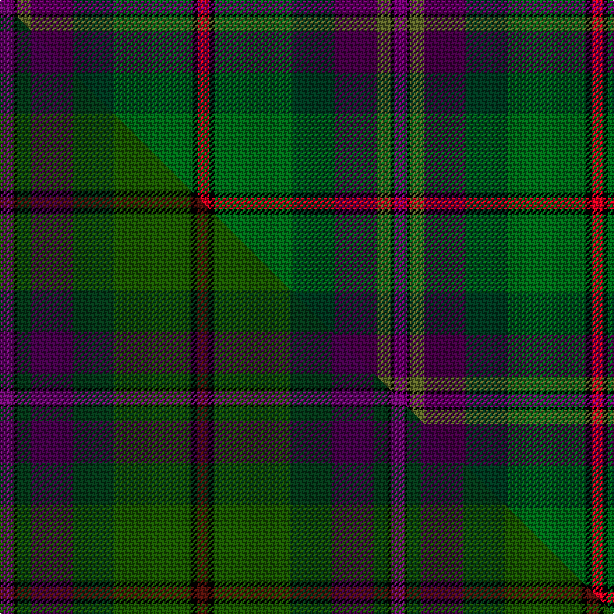

This is one **variant** — a specific cloth: this exact thread count and colourway, with its own
provenance below. It is one weaving of the [sett](/tartans/b/ba/batten-of-argyll/) (the scale-free proportion — the
same cloth at any scale or shade), whose colour order is pattern [BKGBGGKR](/stripes/bkgbggkr/).

Part of the [Batten of Argyll](/tartans/b/ba/batten-of-argyll/) tartan — the named design grouping this sett with its other cloths.

Sourced from house-of-tartan.  It is a [8 stripe tartan](/stripes/stripes8/).

Original link [http://www.house-of-tartan.scotland.net/house/TartanViewjs.asp?colr=Def&tnam=5768](http://www.house-of-tartan.scotland.net/house/TartanViewjs.asp?colr=Def&tnam=5768)

## Provenance

Earliest known date: 2003 The Baddenach family originally emigrated from Argyll, Scotland to Jamestown, Virginia. This can be worn by all of the name or its anglicised variants (Batten, Batton, Battin, Badden etc). IT is also to serve as the official tartan for the St Andrews Legion/St Andrews Legion Pipes & Drums headquartered in Richmond Virginia, whose founder is the designer of this tartan. It may also serve as a tartan for anyone having Scottish ancestors who settled in the Virginia Colony.

Dataset <small>— provenance for this record, inherited from the source manifest</small>

<dl class="dataset-prov">
<dt>source</dt><dd><a href="/sources/house-of-tartan/">House of Tartan</a></dd>
<dt>data captured from</dt><dd><a href="https://github.com/thetartan/tartan-database/blob/master/data/house-of-tartan/data.csv">https://github.com/thetartan/tartan-database/blob/master/data/house-of-tartan/data.csv</a></dd>
<dt>data date</dt><dd>2003 <small>(this record)</small></dd>
<dt>licence</dt><dd><a href="https://creativecommons.org/licenses/by-nc-nd/4.0/">CC BY-NC-ND 4.0</a></dd>
</dl>

Capture chain <small>— the hands this data passed through, oldest first; each capture carries its own licence</small>

<ol class="capture-chain">
<li><a href="http://www.house-of-tartan.scotland.net/">House of Tartan</a> <small>the weaver/retailer's database — the site is now offline; the URL is kept as the ultimate source's identity</small></li>
<li><a href="https://github.com/thetartan/tartan-database">thetartan/tartan-database</a> <small>2016-2017</small> · <a href="https://creativecommons.org/licenses/by-nc-nd/4.0/">CC BY-NC-ND 4.0</a> <small>Levko Kravets's frozen compilation — the capture we vendored, and where its CC licence text came from</small></li>
<li>this dictionary <small>captured 2026-06-10 · commit 5bf86c7566</small> <small>each re-capture is a git commit to data/sources</small></li>
</ol>

## Thread count
DPi/10 K2 G10 DP30 DG30 DGi56 K4 R/8

One full sett is **282 threads**.

## Palette
<table><thead><tr><th>Colour</th><th>Shade</th><th>OKLCh</th></tr></thead><tbody><tr><td>DG</td><td><code style="background-color:#003820;">#003820</code> <small style="color:#888">#003820</small></td><td><small style="color:#888">oklch(30.0% 0.070 158.3)</small></td></tr><tr><td>DP</td><td><code style="background-color:#440044;">#440044</code> <small style="color:#888">#440044</small></td><td><small style="color:#888">oklch(27.1% 0.125 328.4)</small></td></tr><tr><td>DR</td><td><code style="background-color:#55120C;">#55120C</code> <small style="color:#888">#55120C</small></td><td><small style="color:#888">oklch(30.0% 0.099 29.3)</small></td></tr><tr><td>DG</td><td><code style="background-color:#285800;">#285800</code> <small style="color:#888">#285800</small></td><td><small style="color:#888">oklch(41.0% 0.122 135.8)</small></td></tr><tr><td>G</td><td><code style="background-color:#5C6428;">#5C6428</code> <small style="color:#888">#5C6428</small></td><td><small style="color:#888">oklch(48.3% 0.084 116.0)</small></td></tr><tr><td>DG</td><td><code style="background-color:#006818;">#006818</code> <small style="color:#888">#006818</small></td><td><small style="color:#888">oklch(45.0% 0.142 145.0)</small></td></tr><tr><td>K</td><td><code style="background-color:#000000;">#000000</code> <small style="color:#888">#000000</small></td><td><small style="color:#888">oklch(0.0% 0.000 0.0)</small></td></tr><tr><td>O</td><td><code style="background-color:#A65C11;">#A65C11</code> <small style="color:#888">#A65C11</small></td><td><small style="color:#888">oklch(55.0% 0.125 58.3)</small></td></tr><tr><td>DP</td><td><code style="background-color:#780078;">#780078</code> <small style="color:#888">#780078</small></td><td><small style="color:#888">oklch(40.2% 0.185 328.4)</small></td></tr><tr><td>R</td><td><code style="background-color:#D60020;">#D60020</code> <small style="color:#888">#D60020</small></td><td><small style="color:#888">oklch(55.2% 0.224 25.5)</small></td></tr></tbody></table>

# Sample pattern

## Compared to the master

This cloth is one sett of its design; the master sett (the exemplar the design is anchored on) is below for comparison.

Its **ΔTartan distance** from the master is **1.09** — the same measure the nearest-tartans table ranks by (0 is identical; a re-scale of the same cloth is near 0, a recolour or a different proportion further).

<figure class="master-compare" style="margin:0">

this sett
master sett ★

<figcaption style="color:#888;font-size:smaller">One weave of this sett against the <a href="/setts/dpi10k2dg10dp30dg30dgi55k4dr8/">master sett ★</a>, split on the diagonal: a shared proportion runs seamlessly across it with only the shades shifting; a different proportion breaks on it.</figcaption>
</figure>

## Nearest tartan variants

The nearest existing variants by ΔTartan distance, with this cloth at the top so the swatches line up against it.

ΔTartan

Threads

Variant

Sett

—

282

<a href="/variants/s8/dpi5k1g5dp15dg15dgi28k2r4~x2~dpi1607327-g1903114-dp1105325-dgi1806142/">Batten of Argyll Clan Tartan</a>

<a href="/ttd/edit/#slug=dpi10k2dg10dp30dg30dgi55k4dr8~dpi1607327-dp1105325-dgi1605139&amp;base=dpi5k1g5dp15dg15dgi28k2r4~x2~dpi1607327-g1903114-dp1105325-dgi1806142" title="compare in the TTD">1.09</a>

280

<a href="/variants/s8/dpi10k2dg10dp30dg30dgi55k4dr8~dpi1607327-dp1105325-dgi1605139/">Batten of Argyll (Baddenach)</a>

<a href="/ttd/edit/#slug=oi8k2g10dp30g30dg55k4o6~oi2404317-g1803114-dg1806142-o2206047&amp;base=dpi5k1g5dp15dg15dgi28k2r4~x2~dpi1607327-g1903114-dp1105325-dgi1806142" title="compare in the TTD">2.53</a>

276

<a href="/variants/s8/oi8k2g10dp30g30dg55k4o6~oi2404317-g1803114-dg1806142-o2206047/">Aberuchill District Tartan</a>

<a href="/ttd/edit/#slug=o8k2dy10dp30dy30g55k4lo6&amp;base=dpi5k1g5dp15dg15dgi28k2r4~x2~dpi1607327-g1903114-dp1105325-dgi1806142" title="compare in the TTD">3.33</a>

276

<a href="/variants/s8/o8k2dy10dp30dy30g55k4lo6/">Aberuchill</a>

<a href="/ttd/edit/#slug=dr4g4k2g17do5g5do17g6lb1db22dr2~x2&amp;base=dpi5k1g5dp15dg15dgi28k2r4~x2~dpi1607327-g1903114-dp1105325-dgi1806142" title="compare in the TTD">3.47</a>

328

<a href="/variants/s11/dr4g4k2g17do5g5do17g6lb1db22dr2~x2/">Adams (Name)</a>

<a href="/ttd/edit/#slug=o5dr8dp13dgi21dg34g55o3~dgi1104144&amp;base=dpi5k1g5dp15dg15dgi28k2r4~x2~dpi1607327-g1903114-dp1105325-dgi1806142" title="compare in the TTD">3.55</a>

270

<a href="/variants/s7/o5dr8dp13dgi21dg34g55o3~dgi1104144/">Lunting Papi (Personal)</a>

<a href="/ttd/edit/#slug=dp2g18dp15dr24k1ly2~x2&amp;base=dpi5k1g5dp15dg15dgi28k2r4~x2~dpi1607327-g1903114-dp1105325-dgi1806142" title="compare in the TTD">3.66</a>

240

<a href="/variants/s6/dp2g18dp15dr24k1ly2~x2/">Miller, Reverend Ian (Personal</a>

<a href="/ttd/edit/#slug=o4dg30db12g3k2lb3k26dp4k2~dg1504144-db0906265-g2307139-k0704274&amp;base=dpi5k1g5dp15dg15dgi28k2r4~x2~dpi1607327-g1903114-dp1105325-dgi1806142" title="compare in the TTD">3.67</a>

166

<a href="/variants/s9/o4dg30db12g3k2lb3k26dp4k2~dg1504144-db0906265-g2307139-k0704274/">Begg (Scarfskerry)</a>

<a href="/ttd/edit/#slug=dg42dy2dgi16db7k16r5~x2~dg1202166-dgi1804158&amp;base=dpi5k1g5dp15dg15dgi28k2r4~x2~dpi1607327-g1903114-dp1105325-dgi1806142" title="compare in the TTD">3.67</a>

258

<a href="/variants/s6/dg42dy2dgi16db7k16r5~x2~dg1202166-dgi1804158/">Waterford Irish County Tartan</a>

<a href="/ttd/edit/#slug=k4r1k3r2dy3k12dg10dgi18db3n3db3~x2~dgi1705139&amp;base=dpi5k1g5dp15dg15dgi28k2r4~x2~dpi1607327-g1903114-dp1105325-dgi1806142" title="compare in the TTD">3.73</a>

234

<a href="/variants/s11/k4r1k3r2dy3k12dg10dgi18db3n3db3~x2~dgi1705139/">Blake, William &amp; Agnes (Australia)</a>

<a href="/ttd/edit/#slug=db9k2db4k2dr6ly3dy2db2dr11dy23lb1k8~x2&amp;base=dpi5k1g5dp15dg15dgi28k2r4~x2~dpi1607327-g1903114-dp1105325-dgi1806142" title="compare in the TTD">3.74</a>

258

<a href="/variants/s12/db9k2db4k2dr6ly3dy2db2dr11dy23lb1k8~x2/">Kelvin Family (Personal)</a>

## Neighbour map

Every grey dot is one of 13657 variants placed by the first two principal components of the ΔTartan feature space (42% of its variance). Red is this tartan; blue dots are its nearest — click one to open its page. The map is a flat projection of a many-dimensional space — [how to read it](/posts/neighbourhood-maps/).

<svg viewBox="0 0 640 380" role="img" style="max-width:100%;height:auto;border:1px solid #e0e0e0;border-radius:4px;display:block" xmlns="http://www.w3.org/2000/svg"><image href="/nn/cloud.v1.png" width="640" height="380"/><a href="/variants/s8/dpi10k2dg10dp30dg30dgi55k4dr8~dpi1607327-dp1105325-dgi1605139/"><circle cx="265.9" cy="156.3" r="4" fill="#3465a4"><title>Batten of Argyll (Baddenach)</title></circle></a><a href="/variants/s8/oi8k2g10dp30g30dg55k4o6~oi2404317-g1803114-dg1806142-o2206047/"><circle cx="244.0" cy="142.1" r="4" fill="#3465a4"><title>Aberuchill District Tartan</title></circle></a><a href="/variants/s8/o8k2dy10dp30dy30g55k4lo6/"><circle cx="190.2" cy="123.1" r="4" fill="#3465a4"><title>Aberuchill</title></circle></a><a href="/variants/s11/dr4g4k2g17do5g5do17g6lb1db22dr2~x2/"><circle cx="187.7" cy="131.3" r="4" fill="#3465a4"><title>Adams (Name)</title></circle></a><a href="/variants/s7/o5dr8dp13dgi21dg34g55o3~dgi1104144/"><circle cx="236.5" cy="181.8" r="4" fill="#3465a4"><title>Lunting Papi (Personal)</title></circle></a><a href="/variants/s6/dp2g18dp15dr24k1ly2~x2/"><circle cx="242.7" cy="162.8" r="4" fill="#3465a4"><title>Miller, Reverend Ian (Personal</title></circle></a><a href="/variants/s9/o4dg30db12g3k2lb3k26dp4k2~dg1504144-db0906265-g2307139-k0704274/"><circle cx="174.2" cy="128.5" r="4" fill="#3465a4"><title>Begg (Scarfskerry)</title></circle></a><a href="/variants/s6/dg42dy2dgi16db7k16r5~x2~dg1202166-dgi1804158/"><circle cx="251.9" cy="154.7" r="4" fill="#3465a4"><title>Waterford Irish County Tartan</title></circle></a><a href="/variants/s11/k4r1k3r2dy3k12dg10dgi18db3n3db3~x2~dgi1705139/"><circle cx="107.9" cy="116.7" r="4" fill="#3465a4"><title>Blake, William &amp; Agnes (Australia)</title></circle></a><a href="/variants/s12/db9k2db4k2dr6ly3dy2db2dr11dy23lb1k8~x2/"><circle cx="186.5" cy="119.7" r="4" fill="#3465a4"><title>Kelvin Family (Personal)</title></circle></a><circle cx="194.5" cy="123.7" r="5" fill="#c00000"/><text x="320" y="376" text-anchor="middle" font-size="11" fill="#999">ground</text><text x="11" y="190" text-anchor="middle" font-size="11" fill="#999" transform="rotate(-90 11 190)">complexity</text></svg>

ID: /variants/s8/dpi5k1g5dp15dg15dgi28k2r4~x2~dpi1607327-g1903114-dp1105325-dgi1806142/
