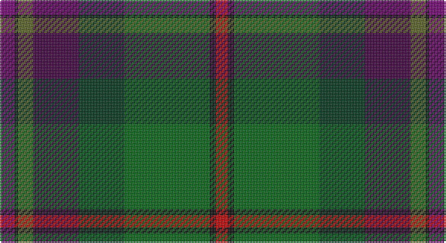

This page is one **sett** — a single exact thread-count. It belongs to the [tartan](/setts/dpi5k1y5dp15dg15g28k2r4/)
(the same proportion at any scale), whose colour order is pattern [BKGBGGKR](/stripes/bkgbggkr/).

Part of the [Batten of Argyll](/tartans/batten-of-argyll/) tartan — the named design grouping this sett with its other cloths.

Sourced from house-of-tartan.  It is a [8 stripe tartan](/stripes/stripes8/).

Original link http://www.house-of-tartan.scotland.net/house/TartanViewjs.asp?colr=Def&tnam=5768

## Provenance

Earliest known date: 2003 The Baddenach family originally emigrated from Argyll, Scotland to Jamestown, Virginia. This can be worn by all of the name or its anglicised variants (Batten, Batton, Battin, Badden etc). IT is also to serve as the official tartan for the St Andrews Legion/St Andrews Legion Pipes & Drums headquartered in Richmond Virginia, whose founder is the designer of this tartan. It may also serve as a tartan for anyone having Scottish ancestors who settled in the Virginia Colony.

## Thread count
P/10 K2 Ga10 DP30 DG30 Gb56 K4 R/8

One full sett is **282 threads**.

## Palette

Palette: <strong>Tartan Register</strong>
<table><thead><tr><th>Colour</th><th>Threads</th><th>Shade</th><th>Base</th><th>OKLCh</th></tr></thead><tbody><tr><td>P/</td><td style="text-align:right;font-variant-numeric:tabular-nums">10</td><td><code style="background-color:#780078;">#780078</code> <small style="color:#888">#780078</small></td><td>B <code style="background-color:#2A418A;">#2A418A</code></td><td><small style="color:#888">oklch(40.2% 0.185 328.4)</small></td></tr><tr><td>K</td><td style="text-align:right;font-variant-numeric:tabular-nums">2</td><td><code style="background-color:#101010;">#101010</code> <small style="color:#888">#101010</small></td><td>K <code style="background-color:#000000;">#000000</code></td><td><small style="color:#888">oklch(17.3% 0.000 89.9)</small></td></tr><tr><td>Ga</td><td style="text-align:right;font-variant-numeric:tabular-nums">10</td><td><code style="background-color:#5C6428;">#5C6428</code> <small style="color:#888">#5C6428</small></td><td>G <code style="background-color:#006100;">#006100</code></td><td><small style="color:#888">oklch(48.3% 0.084 116.0)</small></td></tr><tr><td>DP</td><td style="text-align:right;font-variant-numeric:tabular-nums">30</td><td><code style="background-color:#440044;">#440044</code> <small style="color:#888">#440044</small></td><td>B <code style="background-color:#2A418A;">#2A418A</code></td><td><small style="color:#888">oklch(27.1% 0.125 328.4)</small></td></tr><tr><td>DG</td><td style="text-align:right;font-variant-numeric:tabular-nums">30</td><td><code style="background-color:#003820;">#003820</code> <small style="color:#888">#003820</small></td><td>G <code style="background-color:#006100;">#006100</code></td><td><small style="color:#888">oklch(30.0% 0.070 158.3)</small></td></tr><tr><td>Gb</td><td style="text-align:right;font-variant-numeric:tabular-nums">56</td><td><code style="background-color:#006818;">#006818</code> <small style="color:#888">#006818</small></td><td>G <code style="background-color:#006100;">#006100</code></td><td><small style="color:#888">oklch(45.0% 0.142 145.0)</small></td></tr><tr><td>K</td><td style="text-align:right;font-variant-numeric:tabular-nums">4</td><td><code style="background-color:#101010;">#101010</code> <small style="color:#888">#101010</small></td><td>K <code style="background-color:#000000;">#000000</code></td><td><small style="color:#888">oklch(17.3% 0.000 89.9)</small></td></tr><tr><td>R/</td><td style="text-align:right;font-variant-numeric:tabular-nums">8</td><td><code style="background-color:#C80000;">#C80000</code> <small style="color:#888">#C80000</small></td><td>R <code style="background-color:#CC0000;">#CC0000</code></td><td><small style="color:#888">oklch(52.3% 0.215 29.2)</small></td></tr></tbody></table>

# Sample pattern

## Compared to the master

This cloth is one sett of its design; the master sett (the exemplar the design is anchored on) is below for comparison.

<figure style="margin:0"><figcaption style="color:#888;font-size:smaller">this sett</figcaption></figure>
<figure style="margin:0"><figcaption style="color:#888;font-size:smaller"><a href="/setts/dpi10k2dg10dp30dg30dgi55k4r8/">master sett →</a></figcaption></figure>

## Nearest tartans

The nearest existing variants by ΔTartan distance, with this tartan at the top so the swatches line up against it.

ΔTartan

Tartan

Sett

—

<a href="/ttd/edit/#slug=dpi5k1y5dp15dg15g28k2r4~x2">Batten of Argyll Clan Tartan</a> <a class="nn-out" href="/variants/s8/dpi5k1y5dp15dg15g28k2r4~x2/" title="open its dictionary page">↗</a>

0.91

<a href="/ttd/edit/#slug=k5b3dy4ly1db13dy13g29w2~x2&amp;base=dpi5k1y5dp15dg15g28k2r4~x2">Teviotdale</a> <a class="nn-out" href="/variants/s8/k5b3dy4ly1db13dy13g29w2~x2/" title="open its dictionary page">↗</a>

1.05

<a href="/ttd/edit/#slug=m8k2dy10dp30dy30g55k4lo6&amp;base=dpi5k1y5dp15dg15g28k2r4~x2">Aberuchill</a> <a class="nn-out" href="/variants/s8/m8k2dy10dp30dy30g55k4lo6/" title="open its dictionary page">↗</a>

1.07

<a href="/ttd/edit/#slug=m8k2y10dp30y30g55k4o6&amp;base=dpi5k1y5dp15dg15g28k2r4~x2">Aberuchill District Tartan</a> <a class="nn-out" href="/variants/s8/m8k2y10dp30y30g55k4o6/" title="open its dictionary page">↗</a>

1.16

<a href="/ttd/edit/#slug=w1db6dp9r12k12g32k6ly1~x2&amp;base=dpi5k1y5dp15dg15g28k2r4~x2">Fujitsu</a> <a class="nn-out" href="/variants/s8/w1db6dp9r12k12g32k6ly1~x2/" title="open its dictionary page">↗</a>

1.29

<a href="/ttd/edit/#slug=k4r1k3r2lo3k12dg10dgi18db3o3db3~x2&amp;base=dpi5k1y5dp15dg15g28k2r4~x2">Blake (Personal)</a> <a class="nn-out" href="/variants/s11/k4r1k3r2lo3k12dg10dgi18db3o3db3~x2/" title="open its dictionary page">↗</a>

1.29

<a href="/ttd/edit/#slug=r9dt8r8g52w2k32dt44b4&amp;base=dpi5k1y5dp15dg15g28k2r4~x2">Highland Wedding (Fashion)</a> <a class="nn-out" href="/variants/s8/r9dt8r8g52w2k32dt44b4/" title="open its dictionary page">↗</a>

1.32

<a href="/ttd/edit/#slug=db1r4db12r1k7y12k7dy21lb1~x2&amp;base=dpi5k1y5dp15dg15g28k2r4~x2">Redgate Htg #1 (Name)</a> <a class="nn-out" href="/variants/s9/db1r4db12r1k7y12k7dy21lb1~x2/" title="open its dictionary page">↗</a>

1.35

<a href="/ttd/edit/#slug=o20dp2o2dp2o3dp8dg9g8y8dg1lr2~x2&amp;base=dpi5k1y5dp15dg15g28k2r4~x2">Isle of Skye</a> <a class="nn-out" href="/variants/s11/o20dp2o2dp2o3dp8dg9g8y8dg1lr2~x2/" title="open its dictionary page">↗</a>

1.39

<a href="/ttd/edit/#slug=t1dr4t12dr1k7dg12k7do21w1~x2&amp;base=dpi5k1y5dp15dg15g28k2r4~x2">Redgate (Connecticut) Hunting</a> <a class="nn-out" href="/variants/s9/t1dr4t12dr1k7dg12k7do21w1~x2/" title="open its dictionary page">↗</a>

1.39

<a href="/ttd/edit/#slug=lb4k1y19lo1k19n13r2n4r2~x4&amp;base=dpi5k1y5dp15dg15g28k2r4~x2">Whitson (Name)</a> <a class="nn-out" href="/variants/s9/lb4k1y19lo1k19n13r2n4r2~x4/" title="open its dictionary page">↗</a>

## Neighbour map

Every grey dot is one of 14360 variants placed by the first two principal components of the ΔTartan feature space (44% of its variance). Red is this tartan; blue dots are its nearest — click one to open its page.

<svg viewBox="0 0 640 380" role="img" style="max-width:100%;height:auto;border:1px solid #e0e0e0;border-radius:4px;display:block" xmlns="http://www.w3.org/2000/svg"><image href="/nn/cloud.v1.png" width="640" height="380"/><a href="/variants/s8/k5b3dy4ly1db13dy13g29w2~x2/"><circle cx="223.8" cy="124.3" r="4" fill="#3465a4"><title>Teviotdale</title></circle></a><a href="/variants/s8/m8k2dy10dp30dy30g55k4lo6/"><circle cx="232.1" cy="141.8" r="4" fill="#3465a4"><title>Aberuchill</title></circle></a><a href="/variants/s8/m8k2y10dp30y30g55k4o6/"><circle cx="243.3" cy="151.3" r="4" fill="#3465a4"><title>Aberuchill District Tartan</title></circle></a><a href="/variants/s8/w1db6dp9r12k12g32k6ly1~x2/"><circle cx="200.2" cy="112.5" r="4" fill="#3465a4"><title>Fujitsu</title></circle></a><a href="/variants/s11/k4r1k3r2lo3k12dg10dgi18db3o3db3~x2/"><circle cx="134.9" cy="132.1" r="4" fill="#3465a4"><title>Blake (Personal)</title></circle></a><a href="/variants/s8/r9dt8r8g52w2k32dt44b4/"><circle cx="193.6" cy="144.9" r="4" fill="#3465a4"><title>Highland Wedding (Fashion)</title></circle></a><a href="/variants/s9/db1r4db12r1k7y12k7dy21lb1~x2/"><circle cx="191.0" cy="160.2" r="4" fill="#3465a4"><title>Redgate Htg #1 (Name)</title></circle></a><a href="/variants/s11/o20dp2o2dp2o3dp8dg9g8y8dg1lr2~x2/"><circle cx="192.2" cy="138.6" r="4" fill="#3465a4"><title>Isle of Skye</title></circle></a><a href="/variants/s9/t1dr4t12dr1k7dg12k7do21w1~x2/"><circle cx="166.3" cy="148.8" r="4" fill="#3465a4"><title>Redgate (Connecticut) Hunting</title></circle></a><a href="/variants/s9/lb4k1y19lo1k19n13r2n4r2~x4/"><circle cx="175.6" cy="145.8" r="4" fill="#3465a4"><title>Whitson (Name)</title></circle></a><circle cx="201.0" cy="133.7" r="5" fill="#c00000"/></svg>

ID: /variants/s8/dpi5k1y5dp15dg15g28k2r4~x2/
