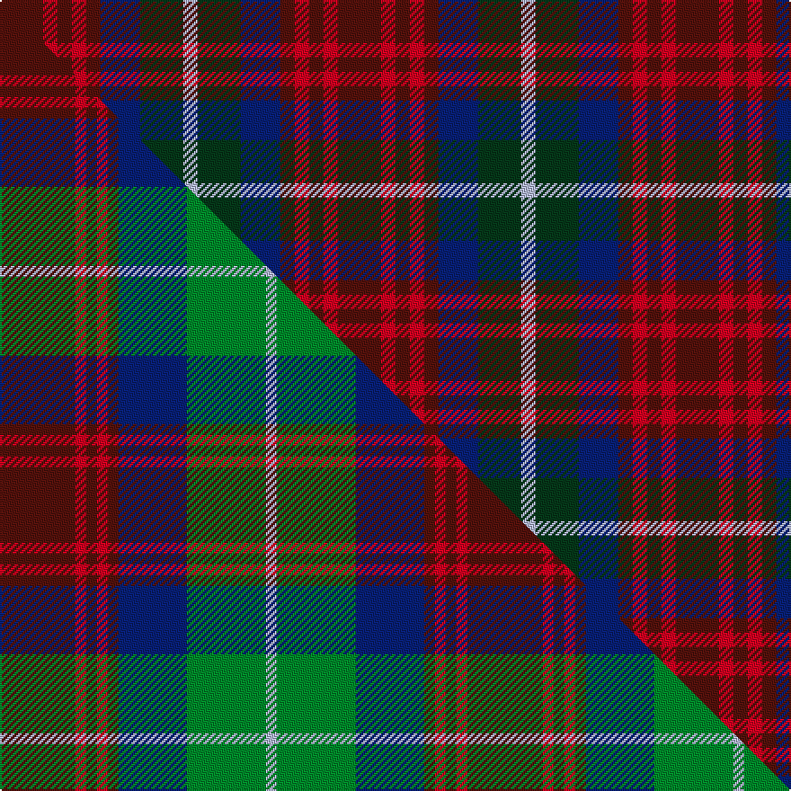

This page is one **sett** — a single exact thread-count. It belongs to the [tartan](/setts/dr12r4dr4r4dr4db11dg12lb4/)
(the same proportion at any scale), whose colour order is pattern [BRBRBBGW](/stripes/brbrbbgw/).

Part of the [Akins](/tartans/akins/) tartan — the named design grouping this sett with its other cloths.

Sourced from house-of-tartan.  It is a [8 stripe tartan](/stripes/stripes8/).

Original link http://www.house-of-tartan.scotland.net/house/TartanViewjs.asp?colr=Def&tnam=2426

## Provenance

Earliest known date: 1822 This is the `Approved` tartan for the Akins Clan

Dataset <small>— provenance for this record, inherited from the source manifest</small>

<dl class="dataset-prov">
<dt>source</dt><dd><a href="/sources/house-of-tartan/">House of Tartan</a></dd>
<dt>data captured from</dt><dd><a href="https://github.com/thetartan/tartan-database/blob/master/data/house-of-tartan/data.csv">https://github.com/thetartan/tartan-database/blob/master/data/house-of-tartan/data.csv</a></dd>
<dt>data date</dt><dd>2017-01-10 <small>(dataset default)</small></dd>
<dt>licence</dt><dd><a href="https://creativecommons.org/licenses/by-nc-nd/4.0/">CC BY-NC-ND 4.0</a></dd>
</dl>

Capture chain <small>— the hands this data passed through, oldest first; each capture carries its own licence</small>

<ol class="capture-chain">
<li><a href="http://www.house-of-tartan.scotland.net/">House of Tartan</a> <small>the weaver/retailer's database — the site is now offline; the URL is kept as the ultimate source's identity</small></li>
<li><a href="https://github.com/thetartan/tartan-database">thetartan/tartan-database</a> <small>2016-2017</small> · <a href="https://creativecommons.org/licenses/by-nc-nd/4.0/">CC BY-NC-ND 4.0</a> <small>Levko Kravets's frozen compilation — the capture we vendored, and where its CC licence text came from</small></li>
<li>this dictionary <small>captured 2026-06-10 · commit 5bf86c7566</small> <small>each re-capture is a git commit to data/sources</small></li>
</ol>

## Thread count
DR/24 R8 DR8 R8 DR8 DB22 DG24 LB/8

One full sett is **188 threads**.

## Palette
<table><thead><tr><th>Colour</th><th>Shade</th><th>OKLCh</th></tr></thead><tbody><tr><td>LB</td><td><code style="background-color:#B5BBDE;">#B5BBDE</code> <small style="color:#888">#B5BBDE</small></td><td><small style="color:#888">oklch(79.9% 0.050 277.6)</small></td></tr><tr><td>DB</td><td><code style="background-color:#082077;">#082077</code> <small style="color:#888">#082077</small></td><td><small style="color:#888">oklch(30.0% 0.149 265.1)</small></td></tr><tr><td>DG</td><td><code style="background-color:#053819;">#053819</code> <small style="color:#888">#053819</small></td><td><small style="color:#888">oklch(30.0% 0.075 151.3)</small></td></tr><tr><td>DR</td><td><code style="background-color:#55120C;">#55120C</code> <small style="color:#888">#55120C</small></td><td><small style="color:#888">oklch(30.0% 0.099 29.3)</small></td></tr><tr><td>R</td><td><code style="background-color:#D60020;">#D60020</code> <small style="color:#888">#D60020</small></td><td><small style="color:#888">oklch(55.2% 0.224 25.5)</small></td></tr></tbody></table>

# Sample pattern

## Compared to the master

This cloth is one sett of its design; the master sett (the exemplar the design is anchored on) is below for comparison.

Its **ΔTartan distance** from the master is **0.67** — the same measure the nearest-tartans table ranks by (0 is identical; a re-scale of the same cloth is near 0, a recolour or a different proportion further).

<figure class="master-compare" style="margin:0">

this sett
master sett ★

<figcaption style="color:#888;font-size:smaller">One weave of this sett against the <a href="/setts/dr21r3dr3r3dr3db19g22lb3/">master sett ★</a>, split on the diagonal: a shared proportion runs seamlessly across it with only the shades shifting; a different proportion breaks on it.</figcaption>
</figure>

## Nearest tartan variants

The nearest existing variants by ΔTartan distance, with this cloth at the top so the swatches line up against it.

ΔTartan

Threads

Variant

Sett

—

188

<a href="/variants/s8/dr12r4dr4r4dr4db11dg12lb4~x2/">Akins Clan Tartan</a>

<a href="/ttd/edit/#slug=dr21r3dr3r3dr3db19g22lb3~x2&amp;base=dr12r4dr4r4dr4db11dg12lb4~x2" title="compare in the TTD">0.67</a>

260

<a href="/variants/s8/dr21r3dr3r3dr3db19g22lb3~x2/">Akins Clan (Personal)</a>

<a href="/ttd/edit/#slug=dr21r3dr3r3dr3db19g22b3~x2&amp;base=dr12r4dr4r4dr4db11dg12lb4~x2" title="compare in the TTD">0.68</a>

260

<a href="/variants/s8/dr21r3dr3r3dr3db19g22b3~x2/">Akins</a>

<a href="/ttd/edit/#slug=r21ri3r3ri3r3db19g22lb3~x2~r1807008-ri2108022&amp;base=dr12r4dr4r4dr4db11dg12lb4~x2" title="compare in the TTD">0.69</a>

260

<a href="/variants/s8/r21ri3r3ri3r3db19g22lb3~x2~r1807008-ri2108022/">Akins (Clan)</a>

<a href="/ttd/edit/#slug=r10dbi6g24db24r6y3~dbi1406275-db1004274&amp;base=dr12r4dr4r4dr4db11dg12lb4~x2" title="compare in the TTD">2.55</a>

133

<a href="/variants/s6/r10dbi6g24db24r6y3~dbi1406275-db1004274/">Canine All Dogs (Fashion)</a>

<a href="/ttd/edit/#slug=r1db3dr1g3dr5lb1~x4&amp;base=dr12r4dr4r4dr4db11dg12lb4~x2" title="compare in the TTD">3.08</a>

104

<a href="/variants/s6/r1db3dr1g3dr5lb1~x4/">Lanark (Fashion #1)</a>

<a href="/ttd/edit/#slug=r1lo4dr3r1dr3lr1g3db3lr1~x4~r1606028-dr1004029&amp;base=dr12r4dr4r4dr4db11dg12lb4~x2" title="compare in the TTD">3.16</a>

152

<a href="/variants/s9/r1lo4dr3r1dr3lr1g3db3lr1~x4~r1606028-dr1004029/">Isle of Arran (Personal)</a>

<a href="/ttd/edit/#slug=db4lr3db4lr3o3n11o3~x2&amp;base=dr12r4dr4r4dr4db11dg12lb4~x2" title="compare in the TTD">3.23</a>

110

<a href="/variants/s7/db4lr3db4lr3o3n11o3~x2/">Stevens #2</a>

<a href="/ttd/edit/#slug=dy2n1dy1o3n3db3dy2r2db1~x4&amp;base=dr12r4dr4r4dr4db11dg12lb4~x2" title="compare in the TTD">3.30</a>

132

<a href="/variants/s9/dy2n1dy1o3n3db3dy2r2db1~x4/">Titanic</a>

<a href="/ttd/edit/#slug=n2r9db8dr4db8g2y2~x8&amp;base=dr12r4dr4r4dr4db11dg12lb4~x2" title="compare in the TTD">3.40</a>

528

<a href="/variants/s7/n2r9db8dr4db8g2y2~x8/">Feis An Eilein</a>

<a href="/ttd/edit/#slug=r10do10r4dg2r2do2r4dg12db12dg3db4~x2&amp;base=dr12r4dr4r4dr4db11dg12lb4~x2" title="compare in the TTD">3.57</a>

232

<a href="/variants/s11/r10do10r4dg2r2do2r4dg12db12dg3db4~x2/">Hueg (Munich) Hunting (Personal)</a>

## Neighbour map

Every grey dot is one of 13620 variants placed by the first two principal components of the ΔTartan feature space (42% of its variance). Red is this tartan; blue dots are its nearest — click one to open its page.

<svg viewBox="0 0 640 380" role="img" style="max-width:100%;height:auto;border:1px solid #e0e0e0;border-radius:4px;display:block" xmlns="http://www.w3.org/2000/svg"><image href="/nn/cloud.v1.png" width="640" height="380"/><a href="/variants/s8/dr21r3dr3r3dr3db19g22lb3~x2/"><circle cx="180.5" cy="204.5" r="4" fill="#3465a4"><title>Akins Clan (Personal)</title></circle></a><a href="/variants/s8/dr21r3dr3r3dr3db19g22b3~x2/"><circle cx="189.7" cy="207.6" r="4" fill="#3465a4"><title>Akins</title></circle></a><a href="/variants/s8/r21ri3r3ri3r3db19g22lb3~x2~r1807008-ri2108022/"><circle cx="177.1" cy="197.7" r="4" fill="#3465a4"><title>Akins (Clan)</title></circle></a><a href="/variants/s6/r10dbi6g24db24r6y3~dbi1406275-db1004274/"><circle cx="163.1" cy="226.3" r="4" fill="#3465a4"><title>Canine All Dogs (Fashion)</title></circle></a><a href="/variants/s6/r1db3dr1g3dr5lb1~x4/"><circle cx="184.1" cy="249.7" r="4" fill="#3465a4"><title>Lanark (Fashion #1)</title></circle></a><a href="/variants/s9/r1lo4dr3r1dr3lr1g3db3lr1~x4~r1606028-dr1004029/"><circle cx="46.6" cy="237.4" r="4" fill="#3465a4"><title>Isle of Arran (Personal)</title></circle></a><a href="/variants/s7/db4lr3db4lr3o3n11o3~x2/"><circle cx="172.3" cy="278.3" r="4" fill="#3465a4"><title>Stevens #2</title></circle></a><a href="/variants/s9/dy2n1dy1o3n3db3dy2r2db1~x4/"><circle cx="120.3" cy="302.0" r="4" fill="#3465a4"><title>Titanic</title></circle></a><a href="/variants/s7/n2r9db8dr4db8g2y2~x8/"><circle cx="180.8" cy="238.6" r="4" fill="#3465a4"><title>Feis An Eilein</title></circle></a><a href="/variants/s11/r10do10r4dg2r2do2r4dg12db12dg3db4~x2/"><circle cx="172.8" cy="236.3" r="4" fill="#3465a4"><title>Hueg (Munich) Hunting (Personal)</title></circle></a><circle cx="140.6" cy="274.0" r="5" fill="#c00000"/><text x="320" y="376" text-anchor="middle" font-size="11" fill="#999">ground</text><text x="11" y="190" text-anchor="middle" font-size="11" fill="#999" transform="rotate(-90 11 190)">complexity</text></svg>

ID: /variants/s8/dr12r4dr4r4dr4db11dg12lb4~x2/
