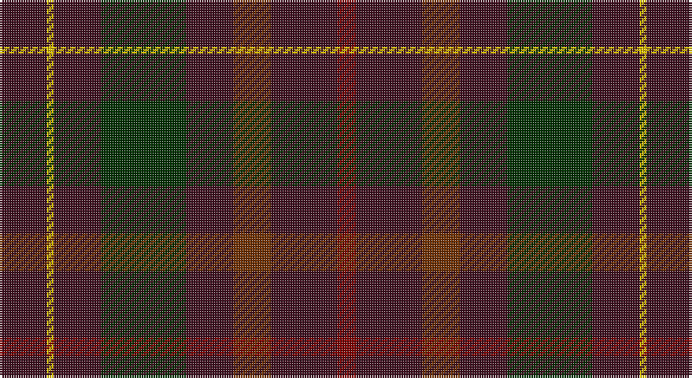

This page is one **sett** — a single exact thread-count. It belongs to the [tartan](/setts/dr20ly3dr20dg36dr20o16dr28r8/)
(the same proportion at any scale), whose colour order is pattern [BYBGBRBR](/stripes/bybgbrbr/).

Part of the [Leighton](/tartans/leighton/) tartan — the named design grouping this sett with its other cloths.

Sourced from weddslist.  It is a [8 stripe tartan](/stripes/stripes8/).

Original link http://www.weddslist.com/cgi-bin/tartans/pg.pl?source=sts

## Thread count
DR/20 Y3 DR20 DG36 DR20 T16 DR28 DRa/8

One full sett is **274 threads**.

## Palette

Palette: <strong>custom</strong>
<table><thead><tr><th>Colour</th><th>Threads</th><th>Shade</th><th>Base</th><th>OKLCh</th></tr></thead><tbody><tr><td>DR/</td><td style="text-align:right;font-variant-numeric:tabular-nums">20</td><td><code style="background-color:#401020;">#401020</code> <small style="color:#888">#401020</small></td><td>B <code style="background-color:#2A418A;">#2A418A</code></td><td><small style="color:#888">oklch(26.0% 0.076 3.6)</small></td></tr><tr><td>Y</td><td style="text-align:right;font-variant-numeric:tabular-nums">3</td><td><code style="background-color:#F0C000;">#F0C000</code> <small style="color:#888">#F0C000</small></td><td>Y <code style="background-color:#F2BF00;">#F2BF00</code></td><td><small style="color:#888">oklch(82.7% 0.169 90.5)</small></td></tr><tr><td>DR</td><td style="text-align:right;font-variant-numeric:tabular-nums">20</td><td><code style="background-color:#401020;">#401020</code> <small style="color:#888">#401020</small></td><td>B <code style="background-color:#2A418A;">#2A418A</code></td><td><small style="color:#888">oklch(26.0% 0.076 3.6)</small></td></tr><tr><td>DG</td><td style="text-align:right;font-variant-numeric:tabular-nums">36</td><td><code style="background-color:#003000;">#003000</code> <small style="color:#888">#003000</small></td><td>G <code style="background-color:#006100;">#006100</code></td><td><small style="color:#888">oklch(26.8% 0.091 142.5)</small></td></tr><tr><td>DR</td><td style="text-align:right;font-variant-numeric:tabular-nums">20</td><td><code style="background-color:#401020;">#401020</code> <small style="color:#888">#401020</small></td><td>B <code style="background-color:#2A418A;">#2A418A</code></td><td><small style="color:#888">oklch(26.0% 0.076 3.6)</small></td></tr><tr><td>T</td><td style="text-align:right;font-variant-numeric:tabular-nums">16</td><td><code style="background-color:#703000;">#703000</code> <small style="color:#888">#703000</small></td><td>R <code style="background-color:#CC0000;">#CC0000</code></td><td><small style="color:#888">oklch(39.1% 0.105 49.1)</small></td></tr><tr><td>DR</td><td style="text-align:right;font-variant-numeric:tabular-nums">28</td><td><code style="background-color:#401020;">#401020</code> <small style="color:#888">#401020</small></td><td>B <code style="background-color:#2A418A;">#2A418A</code></td><td><small style="color:#888">oklch(26.0% 0.076 3.6)</small></td></tr><tr><td>DRa/</td><td style="text-align:right;font-variant-numeric:tabular-nums">8</td><td><code style="background-color:#800000;">#800000</code> <small style="color:#888">#800000</small></td><td>R <code style="background-color:#CC0000;">#CC0000</code></td><td><small style="color:#888">oklch(37.7% 0.155 29.2)</small></td></tr></tbody></table>

# Sample pattern

## Compared to the master

This cloth is one sett of its design; the master sett (the exemplar the design is anchored on) is below for comparison.

<figure style="margin:0"><figcaption style="color:#888;font-size:smaller">this sett</figcaption></figure>
<figure style="margin:0"><figcaption style="color:#888;font-size:smaller"><a href="/setts/dr20lo4dr20g35do20dy16dr28r8/">master sett →</a></figcaption></figure>

## Nearest tartans

The nearest existing variants by ΔTartan distance, with this tartan at the top so the swatches line up against it.

ΔTartan

Tartan

Sett

—

<a href="/ttd/edit/#slug=dr20ly3dr20dg36dr20o16dr28r8">Leighton</a> <a class="nn-out" href="/variants/s8/dr20ly3dr20dg36dr20o16dr28r8/" title="open its dictionary page">↗</a>

1.81

<a href="/ttd/edit/#slug=db1dy9dg5dy1k5dy1dg5dy9w1~x2&amp;base=dr20ly3dr20dg36dr20o16dr28r8">Duchess of York</a> <a class="nn-out" href="/variants/s9/db1dy9dg5dy1k5dy1dg5dy9w1~x2/" title="open its dictionary page">↗</a>

1.92

<a href="/ttd/edit/#slug=dg1dr8dg8r1dg8dr8lr1~x4&amp;base=dr20ly3dr20dg36dr20o16dr28r8">MacKinnon Hunting</a> <a class="nn-out" href="/variants/s7/dg1dr8dg8r1dg8dr8lr1~x4/" title="open its dictionary page">↗</a>

1.92

<a href="/ttd/edit/#slug=dg1dr8dg8r1dg8dr8lr1~x2&amp;base=dr20ly3dr20dg36dr20o16dr28r8">MacKinnon Hunting</a> <a class="nn-out" href="/variants/s7/dg1dr8dg8r1dg8dr8lr1~x2/" title="open its dictionary page">↗</a>

2.01

<a href="/ttd/edit/#slug=r2do15dg12do2dt12do2dg12do15o2~x4&amp;base=dr20ly3dr20dg36dr20o16dr28r8">Amazing Union (Personal)</a> <a class="nn-out" href="/variants/s9/r2do15dg12do2dt12do2dg12do15o2~x4/" title="open its dictionary page">↗</a>

2.04

<a href="/ttd/edit/#slug=r2dy15dg12dy2dt12dy2dg12dy15o2~x4&amp;base=dr20ly3dr20dg36dr20o16dr28r8">Amazing Union (Personal)</a> <a class="nn-out" href="/variants/s9/r2dy15dg12dy2dt12dy2dg12dy15o2~x4/" title="open its dictionary page">↗</a>

2.11

<a href="/ttd/edit/#slug=dr20lo4dr20g35do20dy16dr28r8&amp;base=dr20ly3dr20dg36dr20o16dr28r8">Leighton (Personal)</a> <a class="nn-out" href="/variants/s8/dr20lo4dr20g35do20dy16dr28r8/" title="open its dictionary page">↗</a>

2.13

<a href="/ttd/edit/#slug=dr5lo1dr5g9do5dy4dr7r2~x4&amp;base=dr20ly3dr20dg36dr20o16dr28r8">Leighton (Personal)</a> <a class="nn-out" href="/variants/s8/dr5lo1dr5g9do5dy4dr7r2~x4/" title="open its dictionary page">↗</a>

2.13

<a href="/ttd/edit/#slug=r8lr2o30dg12o3dg12o3~x2&amp;base=dr20ly3dr20dg36dr20o16dr28r8">Wasko (Personal)</a> <a class="nn-out" href="/variants/s7/r8lr2o30dg12o3dg12o3~x2/" title="open its dictionary page">↗</a>

2.15

<a href="/ttd/edit/#slug=dg14k8dg21k2lo5k2dg21k11db18k2r5~x2&amp;base=dr20ly3dr20dg36dr20o16dr28r8">de Vere-Austin (Clan)</a> <a class="nn-out" href="/variants/s11/dg14k8dg21k2lo5k2dg21k11db18k2r5~x2/" title="open its dictionary page">↗</a>

2.16

<a href="/variants/s11/n12y3ni36k12ni8k8ni16k2ni18k4n10/">Bute Heather, Hunting (Fashion)</a>

## Neighbour map

Every grey dot is one of 14360 variants placed by the first two principal components of the ΔTartan feature space (44% of its variance). Red is this tartan; blue dots are its nearest — click one to open its page.

<svg viewBox="0 0 640 380" role="img" style="max-width:100%;height:auto;border:1px solid #e0e0e0;border-radius:4px;display:block" xmlns="http://www.w3.org/2000/svg"><image href="/nn/cloud.v1.png" width="640" height="380"/><a href="/variants/s9/db1dy9dg5dy1k5dy1dg5dy9w1~x2/"><circle cx="327.8" cy="239.6" r="4" fill="#3465a4"><title>Duchess of York</title></circle></a><a href="/variants/s7/dg1dr8dg8r1dg8dr8lr1~x4/"><circle cx="361.7" cy="282.6" r="4" fill="#3465a4"><title>MacKinnon Hunting</title></circle></a><a href="/variants/s7/dg1dr8dg8r1dg8dr8lr1~x2/"><circle cx="361.7" cy="282.6" r="4" fill="#3465a4"><title>MacKinnon Hunting</title></circle></a><a href="/variants/s9/r2do15dg12do2dt12do2dg12do15o2~x4/"><circle cx="322.1" cy="277.3" r="4" fill="#3465a4"><title>Amazing Union (Personal)</title></circle></a><a href="/variants/s9/r2dy15dg12dy2dt12dy2dg12dy15o2~x4/"><circle cx="270.8" cy="243.2" r="4" fill="#3465a4"><title>Amazing Union (Personal)</title></circle></a><a href="/variants/s8/dr20lo4dr20g35do20dy16dr28r8/"><circle cx="221.9" cy="243.7" r="4" fill="#3465a4"><title>Leighton (Personal)</title></circle></a><a href="/variants/s8/dr5lo1dr5g9do5dy4dr7r2~x4/"><circle cx="221.9" cy="241.3" r="4" fill="#3465a4"><title>Leighton (Personal)</title></circle></a><a href="/variants/s7/r8lr2o30dg12o3dg12o3~x2/"><circle cx="385.4" cy="226.6" r="4" fill="#3465a4"><title>Wasko (Personal)</title></circle></a><a href="/variants/s11/dg14k8dg21k2lo5k2dg21k11db18k2r5~x2/"><circle cx="303.1" cy="233.8" r="4" fill="#3465a4"><title>de Vere-Austin (Clan)</title></circle></a><a href="/variants/s11/n12y3ni36k12ni8k8ni16k2ni18k4n10/"><circle cx="421.2" cy="227.7" r="4" fill="#3465a4"><title>Bute Heather, Hunting (Fashion)</title></circle></a><circle cx="364.5" cy="267.7" r="5" fill="#c00000"/></svg>

ID: /variants/s8/dr20ly3dr20dg36dr20o16dr28r8/
