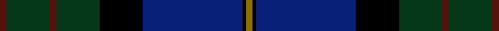

This page is one **sett** — a single exact thread-count. It belongs to the [tartan](/setts/dr2dg13dr2dg13k13db30k1y2/)
(the same proportion at any scale), whose colour order is pattern [BGBGKBKG](/stripes/bgbgkbkg/).

Sourced from tartans-authority.  It is a [8 stripe tartan](/stripes/stripes8/).

Original link http://www.tartansauthority.com/tartan-ferret/display/6423/

## Register references

External register numbers recorded for this tartan.

- Scottish Tartans Authority (ITI): 6423

## Thread count
DR/4 DG26 DR4 DG26 K26 DB60 K2 Y/4

One full sett is **296 threads**.

## Palette
<table><thead><tr><th>Colour</th><th>Shade</th><th>OKLCh</th></tr></thead><tbody><tr><td>DB</td><td><code style="background-color:#082077;">#082077</code> <small style="color:#888">#082077</small></td><td><small style="color:#888">oklch(30.0% 0.149 265.1)</small></td></tr><tr><td>DR</td><td><code style="background-color:#55120C;">#55120C</code> <small style="color:#888">#55120C</small></td><td><small style="color:#888">oklch(30.0% 0.099 29.3)</small></td></tr><tr><td>G</td><td><code style="background-color:#053819;">#053819</code> <small style="color:#888">#053819</small></td><td><small style="color:#888">oklch(30.0% 0.075 151.3)</small></td></tr><tr><td>K</td><td><code style="background-color:#000000;">#000000</code> <small style="color:#888">#000000</small></td><td><small style="color:#888">oklch(0.0% 0.000 0.0)</small></td></tr><tr><td>Y</td><td><code style="background-color:#8B6E00;">#8B6E00</code> <small style="color:#888">#8B6E00</small></td><td><small style="color:#888">oklch(55.1% 0.113 90.4)</small></td></tr></tbody></table>

# Sample pattern

## Nearest variants

The nearest existing variants by ΔTartan distance, with this cloth at the top so the swatches line up against it.

ΔTartan

Threads

Variant

Sett

—

296

<a href="/variants/s8/dr2dg13dr2dg13k13db30k1y2~x2/">Chan (Name?)</a>

<a href="/ttd/edit/#slug=y2k4y1dg16k14db23k4r1~x2&amp;base=dr2dg13dr2dg13k13db30k1y2~x2" title="compare in the TTD">2.27</a>

254

<a href="/variants/s8/y2k4y1dg16k14db23k4r1~x2/">Thomas of Craigie (Personal)</a>

<a href="/ttd/edit/#slug=r4dg3k2dg38db30k3db3k3~x2&amp;base=dr2dg13dr2dg13k13db30k1y2~x2" title="compare in the TTD">2.38</a>

330

<a href="/variants/s8/r4dg3k2dg38db30k3db3k3~x2/">Peter of Lee</a>

<a href="/ttd/edit/#slug=k2r1dg15k15db15y1k2~x2&amp;base=dr2dg13dr2dg13k13db30k1y2~x2" title="compare in the TTD">2.38</a>

196

<a href="/variants/s7/k2r1dg15k15db15y1k2~x2/">MacCaskill (Personal)</a>

## Neighbour map

Every grey dot is one of 13620 variants placed by the first two principal components of the ΔTartan feature space (42% of its variance). Red is this tartan; blue dots are its nearest — click one to open its page.

<svg viewBox="0 0 640 380" role="img" style="max-width:100%;height:auto;border:1px solid #e0e0e0;border-radius:4px;display:block" xmlns="http://www.w3.org/2000/svg"><image href="/nn/cloud.v1.png" width="640" height="380"/><a href="/variants/s8/y2k4y1dg16k14db23k4r1~x2/"><circle cx="216.6" cy="144.3" r="4" fill="#3465a4"><title>Thomas of Craigie (Personal)</title></circle></a><a href="/variants/s8/r4dg3k2dg38db30k3db3k3~x2/"><circle cx="351.4" cy="159.2" r="4" fill="#3465a4"><title>Peter of Lee</title></circle></a><a href="/variants/s7/k2r1dg15k15db15y1k2~x2/"><circle cx="213.6" cy="167.1" r="4" fill="#3465a4"><title>MacCaskill (Personal)</title></circle></a><circle cx="280.4" cy="148.5" r="5" fill="#c00000"/><text x="320" y="376" text-anchor="middle" font-size="11" fill="#999">ground</text><text x="11" y="190" text-anchor="middle" font-size="11" fill="#999" transform="rotate(-90 11 190)">complexity</text></svg>

ID: /variants/s8/dr2dg13dr2dg13k13db30k1y2~x2/
