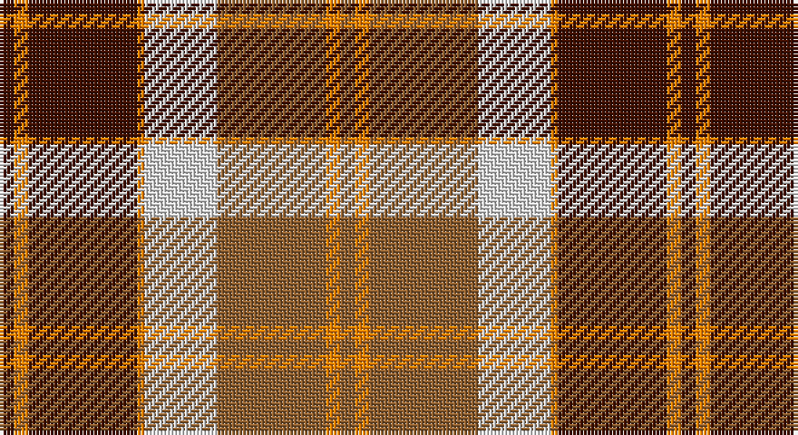

This page is one **sett** — a single exact thread-count. It belongs to the [tartan](/setts/dr2lo2dr15lo1w10o15lo2o2/)
(the same proportion at any scale), whose colour order is pattern [BYBYWRYR](/stripes/bybywryr/).

Sourced from weddslist.  It is a [8 stripe tartan](/stripes/stripes8/).

Original link http://www.weddslist.com/cgi-bin/tartans/pg.pl?source=sts

## Thread count
DR/4 O4 DR30 O2 LN20 LT30 O4 LT/4

One full sett is **188 threads**.

## Palette

Palette: <strong>Tartan Dictionary</strong> <small style="color:#888">(1 of 4 colours)</small>
<table><thead><tr><th>Colour</th><th>Threads</th><th>Shade</th><th>Base</th><th>OKLCh</th></tr></thead><tbody><tr><td>DR/</td><td style="text-align:right;font-variant-numeric:tabular-nums">4</td><td><code style="background-color:#401000;">#401000</code> <small style="color:#888">#401000</small></td><td>B <code style="background-color:#2A418A;">#2A418A</code></td><td><small style="color:#888">oklch(25.3% 0.079 39.9)</small></td></tr><tr><td>O</td><td style="text-align:right;font-variant-numeric:tabular-nums">4</td><td><code style="background-color:#FF8500;">#FF8500</code> <small style="color:#888">#FF8500</small></td><td>Y <code style="background-color:#F2BF00;">#F2BF00</code></td><td><small style="color:#888">oklch(74.0% 0.183 55.1)</small></td></tr><tr><td>DR</td><td style="text-align:right;font-variant-numeric:tabular-nums">30</td><td><code style="background-color:#401000;">#401000</code> <small style="color:#888">#401000</small></td><td>B <code style="background-color:#2A418A;">#2A418A</code></td><td><small style="color:#888">oklch(25.3% 0.079 39.9)</small></td></tr><tr><td>O</td><td style="text-align:right;font-variant-numeric:tabular-nums">2</td><td><code style="background-color:#FF8500;">#FF8500</code> <small style="color:#888">#FF8500</small></td><td>Y <code style="background-color:#F2BF00;">#F2BF00</code></td><td><small style="color:#888">oklch(74.0% 0.183 55.1)</small></td></tr><tr><td>LN</td><td style="text-align:right;font-variant-numeric:tabular-nums">20</td><td><code style="background-color:#E0E0E0;">#E0E0E0</code> <small style="color:#888">#E0E0E0</small></td><td>W <code style="background-color:#F7F7F7;">#F7F7F7</code></td><td><small style="color:#888">oklch(90.7% 0.000 89.9)</small></td></tr><tr><td>LT</td><td style="text-align:right;font-variant-numeric:tabular-nums">30</td><td><code style="background-color:#906030;">#906030</code> <small style="color:#888">#906030</small></td><td>R <code style="background-color:#CC0000;">#CC0000</code></td><td><small style="color:#888">oklch(53.1% 0.089 63.7)</small></td></tr><tr><td>O</td><td style="text-align:right;font-variant-numeric:tabular-nums">4</td><td><code style="background-color:#FF8500;">#FF8500</code> <small style="color:#888">#FF8500</small></td><td>Y <code style="background-color:#F2BF00;">#F2BF00</code></td><td><small style="color:#888">oklch(74.0% 0.183 55.1)</small></td></tr><tr><td>LT/</td><td style="text-align:right;font-variant-numeric:tabular-nums">4</td><td><code style="background-color:#906030;">#906030</code> <small style="color:#888">#906030</small></td><td>R <code style="background-color:#CC0000;">#CC0000</code></td><td><small style="color:#888">oklch(53.1% 0.089 63.7)</small></td></tr></tbody></table>

# Sample pattern

## Nearest tartans

The nearest existing variants by ΔTartan distance, with this tartan at the top so the swatches line up against it.

ΔTartan

Tartan

Sett

—

<a href="/ttd/edit/#slug=dr2lo2dr15lo1w10o15lo2o2~x2">Bannockbane</a> <a class="nn-out" href="/variants/s8/dr2lo2dr15lo1w10o15lo2o2~x2/" title="open its dictionary page">↗</a>

0.51

<a href="/ttd/edit/#slug=do2lo2do15lo1w10loi15lo2loi2~x2&amp;base=dr2lo2dr15lo1w10o15lo2o2~x2">Bannockbane Orange Stripes</a> <a class="nn-out" href="/variants/s8/do2lo2do15lo1w10loi15lo2loi2~x2/" title="open its dictionary page">↗</a>

0.51

<a href="/ttd/edit/#slug=dr2r2dr15r1w10o15r2o2~x2&amp;base=dr2lo2dr15lo1w10o15lo2o2~x2">Bannockbane</a> <a class="nn-out" href="/variants/s8/dr2r2dr15r1w10o15r2o2~x2/" title="open its dictionary page">↗</a>

0.57

<a href="/ttd/edit/#slug=do2r2do15r1w10dy15r2dy2~x2&amp;base=dr2lo2dr15lo1w10o15lo2o2~x2">Bannockbane Brown #1</a> <a class="nn-out" href="/variants/s8/do2r2do15r1w10dy15r2dy2~x2/" title="open its dictionary page">↗</a>

0.90

<a href="/ttd/edit/#slug=do4r3do21r2w14o22r3o4~x2&amp;base=dr2lo2dr15lo1w10o15lo2o2~x2">Bannock Bane M.405</a> <a class="nn-out" href="/variants/s8/do4r3do21r2w14o22r3o4~x2/" title="open its dictionary page">↗</a>

0.96

<a href="/ttd/edit/#slug=p9r4p1r4g15ri4p1~x2&amp;base=dr2lo2dr15lo1w10o15lo2o2~x2">Logan, Light</a> <a class="nn-out" href="/variants/s7/p9r4p1r4g15ri4p1~x2/" title="open its dictionary page">↗</a>

0.98

<a href="/ttd/edit/#slug=dp9ri4dp1ri4g15r4dp1~x2&amp;base=dr2lo2dr15lo1w10o15lo2o2~x2">Logan Light</a> <a class="nn-out" href="/variants/s7/dp9ri4dp1ri4g15r4dp1~x2/" title="open its dictionary page">↗</a>

1.02

<a href="/ttd/edit/#slug=r15db2r1db2r3db7g13gi3~x2&amp;base=dr2lo2dr15lo1w10o15lo2o2~x2">Cranston Dress</a> <a class="nn-out" href="/variants/s8/r15db2r1db2r3db7g13gi3~x2/" title="open its dictionary page">↗</a>

1.04

<a href="/ttd/edit/#slug=r30db3r2db3r6db14g26gi6&amp;base=dr2lo2dr15lo1w10o15lo2o2~x2">Cranston Dress Family Tartan</a> <a class="nn-out" href="/variants/s8/r30db3r2db3r6db14g26gi6/" title="open its dictionary page">↗</a>

1.04

<a href="/ttd/edit/#slug=k3lo18k12lo18k2lo2k3~x2&amp;base=dr2lo2dr15lo1w10o15lo2o2~x2">Kinloch Anderson Check (Fashion)</a> <a class="nn-out" href="/variants/s7/k3lo18k12lo18k2lo2k3~x2/" title="open its dictionary page">↗</a>

1.08

<a href="/ttd/edit/#slug=g12w1r1w4r1w1r8ly2r1~x4&amp;base=dr2lo2dr15lo1w10o15lo2o2~x2">Karibu</a> <a class="nn-out" href="/variants/s9/g12w1r1w4r1w1r8ly2r1~x4/" title="open its dictionary page">↗</a>

## Neighbour map

Every grey dot is one of 14360 variants placed by the first two principal components of the ΔTartan feature space (44% of its variance). Red is this tartan; blue dots are its nearest — click one to open its page.

<svg viewBox="0 0 640 380" role="img" style="max-width:100%;height:auto;border:1px solid #e0e0e0;border-radius:4px;display:block" xmlns="http://www.w3.org/2000/svg"><image href="/nn/cloud.v1.png" width="640" height="380"/><a href="/variants/s8/do2lo2do15lo1w10loi15lo2loi2~x2/"><circle cx="184.8" cy="151.9" r="4" fill="#3465a4"><title>Bannockbane Orange Stripes</title></circle></a><a href="/variants/s8/dr2r2dr15r1w10o15r2o2~x2/"><circle cx="190.6" cy="154.3" r="4" fill="#3465a4"><title>Bannockbane</title></circle></a><a href="/variants/s8/do2r2do15r1w10dy15r2dy2~x2/"><circle cx="193.3" cy="157.9" r="4" fill="#3465a4"><title>Bannockbane Brown #1</title></circle></a><a href="/variants/s8/do4r3do21r2w14o22r3o4~x2/"><circle cx="184.6" cy="172.0" r="4" fill="#3465a4"><title>Bannock Bane M.405</title></circle></a><a href="/variants/s7/p9r4p1r4g15ri4p1~x2/"><circle cx="218.0" cy="174.3" r="4" fill="#3465a4"><title>Logan, Light</title></circle></a><a href="/variants/s7/dp9ri4dp1ri4g15r4dp1~x2/"><circle cx="209.9" cy="173.7" r="4" fill="#3465a4"><title>Logan Light</title></circle></a><a href="/variants/s8/r15db2r1db2r3db7g13gi3~x2/"><circle cx="228.6" cy="170.0" r="4" fill="#3465a4"><title>Cranston Dress</title></circle></a><a href="/variants/s8/r30db3r2db3r6db14g26gi6/"><circle cx="236.2" cy="167.0" r="4" fill="#3465a4"><title>Cranston Dress Family Tartan</title></circle></a><a href="/variants/s7/k3lo18k12lo18k2lo2k3~x2/"><circle cx="160.8" cy="182.7" r="4" fill="#3465a4"><title>Kinloch Anderson Check (Fashion)</title></circle></a><a href="/variants/s9/g12w1r1w4r1w1r8ly2r1~x4/"><circle cx="202.8" cy="140.8" r="4" fill="#3465a4"><title>Karibu</title></circle></a><circle cx="185.4" cy="150.3" r="5" fill="#c00000"/></svg>

ID: /variants/s8/dr2lo2dr15lo1w10o15lo2o2~x2/
