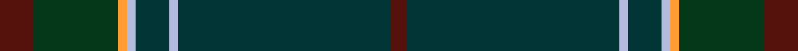

This is one **variant** — a specific cloth: this exact thread count and colourway, with its own
provenance below. It is one weaving of the [sett](/tartans/r/ra/raymond-of-doune/) (the scale-free proportion — the
same cloth at any scale or shade), whose colour order is pattern [BBWBWYGB](/stripes/bbwbwygb/).

Part of the [Raymond of Doune](/tartans/r/ra/raymond-of-doune/) tartan — the named design grouping this sett with its other cloths.

Sourced from register-of-tartans.  It is a [8 stripe tartan](/stripes/stripes8/).

Original link [https://www.tartanregister.gov.uk/tartanDetails.aspx?ref=3469](https://www.tartanregister.gov.uk/tartanDetails.aspx?ref=3469)

2 attestations — the source records this cloth was collapsed from (oldest owns this page)

<ul>
<li>01/01/1997 — Raymond of Doune (register-of-tartans, <a href="https://www.tartanregister.gov.uk/tartanDetails.aspx?ref=3469">record</a>)  <em>Manufactured by Lochcarron 1997 for 'Raymond of Doune' store to be used by a pipe band in Northern Ireland. Sample in Scottish Tartans Authority's Johnston Collection.</em></li>
<li>1997 — Raymond of Doune (Corporate) (tartans-authority, <a href="https://web.archive.org/web/*/http://www.tartansauthority.com/tartan-ferret/display/5437/*">record</a>)  <em>Manufactured by Lochcarron 1997 for "Raymond of Doune" store to be used by a pipe band in Northern Ireland. Sample in STA Johnston Collection.</em></li>
</ul>

Dataset <small>— provenance for this record, inherited from the source manifest</small>

<dl class="dataset-prov">
<dt>source</dt><dd><a href="/sources/register-of-tartans/">Scottish Register of Tartans</a></dd>
<dt>data captured from</dt><dd><a href="https://github.com/thetartan/tartan-database/blob/master/data/register-of-tartans/data.csv">https://github.com/thetartan/tartan-database/blob/master/data/register-of-tartans/data.csv</a></dd>
<dt>data date</dt><dd>1997 <small>(this record)</small></dd>
<dt>licence</dt><dd><a href="https://www.tartanregister.gov.uk/copyright">Crown copyright</a></dd>
</dl>

Capture chain <small>— the hands this data passed through, oldest first; each capture carries its own licence</small>

<ol class="capture-chain">
<li><a href="https://www.tartanregister.gov.uk/">Scottish Register of Tartans</a> · <a href="https://www.tartanregister.gov.uk/copyright">Crown copyright</a> <small>the living register — still published by National Records of Scotland</small></li>
<li><a href="https://github.com/thetartan/tartan-database">thetartan/tartan-database</a> <small>2016-2017</small> · <a href="https://creativecommons.org/licenses/by-nc-nd/4.0/">CC BY-NC-ND 4.0</a> <small>Levko Kravets's frozen compilation — the capture we vendored, and where its CC licence text came from</small></li>
<li>this dictionary <small>captured 2026-06-10 · commit 5bf86c7566</small> <small>each re-capture is a git commit to data/sources</small></li>
</ol>

## Register references

External register numbers recorded for this tartan.

- Scottish Register of Tartans: [3469](https://www.tartanregister.gov.uk/tartanDetails.aspx?ref=3469)
- Scottish Tartans Authority (ITI): 5437

## Thread count
DR/8 DG20 LO2 LB2 DT8 LB2 DT50 DR/4

One full sett is **180 threads**.

## Palette
<table><thead><tr><th>Colour</th><th>Shade</th><th>OKLCh</th></tr></thead><tbody><tr><td>DG</td><td><code style="background-color:#053819;">#053819</code> <small style="color:#888">#053819</small></td><td><small style="color:#888">oklch(30.0% 0.075 151.3)</small></td></tr><tr><td>DT</td><td><code style="background-color:#023535;">#023535</code> <small style="color:#888">#023535</small></td><td><small style="color:#888">oklch(29.8% 0.050 194.8)</small></td></tr><tr><td>DR</td><td><code style="background-color:#55120C;">#55120C</code> <small style="color:#888">#55120C</small></td><td><small style="color:#888">oklch(30.0% 0.099 29.3)</small></td></tr><tr><td>LO</td><td><code style="background-color:#FF9C34;">#FF9C34</code> <small style="color:#888">#FF9C34</small></td><td><small style="color:#888">oklch(77.9% 0.161 61.8)</small></td></tr><tr><td>LB</td><td><code style="background-color:#B5BBDE;">#B5BBDE</code> <small style="color:#888">#B5BBDE</small></td><td><small style="color:#888">oklch(79.9% 0.050 277.6)</small></td></tr></tbody></table>

# Sample pattern

## Nearest tartan variants

The nearest existing variants by ΔTartan distance, with this cloth at the top so the swatches line up against it.

ΔTartan

Threads

Variant

Sett

—

180

<a href="/variants/s8/dr4dg10lo1lb1dt4lb1dt25dr2~x2/">Raymond of Doune</a>

<a href="/ttd/edit/#slug=dt47dg14dp5do2dr3dg7~x2~dt1204274-dg1605139-dp1105325&amp;base=dr4dg10lo1lb1dt4lb1dt25dr2~x2" title="compare in the TTD">2.97</a>

204

<a href="/variants/s6/db47dg14dp5do2dr3dg7~x2~db1204274-dg1605139-dp1105325/">Round Table of Britain and Ire Corporate Tartan</a>

<a href="/ttd/edit/#slug=db47dg14dp5do2dr3dg7~x2&amp;base=dr4dg10lo1lb1dt4lb1dt25dr2~x2" title="compare in the TTD">3.17</a>

204

<a href="/variants/s6/db47dg14dp5do2dr3dg7~x2/">Round Table (1997)</a>

<a href="/ttd/edit/#slug=dr2dg8db27dg11do2~x2&amp;base=dr4dg10lo1lb1dt4lb1dt25dr2~x2" title="compare in the TTD">3.30</a>

192

<a href="/variants/s5/dr2dg8db27dg11do2~x2/">Hector, James (Corporate)</a>

<a href="/ttd/edit/#slug=db26dg6db2dg17dy4w1dy4~x4&amp;base=dr4dg10lo1lb1dt4lb1dt25dr2~x2" title="compare in the TTD">3.45</a>

360

<a href="/variants/s7/db26dg6db2dg17dy4w1dy4~x4/">Doral</a>

## Neighbour map

Every grey dot is one of 13656 variants placed by the first two principal components of the ΔTartan feature space (42% of its variance). Red is this tartan; blue dots are its nearest — click one to open its page. The map is a flat projection of a many-dimensional space — [how to read it](/posts/neighbourhood-maps/).

<svg viewBox="0 0 640 380" role="img" style="max-width:100%;height:auto;border:1px solid #e0e0e0;border-radius:4px;display:block" xmlns="http://www.w3.org/2000/svg"><image href="/nn/cloud.v1.png" width="640" height="380"/><a href="/variants/s6/db47dg14dp5do2dr3dg7~x2~db1204274-dg1605139-dp1105325/"><circle cx="415.7" cy="177.3" r="4" fill="#3465a4"><title>Round Table of Britain and Ire Corporate Tartan</title></circle></a><a href="/variants/s6/db47dg14dp5do2dr3dg7~x2/"><circle cx="557.4" cy="218.3" r="4" fill="#3465a4"><title>Round Table (1997)</title></circle></a><a href="/variants/s5/dr2dg8db27dg11do2~x2/"><circle cx="518.5" cy="278.9" r="4" fill="#3465a4"><title>Hector, James (Corporate)</title></circle></a><a href="/variants/s7/db26dg6db2dg17dy4w1dy4~x4/"><circle cx="441.5" cy="219.3" r="4" fill="#3465a4"><title>Doral</title></circle></a><circle cx="505.7" cy="189.6" r="5" fill="#c00000"/><text x="320" y="376" text-anchor="middle" font-size="11" fill="#999">ground</text><text x="11" y="190" text-anchor="middle" font-size="11" fill="#999" transform="rotate(-90 11 190)">complexity</text></svg>

ID: /variants/s8/dr4dg10lo1lb1dt4lb1dt25dr2~x2/
