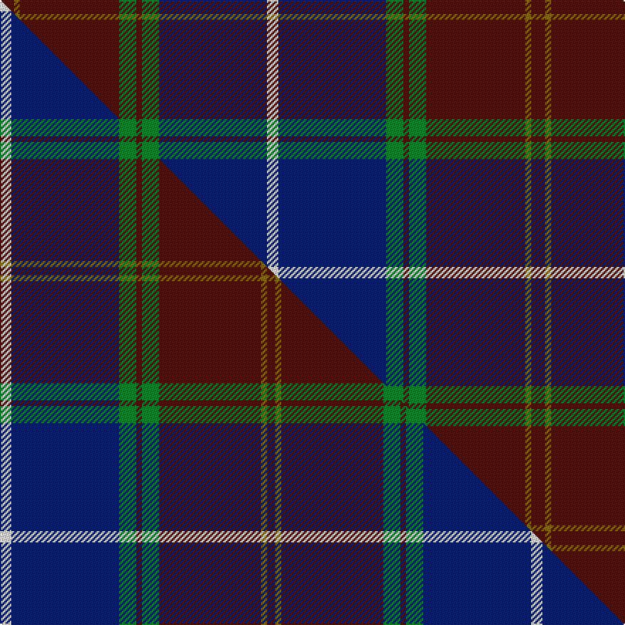

This is one **variant** — a specific cloth: this exact thread count and colourway, with its own
provenance below. It is one weaving of the [sett](/tartans/s/sc/scotland-2000/) (the scale-free proportion — the
same cloth at any scale or shade), whose colour order is pattern [BGBGBGBW](/stripes/bgbgbgbw/).

Part of the [Scotland 2000](/tartans/s/sc/scotland-2000/) tartan — the named design grouping this sett with its other cloths.

Sourced from weddslist.  It is a [8 stripe tartan](/stripes/stripes8/).

Original link [http://www.weddslist.com/cgi-bin/tartans/pg.pl?source=sts](http://www.weddslist.com/cgi-bin/tartans/pg.pl?source=sts)

Dataset <small>— provenance for this record, inherited from the source manifest</small>

<dl class="dataset-prov">
<dt>source</dt><dd><a href="/sources/weddslist/">Weddslist</a></dd>
<dt>data captured from</dt><dd><a href="https://github.com/thetartan/tartan-database/blob/master/data/weddslist/data.csv">https://github.com/thetartan/tartan-database/blob/master/data/weddslist/data.csv</a></dd>
<dt>data date</dt><dd>2016-11-17 <small>(dataset default)</small></dd>
<dt>licence</dt><dd><a href="https://creativecommons.org/licenses/by-nc-nd/4.0/">CC BY-NC-ND 4.0</a></dd>
</dl>

Capture chain <small>— the hands this data passed through, oldest first; each capture carries its own licence</small>

<ol class="capture-chain">
<li><a href="https://www.weddslist.com/tartans/">Weddslist</a> <small>the living privately compiled reference</small></li>
<li><a href="https://github.com/thetartan/tartan-database">thetartan/tartan-database</a> <small>2016-2017</small> · <a href="https://creativecommons.org/licenses/by-nc-nd/4.0/">CC BY-NC-ND 4.0</a> <small>Levko Kravets's frozen compilation — the capture we vendored, and where its CC licence text came from</small></li>
<li>this dictionary <small>captured 2026-06-10 · commit 5bf86c7566</small> <small>each re-capture is a git commit to data/sources</small></li>
</ol>

## Thread count
DR/10 Y4 DR70 G12 DR4 G12 DB76 W/8

One full sett is **374 threads**.

## Palette
<table><thead><tr><th>Colour</th><th>Shade</th><th>OKLCh</th></tr></thead><tbody><tr><td>DB</td><td><code style="background-color:#082077;">#082077</code> <small style="color:#888">#082077</small></td><td><small style="color:#888">oklch(30.0% 0.149 265.1)</small></td></tr><tr><td>DR</td><td><code style="background-color:#55120C;">#55120C</code> <small style="color:#888">#55120C</small></td><td><small style="color:#888">oklch(30.0% 0.099 29.3)</small></td></tr><tr><td>G</td><td><code style="background-color:#008B2A;">#008B2A</code> <small style="color:#888">#008B2A</small></td><td><small style="color:#888">oklch(55.4% 0.170 145.9)</small></td></tr><tr><td>W</td><td><code style="background-color:#F7F7F7;">#F7F7F7</code> <small style="color:#888">#F7F7F7</small></td><td><small style="color:#888">oklch(97.6% 0.000 89.9)</small></td></tr><tr><td>Y</td><td><code style="background-color:#8B6E00;">#8B6E00</code> <small style="color:#888">#8B6E00</small></td><td><small style="color:#888">oklch(55.1% 0.113 90.4)</small></td></tr></tbody></table>

# Sample pattern

## Compared to the master

This cloth is one sett of its design; the master sett (the exemplar the design is anchored on) is below for comparison.

Its **ΔTartan distance** from the master is **0.06** — the same measure the nearest-tartans table ranks by (0 is identical; a re-scale of the same cloth is near 0, a recolour or a different proportion further).

<figure class="master-compare" style="margin:0">

this sett
master sett ★

<figcaption style="color:#888;font-size:smaller">One weave of this sett against the <a href="/setts/w4db38g6dr2g6dr36y2dr3/">master sett ★</a>, split on the diagonal: a shared proportion runs seamlessly across it with only the shades shifting; a different proportion breaks on it.</figcaption>
</figure>

## Nearest tartan variants

The nearest existing variants by ΔTartan distance, with this cloth at the top so the swatches line up against it.

ΔTartan

Threads

Variant

Sett

—

374

<a href="/variants/s8/dr5y2dr35g6dr2g6db38w4~x2/">Scotland 2000</a>

<a href="/ttd/edit/#slug=w4db38g6dr2g6dr36y2dr3~x2&amp;base=dr5y2dr35g6dr2g6db38w4~x2" title="compare in the TTD">0.06</a>

374

<a href="/variants/s8/w4db38g6dr2g6dr36y2dr3~x2/">Scotland 2000</a>

<a href="/ttd/edit/#slug=w4db38g6dr2g6dr38ly2dr3~x2&amp;base=dr5y2dr35g6dr2g6db38w4~x2" title="compare in the TTD">0.10</a>

382

<a href="/variants/s8/w4db38g6dr2g6dr38ly2dr3~x2/">21st Century (Fashion)</a>

<a href="/ttd/edit/#slug=lb4db38g6dr2g6dr36lo2dr3~x2&amp;base=dr5y2dr35g6dr2g6db38w4~x2" title="compare in the TTD">0.66</a>

374

<a href="/variants/s8/lb4db38g6dr2g6dr36lo2dr3~x2/">Scotland 2000 (Commemorative)</a>

<a href="/ttd/edit/#slug=db23ly2dr3dbi7dr3ly2g15dr21ly5~x2~db3409246-dbi3514276&amp;base=dr5y2dr35g6dr2g6db38w4~x2" title="compare in the TTD">1.81</a>

268

<a href="/variants/s9/db23ly2dr3dbi7dr3ly2g15dr21ly5~x2~db3409246-dbi3514276/">Land's End Maroon</a>

<a href="/ttd/edit/#slug=g3r12dg12g5r2db30g2r2~x2&amp;base=dr5y2dr35g6dr2g6db38w4~x2" title="compare in the TTD">2.02</a>

262

<a href="/variants/s8/g3r12dg12g5r2db30g2r2~x2/">Rannoch Moor (Fashion)</a>

<a href="/ttd/edit/#slug=dr25g10db30w4db30g10dr25w2~x2&amp;base=dr5y2dr35g6dr2g6db38w4~x2" title="compare in the TTD">2.22</a>

490

<a href="/variants/s8/dr25g10db30w4db30g10dr25w2~x2/">Highland Spring Dress (2004)</a>

<a href="/ttd/edit/#slug=dr3lb2g18lo2g18dp34dr3dp3~x2&amp;base=dr5y2dr35g6dr2g6db38w4~x2" title="compare in the TTD">2.59</a>

320

<a href="/variants/s8/dr3lb2g18lo2g18dp34dr3dp3~x2/">Singh</a>

<a href="/ttd/edit/#slug=dr1g4ly1g3dr4db15w1~x4&amp;base=dr5y2dr35g6dr2g6db38w4~x2" title="compare in the TTD">2.64</a>

224

<a href="/variants/s7/dr1g4ly1g3dr4db15w1~x4/">Bressuire (District)</a>

<a href="/ttd/edit/#slug=dr1dg4g1dg3dr4db15w1~x4&amp;base=dr5y2dr35g6dr2g6db38w4~x2" title="compare in the TTD">2.77</a>

224

<a href="/variants/s7/dr1dg4g1dg3dr4db15w1~x4/">Bressuire</a>

<a href="/ttd/edit/#slug=w1dy2dr15db2dr2db15dr2g15dr2db2dr15dy2w1~x2&amp;base=dr5y2dr35g6dr2g6db38w4~x2" title="compare in the TTD">2.87</a>

300

<a href="/variants/s13/w1dy2dr15db2dr2db15dr2g15dr2db2dr15dy2w1~x2/">Robbie (Stirling) (Personal)</a>

## Neighbour map

Every grey dot is one of 13662 variants placed by the first two principal components of the ΔTartan feature space (42% of its variance). Red is this tartan; blue dots are its nearest — click one to open its page. The map is a flat projection of a many-dimensional space — [how to read it](/posts/neighbourhood-maps/).

<svg viewBox="0 0 640 380" role="img" style="max-width:100%;height:auto;border:1px solid #e0e0e0;border-radius:4px;display:block" xmlns="http://www.w3.org/2000/svg"><image href="/nn/cloud.v1.png" width="640" height="380"/><a href="/variants/s8/w4db38g6dr2g6dr36y2dr3~x2/"><circle cx="300.9" cy="161.5" r="4" fill="#3465a4"><title>Scotland 2000</title></circle></a><a href="/variants/s8/w4db38g6dr2g6dr38ly2dr3~x2/"><circle cx="300.1" cy="158.5" r="4" fill="#3465a4"><title>21st Century (Fashion)</title></circle></a><a href="/variants/s8/lb4db38g6dr2g6dr36lo2dr3~x2/"><circle cx="309.9" cy="164.2" r="4" fill="#3465a4"><title>Scotland 2000 (Commemorative)</title></circle></a><a href="/variants/s9/db23ly2dr3dbi7dr3ly2g15dr21ly5~x2~db3409246-dbi3514276/"><circle cx="204.0" cy="203.4" r="4" fill="#3465a4"><title>Land's End Maroon</title></circle></a><a href="/variants/s8/g3r12dg12g5r2db30g2r2~x2/"><circle cx="262.9" cy="173.6" r="4" fill="#3465a4"><title>Rannoch Moor (Fashion)</title></circle></a><a href="/variants/s8/dr25g10db30w4db30g10dr25w2~x2/"><circle cx="278.8" cy="227.8" r="4" fill="#3465a4"><title>Highland Spring Dress (2004)</title></circle></a><a href="/variants/s8/dr3lb2g18lo2g18dp34dr3dp3~x2/"><circle cx="302.0" cy="172.0" r="4" fill="#3465a4"><title>Singh</title></circle></a><a href="/variants/s7/dr1g4ly1g3dr4db15w1~x4/"><circle cx="303.2" cy="176.3" r="4" fill="#3465a4"><title>Bressuire (District)</title></circle></a><a href="/variants/s7/dr1dg4g1dg3dr4db15w1~x4/"><circle cx="353.3" cy="191.1" r="4" fill="#3465a4"><title>Bressuire</title></circle></a><a href="/variants/s13/w1dy2dr15db2dr2db15dr2g15dr2db2dr15dy2w1~x2/"><circle cx="292.6" cy="163.6" r="4" fill="#3465a4"><title>Robbie (Stirling) (Personal)</title></circle></a><circle cx="301.7" cy="164.0" r="5" fill="#c00000"/><text x="320" y="376" text-anchor="middle" font-size="11" fill="#999">ground</text><text x="11" y="190" text-anchor="middle" font-size="11" fill="#999" transform="rotate(-90 11 190)">complexity</text></svg>

ID: /variants/s8/dr5y2dr35g6dr2g6db38w4~x2/
