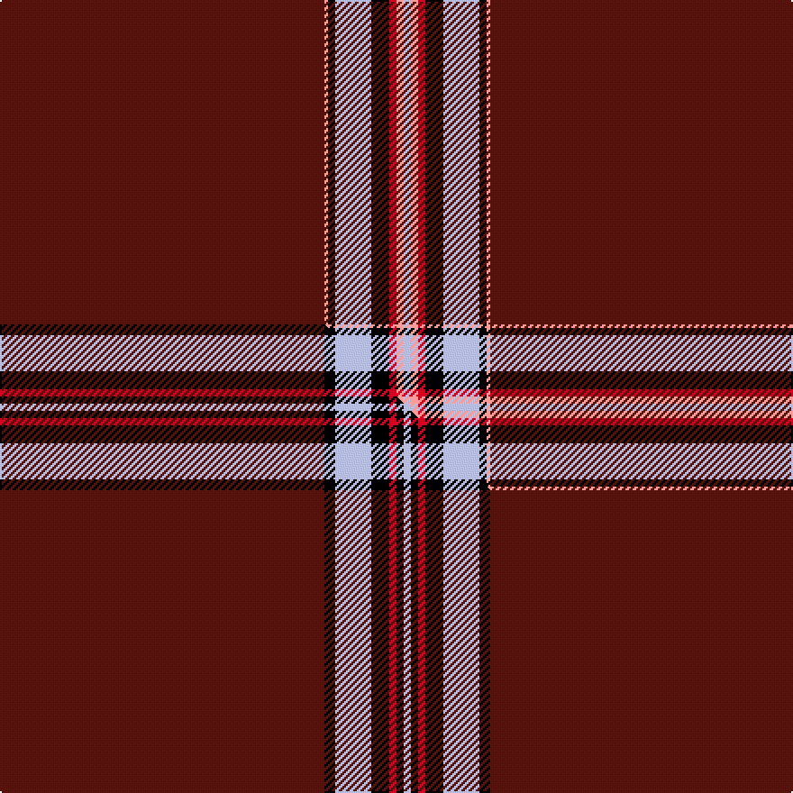

This is one **variant** — a specific cloth: this exact thread count and colourway, with its own
provenance below. It is one weaving of the [sett](/tartans/l/lo/lock-in-northumberland/) (the scale-free proportion — the
same cloth at any scale or shade), whose colour order is pattern [BYKWKRYW](/stripes/bykwkryw/).

Part of the [Lock in Northumberland](/tartans/l/lo/lock-in-northumberland/) tartan — the named design grouping this sett with its other cloths.

Sourced from tartans-authority.  It is a [8 stripe tartan](/stripes/stripes8/).

Original link <code>http://www.tartansauthority.com/tartan-ferret/display/10445/</code> — retired · [Internet Archive copy](https://web.archive.org/web/*/http://www.tartansauthority.com/tartan-ferret/display/10445/*)

Dataset <small>— provenance for this record, inherited from the source manifest</small>

<dl class="dataset-prov">
<dt>source</dt><dd><a href="/sources/tartans-authority/">Scottish Tartans Authority</a></dd>
<dt>data captured from</dt><dd><a href="https://github.com/thetartan/tartan-database/blob/master/data/tartans-authority/data.csv">https://github.com/thetartan/tartan-database/blob/master/data/tartans-authority/data.csv</a></dd>
<dt>data date</dt><dd>23rd June 2011 <small>(this record)</small></dd>
<dt>licence</dt><dd><a href="https://creativecommons.org/licenses/by-nc-nd/4.0/">CC BY-NC-ND 4.0</a></dd>
</dl>

Capture chain <small>— the hands this data passed through, oldest first; each capture carries its own licence</small>

<ol class="capture-chain">
<li><a href="https://www.tartansauthority.com/">Scottish Tartans Authority</a> <small>the heritage body’s archive — its tartan-ferret record browser is retired; dead record links are shown unlinked, with an Internet Archive copy (ITI numbers are not SRT references)</small></li>
<li><a href="https://github.com/thetartan/tartan-database">thetartan/tartan-database</a> <small>2016-2017</small> · <a href="https://creativecommons.org/licenses/by-nc-nd/4.0/">CC BY-NC-ND 4.0</a> <small>Levko Kravets's frozen compilation — the capture we vendored, and where its CC licence text came from</small></li>
<li>this dictionary <small>captured 2026-06-10 · commit 5bf86c7566</small> <small>each re-capture is a git commit to data/sources</small></li>
</ol>

## Register references

External register numbers recorded for this tartan.

- Scottish Register of Tartans: [10445](https://www.tartanregister.gov.uk/tartanDetails?ref=10445)
- Scottish Tartans Authority (ITI): 10445

## Thread count
DR/180 LR2 K4 LB20 K10 R4 LR4 LB/4

One full sett is **272 threads**.

## Palette
<table><thead><tr><th>Colour</th><th>Shade</th><th>OKLCh</th></tr></thead><tbody><tr><td>DR</td><td><code style="background-color:#55120C;">#55120C</code> <small style="color:#888">#55120C</small></td><td><small style="color:#888">oklch(30.0% 0.099 29.3)</small></td></tr><tr><td>K</td><td><code style="background-color:#000000;">#000000</code> <small style="color:#888">#000000</small></td><td><small style="color:#888">oklch(0.0% 0.000 0.0)</small></td></tr><tr><td>LB</td><td><code style="background-color:#B5BBDE;">#B5BBDE</code> <small style="color:#888">#B5BBDE</small></td><td><small style="color:#888">oklch(79.9% 0.050 277.6)</small></td></tr><tr><td>LR</td><td><code style="background-color:#FF9C97;">#FF9C97</code> <small style="color:#888">#FF9C97</small></td><td><small style="color:#888">oklch(79.3% 0.119 23.2)</small></td></tr><tr><td>R</td><td><code style="background-color:#D60020;">#D60020</code> <small style="color:#888">#D60020</small></td><td><small style="color:#888">oklch(55.2% 0.224 25.5)</small></td></tr></tbody></table>

# Sample pattern

## Compared to the master

This cloth is one sett of its design; the master sett (the exemplar the design is anchored on) is below for comparison.

Its **ΔTartan distance** from the master is **1.09** — the same measure the nearest-tartans table ranks by (0 is identical; a re-scale of the same cloth is near 0, a recolour or a different proportion further).

<figure class="master-compare" style="margin:0">

this sett
master sett ★

<figcaption style="color:#888;font-size:smaller">One weave of this sett against the <a href="/setts/dr90k3lb10k5r2k2lb2/">master sett ★</a>, split on the diagonal: a shared proportion runs seamlessly across it with only the shades shifting; a different proportion breaks on it.</figcaption>
</figure>

## Nearest tartan variants

The nearest existing variants by ΔTartan distance, with this cloth at the top so the swatches line up against it.

ΔTartan

Threads

Variant

Sett

—

272

<a href="/variants/s8/dr90lr1k2lb10k5r2lr2lb2~x2/">Lock in Northumberland (Name)</a>

<a href="/ttd/edit/#slug=dr90k3lb10k5r2k2lb2~x2&amp;base=dr90lr1k2lb10k5r2lr2lb2~x2" title="compare in the TTD">1.20</a>

272

<a href="/variants/s7/dr90k3lb10k5r2k2lb2~x2/">Lock in Northumberland</a>

<a href="/ttd/edit/#slug=db12k1r70k1g12k1~x2&amp;base=dr90lr1k2lb10k5r2lr2lb2~x2" title="compare in the TTD">1.51</a>

362

<a href="/variants/s6/db12k1r70k1g12k1~x2/">Lawers Estate</a>

<a href="/ttd/edit/#slug=r70k1db12k1g12k1~x2&amp;base=dr90lr1k2lb10k5r2lr2lb2~x2" title="compare in the TTD">1.51</a>

246

<a href="/variants/s6/r70k1db12k1g12k1~x2/">Lawers Estate (Corporate)</a>

<a href="/ttd/edit/#slug=ri64k10y4r5w2k2db3y4~x2~ri5021030-r4116015&amp;base=dr90lr1k2lb10k5r2lr2lb2~x2" title="compare in the TTD">1.80</a>

240

<a href="/variants/s8/ri64k10y4r5w2k2db3y4~x2~ri5021030-r4116015/">Conroy</a>

<a href="/ttd/edit/#slug=ri64k10y4r5w2k2db3y4~x2~ri5221030-r4518006&amp;base=dr90lr1k2lb10k5r2lr2lb2~x2" title="compare in the TTD">1.80</a>

240

<a href="/variants/s8/ri64k10y4r5w2k2db3y4~x2~ri5221030-r4518006/">Conroy Family Tartan</a>

<a href="/ttd/edit/#slug=dr64k10lo4r5lb2k2db3lo4~x2&amp;base=dr90lr1k2lb10k5r2lr2lb2~x2" title="compare in the TTD">2.07</a>

240

<a href="/variants/s8/dr64k10lo4r5lb2k2db3lo4~x2/">Conroy (Personal)</a>

<a href="/ttd/edit/#slug=dr64k10lo4r5lb2k2db3lo4~x2~lb82&amp;base=dr90lr1k2lb10k5r2lr2lb2~x2" title="compare in the TTD">2.07</a>

240

<a href="/variants/s8/dr64k10lo4r5lb2k2db3lo4~x2~lb82/">Conroy (Personal)</a>

<a href="/ttd/edit/#slug=db3w2k2r62db2k2y2w2~x2&amp;base=dr90lr1k2lb10k5r2lr2lb2~x2" title="compare in the TTD">2.07</a>

298

<a href="/variants/s8/db3w2k2r62db2k2y2w2~x2/">Singer Sewing Machine Company</a>

<a href="/ttd/edit/#slug=k45db2dr2r2y1w1~x2&amp;base=dr90lr1k2lb10k5r2lr2lb2~x2" title="compare in the TTD">2.12</a>

120

<a href="/variants/s6/k45db2dr2r2y1w1~x2/">MacHattie Family Tartan</a>

<a href="/ttd/edit/#slug=k60r3k15r3lb2r5db3r2~x2&amp;base=dr90lr1k2lb10k5r2lr2lb2~x2" title="compare in the TTD">2.12</a>

248

<a href="/variants/s8/k60r3k15r3lb2r5db3r2~x2/">Whitaker (2014)</a>

## Neighbour map

Every grey dot is one of 13662 variants placed by the first two principal components of the ΔTartan feature space (42% of its variance). Red is this tartan; blue dots are its nearest — click one to open its page. The map is a flat projection of a many-dimensional space — [how to read it](/posts/neighbourhood-maps/).

<svg viewBox="0 0 640 380" role="img" style="max-width:100%;height:auto;border:1px solid #e0e0e0;border-radius:4px;display:block" xmlns="http://www.w3.org/2000/svg"><image href="/nn/cloud.v1.png" width="640" height="380"/><a href="/variants/s7/dr90k3lb10k5r2k2lb2~x2/"><circle cx="516.0" cy="37.4" r="4" fill="#3465a4"><title>Lock in Northumberland</title></circle></a><a href="/variants/s6/db12k1r70k1g12k1~x2/"><circle cx="480.5" cy="80.1" r="4" fill="#3465a4"><title>Lawers Estate</title></circle></a><a href="/variants/s6/r70k1db12k1g12k1~x2/"><circle cx="480.5" cy="80.1" r="4" fill="#3465a4"><title>Lawers Estate (Corporate)</title></circle></a><a href="/variants/s8/ri64k10y4r5w2k2db3y4~x2~ri5021030-r4116015/"><circle cx="393.4" cy="49.8" r="4" fill="#3465a4"><title>Conroy</title></circle></a><a href="/variants/s8/ri64k10y4r5w2k2db3y4~x2~ri5221030-r4518006/"><circle cx="390.7" cy="48.4" r="4" fill="#3465a4"><title>Conroy Family Tartan</title></circle></a><a href="/variants/s8/dr64k10lo4r5lb2k2db3lo4~x2/"><circle cx="397.0" cy="59.3" r="4" fill="#3465a4"><title>Conroy (Personal)</title></circle></a><a href="/variants/s8/dr64k10lo4r5lb2k2db3lo4~x2~lb82/"><circle cx="396.2" cy="59.1" r="4" fill="#3465a4"><title>Conroy (Personal)</title></circle></a><a href="/variants/s8/db3w2k2r62db2k2y2w2~x2/"><circle cx="518.3" cy="46.4" r="4" fill="#3465a4"><title>Singer Sewing Machine Company</title></circle></a><a href="/variants/s6/k45db2dr2r2y1w1~x2/"><circle cx="447.1" cy="19.4" r="4" fill="#3465a4"><title>MacHattie Family Tartan</title></circle></a><a href="/variants/s8/k60r3k15r3lb2r5db3r2~x2/"><circle cx="493.0" cy="79.0" r="4" fill="#3465a4"><title>Whitaker (2014)</title></circle></a><circle cx="515.9" cy="38.6" r="5" fill="#c00000"/><text x="320" y="376" text-anchor="middle" font-size="11" fill="#999">ground</text><text x="11" y="190" text-anchor="middle" font-size="11" fill="#999" transform="rotate(-90 11 190)">complexity</text></svg>

ID: /variants/s8/dr90lr1k2lb10k5r2lr2lb2~x2/
