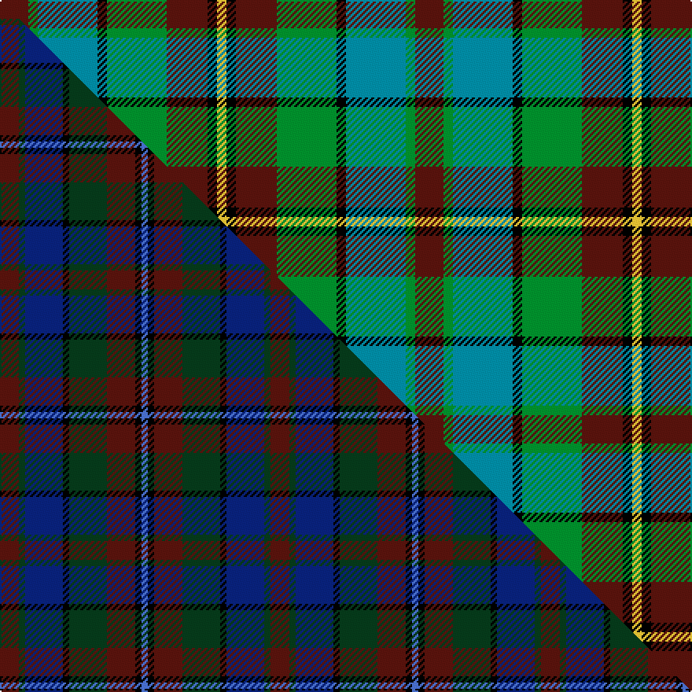

This page is one **sett** — a single exact thread-count. It belongs to the [tartan](/setts/dr9g3t19k3g19dr13k3ly3/)
(the same proportion at any scale), whose colour order is pattern [BGBKGBKY](/stripes/bgbkgbky/).

Part of the [Orkney](/tartans/orkney/) tartan — the named design grouping this sett with its other cloths.

Sourced from tartans-authority.  It is a [8 stripe tartan](/stripes/stripes8/).

Original link https://www.tartanregister.gov.uk/tartanDetails.aspx?ref=2681

Dataset <small>— provenance for this record, inherited from the source manifest</small>

<dl class="dataset-prov">
<dt>source</dt><dd><a href="/sources/tartans-authority/">Scottish Tartans Authority</a></dd>
<dt>data captured from</dt><dd><a href="https://github.com/thetartan/tartan-database/blob/master/data/tartans-authority/data.csv">https://github.com/thetartan/tartan-database/blob/master/data/tartans-authority/data.csv</a></dd>
<dt>data date</dt><dd>2000 <small>(this record)</small></dd>
<dt>licence</dt><dd><a href="https://creativecommons.org/licenses/by-nc-nd/4.0/">CC BY-NC-ND 4.0</a></dd>
</dl>

Capture chain <small>— the hands this data passed through, oldest first; each capture carries its own licence</small>

<ol class="capture-chain">
<li><a href="https://www.tartansauthority.com/">Scottish Tartans Authority</a> <small>the heritage body's archive — its tartan-ferret record browser is retired (links repaired to the SRT, above)</small></li>
<li><a href="https://github.com/thetartan/tartan-database">thetartan/tartan-database</a> <small>2016-2017</small> · <a href="https://creativecommons.org/licenses/by-nc-nd/4.0/">CC BY-NC-ND 4.0</a> <small>Levko Kravets's frozen compilation — the capture we vendored, and where its CC licence text came from</small></li>
<li>this dictionary <small>captured 2026-06-10 · commit 5bf86c7566</small> <small>each re-capture is a git commit to data/sources</small></li>
</ol>

## Register references

External register numbers recorded for this tartan.

- Scottish Tartans Authority (ITI): 2681

## Thread count
DR/18 G6 T38 K6 G38 DR26 K6 LY/6

One full sett is **264 threads**.

## Palette
<table><thead><tr><th>Colour</th><th>Shade</th><th>OKLCh</th></tr></thead><tbody><tr><td>T</td><td><code style="background-color:#00879F;">#00879F</code> <small style="color:#888">#00879F</small></td><td><small style="color:#888">oklch(57.4% 0.102 216.1)</small></td></tr><tr><td>DR</td><td><code style="background-color:#55120C;">#55120C</code> <small style="color:#888">#55120C</small></td><td><small style="color:#888">oklch(30.0% 0.099 29.3)</small></td></tr><tr><td>LY</td><td><code style="background-color:#DCBC32;">#DCBC32</code> <small style="color:#888">#DCBC32</small></td><td><small style="color:#888">oklch(80.0% 0.150 95.2)</small></td></tr><tr><td>G</td><td><code style="background-color:#008B2A;">#008B2A</code> <small style="color:#888">#008B2A</small></td><td><small style="color:#888">oklch(55.4% 0.170 145.9)</small></td></tr><tr><td>K</td><td><code style="background-color:#000000;">#000000</code> <small style="color:#888">#000000</small></td><td><small style="color:#888">oklch(0.0% 0.000 0.0)</small></td></tr></tbody></table>

# Sample pattern

## Compared to the master

This cloth is one sett of its design; the master sett (the exemplar the design is anchored on) is below for comparison.

Its **ΔTartan distance** from the master is **0.51** — the same measure the nearest-tartans table ranks by (0 is identical; a re-scale of the same cloth is near 0, a recolour or a different proportion further).

<figure class="master-compare" style="margin:0">

this sett
master sett ★

<figcaption style="color:#888;font-size:smaller">One weave of this sett against the <a href="/setts/dr6dg2db12k2dg12dr9k2b2/">master sett ★</a>, split on the diagonal: a shared proportion runs seamlessly across it with only the shades shifting; a different proportion breaks on it.</figcaption>
</figure>

## Nearest tartan variants

The nearest existing variants by ΔTartan distance, with this cloth at the top so the swatches line up against it.

ΔTartan

Threads

Variant

Sett

—

264

<a href="/variants/s8/dr9g3t19k3g19dr13k3ly3~x2/">Orkney (District?)</a>

<a href="/ttd/edit/#slug=r4g16k16db4g3db12y2~x2&amp;base=dr9g3t19k3g19dr13k3ly3~x2" title="compare in the TTD">2.26</a>

216

<a href="/variants/s7/r4g16k16db4g3db12y2~x2/">Junior Chamber International</a>

<a href="/ttd/edit/#slug=db18r3k9r3g23y3~x2&amp;base=dr9g3t19k3g19dr13k3ly3~x2" title="compare in the TTD">2.27</a>

194

<a href="/variants/s6/db18r3k9r3g23y3~x2/">Royal College of Physicians (Corp)</a>

<a href="/ttd/edit/#slug=dr3g2dr3g18k14w2db16g3~x2&amp;base=dr9g3t19k3g19dr13k3ly3~x2" title="compare in the TTD">2.41</a>

232

<a href="/variants/s8/dr3g2dr3g18k14w2db16g3~x2/">Mantle (Personal)</a>

<a href="/ttd/edit/#slug=k6lb2db12g8r5k2g3~x4&amp;base=dr9g3t19k3g19dr13k3ly3~x2" title="compare in the TTD">2.41</a>

268

<a href="/variants/s7/k6lb2db12g8r5k2g3~x4/">Cooke (Personal)</a>

<a href="/ttd/edit/#slug=k6b2db12g8r5k2g3~x4&amp;base=dr9g3t19k3g19dr13k3ly3~x2" title="compare in the TTD">2.42</a>

268

<a href="/variants/s7/k6b2db12g8r5k2g3~x4/">Cooke</a>

<a href="/ttd/edit/#slug=g4n12lo2k10y10lo3y2~x2&amp;base=dr9g3t19k3g19dr13k3ly3~x2" title="compare in the TTD">2.51</a>

160

<a href="/variants/s7/g4n12lo2k10y10lo3y2~x2/">Rothesay</a>

<a href="/ttd/edit/#slug=k3dr13g19k3t19g3dr9g3t19k3g19dr13k3ly3~x2&amp;base=dr9g3t19k3g19dr13k3ly3~x2" title="compare in the TTD">2.52</a>

516

<a href="/variants/s14/k3dr13g19k3t19g3dr9g3t19k3g19dr13k3ly3~x2/">Orkney</a>

<a href="/ttd/edit/#slug=y5k5g17k6n24k6y3~x2&amp;base=dr9g3t19k3g19dr13k3ly3~x2" title="compare in the TTD">2.55</a>

248

<a href="/variants/s7/y5k5g17k6n24k6y3~x2/">Cape Breton</a>

<a href="/ttd/edit/#slug=y8g4db16g4k14y14db4t3~x2&amp;base=dr9g3t19k3g19dr13k3ly3~x2" title="compare in the TTD">2.63</a>

246

<a href="/variants/s8/y8g4db16g4k14y14db4t3~x2/">Hinnigan (Personal)</a>

<a href="/ttd/edit/#slug=k7db11k3db11dy11g22db3~x2~db1605267&amp;base=dr9g3t19k3g19dr13k3ly3~x2" title="compare in the TTD">2.69</a>

252

<a href="/variants/s7/k7db11k3db11dy11g22db3~x2~db1605267/">Scottish Odyssey Commemorative Tartan</a>

## Neighbour map

Every grey dot is one of 13620 variants placed by the first two principal components of the ΔTartan feature space (42% of its variance). Red is this tartan; blue dots are its nearest — click one to open its page.

<svg viewBox="0 0 640 380" role="img" style="max-width:100%;height:auto;border:1px solid #e0e0e0;border-radius:4px;display:block" xmlns="http://www.w3.org/2000/svg"><image href="/nn/cloud.v1.png" width="640" height="380"/><a href="/variants/s7/r4g16k16db4g3db12y2~x2/"><circle cx="105.9" cy="197.7" r="4" fill="#3465a4"><title>Junior Chamber International</title></circle></a><a href="/variants/s6/db18r3k9r3g23y3~x2/"><circle cx="138.2" cy="196.1" r="4" fill="#3465a4"><title>Royal College of Physicians (Corp)</title></circle></a><a href="/variants/s8/dr3g2dr3g18k14w2db16g3~x2/"><circle cx="128.8" cy="175.5" r="4" fill="#3465a4"><title>Mantle (Personal)</title></circle></a><a href="/variants/s7/k6lb2db12g8r5k2g3~x4/"><circle cx="70.8" cy="214.3" r="4" fill="#3465a4"><title>Cooke (Personal)</title></circle></a><a href="/variants/s7/k6b2db12g8r5k2g3~x4/"><circle cx="76.0" cy="216.1" r="4" fill="#3465a4"><title>Cooke</title></circle></a><a href="/variants/s7/g4n12lo2k10y10lo3y2~x2/"><circle cx="70.8" cy="217.0" r="4" fill="#3465a4"><title>Rothesay</title></circle></a><a href="/variants/s14/k3dr13g19k3t19g3dr9g3t19k3g19dr13k3ly3~x2/"><circle cx="111.2" cy="189.5" r="4" fill="#3465a4"><title>Orkney</title></circle></a><a href="/variants/s7/y5k5g17k6n24k6y3~x2/"><circle cx="150.3" cy="209.7" r="4" fill="#3465a4"><title>Cape Breton</title></circle></a><a href="/variants/s8/y8g4db16g4k14y14db4t3~x2/"><circle cx="86.2" cy="222.2" r="4" fill="#3465a4"><title>Hinnigan (Personal)</title></circle></a><a href="/variants/s7/k7db11k3db11dy11g22db3~x2~db1605267/"><circle cx="140.9" cy="224.3" r="4" fill="#3465a4"><title>Scottish Odyssey Commemorative Tartan</title></circle></a><circle cx="112.4" cy="209.5" r="5" fill="#c00000"/><text x="320" y="376" text-anchor="middle" font-size="11" fill="#999">ground</text><text x="11" y="190" text-anchor="middle" font-size="11" fill="#999" transform="rotate(-90 11 190)">complexity</text></svg>

ID: /variants/s8/dr9g3t19k3g19dr13k3ly3~x2/
