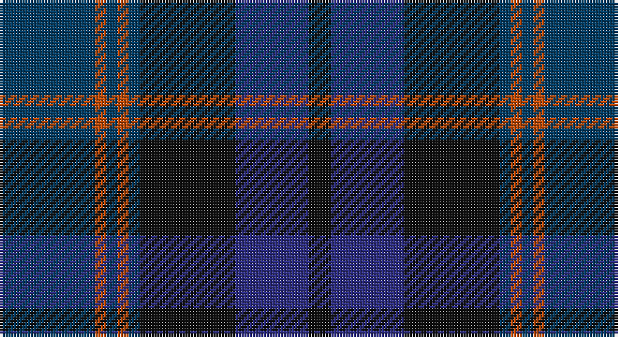

This page is one **sett** — a single exact thread-count. It belongs to the [tartan](/setts/dt17o2dt2o2dt2k17db13k4/)
(the same proportion at any scale), whose colour order is pattern [BRBRBKBK](/stripes/brbrbkbk/).

Part of the [Balmoral Hotel](/tartans/balmoral-hotel/) tartan — the named design grouping this sett with its other cloths.

Sourced from register-of-tartans.  It is a [8 stripe tartan](/stripes/stripes8/).

Original link https://www.tartanregister.gov.uk/tartanDetails.aspx?ref=5100

## Register references

External register numbers recorded for this tartan.

- Scottish Register of Tartans: [5100](https://www.tartanregister.gov.uk/tartanDetails.aspx?ref=5100)
- Scottish Tartans Authority (ITI): 3955
- Scottish Tartans World Register: 3268

## Thread count
DBa/34 DO4 DBa4 DO4 DBa4 K34 DB26 K/8

One full sett is **194 threads**.

## Palette

Palette: <strong>Tartan Register</strong> <small style="color:#888">(3 of 4 colours)</small>
<table><thead><tr><th>Colour</th><th>Threads</th><th>Shade</th><th>Base</th><th>OKLCh</th></tr></thead><tbody><tr><td>DBa/</td><td style="text-align:right;font-variant-numeric:tabular-nums">34</td><td><code style="background-color:#003C64;">#003C64</code> <small style="color:#888">#003C64</small></td><td>B <code style="background-color:#2A418A;">#2A418A</code></td><td><small style="color:#888">oklch(34.5% 0.089 246.0)</small></td></tr><tr><td>DO</td><td style="text-align:right;font-variant-numeric:tabular-nums">4</td><td><code style="background-color:#C04C08;">#C04C08</code> <small style="color:#888">#C04C08</small></td><td>R <code style="background-color:#CC0000;">#CC0000</code></td><td><small style="color:#888">oklch(56.4% 0.163 43.2)</small></td></tr><tr><td>DBa</td><td style="text-align:right;font-variant-numeric:tabular-nums">4</td><td><code style="background-color:#003C64;">#003C64</code> <small style="color:#888">#003C64</small></td><td>B <code style="background-color:#2A418A;">#2A418A</code></td><td><small style="color:#888">oklch(34.5% 0.089 246.0)</small></td></tr><tr><td>DO</td><td style="text-align:right;font-variant-numeric:tabular-nums">4</td><td><code style="background-color:#C04C08;">#C04C08</code> <small style="color:#888">#C04C08</small></td><td>R <code style="background-color:#CC0000;">#CC0000</code></td><td><small style="color:#888">oklch(56.4% 0.163 43.2)</small></td></tr><tr><td>DBa</td><td style="text-align:right;font-variant-numeric:tabular-nums">4</td><td><code style="background-color:#003C64;">#003C64</code> <small style="color:#888">#003C64</small></td><td>B <code style="background-color:#2A418A;">#2A418A</code></td><td><small style="color:#888">oklch(34.5% 0.089 246.0)</small></td></tr><tr><td>K</td><td style="text-align:right;font-variant-numeric:tabular-nums">34</td><td><code style="background-color:#101010;">#101010</code> <small style="color:#888">#101010</small></td><td>K <code style="background-color:#000000;">#000000</code></td><td><small style="color:#888">oklch(17.3% 0.000 89.9)</small></td></tr><tr><td>DB</td><td style="text-align:right;font-variant-numeric:tabular-nums">26</td><td><code style="background-color:#2C2C80;">#2C2C80</code> <small style="color:#888">#2C2C80</small></td><td>B <code style="background-color:#2A418A;">#2A418A</code></td><td><small style="color:#888">oklch(35.0% 0.138 276.6)</small></td></tr><tr><td>K/</td><td style="text-align:right;font-variant-numeric:tabular-nums">8</td><td><code style="background-color:#101010;">#101010</code> <small style="color:#888">#101010</small></td><td>K <code style="background-color:#000000;">#000000</code></td><td><small style="color:#888">oklch(17.3% 0.000 89.9)</small></td></tr></tbody></table>

# Sample pattern

## Nearest tartans

The nearest existing variants by ΔTartan distance, with this tartan at the top so the swatches line up against it.

ΔTartan

Tartan

Sett

—

<a href="/ttd/edit/#slug=dt17o2dt2o2dt2k17db13k4~x2">Balmoral Hotel</a> <a class="nn-out" href="/variants/s8/dt17o2dt2o2dt2k17db13k4~x2/" title="open its dictionary page">↗</a>

0.84

<a href="/ttd/edit/#slug=n9db1n1db1n1db7dg7r2~x4&amp;base=dt17o2dt2o2dt2k17db13k4~x2">Caledonian Hotel (Corporate)</a> <a class="nn-out" href="/variants/s8/n9db1n1db1n1db7dg7r2~x4/" title="open its dictionary page">↗</a>

0.91

<a href="/ttd/edit/#slug=k3dg4db25k16dg3k3dg3k3dg6r3~x2&amp;base=dt17o2dt2o2dt2k17db13k4~x2">MacAndreis (Personal)</a> <a class="nn-out" href="/variants/s10/k3dg4db25k16dg3k3dg3k3dg6r3~x2/" title="open its dictionary page">↗</a>

0.93

<a href="/ttd/edit/#slug=db16k2db2k2db2k6dg13ly2dg3~x2&amp;base=dt17o2dt2o2dt2k17db13k4~x2">Christian Dewar (Personal)</a> <a class="nn-out" href="/variants/s9/db16k2db2k2db2k6dg13ly2dg3~x2/" title="open its dictionary page">↗</a>

1.23

<a href="/ttd/edit/#slug=db16r2db2r2db2r6dg13lo2dg3~x2&amp;base=dt17o2dt2o2dt2k17db13k4~x2">Dewar, Christian (Personal)</a> <a class="nn-out" href="/variants/s9/db16r2db2r2db2r6dg13lo2dg3~x2/" title="open its dictionary page">↗</a>

1.31

<a href="/ttd/edit/#slug=y24r2y3db14dt24r2dt3db3~x2&amp;base=dt17o2dt2o2dt2k17db13k4~x2">Grampian (District)</a> <a class="nn-out" href="/variants/s8/y24r2y3db14dt24r2dt3db3~x2/" title="open its dictionary page">↗</a>

1.34

<a href="/ttd/edit/#slug=n9db1n1db1n1db7k7r2~x4&amp;base=dt17o2dt2o2dt2k17db13k4~x2">Caledonian Hotel (Corporate)</a> <a class="nn-out" href="/variants/s8/n9db1n1db1n1db7k7r2~x4/" title="open its dictionary page">↗</a>

1.40

<a href="/ttd/edit/#slug=dg24db7dg7db7k22db7k4dy4k4db40m14&amp;base=dt17o2dt2o2dt2k17db13k4~x2">Brethwe Powys</a> <a class="nn-out" href="/variants/s11/dg24db7dg7db7k22db7k4dy4k4db40m14/" title="open its dictionary page">↗</a>

1.41

<a href="/ttd/edit/#slug=t1db11k11dg11k2t1~x2&amp;base=dt17o2dt2o2dt2k17db13k4~x2">Unidentified No 59</a> <a class="nn-out" href="/variants/s6/t1db11k11dg11k2t1~x2/" title="open its dictionary page">↗</a>

1.43

<a href="/ttd/edit/#slug=dt13dg19k2dg7k2dg7k2db18r2dt13~x2&amp;base=dt17o2dt2o2dt2k17db13k4~x2">South Australia</a> <a class="nn-out" href="/variants/s10/dt13dg19k2dg7k2dg7k2db18r2dt13~x2/" title="open its dictionary page">↗</a>

1.43

<a href="/ttd/edit/#slug=k1r1dg6k1dg1k1dg1k6db9k1db1~x2&amp;base=dt17o2dt2o2dt2k17db13k4~x2">Louise of Lorne</a> <a class="nn-out" href="/variants/s11/k1r1dg6k1dg1k1dg1k6db9k1db1~x2/" title="open its dictionary page">↗</a>

## Neighbour map

Every grey dot is one of 14360 variants placed by the first two principal components of the ΔTartan feature space (44% of its variance). Red is this tartan; blue dots are its nearest — click one to open its page.

<svg viewBox="0 0 640 380" role="img" style="max-width:100%;height:auto;border:1px solid #e0e0e0;border-radius:4px;display:block" xmlns="http://www.w3.org/2000/svg"><image href="/nn/cloud.v1.png" width="640" height="380"/><a href="/variants/s8/n9db1n1db1n1db7dg7r2~x4/"><circle cx="256.3" cy="236.1" r="4" fill="#3465a4"><title>Caledonian Hotel (Corporate)</title></circle></a><a href="/variants/s10/k3dg4db25k16dg3k3dg3k3dg6r3~x2/"><circle cx="257.4" cy="221.9" r="4" fill="#3465a4"><title>MacAndreis (Personal)</title></circle></a><a href="/variants/s9/db16k2db2k2db2k6dg13ly2dg3~x2/"><circle cx="273.1" cy="233.1" r="4" fill="#3465a4"><title>Christian Dewar (Personal)</title></circle></a><a href="/variants/s9/db16r2db2r2db2r6dg13lo2dg3~x2/"><circle cx="282.3" cy="231.6" r="4" fill="#3465a4"><title>Dewar, Christian (Personal)</title></circle></a><a href="/variants/s8/y24r2y3db14dt24r2dt3db3~x2/"><circle cx="277.9" cy="221.1" r="4" fill="#3465a4"><title>Grampian (District)</title></circle></a><a href="/variants/s8/n9db1n1db1n1db7k7r2~x4/"><circle cx="239.9" cy="225.7" r="4" fill="#3465a4"><title>Caledonian Hotel (Corporate)</title></circle></a><a href="/variants/s11/dg24db7dg7db7k22db7k4dy4k4db40m14/"><circle cx="249.4" cy="209.3" r="4" fill="#3465a4"><title>Brethwe Powys</title></circle></a><a href="/variants/s6/t1db11k11dg11k2t1~x2/"><circle cx="243.7" cy="251.3" r="4" fill="#3465a4"><title>Unidentified No 59</title></circle></a><a href="/variants/s10/dt13dg19k2dg7k2dg7k2db18r2dt13~x2/"><circle cx="235.3" cy="233.5" r="4" fill="#3465a4"><title>South Australia</title></circle></a><a href="/variants/s11/k1r1dg6k1dg1k1dg1k6db9k1db1~x2/"><circle cx="244.7" cy="209.7" r="4" fill="#3465a4"><title>Louise of Lorne</title></circle></a><circle cx="260.4" cy="249.0" r="5" fill="#c00000"/></svg>

ID: /variants/s8/dt17o2dt2o2dt2k17db13k4~x2/
