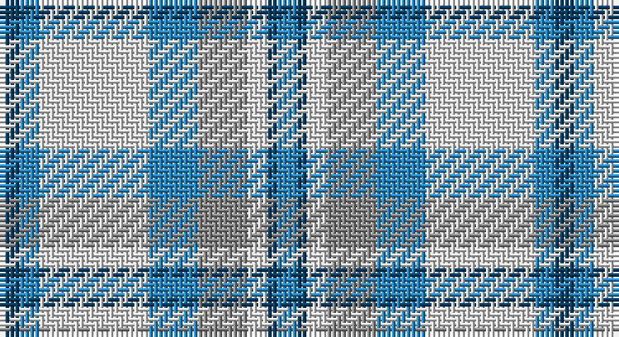

This page is one **sett** — a single exact thread-count. It belongs to the [tartan](/setts/dt2t2w11t5o5w2dt1t2/)
(the same proportion at any scale), whose colour order is pattern [BBWBRWBB](/stripes/bbwbrwbb/).

Part of the [Conquergood](/tartans/conquergood/) tartan — the named design grouping this sett with its other cloths.

Sourced from house-of-tartan.  It is a [8 stripe tartan](/stripes/stripes8/).

Original link http://www.house-of-tartan.scotland.net/house/TartanViewjs.asp?colr=Def&tnam=2095

## Provenance

Earliest known date: 1982 Designed to represent Canadian landscape in winter and sandy beaches in summer. Robert Conquergood, born in 1818 in Ormston, in the Parish of Roxburgh, Scotland, emigrated to Ontario, Canada with his father, also Robert, who was born in 1781. The Conquergood family in Canada approved this tartan at their 1990 biennial family reunion held at Kelowna, British Columbia.

## Thread count
DB/4 B4 LN22 B10 N10 LN4 DB2 B/4

One full sett is **112 threads**.

## Palette

Palette: <strong>Tartan Register</strong>
<table><thead><tr><th>Colour</th><th>Threads</th><th>Shade</th><th>Base</th><th>OKLCh</th></tr></thead><tbody><tr><td>DB/</td><td style="text-align:right;font-variant-numeric:tabular-nums">4</td><td><code style="background-color:#003C64;">#003C64</code> <small style="color:#888">#003C64</small></td><td>B <code style="background-color:#2A418A;">#2A418A</code></td><td><small style="color:#888">oklch(34.5% 0.089 246.0)</small></td></tr><tr><td>B</td><td style="text-align:right;font-variant-numeric:tabular-nums">4</td><td><code style="background-color:#2888C4;">#2888C4</code> <small style="color:#888">#2888C4</small></td><td>B <code style="background-color:#2A418A;">#2A418A</code></td><td><small style="color:#888">oklch(60.1% 0.125 241.5)</small></td></tr><tr><td>LN</td><td style="text-align:right;font-variant-numeric:tabular-nums">22</td><td><code style="background-color:#E0E0E0;">#E0E0E0</code> <small style="color:#888">#E0E0E0</small></td><td>W <code style="background-color:#F7F7F7;">#F7F7F7</code></td><td><small style="color:#888">oklch(90.7% 0.000 89.9)</small></td></tr><tr><td>B</td><td style="text-align:right;font-variant-numeric:tabular-nums">10</td><td><code style="background-color:#2888C4;">#2888C4</code> <small style="color:#888">#2888C4</small></td><td>B <code style="background-color:#2A418A;">#2A418A</code></td><td><small style="color:#888">oklch(60.1% 0.125 241.5)</small></td></tr><tr><td>N</td><td style="text-align:right;font-variant-numeric:tabular-nums">10</td><td><code style="background-color:#888888;">#888888</code> <small style="color:#888">#888888</small></td><td>R <code style="background-color:#CC0000;">#CC0000</code></td><td><small style="color:#888">oklch(62.7% 0.000 89.9)</small></td></tr><tr><td>LN</td><td style="text-align:right;font-variant-numeric:tabular-nums">4</td><td><code style="background-color:#E0E0E0;">#E0E0E0</code> <small style="color:#888">#E0E0E0</small></td><td>W <code style="background-color:#F7F7F7;">#F7F7F7</code></td><td><small style="color:#888">oklch(90.7% 0.000 89.9)</small></td></tr><tr><td>DB</td><td style="text-align:right;font-variant-numeric:tabular-nums">2</td><td><code style="background-color:#003C64;">#003C64</code> <small style="color:#888">#003C64</small></td><td>B <code style="background-color:#2A418A;">#2A418A</code></td><td><small style="color:#888">oklch(34.5% 0.089 246.0)</small></td></tr><tr><td>B/</td><td style="text-align:right;font-variant-numeric:tabular-nums">4</td><td><code style="background-color:#2888C4;">#2888C4</code> <small style="color:#888">#2888C4</small></td><td>B <code style="background-color:#2A418A;">#2A418A</code></td><td><small style="color:#888">oklch(60.1% 0.125 241.5)</small></td></tr></tbody></table>

# Sample pattern

## Compared to the master

This cloth is one sett of its design; the master sett (the exemplar the design is anchored on) is below for comparison.

<figure style="margin:0"><figcaption style="color:#888;font-size:smaller">this sett</figcaption></figure>
<figure style="margin:0"><figcaption style="color:#888;font-size:smaller"><a href="/setts/k4t2w11t5o5w2k1t2/">master sett →</a></figcaption></figure>

## Nearest tartans

The nearest existing variants by ΔTartan distance, with this tartan at the top so the swatches line up against it.

ΔTartan

Tartan

Sett

—

<a href="/ttd/edit/#slug=dt2t2w11t5o5w2dt1t2~x2">Conquergood Family Tartan</a> <a class="nn-out" href="/variants/s8/dt2t2w11t5o5w2dt1t2~x2/" title="open its dictionary page">↗</a>

0.98

<a href="/ttd/edit/#slug=t8db2t24db5w26k2w8~x2&amp;base=dt2t2w11t5o5w2dt1t2~x2">Lennox Turquoise Dress District Tartan</a> <a class="nn-out" href="/variants/s7/t8db2t24db5w26k2w8~x2/" title="open its dictionary page">↗</a>

1.15

<a href="/ttd/edit/#slug=k4t2w11t5o5w2k1t2~x2&amp;base=dt2t2w11t5o5w2dt1t2~x2">Conquergood (Name)</a> <a class="nn-out" href="/variants/s8/k4t2w11t5o5w2k1t2~x2/" title="open its dictionary page">↗</a>

1.31

<a href="/ttd/edit/#slug=k3w29m9lb19k3~x2&amp;base=dt2t2w11t5o5w2dt1t2~x2">Islander Dress</a> <a class="nn-out" href="/variants/s5/k3w29m9lb19k3~x2/" title="open its dictionary page">↗</a>

1.37

<a href="/variants/s14/k4t2w11t5o5w2k1t2~x2/">Conquergood</a>

1.39

<a href="/ttd/edit/#slug=w4k2w26t23w3t8p3~x2&amp;base=dt2t2w11t5o5w2dt1t2~x2">MacPherson Turquoise Dress Tartan</a> <a class="nn-out" href="/variants/s7/w4k2w26t23w3t8p3~x2/" title="open its dictionary page">↗</a>

1.44

<a href="/ttd/edit/#slug=w8t30g5w3db8r5&amp;base=dt2t2w11t5o5w2dt1t2~x2">Roseberry</a> <a class="nn-out" href="/variants/s6/w8t30g5w3db8r5/" title="open its dictionary page">↗</a>

1.44

<a href="/ttd/edit/#slug=b15w13dy6b2dy2r2dy2b2dy6w13b15r3~x4&amp;base=dt2t2w11t5o5w2dt1t2~x2">Thompson (Pendleton)</a> <a class="nn-out" href="/variants/s12/b15w13dy6b2dy2r2dy2b2dy6w13b15r3~x4/" title="open its dictionary page">↗</a>

1.47

<a href="/ttd/edit/#slug=w28t19db19w4dbi2lp2db7~x2&amp;base=dt2t2w11t5o5w2dt1t2~x2">St Andrews, Earl of, dress</a> <a class="nn-out" href="/variants/s7/w28t19db19w4dbi2lp2db7~x2/" title="open its dictionary page">↗</a>

1.48

<a href="/ttd/edit/#slug=g4w28db14ly2t17g4~x2&amp;base=dt2t2w11t5o5w2dt1t2~x2">Allanton Dress (Fashion)</a> <a class="nn-out" href="/variants/s6/g4w28db14ly2t17g4~x2/" title="open its dictionary page">↗</a>

1.48

<a href="/ttd/edit/#slug=w2db1w15t12w1ly3db1~x6&amp;base=dt2t2w11t5o5w2dt1t2~x2">St. John's (Corporate)</a> <a class="nn-out" href="/variants/s7/w2db1w15t12w1ly3db1~x6/" title="open its dictionary page">↗</a>

## Neighbour map

Every grey dot is one of 14360 variants placed by the first two principal components of the ΔTartan feature space (44% of its variance). Red is this tartan; blue dots are its nearest — click one to open its page.

<svg viewBox="0 0 640 380" role="img" style="max-width:100%;height:auto;border:1px solid #e0e0e0;border-radius:4px;display:block" xmlns="http://www.w3.org/2000/svg"><image href="/nn/cloud.v1.png" width="640" height="380"/><a href="/variants/s7/t8db2t24db5w26k2w8~x2/"><circle cx="248.9" cy="177.7" r="4" fill="#3465a4"><title>Lennox Turquoise Dress District Tartan</title></circle></a><a href="/variants/s8/k4t2w11t5o5w2k1t2~x2/"><circle cx="159.1" cy="179.1" r="4" fill="#3465a4"><title>Conquergood (Name)</title></circle></a><a href="/variants/s5/k3w29m9lb19k3~x2/"><circle cx="215.1" cy="200.8" r="4" fill="#3465a4"><title>Islander Dress</title></circle></a><a href="/variants/s14/k4t2w11t5o5w2k1t2~x2/"><circle cx="178.5" cy="157.4" r="4" fill="#3465a4"><title>Conquergood</title></circle></a><a href="/variants/s7/w4k2w26t23w3t8p3~x2/"><circle cx="277.7" cy="173.1" r="4" fill="#3465a4"><title>MacPherson Turquoise Dress Tartan</title></circle></a><a href="/variants/s6/w8t30g5w3db8r5/"><circle cx="216.1" cy="173.5" r="4" fill="#3465a4"><title>Roseberry</title></circle></a><a href="/variants/s12/b15w13dy6b2dy2r2dy2b2dy6w13b15r3~x4/"><circle cx="169.9" cy="179.1" r="4" fill="#3465a4"><title>Thompson (Pendleton)</title></circle></a><a href="/variants/s7/w28t19db19w4dbi2lp2db7~x2/"><circle cx="173.4" cy="158.9" r="4" fill="#3465a4"><title>St Andrews, Earl of, dress</title></circle></a><a href="/variants/s6/g4w28db14ly2t17g4~x2/"><circle cx="161.8" cy="164.8" r="4" fill="#3465a4"><title>Allanton Dress (Fashion)</title></circle></a><a href="/variants/s7/w2db1w15t12w1ly3db1~x6/"><circle cx="286.3" cy="154.5" r="4" fill="#3465a4"><title>St. John's (Corporate)</title></circle></a><circle cx="207.3" cy="185.8" r="5" fill="#c00000"/></svg>

ID: /variants/s8/dt2t2w11t5o5w2dt1t2~x2/
