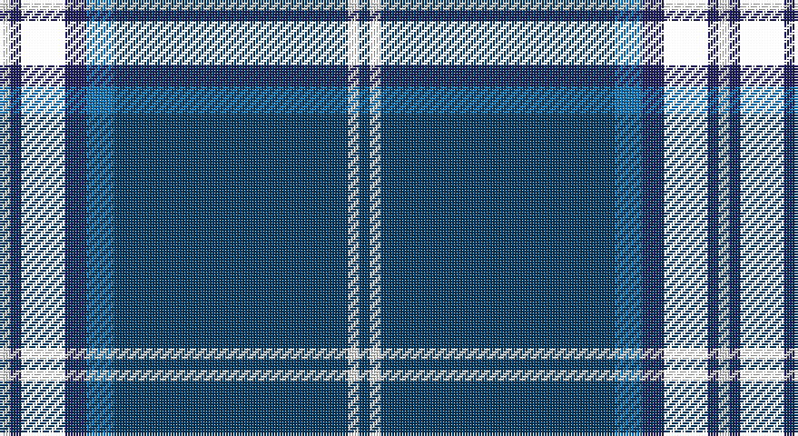

This page is one **sett** — a single exact thread-count. It belongs to the [tartan](/setts/dt2w2dt43b5db4k8db2w2/)
(the same proportion at any scale), whose colour order is pattern [BWBBBKBW](/stripes/bwbbbkbw/).

Part of the [Fife Flyers](/tartans/fife-flyers/) tartan — the named design grouping this sett with its other cloths.

Sourced from register-of-tartans.  It is a [8 stripe tartan](/stripes/stripes8/).

Original link https://www.tartanregister.gov.uk/tartanDetails.aspx?ref=1181

## Register references

External register numbers recorded for this tartan.

- Scottish Register of Tartans: [1181](https://www.tartanregister.gov.uk/tartanDetails.aspx?ref=1181)
- Scottish Tartans Authority (ITI): 4534
- Scottish Tartans World Register: 2751

## Thread count
W/4 DB4 YY16 DB8 B10 DBa86 W4 DBa/4

One full sett is **264 threads**.

## Palette

Palette: <strong>Tartan Register</strong>
<table><thead><tr><th>Colour</th><th>Threads</th><th>Shade</th><th>Base</th><th>OKLCh</th></tr></thead><tbody><tr><td>W/</td><td style="text-align:right;font-variant-numeric:tabular-nums">4</td><td><code style="background-color:#FCFCFC;">#FCFCFC</code> <small style="color:#888">#FCFCFC</small></td><td>W <code style="background-color:#F7F7F7;">#F7F7F7</code></td><td><small style="color:#888">oklch(99.1% 0.000 89.9)</small></td></tr><tr><td>DB</td><td style="text-align:right;font-variant-numeric:tabular-nums">4</td><td><code style="background-color:#202060;">#202060</code> <small style="color:#888">#202060</small></td><td>B <code style="background-color:#2A418A;">#2A418A</code></td><td><small style="color:#888">oklch(28.9% 0.111 276.9)</small></td></tr><tr><td></td><td style="text-align:right;font-variant-numeric:tabular-nums">16</td><td><code style="background-color:;"></code> <small style="color:#888"></small></td><td> <code style="background-color:;"></code></td><td><small style="color:#888"></small></td></tr><tr><td>DB</td><td style="text-align:right;font-variant-numeric:tabular-nums">8</td><td><code style="background-color:#202060;">#202060</code> <small style="color:#888">#202060</small></td><td>B <code style="background-color:#2A418A;">#2A418A</code></td><td><small style="color:#888">oklch(28.9% 0.111 276.9)</small></td></tr><tr><td>B</td><td style="text-align:right;font-variant-numeric:tabular-nums">10</td><td><code style="background-color:#1474B4;">#1474B4</code> <small style="color:#888">#1474B4</small></td><td>B <code style="background-color:#2A418A;">#2A418A</code></td><td><small style="color:#888">oklch(54.0% 0.129 245.1)</small></td></tr><tr><td>DBa</td><td style="text-align:right;font-variant-numeric:tabular-nums">86</td><td><code style="background-color:#003C64;">#003C64</code> <small style="color:#888">#003C64</small></td><td>B <code style="background-color:#2A418A;">#2A418A</code></td><td><small style="color:#888">oklch(34.5% 0.089 246.0)</small></td></tr><tr><td>W</td><td style="text-align:right;font-variant-numeric:tabular-nums">4</td><td><code style="background-color:#FCFCFC;">#FCFCFC</code> <small style="color:#888">#FCFCFC</small></td><td>W <code style="background-color:#F7F7F7;">#F7F7F7</code></td><td><small style="color:#888">oklch(99.1% 0.000 89.9)</small></td></tr><tr><td>DBa/</td><td style="text-align:right;font-variant-numeric:tabular-nums">4</td><td><code style="background-color:#003C64;">#003C64</code> <small style="color:#888">#003C64</small></td><td>B <code style="background-color:#2A418A;">#2A418A</code></td><td><small style="color:#888">oklch(34.5% 0.089 246.0)</small></td></tr></tbody></table>

# Sample pattern

## Nearest tartans

The nearest existing variants by ΔTartan distance, with this tartan at the top so the swatches line up against it.

ΔTartan

Tartan

Sett

—

<a href="/ttd/edit/#slug=dt2w2dt43b5db4k8db2w2~x2">Fife Flyers</a> <a class="nn-out" href="/variants/s8/dt2w2dt43b5db4k8db2w2~x2/" title="open its dictionary page">↗</a>

0.98

<a href="/ttd/edit/#slug=lr5k6w2dg7w2dt44w2~x2&amp;base=dt2w2dt43b5db4k8db2w2~x2">Leblant-Macqueron (Personal)</a> <a class="nn-out" href="/variants/s7/lr5k6w2dg7w2dt44w2~x2/" title="open its dictionary page">↗</a>

0.99

<a href="/ttd/edit/#slug=db50ly4db3ly4db8k2dbi12w5~x2&amp;base=dt2w2dt43b5db4k8db2w2~x2">Indiana #2</a> <a class="nn-out" href="/variants/s8/db50ly4db3ly4db8k2dbi12w5~x2/" title="open its dictionary page">↗</a>

0.99

<a href="/ttd/edit/#slug=db21n2w1n2db1r2db1o6~x4&amp;base=dt2w2dt43b5db4k8db2w2~x2">Blue Rust</a> <a class="nn-out" href="/variants/s8/db21n2w1n2db1r2db1o6~x4/" title="open its dictionary page">↗</a>

1.05

<a href="/ttd/edit/#slug=db20dy1db1dy1dg8k1w3~x2&amp;base=dt2w2dt43b5db4k8db2w2~x2">Chestico</a> <a class="nn-out" href="/variants/s7/db20dy1db1dy1dg8k1w3~x2/" title="open its dictionary page">↗</a>

1.07

<a href="/ttd/edit/#slug=dt2w2dt43b5db4ly8db2w2~x2&amp;base=dt2w2dt43b5db4k8db2w2~x2">Fife Flyers (Corporate)</a> <a class="nn-out" href="/variants/s8/dt2w2dt43b5db4ly8db2w2~x2/" title="open its dictionary page">↗</a>

1.11

<a href="/ttd/edit/#slug=db20o1db1o1dg8k1w3~x2&amp;base=dt2w2dt43b5db4k8db2w2~x2">Chestico</a> <a class="nn-out" href="/variants/s7/db20o1db1o1dg8k1w3~x2/" title="open its dictionary page">↗</a>

1.15

<a href="/ttd/edit/#slug=db21n2lr1n2db1r2db1o6~x4&amp;base=dt2w2dt43b5db4k8db2w2~x2">Blue Rust (Corporate)</a> <a class="nn-out" href="/variants/s8/db21n2lr1n2db1r2db1o6~x4/" title="open its dictionary page">↗</a>

1.18

<a href="/ttd/edit/#slug=r1db2dt1dbi3dt19db3ly1db2ly1~x4&amp;base=dt2w2dt43b5db4k8db2w2~x2">Pagus Wasia</a> <a class="nn-out" href="/variants/s9/r1db2dt1dbi3dt19db3ly1db2ly1~x4/" title="open its dictionary page">↗</a>

1.30

<a href="/ttd/edit/#slug=db47g14dr5o2r3g7~x2&amp;base=dt2w2dt43b5db4k8db2w2~x2">Round Table of Britain and Ireland, RtbI.</a> <a class="nn-out" href="/variants/s6/db47g14dr5o2r3g7~x2/" title="open its dictionary page">↗</a>

1.31

<a href="/ttd/edit/#slug=lb3k6lbi2k6db2k2db32k2n1~x2&amp;base=dt2w2dt43b5db4k8db2w2~x2">Nocken (Personal)</a> <a class="nn-out" href="/variants/s9/lb3k6lbi2k6db2k2db32k2n1~x2/" title="open its dictionary page">↗</a>

## Neighbour map

Every grey dot is one of 14360 variants placed by the first two principal components of the ΔTartan feature space (44% of its variance). Red is this tartan; blue dots are its nearest — click one to open its page.

<svg viewBox="0 0 640 380" role="img" style="max-width:100%;height:auto;border:1px solid #e0e0e0;border-radius:4px;display:block" xmlns="http://www.w3.org/2000/svg"><image href="/nn/cloud.v1.png" width="640" height="380"/><a href="/variants/s7/lr5k6w2dg7w2dt44w2~x2/"><circle cx="363.8" cy="123.9" r="4" fill="#3465a4"><title>Leblant-Macqueron (Personal)</title></circle></a><a href="/variants/s8/db50ly4db3ly4db8k2dbi12w5~x2/"><circle cx="411.8" cy="124.1" r="4" fill="#3465a4"><title>Indiana #2</title></circle></a><a href="/variants/s8/db21n2w1n2db1r2db1o6~x4/"><circle cx="382.8" cy="133.9" r="4" fill="#3465a4"><title>Blue Rust</title></circle></a><a href="/variants/s7/db20dy1db1dy1dg8k1w3~x2/"><circle cx="352.6" cy="145.2" r="4" fill="#3465a4"><title>Chestico</title></circle></a><a href="/variants/s8/dt2w2dt43b5db4ly8db2w2~x2/"><circle cx="377.6" cy="114.4" r="4" fill="#3465a4"><title>Fife Flyers (Corporate)</title></circle></a><a href="/variants/s7/db20o1db1o1dg8k1w3~x2/"><circle cx="331.4" cy="139.0" r="4" fill="#3465a4"><title>Chestico</title></circle></a><a href="/variants/s8/db21n2lr1n2db1r2db1o6~x4/"><circle cx="395.7" cy="140.5" r="4" fill="#3465a4"><title>Blue Rust (Corporate)</title></circle></a><a href="/variants/s9/r1db2dt1dbi3dt19db3ly1db2ly1~x4/"><circle cx="375.2" cy="141.7" r="4" fill="#3465a4"><title>Pagus Wasia</title></circle></a><a href="/variants/s6/db47g14dr5o2r3g7~x2/"><circle cx="359.5" cy="155.6" r="4" fill="#3465a4"><title>Round Table of Britain and Ireland, RtbI.</title></circle></a><a href="/variants/s9/lb3k6lbi2k6db2k2db32k2n1~x2/"><circle cx="406.6" cy="120.6" r="4" fill="#3465a4"><title>Nocken (Personal)</title></circle></a><circle cx="395.4" cy="129.0" r="5" fill="#c00000"/></svg>

ID: /variants/s8/dt2w2dt43b5db4k8db2w2~x2/
