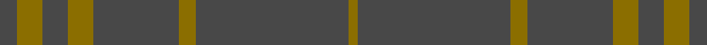

This page is one **sett** — a single exact thread-count. It belongs to the [tartan](/setts/dt2y3dt3y3dt10y2dt18y1/)
(the same proportion at any scale), whose colour order is pattern [BGBGBGBG](/stripes/bgbgbgbg/).

Sourced from house-of-tartan.  It is a [8 stripe tartan](/stripes/stripes8/).

Original link http://www.house-of-tartan.scotland.net/house/TartanViewjs.asp?colr=Def&tnam=6822

## Provenance

Earliest known date: 2005 For a new House of Edgar Collection in wedding gray.

## Thread count
DT/8 Y12 DT12 Y12 DT40 Y8 DT72 Y/4

One full sett is **324 threads**.

## Palette
<table><thead><tr><th>Colour</th><th>Shade</th><th>OKLCh</th></tr></thead><tbody><tr><td>O</td><td><code style="background-color:#888888;">#888888</code> <small style="color:#888">#888888</small></td><td><small style="color:#888">oklch(62.7% 0.000 89.9)</small></td></tr><tr><td>DT</td><td><code style="background-color:#484848;">#484848</code> <small style="color:#888">#484848</small></td><td><small style="color:#888">oklch(40.2% 0.000 89.9)</small></td></tr><tr><td>Y</td><td><code style="background-color:#8B6E00;">#8B6E00</code> <small style="color:#888">#8B6E00</small></td><td><small style="color:#888">oklch(55.1% 0.113 90.4)</small></td></tr></tbody></table>

# Sample pattern

## Nearest tartan variants

The nearest existing variants by ΔTartan distance, with this cloth at the top so the swatches line up against it.

ΔTartan

Threads

Variant

Sett

—

324

<a href="/variants/s8/dt2y3dt3y3dt10y2dt18y1~x4~dt1600000/">Hebridean Cairn Fashion Tartan</a>

<a href="/ttd/edit/#slug=dy6n2dy29n29dy2n6~x2&amp;base=dt2y3dt3y3dt10y2dt18y1~x4~dt1600000" title="compare in the TTD">2.99</a>

272

<a href="/variants/s6/dy6n2dy29n29dy2n6~x2/">Harmony 12 #2</a>

## Neighbour map

Every grey dot is one of 13620 variants placed by the first two principal components of the ΔTartan feature space (42% of its variance). Red is this tartan; blue dots are its nearest — click one to open its page.

<svg viewBox="0 0 640 380" role="img" style="max-width:100%;height:auto;border:1px solid #e0e0e0;border-radius:4px;display:block" xmlns="http://www.w3.org/2000/svg"><image href="/nn/cloud.v1.png" width="640" height="380"/><a href="/variants/s6/dy6n2dy29n29dy2n6~x2/"><circle cx="545.6" cy="283.4" r="4" fill="#3465a4"><title>Harmony 12 #2</title></circle></a><circle cx="626.0" cy="271.6" r="5" fill="#c00000"/><text x="320" y="376" text-anchor="middle" font-size="11" fill="#999">ground</text><text x="11" y="190" text-anchor="middle" font-size="11" fill="#999" transform="rotate(-90 11 190)">complexity</text></svg>

ID: /variants/s8/dt2y3dt3y3dt10y2dt18y1~x4~dt1600000/
