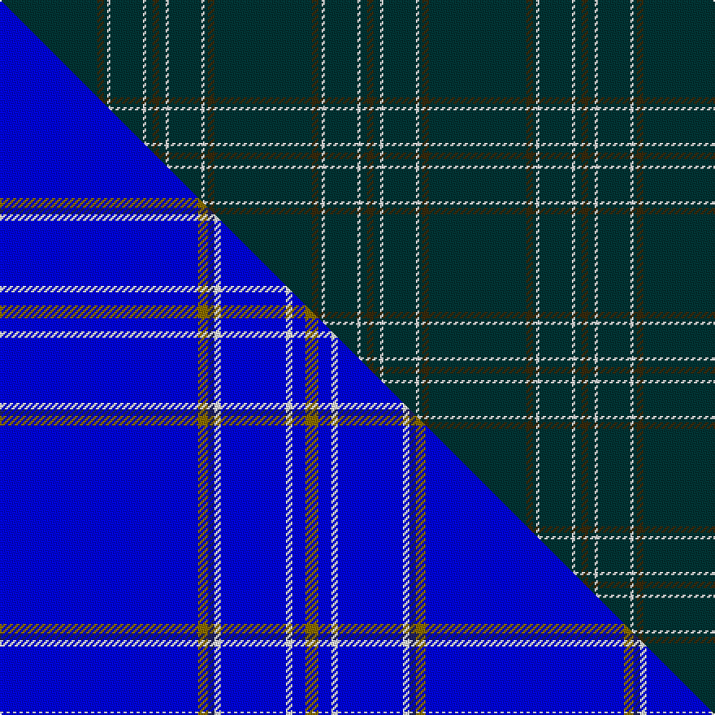

This is one **variant** — a specific cloth: this exact thread count and colourway, with its own
provenance below. It is one weaving of the [sett](/setts/dt30dy2dt1w1dt10w1dt2dy2/) (the scale-free proportion — the
same cloth at any scale or shade), whose colour order is pattern [BGBWBWBG](/stripes/bgbwbwbg/).

Part of the [Royal Warrant Holders](/tartans/r/ro/royal-warrant-holders/) tartan — the named design grouping this sett with its other cloths.

Sourced from tartans-authority.  It is a [8 stripe tartan](/stripes/stripes8/).

Original link [https://www.tartanregister.gov.uk/tartanDetails.aspx?ref=3981](https://www.tartanregister.gov.uk/tartanDetails.aspx?ref=3981)

Dataset <small>— provenance for this record, inherited from the source manifest</small>

<dl class="dataset-prov">
<dt>source</dt><dd><a href="/sources/tartans-authority/">Scottish Tartans Authority</a></dd>
<dt>data captured from</dt><dd><a href="https://github.com/thetartan/tartan-database/blob/master/data/tartans-authority/data.csv">https://github.com/thetartan/tartan-database/blob/master/data/tartans-authority/data.csv</a></dd>
<dt>data date</dt><dd>pre 2002 <small>(this record)</small></dd>
<dt>licence</dt><dd><a href="https://creativecommons.org/licenses/by-nc-nd/4.0/">CC BY-NC-ND 4.0</a></dd>
</dl>

Capture chain <small>— the hands this data passed through, oldest first; each capture carries its own licence</small>

<ol class="capture-chain">
<li><a href="https://www.tartansauthority.com/">Scottish Tartans Authority</a> <small>the heritage body's archive — its tartan-ferret record browser is retired (links repaired to the SRT, above)</small></li>
<li><a href="https://github.com/thetartan/tartan-database">thetartan/tartan-database</a> <small>2016-2017</small> · <a href="https://creativecommons.org/licenses/by-nc-nd/4.0/">CC BY-NC-ND 4.0</a> <small>Levko Kravets's frozen compilation — the capture we vendored, and where its CC licence text came from</small></li>
<li>this dictionary <small>captured 2026-06-10 · commit 5bf86c7566</small> <small>each re-capture is a git commit to data/sources</small></li>
</ol>

## Register references

External register numbers recorded for this tartan.

- Scottish Tartans Authority (ITI): 3981

## Thread count
DT/60 DY4 DT2 W2 DT20 W2 DT4 DY/4

One full sett is **132 threads**.

## Palette
<table><thead><tr><th>Colour</th><th>Shade</th><th>OKLCh</th></tr></thead><tbody><tr><td>DT</td><td><code style="background-color:#023535;">#023535</code> <small style="color:#888">#023535</small></td><td><small style="color:#888">oklch(29.8% 0.050 194.8)</small></td></tr><tr><td>W</td><td><code style="background-color:#F7F7F7;">#F7F7F7</code> <small style="color:#888">#F7F7F7</small></td><td><small style="color:#888">oklch(97.6% 0.000 89.9)</small></td></tr><tr><td>DY</td><td><code style="background-color:#3A2B0D;">#3A2B0D</code> <small style="color:#888">#3A2B0D</small></td><td><small style="color:#888">oklch(30.0% 0.049 82.0)</small></td></tr></tbody></table>

# Sample pattern

## Compared to the master

This cloth is one sett of its design; the master sett (the exemplar the design is anchored on) is below for comparison.

Its **ΔTartan distance** from the master is **11.97** — the same measure the nearest-tartans table ranks by (0 is identical; a re-scale of the same cloth is near 0, a recolour or a different proportion further).

<figure class="master-compare" style="margin:0">

this sett
master sett ★

<figcaption style="color:#888;font-size:smaller">One weave of this sett against the <a href="/setts/b61y3db2w2b20w2b4y4/">master sett ★</a>, split on the diagonal: a shared proportion runs seamlessly across it with only the shades shifting; a different proportion breaks on it.</figcaption>
</figure>

## Nearest tartan variants

The nearest existing variants by ΔTartan distance, with this cloth at the top so the swatches line up against it.

ΔTartan

Threads

Variant

Sett

—

132

<a href="/variants/s8/dt30dy2dt1w1dt10w1dt2dy2~x2/">Royal Warrant Holders (Corporate)</a>

<a href="/ttd/edit/#slug=g2dy2g15dy1w1g15dy2g2~x2&amp;base=dt30dy2dt1w1dt10w1dt2dy2~x2" title="compare in the TTD">1.49</a>

152

<a href="/variants/s8/g2dy2g15dy1w1g15dy2g2~x2/">Bannockbane Hunting Trade Tartan</a>

<a href="/ttd/edit/#slug=dg2dy2dg15dy1w1dg15dy2dg2~x2&amp;base=dt30dy2dt1w1dt10w1dt2dy2~x2" title="compare in the TTD">1.49</a>

152

<a href="/variants/s8/dg2dy2dg15dy1w1dg15dy2dg2~x2/">Bannockbane Hunting</a>

<a href="/ttd/edit/#slug=r2g2r2g4y3dy45g2dy3g2~x2&amp;base=dt30dy2dt1w1dt10w1dt2dy2~x2" title="compare in the TTD">1.70</a>

252

<a href="/variants/s9/r2g2r2g4y3dy45g2dy3g2~x2/">Welsh Stanley–Gpa (Personal)</a>

<a href="/ttd/edit/#slug=r2g2r2g4ly3dy45g2dy3g2~x2&amp;base=dt30dy2dt1w1dt10w1dt2dy2~x2" title="compare in the TTD">1.70</a>

252

<a href="/variants/s9/r2g2r2g4ly3dy45g2dy3g2~x2/">Welsh, Stanly-Gpa (Personal)</a>

<a href="/ttd/edit/#slug=g16dg1y4dg41y1dg6gi2dg2~x2~g2203152-gi2408144&amp;base=dt30dy2dt1w1dt10w1dt2dy2~x2" title="compare in the TTD">1.97</a>

256

<a href="/variants/s8/g16dg1y4dg41y1dg6gi2dg2~x2~g2203152-gi2408144/">Semper</a>

<a href="/ttd/edit/#slug=dt40dy10dt8r20dt100w5&amp;base=dt30dy2dt1w1dt10w1dt2dy2~x2" title="compare in the TTD">2.18</a>

321

<a href="/variants/s6/dt40dy10dt8r20dt100w5/">East of Scotland Tartan Army</a>

<a href="/ttd/edit/#slug=dt4k2dt16k2dt16k1~x4&amp;base=dt30dy2dt1w1dt10w1dt2dy2~x2" title="compare in the TTD">2.22</a>

308

<a href="/variants/s6/dt4k2dt16k2dt16k1~x4/">Ben Dubh (The Black Mount)</a>

<a href="/ttd/edit/#slug=dg30dr2dg8dr1dg5w2&amp;base=dt30dy2dt1w1dt10w1dt2dy2~x2" title="compare in the TTD">2.38</a>

64

<a href="/variants/s6/dg30dr2dg8dr1dg5w2/">Dewi Sant</a>

<a href="/ttd/edit/#slug=dg60r2dg8r1dg5w2~w4000000&amp;base=dt30dy2dt1w1dt10w1dt2dy2~x2" title="compare in the TTD">2.82</a>

94

<a href="/variants/s6/dg60r2dg8r1dg5w2~w4000000/">St. David's Welsh District Tartan</a>

<a href="/ttd/edit/#slug=dg60r2dg8r1dg5w2&amp;base=dt30dy2dt1w1dt10w1dt2dy2~x2" title="compare in the TTD">2.82</a>

94

<a href="/variants/s6/dg60r2dg8r1dg5w2/">St. David's (District)</a>

## Neighbour map

Every grey dot is one of 13621 variants placed by the first two principal components of the ΔTartan feature space (42% of its variance). Red is this tartan; blue dots are its nearest — click one to open its page.

<svg viewBox="0 0 640 380" role="img" style="max-width:100%;height:auto;border:1px solid #e0e0e0;border-radius:4px;display:block" xmlns="http://www.w3.org/2000/svg"><image href="/nn/cloud.v1.png" width="640" height="380"/><a href="/variants/s8/g2dy2g15dy1w1g15dy2g2~x2/"><circle cx="626.0" cy="217.8" r="4" fill="#3465a4"><title>Bannockbane Hunting Trade Tartan</title></circle></a><a href="/variants/s8/dg2dy2dg15dy1w1dg15dy2dg2~x2/"><circle cx="626.0" cy="243.1" r="4" fill="#3465a4"><title>Bannockbane Hunting</title></circle></a><a href="/variants/s9/r2g2r2g4y3dy45g2dy3g2~x2/"><circle cx="546.2" cy="128.4" r="4" fill="#3465a4"><title>Welsh Stanley–Gpa (Personal)</title></circle></a><a href="/variants/s9/r2g2r2g4ly3dy45g2dy3g2~x2/"><circle cx="513.2" cy="117.5" r="4" fill="#3465a4"><title>Welsh, Stanly-Gpa (Personal)</title></circle></a><a href="/variants/s8/g16dg1y4dg41y1dg6gi2dg2~x2~g2203152-gi2408144/"><circle cx="564.5" cy="161.6" r="4" fill="#3465a4"><title>Semper</title></circle></a><a href="/variants/s6/dt40dy10dt8r20dt100w5/"><circle cx="550.3" cy="178.4" r="4" fill="#3465a4"><title>East of Scotland Tartan Army</title></circle></a><a href="/variants/s6/dt4k2dt16k2dt16k1~x4/"><circle cx="626.0" cy="231.2" r="4" fill="#3465a4"><title>Ben Dubh (The Black Mount)</title></circle></a><a href="/variants/s6/dg30dr2dg8dr1dg5w2/"><circle cx="626.0" cy="183.2" r="4" fill="#3465a4"><title>Dewi Sant</title></circle></a><a href="/variants/s6/dg60r2dg8r1dg5w2~w4000000/"><circle cx="626.0" cy="129.1" r="4" fill="#3465a4"><title>St. David's Welsh District Tartan</title></circle></a><a href="/variants/s6/dg60r2dg8r1dg5w2/"><circle cx="626.0" cy="129.8" r="4" fill="#3465a4"><title>St. David's (District)</title></circle></a><circle cx="626.0" cy="165.5" r="5" fill="#c00000"/><text x="320" y="376" text-anchor="middle" font-size="11" fill="#999">ground</text><text x="11" y="190" text-anchor="middle" font-size="11" fill="#999" transform="rotate(-90 11 190)">complexity</text></svg>

ID: /variants/s8/dt30dy2dt1w1dt10w1dt2dy2~x2/
