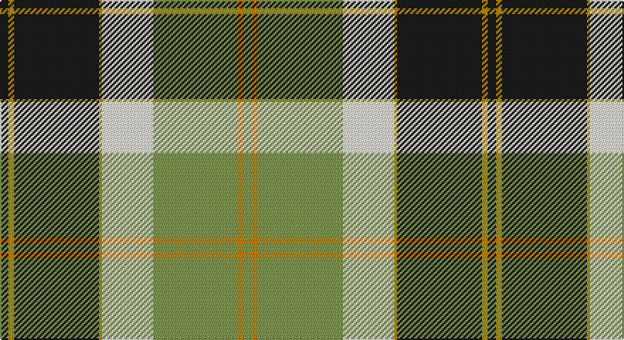

This page is one **sett** — a single exact thread-count. It belongs to the [tartan](/setts/dt3loi2dt30loi1w18lg30lo2lg3/)
(the same proportion at any scale), whose colour order is pattern [BYBYWYYY](/stripes/bybywyyy/).

Part of the [Bannockbane](/tartans/bannockbane/) tartan — the named design grouping this sett with its other cloths.

Sourced from register-of-tartans.  It is a [8 stripe tartan](/stripes/stripes8/).

Original link https://www.tartanregister.gov.uk/tartanDetails.aspx?ref=4873

## Also known as

This cloth is also recorded under:

- Bannockbane Blue
- Bannockbane Blue #1
- Bannockbane Blue #2
- Bannockbane Blue #3
- Bannockbane Brown #2
- Bannockbane Green
- Bannockbane Grey #1
- Bannockbane Grey #2
- Bannockbane Grey #3
- Bannockbane, Blue
- Bannockbane, Green
- Bannockbane, Grey
- Bannockbane, Light Tan

## Register references

External register numbers recorded for this tartan.

- Scottish Register of Tartans: [4873](https://www.tartanregister.gov.uk/tartanDetails.aspx?ref=4873)
- Scottish Tartans Authority (ITI): 3656

## Thread count
K/6 DY4 K60 DY2 LY36 LG60 O4 LG/6

One full sett is **344 threads**.

## Palette

Palette: <strong>Tartan Register</strong> <small style="color:#888">(3 of 6 colours)</small>
<table><thead><tr><th>Colour</th><th>Threads</th><th>Shade</th><th>Base</th><th>OKLCh</th></tr></thead><tbody><tr><td>K/</td><td style="text-align:right;font-variant-numeric:tabular-nums">6</td><td><code style="background-color:#1C1C1C;">#1C1C1C</code> <small style="color:#888">#1C1C1C</small></td><td>B <code style="background-color:#2A418A;">#2A418A</code></td><td><small style="color:#888">oklch(22.6% 0.000 89.9)</small></td></tr><tr><td>DY</td><td style="text-align:right;font-variant-numeric:tabular-nums">4</td><td><code style="background-color:#BC8C00;">#BC8C00</code> <small style="color:#888">#BC8C00</small></td><td>Y <code style="background-color:#F2BF00;">#F2BF00</code></td><td><small style="color:#888">oklch(66.8% 0.137 84.1)</small></td></tr><tr><td>K</td><td style="text-align:right;font-variant-numeric:tabular-nums">60</td><td><code style="background-color:#1C1C1C;">#1C1C1C</code> <small style="color:#888">#1C1C1C</small></td><td>B <code style="background-color:#2A418A;">#2A418A</code></td><td><small style="color:#888">oklch(22.6% 0.000 89.9)</small></td></tr><tr><td>DY</td><td style="text-align:right;font-variant-numeric:tabular-nums">2</td><td><code style="background-color:#BC8C00;">#BC8C00</code> <small style="color:#888">#BC8C00</small></td><td>Y <code style="background-color:#F2BF00;">#F2BF00</code></td><td><small style="color:#888">oklch(66.8% 0.137 84.1)</small></td></tr><tr><td>LY</td><td style="text-align:right;font-variant-numeric:tabular-nums">36</td><td><code style="background-color:#ECECD8;">#ECECD8</code> <small style="color:#888">#ECECD8</small></td><td>W <code style="background-color:#F7F7F7;">#F7F7F7</code></td><td><small style="color:#888">oklch(93.8% 0.026 106.9)</small></td></tr><tr><td>LG</td><td style="text-align:right;font-variant-numeric:tabular-nums">60</td><td><code style="background-color:#809850;">#809850</code> <small style="color:#888">#809850</small></td><td>Y <code style="background-color:#F2BF00;">#F2BF00</code></td><td><small style="color:#888">oklch(64.4% 0.102 124.3)</small></td></tr><tr><td>O</td><td style="text-align:right;font-variant-numeric:tabular-nums">4</td><td><code style="background-color:#D87C00;">#D87C00</code> <small style="color:#888">#D87C00</small></td><td>Y <code style="background-color:#F2BF00;">#F2BF00</code></td><td><small style="color:#888">oklch(67.3% 0.155 61.8)</small></td></tr><tr><td>LG/</td><td style="text-align:right;font-variant-numeric:tabular-nums">6</td><td><code style="background-color:#809850;">#809850</code> <small style="color:#888">#809850</small></td><td>Y <code style="background-color:#F2BF00;">#F2BF00</code></td><td><small style="color:#888">oklch(64.4% 0.102 124.3)</small></td></tr></tbody></table>

# Sample pattern

## Compared to the master

This cloth is one sett of its design; the master sett (the exemplar the design is anchored on) is below for comparison.

<figure style="margin:0"><figcaption style="color:#888;font-size:smaller">this sett</figcaption></figure>
<figure style="margin:0"><figcaption style="color:#888;font-size:smaller"><a href="/setts/o2dy2o15dy2w10lo15dy2lo2/">master sett →</a></figcaption></figure>

## Nearest tartans

The nearest existing variants by ΔTartan distance, with this tartan at the top so the swatches line up against it.

ΔTartan

Tartan

Sett

—

<a href="/ttd/edit/#slug=dt3loi2dt30loi1w18lg30lo2lg3~x2">Bannockbane Green</a> <a class="nn-out" href="/variants/s8/dt3loi2dt30loi1w18lg30lo2lg3~x2/" title="open its dictionary page">↗</a>

0.88

<a href="/ttd/edit/#slug=r6g2w21ly2k8ly2g32w1k3~x2&amp;base=dt3loi2dt30loi1w18lg30lo2lg3~x2">Fiander, Julian (Personal)</a> <a class="nn-out" href="/variants/s9/r6g2w21ly2k8ly2g32w1k3~x2/" title="open its dictionary page">↗</a>

1.08

<a href="/ttd/edit/#slug=k9n2lo2k2lb18lo2k2lb1k19lo33r2~x2&amp;base=dt3loi2dt30loi1w18lg30lo2lg3~x2">Pride of Scotland Gold</a> <a class="nn-out" href="/variants/s11/k9n2lo2k2lb18lo2k2lb1k19lo33r2~x2/" title="open its dictionary page">↗</a>

1.12

<a href="/ttd/edit/#slug=r8lo44k32w2o52k7o7w3&amp;base=dt3loi2dt30loi1w18lg30lo2lg3~x2">Golden Wedding (Fashion)</a> <a class="nn-out" href="/variants/s8/r8lo44k32w2o52k7o7w3/" title="open its dictionary page">↗</a>

1.14

<a href="/ttd/edit/#slug=r6dg2w21dg2lo2k8lo2dg32w1k3~x2&amp;base=dt3loi2dt30loi1w18lg30lo2lg3~x2">Fiander, Julian (Personal)</a> <a class="nn-out" href="/variants/s10/r6dg2w21dg2lo2k8lo2dg32w1k3~x2/" title="open its dictionary page">↗</a>

1.15

<a href="/ttd/edit/#slug=g22r2g4r2g4r18w24r1lo3~x2&amp;base=dt3loi2dt30loi1w18lg30lo2lg3~x2">Prince Edward Island, Dress</a> <a class="nn-out" href="/variants/s9/g22r2g4r2g4r18w24r1lo3~x2/" title="open its dictionary page">↗</a>

1.24

<a href="/ttd/edit/#slug=dg4dr14dg14o6dr1w30dg2dr1~x2&amp;base=dt3loi2dt30loi1w18lg30lo2lg3~x2">British Columbia #2</a> <a class="nn-out" href="/variants/s8/dg4dr14dg14o6dr1w30dg2dr1~x2/" title="open its dictionary page">↗</a>

1.24

<a href="/ttd/edit/#slug=dg4do10dg10o6do1w26dg2do1~x4&amp;base=dt3loi2dt30loi1w18lg30lo2lg3~x2">Dogwood</a> <a class="nn-out" href="/variants/s8/dg4do10dg10o6do1w26dg2do1~x4/" title="open its dictionary page">↗</a>

1.26

<a href="/ttd/edit/#slug=lo3dy12do14r4do1w26do2dy1~x2&amp;base=dt3loi2dt30loi1w18lg30lo2lg3~x2">Turnberry</a> <a class="nn-out" href="/variants/s8/lo3dy12do14r4do1w26do2dy1~x2/" title="open its dictionary page">↗</a>

1.30

<a href="/ttd/edit/#slug=lg31k18dg13r3dg13k1ly3~x2&amp;base=dt3loi2dt30loi1w18lg30lo2lg3~x2">Big Sur MacLaren (Personal)</a> <a class="nn-out" href="/variants/s7/lg31k18dg13r3dg13k1ly3~x2/" title="open its dictionary page">↗</a>

1.31

<a href="/ttd/edit/#slug=k3g2k21w11g1y21g2y3~x2&amp;base=dt3loi2dt30loi1w18lg30lo2lg3~x2">Dalveen (Fashion)</a> <a class="nn-out" href="/variants/s8/k3g2k21w11g1y21g2y3~x2/" title="open its dictionary page">↗</a>

## Neighbour map

Every grey dot is one of 14360 variants placed by the first two principal components of the ΔTartan feature space (44% of its variance). Red is this tartan; blue dots are its nearest — click one to open its page.

<svg viewBox="0 0 640 380" role="img" style="max-width:100%;height:auto;border:1px solid #e0e0e0;border-radius:4px;display:block" xmlns="http://www.w3.org/2000/svg"><image href="/nn/cloud.v1.png" width="640" height="380"/><a href="/variants/s9/r6g2w21ly2k8ly2g32w1k3~x2/"><circle cx="216.3" cy="87.0" r="4" fill="#3465a4"><title>Fiander, Julian (Personal)</title></circle></a><a href="/variants/s11/k9n2lo2k2lb18lo2k2lb1k19lo33r2~x2/"><circle cx="226.5" cy="81.0" r="4" fill="#3465a4"><title>Pride of Scotland Gold</title></circle></a><a href="/variants/s8/r8lo44k32w2o52k7o7w3/"><circle cx="207.6" cy="124.2" r="4" fill="#3465a4"><title>Golden Wedding (Fashion)</title></circle></a><a href="/variants/s10/r6dg2w21dg2lo2k8lo2dg32w1k3~x2/"><circle cx="227.7" cy="80.7" r="4" fill="#3465a4"><title>Fiander, Julian (Personal)</title></circle></a><a href="/variants/s9/g22r2g4r2g4r18w24r1lo3~x2/"><circle cx="213.4" cy="127.4" r="4" fill="#3465a4"><title>Prince Edward Island, Dress</title></circle></a><a href="/variants/s8/dg4dr14dg14o6dr1w30dg2dr1~x2/"><circle cx="214.5" cy="111.5" r="4" fill="#3465a4"><title>British Columbia #2</title></circle></a><a href="/variants/s8/dg4do10dg10o6do1w26dg2do1~x4/"><circle cx="216.7" cy="118.6" r="4" fill="#3465a4"><title>Dogwood</title></circle></a><a href="/variants/s8/lo3dy12do14r4do1w26do2dy1~x2/"><circle cx="195.7" cy="98.0" r="4" fill="#3465a4"><title>Turnberry</title></circle></a><a href="/variants/s7/lg31k18dg13r3dg13k1ly3~x2/"><circle cx="197.8" cy="140.3" r="4" fill="#3465a4"><title>Big Sur MacLaren (Personal)</title></circle></a><a href="/variants/s8/k3g2k21w11g1y21g2y3~x2/"><circle cx="197.7" cy="131.4" r="4" fill="#3465a4"><title>Dalveen (Fashion)</title></circle></a><circle cx="202.2" cy="105.3" r="5" fill="#c00000"/></svg>

ID: /variants/s8/dt3loi2dt30loi1w18lg30lo2lg3~x2/
