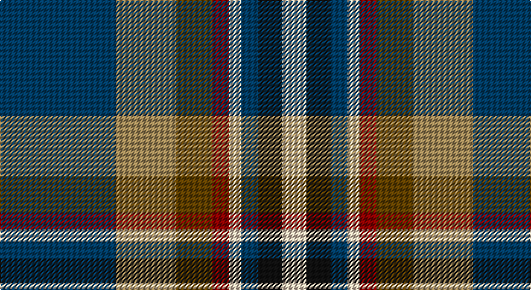

This page is one **sett** — a single exact thread-count. It belongs to the [tartan](/setts/dt48lo25dy15r7lb5dt7k10lb10/)
(the same proportion at any scale), whose colour order is pattern [BYGRWBKW](/stripes/bygrwbkw/).

Sourced from tartans-authority.  It is a [8 stripe tartan](/stripes/stripes8/).

Original link http://www.tartansauthority.com/tartan-ferret/display/8658/

## Register references

External register numbers recorded for this tartan.

- Scottish Register of Tartans: [8658](https://www.tartanregister.gov.uk/tartanDetails?ref=8658)
- Scottish Tartans Authority (ITI): 8658

## Thread count
DB/96 LT50 T30 DR14 LR10 DB14 K20 LR/20

One full sett is **392 threads**.

## Palette

Palette: <strong>Tartan Register</strong>
<table><thead><tr><th>Colour</th><th>Threads</th><th>Shade</th><th>Base</th><th>OKLCh</th></tr></thead><tbody><tr><td>DB/</td><td style="text-align:right;font-variant-numeric:tabular-nums">96</td><td><code style="background-color:#003C64;">#003C64</code> <small style="color:#888">#003C64</small></td><td>B <code style="background-color:#2A418A;">#2A418A</code></td><td><small style="color:#888">oklch(34.5% 0.089 246.0)</small></td></tr><tr><td>LT</td><td style="text-align:right;font-variant-numeric:tabular-nums">50</td><td><code style="background-color:#A08858;">#A08858</code> <small style="color:#888">#A08858</small></td><td>Y <code style="background-color:#F2BF00;">#F2BF00</code></td><td><small style="color:#888">oklch(63.7% 0.071 84.0)</small></td></tr><tr><td>T</td><td style="text-align:right;font-variant-numeric:tabular-nums">30</td><td><code style="background-color:#604000;">#604000</code> <small style="color:#888">#604000</small></td><td>G <code style="background-color:#006100;">#006100</code></td><td><small style="color:#888">oklch(39.8% 0.083 76.8)</small></td></tr><tr><td>DR</td><td style="text-align:right;font-variant-numeric:tabular-nums">14</td><td><code style="background-color:#880000;">#880000</code> <small style="color:#888">#880000</small></td><td>R <code style="background-color:#CC0000;">#CC0000</code></td><td><small style="color:#888">oklch(39.4% 0.162 29.2)</small></td></tr><tr><td>LR</td><td style="text-align:right;font-variant-numeric:tabular-nums">10</td><td><code style="background-color:#E8CCB8;">#E8CCB8</code> <small style="color:#888">#E8CCB8</small></td><td>W <code style="background-color:#F7F7F7;">#F7F7F7</code></td><td><small style="color:#888">oklch(86.3% 0.042 57.7)</small></td></tr><tr><td>DB</td><td style="text-align:right;font-variant-numeric:tabular-nums">14</td><td><code style="background-color:#003C64;">#003C64</code> <small style="color:#888">#003C64</small></td><td>B <code style="background-color:#2A418A;">#2A418A</code></td><td><small style="color:#888">oklch(34.5% 0.089 246.0)</small></td></tr><tr><td>K</td><td style="text-align:right;font-variant-numeric:tabular-nums">20</td><td><code style="background-color:#101010;">#101010</code> <small style="color:#888">#101010</small></td><td>K <code style="background-color:#000000;">#000000</code></td><td><small style="color:#888">oklch(17.3% 0.000 89.9)</small></td></tr><tr><td>LR/</td><td style="text-align:right;font-variant-numeric:tabular-nums">20</td><td><code style="background-color:#E8CCB8;">#E8CCB8</code> <small style="color:#888">#E8CCB8</small></td><td>W <code style="background-color:#F7F7F7;">#F7F7F7</code></td><td><small style="color:#888">oklch(86.3% 0.042 57.7)</small></td></tr></tbody></table>

# Sample pattern

## Nearest tartans

The nearest existing variants by ΔTartan distance, with this tartan at the top so the swatches line up against it.

ΔTartan

Tartan

Sett

—

<a href="/ttd/edit/#slug=dt48lo25dy15r7lb5dt7k10lb10~x2">State Seal of Utah (Fashion)</a> <a class="nn-out" href="/variants/s8/dt48lo25dy15r7lb5dt7k10lb10~x2/" title="open its dictionary page">↗</a>

0.85

<a href="/ttd/edit/#slug=r5w1db10g10w1ly1g2t2w1~x2&amp;base=dt48lo25dy15r7lb5dt7k10lb10~x2">Mary, Queen of Scots</a> <a class="nn-out" href="/variants/s9/r5w1db10g10w1ly1g2t2w1~x2/" title="open its dictionary page">↗</a>

0.88

<a href="/ttd/edit/#slug=r2ly2db9dy1dg9r1w1~x2&amp;base=dt48lo25dy15r7lb5dt7k10lb10~x2">Unidentified (ex Tony Murray)</a> <a class="nn-out" href="/variants/s7/r2ly2db9dy1dg9r1w1~x2/" title="open its dictionary page">↗</a>

0.90

<a href="/ttd/edit/#slug=r2k1lo2g3lo4g3db12k1lb2~x4&amp;base=dt48lo25dy15r7lb5dt7k10lb10~x2">Federated Women's Institutes of</a> <a class="nn-out" href="/variants/s9/r2k1lo2g3lo4g3db12k1lb2~x4/" title="open its dictionary page">↗</a>

0.94

<a href="/ttd/edit/#slug=w1db6g1db1g1db1gi4m5lo1~x4&amp;base=dt48lo25dy15r7lb5dt7k10lb10~x2">McLion</a> <a class="nn-out" href="/variants/s9/w1db6g1db1g1db1gi4m5lo1~x4/" title="open its dictionary page">↗</a>

0.95

<a href="/ttd/edit/#slug=m4db2t7db20k7g10ly4~x2&amp;base=dt48lo25dy15r7lb5dt7k10lb10~x2">Renfrewshire District Tartan</a> <a class="nn-out" href="/variants/s7/m4db2t7db20k7g10ly4~x2/" title="open its dictionary page">↗</a>

0.95

<a href="/ttd/edit/#slug=ly4g22r3k17r3db37w3~x2&amp;base=dt48lo25dy15r7lb5dt7k10lb10~x2">Souza Nery (Personal)</a> <a class="nn-out" href="/variants/s7/ly4g22r3k17r3db37w3~x2/" title="open its dictionary page">↗</a>

0.95

<a href="/ttd/edit/#slug=k3r3g21ri8r3ri4k3db26w3~x2&amp;base=dt48lo25dy15r7lb5dt7k10lb10~x2">Dunedin</a> <a class="nn-out" href="/variants/s9/k3r3g21ri8r3ri4k3db26w3~x2/" title="open its dictionary page">↗</a>

0.96

<a href="/ttd/edit/#slug=db2r1db10w1dy4g8ly1g2~x4&amp;base=dt48lo25dy15r7lb5dt7k10lb10~x2">Ayrshire District Tartan</a> <a class="nn-out" href="/variants/s8/db2r1db10w1dy4g8ly1g2~x4/" title="open its dictionary page">↗</a>

0.98

<a href="/ttd/edit/#slug=r16ly2dy7ly2b24k2g2~x2&amp;base=dt48lo25dy15r7lb5dt7k10lb10~x2">Traill Clan/Family Weavers Tartan</a> <a class="nn-out" href="/variants/s7/r16ly2dy7ly2b24k2g2~x2/" title="open its dictionary page">↗</a>

0.98

<a href="/ttd/edit/#slug=t15k10dt30o11w3lg5~x2&amp;base=dt48lo25dy15r7lb5dt7k10lb10~x2">McHale, Barry</a> <a class="nn-out" href="/variants/s6/t15k10dt30o11w3lg5~x2/" title="open its dictionary page">↗</a>

## Neighbour map

Every grey dot is one of 14360 variants placed by the first two principal components of the ΔTartan feature space (44% of its variance). Red is this tartan; blue dots are its nearest — click one to open its page.

<svg viewBox="0 0 640 380" role="img" style="max-width:100%;height:auto;border:1px solid #e0e0e0;border-radius:4px;display:block" xmlns="http://www.w3.org/2000/svg"><image href="/nn/cloud.v1.png" width="640" height="380"/><a href="/variants/s9/r5w1db10g10w1ly1g2t2w1~x2/"><circle cx="135.9" cy="143.6" r="4" fill="#3465a4"><title>Mary, Queen of Scots</title></circle></a><a href="/variants/s7/r2ly2db9dy1dg9r1w1~x2/"><circle cx="148.3" cy="162.9" r="4" fill="#3465a4"><title>Unidentified (ex Tony Murray)</title></circle></a><a href="/variants/s9/r2k1lo2g3lo4g3db12k1lb2~x4/"><circle cx="141.6" cy="137.7" r="4" fill="#3465a4"><title>Federated Women's Institutes of</title></circle></a><a href="/variants/s9/w1db6g1db1g1db1gi4m5lo1~x4/"><circle cx="120.4" cy="178.2" r="4" fill="#3465a4"><title>McLion</title></circle></a><a href="/variants/s7/m4db2t7db20k7g10ly4~x2/"><circle cx="139.0" cy="184.8" r="4" fill="#3465a4"><title>Renfrewshire District Tartan</title></circle></a><a href="/variants/s7/ly4g22r3k17r3db37w3~x2/"><circle cx="176.0" cy="156.3" r="4" fill="#3465a4"><title>Souza Nery (Personal)</title></circle></a><a href="/variants/s9/k3r3g21ri8r3ri4k3db26w3~x2/"><circle cx="128.4" cy="147.8" r="4" fill="#3465a4"><title>Dunedin</title></circle></a><a href="/variants/s8/db2r1db10w1dy4g8ly1g2~x4/"><circle cx="190.9" cy="173.6" r="4" fill="#3465a4"><title>Ayrshire District Tartan</title></circle></a><a href="/variants/s7/r16ly2dy7ly2b24k2g2~x2/"><circle cx="211.7" cy="152.9" r="4" fill="#3465a4"><title>Traill Clan/Family Weavers Tartan</title></circle></a><a href="/variants/s6/t15k10dt30o11w3lg5~x2/"><circle cx="154.3" cy="193.6" r="4" fill="#3465a4"><title>McHale, Barry</title></circle></a><circle cx="157.5" cy="163.9" r="5" fill="#c00000"/></svg>

ID: /variants/s8/dt48lo25dy15r7lb5dt7k10lb10~x2/
