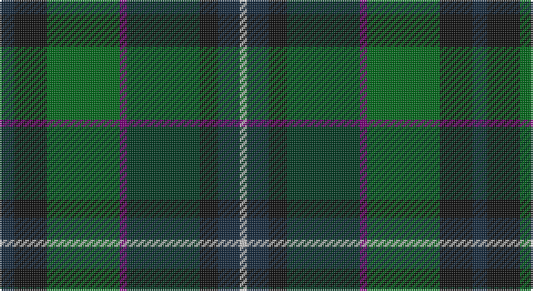

This page is one **sett** — a single exact thread-count. It belongs to the [tartan](/setts/dt4k9g20dp2dg20k5dt6lb2/)
(the same proportion at any scale), whose colour order is pattern [BKGBGKBW](/stripes/bkgbgkbw/).

Sourced from register-of-tartans.  It is a [8 stripe tartan](/stripes/stripes8/).

Original link https://www.tartanregister.gov.uk/tartanDetails.aspx?ref=2114

2 attestations — the source records this cloth was collapsed from (oldest owns this page)

<ul>
<li>01/01/2003 — Linden (register-of-tartans, <a href="https://www.tartanregister.gov.uk/tartanDetails.aspx?ref=2114">record</a>)</li>
<li>Jan 2003 — Linden (Name) (tartans-authority, <a href="http://www.tartansauthority.com/tartan-ferret/display/5772/">record</a>)</li>
</ul>

## Register references

External register numbers recorded for this tartan.

- Scottish Register of Tartans: [2114](https://www.tartanregister.gov.uk/tartanDetails.aspx?ref=2114)
- Scottish Tartans Authority (ITI): 5772

## Thread count
DN/8 K18 G40 P4 DG40 K10 DN12 N/4

One full sett is **260 threads**.

## Palette

Palette: <strong>Tartan Register</strong>
<table><thead><tr><th>Colour</th><th>Threads</th><th>Shade</th><th>Base</th><th>OKLCh</th></tr></thead><tbody><tr><td>DN/</td><td style="text-align:right;font-variant-numeric:tabular-nums">8</td><td><code style="background-color:#14283C;">#14283C</code> <small style="color:#888">#14283C</small></td><td>B <code style="background-color:#2A418A;">#2A418A</code></td><td><small style="color:#888">oklch(27.1% 0.046 249.9)</small></td></tr><tr><td>K</td><td style="text-align:right;font-variant-numeric:tabular-nums">18</td><td><code style="background-color:#101010;">#101010</code> <small style="color:#888">#101010</small></td><td>K <code style="background-color:#000000;">#000000</code></td><td><small style="color:#888">oklch(17.3% 0.000 89.9)</small></td></tr><tr><td>G</td><td style="text-align:right;font-variant-numeric:tabular-nums">40</td><td><code style="background-color:#006818;">#006818</code> <small style="color:#888">#006818</small></td><td>G <code style="background-color:#006100;">#006100</code></td><td><small style="color:#888">oklch(45.0% 0.142 145.0)</small></td></tr><tr><td>P</td><td style="text-align:right;font-variant-numeric:tabular-nums">4</td><td><code style="background-color:#780078;">#780078</code> <small style="color:#888">#780078</small></td><td>B <code style="background-color:#2A418A;">#2A418A</code></td><td><small style="color:#888">oklch(40.2% 0.185 328.4)</small></td></tr><tr><td>DG</td><td style="text-align:right;font-variant-numeric:tabular-nums">40</td><td><code style="background-color:#003820;">#003820</code> <small style="color:#888">#003820</small></td><td>G <code style="background-color:#006100;">#006100</code></td><td><small style="color:#888">oklch(30.0% 0.070 158.3)</small></td></tr><tr><td>K</td><td style="text-align:right;font-variant-numeric:tabular-nums">10</td><td><code style="background-color:#101010;">#101010</code> <small style="color:#888">#101010</small></td><td>K <code style="background-color:#000000;">#000000</code></td><td><small style="color:#888">oklch(17.3% 0.000 89.9)</small></td></tr><tr><td>DN</td><td style="text-align:right;font-variant-numeric:tabular-nums">12</td><td><code style="background-color:#14283C;">#14283C</code> <small style="color:#888">#14283C</small></td><td>B <code style="background-color:#2A418A;">#2A418A</code></td><td><small style="color:#888">oklch(27.1% 0.046 249.9)</small></td></tr><tr><td>N/</td><td style="text-align:right;font-variant-numeric:tabular-nums">4</td><td><code style="background-color:#C0C0C0;">#C0C0C0</code> <small style="color:#888">#C0C0C0</small></td><td>W <code style="background-color:#F7F7F7;">#F7F7F7</code></td><td><small style="color:#888">oklch(80.8% 0.000 89.9)</small></td></tr></tbody></table>

# Sample pattern

## Nearest tartans

The nearest existing variants by ΔTartan distance, with this tartan at the top so the swatches line up against it.

ΔTartan

Tartan

Sett

—

<a href="/ttd/edit/#slug=dt4k9g20dp2dg20k5dt6lb2~x2">Linden</a> <a class="nn-out" href="/variants/s8/dt4k9g20dp2dg20k5dt6lb2~x2/" title="open its dictionary page">↗</a>

1.27

<a href="/ttd/edit/#slug=dg15y3dr2y3dg8b12db20r2db4~x2&amp;base=dt4k9g20dp2dg20k5dt6lb2~x2">Westbrook (2013)</a> <a class="nn-out" href="/variants/s9/dg15y3dr2y3dg8b12db20r2db4~x2/" title="open its dictionary page">↗</a>

1.27

<a href="/ttd/edit/#slug=o4k2dy15k2dg15db15k2r1~x2&amp;base=dt4k9g20dp2dg20k5dt6lb2~x2">McCarter (2016)</a> <a class="nn-out" href="/variants/s8/o4k2dy15k2dg15db15k2r1~x2/" title="open its dictionary page">↗</a>

1.30

<a href="/ttd/edit/#slug=g20gi6dg15dt5dg2dt15o4dt10r2~x2&amp;base=dt4k9g20dp2dg20k5dt6lb2~x2">Copar a'Beannichte (Personal)</a> <a class="nn-out" href="/variants/s9/g20gi6dg15dt5dg2dt15o4dt10r2~x2/" title="open its dictionary page">↗</a>

1.45

<a href="/ttd/edit/#slug=r4k15t4dt15dg24y4~x2&amp;base=dt4k9g20dp2dg20k5dt6lb2~x2">Haughfoot (Commemorative)</a> <a class="nn-out" href="/variants/s6/r4k15t4dt15dg24y4~x2/" title="open its dictionary page">↗</a>

1.45

<a href="/ttd/edit/#slug=k3g30y20o6y3o3y3dt20r2~x2&amp;base=dt4k9g20dp2dg20k5dt6lb2~x2">Glens of Corbie (Corporate)</a> <a class="nn-out" href="/variants/s9/k3g30y20o6y3o3y3dt20r2~x2/" title="open its dictionary page">↗</a>

1.46

<a href="/ttd/edit/#slug=dbi4db4dg16dgi16dbi4db4ly1~x4&amp;base=dt4k9g20dp2dg20k5dt6lb2~x2">Unidentified Waistcoat</a> <a class="nn-out" href="/variants/s7/dbi4db4dg16dgi16dbi4db4ly1~x4/" title="open its dictionary page">↗</a>

1.50

<a href="/ttd/edit/#slug=r2dg18g2dg2g2dg2g12db3k13dg10k2g12ly2~x2&amp;base=dt4k9g20dp2dg20k5dt6lb2~x2">McHeadley Society</a> <a class="nn-out" href="/variants/s13/r2dg18g2dg2g2dg2g12db3k13dg10k2g12ly2~x2/" title="open its dictionary page">↗</a>

1.50

<a href="/ttd/edit/#slug=dg24lo2y16db7do16r5~x2&amp;base=dt4k9g20dp2dg20k5dt6lb2~x2">Waterford, County (District)</a> <a class="nn-out" href="/variants/s6/dg24lo2y16db7do16r5~x2/" title="open its dictionary page">↗</a>

1.50

<a href="/ttd/edit/#slug=r2y2n9k10g12k1y1k1ly1~x4&amp;base=dt4k9g20dp2dg20k5dt6lb2~x2">Trades House</a> <a class="nn-out" href="/variants/s9/r2y2n9k10g12k1y1k1ly1~x4/" title="open its dictionary page">↗</a>

1.51

<a href="/ttd/edit/#slug=w3dt16do15dg18do3r3do3dg18do15dt16ly3~x2&amp;base=dt4k9g20dp2dg20k5dt6lb2~x2">Carinthian National</a> <a class="nn-out" href="/variants/s11/w3dt16do15dg18do3r3do3dg18do15dt16ly3~x2/" title="open its dictionary page">↗</a>

## Neighbour map

Every grey dot is one of 14360 variants placed by the first two principal components of the ΔTartan feature space (44% of its variance). Red is this tartan; blue dots are its nearest — click one to open its page.

<svg viewBox="0 0 640 380" role="img" style="max-width:100%;height:auto;border:1px solid #e0e0e0;border-radius:4px;display:block" xmlns="http://www.w3.org/2000/svg"><image href="/nn/cloud.v1.png" width="640" height="380"/><a href="/variants/s9/dg15y3dr2y3dg8b12db20r2db4~x2/"><circle cx="176.0" cy="196.4" r="4" fill="#3465a4"><title>Westbrook (2013)</title></circle></a><a href="/variants/s8/o4k2dy15k2dg15db15k2r1~x2/"><circle cx="173.0" cy="180.3" r="4" fill="#3465a4"><title>McCarter (2016)</title></circle></a><a href="/variants/s9/g20gi6dg15dt5dg2dt15o4dt10r2~x2/"><circle cx="192.3" cy="220.2" r="4" fill="#3465a4"><title>Copar a'Beannichte (Personal)</title></circle></a><a href="/variants/s6/r4k15t4dt15dg24y4~x2/"><circle cx="157.9" cy="245.8" r="4" fill="#3465a4"><title>Haughfoot (Commemorative)</title></circle></a><a href="/variants/s9/k3g30y20o6y3o3y3dt20r2~x2/"><circle cx="214.5" cy="178.8" r="4" fill="#3465a4"><title>Glens of Corbie (Corporate)</title></circle></a><a href="/variants/s7/dbi4db4dg16dgi16dbi4db4ly1~x4/"><circle cx="233.7" cy="223.9" r="4" fill="#3465a4"><title>Unidentified Waistcoat</title></circle></a><a href="/variants/s13/r2dg18g2dg2g2dg2g12db3k13dg10k2g12ly2~x2/"><circle cx="203.8" cy="188.2" r="4" fill="#3465a4"><title>McHeadley Society</title></circle></a><a href="/variants/s6/dg24lo2y16db7do16r5~x2/"><circle cx="181.7" cy="223.6" r="4" fill="#3465a4"><title>Waterford, County (District)</title></circle></a><a href="/variants/s9/r2y2n9k10g12k1y1k1ly1~x4/"><circle cx="154.5" cy="162.1" r="4" fill="#3465a4"><title>Trades House</title></circle></a><a href="/variants/s11/w3dt16do15dg18do3r3do3dg18do15dt16ly3~x2/"><circle cx="149.8" cy="226.8" r="4" fill="#3465a4"><title>Carinthian National</title></circle></a><circle cx="159.6" cy="209.4" r="5" fill="#c00000"/></svg>

ID: /variants/s8/dt4k9g20dp2dg20k5dt6lb2~x2/
