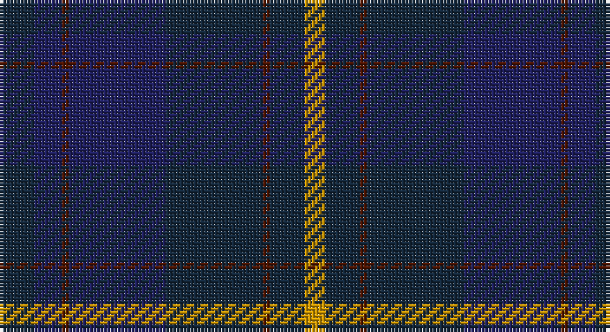

This page is one **sett** — a single exact thread-count. It belongs to the [tartan](/setts/dt5db4dr1db14dt14dr1dt5lo3/)
(the same proportion at any scale), whose colour order is pattern [BBBBBBBY](/stripes/bbbbbbby/).

Sourced from register-of-tartans.  It is a [8 stripe tartan](/stripes/stripes8/).

Original link https://www.tartanregister.gov.uk/tartanDetails.aspx?ref=1085

2 attestations — the source records this cloth was collapsed from (oldest owns this page)

<ul>
<li>01/01/2002 — Edinburgh Monarchs (register-of-tartans, <a href="https://www.tartanregister.gov.uk/tartanDetails.aspx?ref=1085">record</a>)</li>
<li>pre 2002 — Edinburgh Monarchs (Corporate) (tartans-authority, <a href="http://www.tartansauthority.com/tartan-ferret/display/4794/">record</a>)</li>
</ul>

## Register references

External register numbers recorded for this tartan.

- Scottish Register of Tartans: [1085](https://www.tartanregister.gov.uk/tartanDetails.aspx?ref=1085)
- Scottish Tartans Authority (ITI): 4794

## Thread count
DN/10 DB8 DR2 DB28 DN28 DR2 DN10 DY/6

One full sett is **172 threads**.

## Palette

Palette: <strong>Tartan Register</strong> <small style="color:#888">(2 of 4 colours)</small>
<table><thead><tr><th>Colour</th><th>Threads</th><th>Shade</th><th>Base</th><th>OKLCh</th></tr></thead><tbody><tr><td>DN/</td><td style="text-align:right;font-variant-numeric:tabular-nums">10</td><td><code style="background-color:#14283C;">#14283C</code> <small style="color:#888">#14283C</small></td><td>B <code style="background-color:#2A418A;">#2A418A</code></td><td><small style="color:#888">oklch(27.1% 0.046 249.9)</small></td></tr><tr><td>DB</td><td style="text-align:right;font-variant-numeric:tabular-nums">8</td><td><code style="background-color:#202060;">#202060</code> <small style="color:#888">#202060</small></td><td>B <code style="background-color:#2A418A;">#2A418A</code></td><td><small style="color:#888">oklch(28.9% 0.111 276.9)</small></td></tr><tr><td>DR</td><td style="text-align:right;font-variant-numeric:tabular-nums">2</td><td><code style="background-color:#501400;">#501400</code> <small style="color:#888">#501400</small></td><td>B <code style="background-color:#2A418A;">#2A418A</code></td><td><small style="color:#888">oklch(29.1% 0.094 38.4)</small></td></tr><tr><td>DB</td><td style="text-align:right;font-variant-numeric:tabular-nums">28</td><td><code style="background-color:#202060;">#202060</code> <small style="color:#888">#202060</small></td><td>B <code style="background-color:#2A418A;">#2A418A</code></td><td><small style="color:#888">oklch(28.9% 0.111 276.9)</small></td></tr><tr><td>DN</td><td style="text-align:right;font-variant-numeric:tabular-nums">28</td><td><code style="background-color:#14283C;">#14283C</code> <small style="color:#888">#14283C</small></td><td>B <code style="background-color:#2A418A;">#2A418A</code></td><td><small style="color:#888">oklch(27.1% 0.046 249.9)</small></td></tr><tr><td>DR</td><td style="text-align:right;font-variant-numeric:tabular-nums">2</td><td><code style="background-color:#501400;">#501400</code> <small style="color:#888">#501400</small></td><td>B <code style="background-color:#2A418A;">#2A418A</code></td><td><small style="color:#888">oklch(29.1% 0.094 38.4)</small></td></tr><tr><td>DN</td><td style="text-align:right;font-variant-numeric:tabular-nums">10</td><td><code style="background-color:#14283C;">#14283C</code> <small style="color:#888">#14283C</small></td><td>B <code style="background-color:#2A418A;">#2A418A</code></td><td><small style="color:#888">oklch(27.1% 0.046 249.9)</small></td></tr><tr><td>DY/</td><td style="text-align:right;font-variant-numeric:tabular-nums">6</td><td><code style="background-color:#D09800;">#D09800</code> <small style="color:#888">#D09800</small></td><td>Y <code style="background-color:#F2BF00;">#F2BF00</code></td><td><small style="color:#888">oklch(71.4% 0.147 82.1)</small></td></tr></tbody></table>

# Sample pattern

## Nearest tartans

The nearest existing variants by ΔTartan distance, with this tartan at the top so the swatches line up against it.

ΔTartan

Tartan

Sett

—

<a href="/ttd/edit/#slug=dt5db4dr1db14dt14dr1dt5lo3~x2">Edinburgh Monarchs</a> <a class="nn-out" href="/variants/s8/dt5db4dr1db14dt14dr1dt5lo3~x2/" title="open its dictionary page">↗</a>

1.08

<a href="/ttd/edit/#slug=dt4r1dt18dti18w1dti4~x4&amp;base=dt5db4dr1db14dt14dr1dt5lo3~x2">Ewell Castle School</a> <a class="nn-out" href="/variants/s6/dt4r1dt18dti18w1dti4~x4/" title="open its dictionary page">↗</a>

1.38

<a href="/ttd/edit/#slug=dg4db3dg20db9r2db2r2db18dp4~x2&amp;base=dt5db4dr1db14dt14dr1dt5lo3~x2">New Club Centenary</a> <a class="nn-out" href="/variants/s9/dg4db3dg20db9r2db2r2db18dp4~x2/" title="open its dictionary page">↗</a>

1.39

<a href="/ttd/edit/#slug=dti43dg8dti8dt21dg10w2~x2&amp;base=dt5db4dr1db14dt14dr1dt5lo3~x2">Longmuir (2014)</a> <a class="nn-out" href="/variants/s6/dti43dg8dti8dt21dg10w2~x2/" title="open its dictionary page">↗</a>

1.42

<a href="/ttd/edit/#slug=dy5dbi12db4lo4db22dbi3db4dy5&amp;base=dt5db4dr1db14dt14dr1dt5lo3~x2">Daks Muted blue Trade Tartan</a> <a class="nn-out" href="/variants/s8/dy5dbi12db4lo4db22dbi3db4dy5/" title="open its dictionary page">↗</a>

1.43

<a href="/ttd/edit/#slug=dg8w3dt6db11dt30db5~x2&amp;base=dt5db4dr1db14dt14dr1dt5lo3~x2">Craig Devlin (Dundee) (Personal)</a> <a class="nn-out" href="/variants/s6/dg8w3dt6db11dt30db5~x2/" title="open its dictionary page">↗</a>

1.48

<a href="/ttd/edit/#slug=r4dt21w2dt20db21dt2db2~x2&amp;base=dt5db4dr1db14dt14dr1dt5lo3~x2">St. George's (Birmingham) (School)</a> <a class="nn-out" href="/variants/s7/r4dt21w2dt20db21dt2db2~x2/" title="open its dictionary page">↗</a>

1.50

<a href="/ttd/edit/#slug=dt5k2dt2k2dt2db5k2db1o1db1k10dt3~x4&amp;base=dt5db4dr1db14dt14dr1dt5lo3~x2">Hopkins (Wales)</a> <a class="nn-out" href="/variants/s12/dt5k2dt2k2dt2db5k2db1o1db1k10dt3~x4/" title="open its dictionary page">↗</a>

1.52

<a href="/ttd/edit/#slug=db5k2db2k2db2dt5k2dt1o1dt1k10db3~x4&amp;base=dt5db4dr1db14dt14dr1dt5lo3~x2">Hopkins Welsh Name Tartan</a> <a class="nn-out" href="/variants/s12/db5k2db2k2db2dt5k2dt1o1dt1k10db3~x4/" title="open its dictionary page">↗</a>

1.55

<a href="/ttd/edit/#slug=k43dg8k8dt21dg10w2~x2&amp;base=dt5db4dr1db14dt14dr1dt5lo3~x2">Longmuir (2014)</a> <a class="nn-out" href="/variants/s6/k43dg8k8dt21dg10w2~x2/" title="open its dictionary page">↗</a>

1.63

<a href="/ttd/edit/#slug=db4lo2db20dt2r4dt2db3dt12db2~x2&amp;base=dt5db4dr1db14dt14dr1dt5lo3~x2">Stone of Destiny, The (Commemorative</a> <a class="nn-out" href="/variants/s9/db4lo2db20dt2r4dt2db3dt12db2~x2/" title="open its dictionary page">↗</a>

## Neighbour map

Every grey dot is one of 14360 variants placed by the first two principal components of the ΔTartan feature space (44% of its variance). Red is this tartan; blue dots are its nearest — click one to open its page.

<svg viewBox="0 0 640 380" role="img" style="max-width:100%;height:auto;border:1px solid #e0e0e0;border-radius:4px;display:block" xmlns="http://www.w3.org/2000/svg"><image href="/nn/cloud.v1.png" width="640" height="380"/><a href="/variants/s6/dt4r1dt18dti18w1dti4~x4/"><circle cx="415.0" cy="250.8" r="4" fill="#3465a4"><title>Ewell Castle School</title></circle></a><a href="/variants/s9/dg4db3dg20db9r2db2r2db18dp4~x2/"><circle cx="377.1" cy="250.3" r="4" fill="#3465a4"><title>New Club Centenary</title></circle></a><a href="/variants/s6/dti43dg8dti8dt21dg10w2~x2/"><circle cx="426.4" cy="252.7" r="4" fill="#3465a4"><title>Longmuir (2014)</title></circle></a><a href="/variants/s8/dy5dbi12db4lo4db22dbi3db4dy5/"><circle cx="335.6" cy="267.3" r="4" fill="#3465a4"><title>Daks Muted blue Trade Tartan</title></circle></a><a href="/variants/s6/dg8w3dt6db11dt30db5~x2/"><circle cx="372.8" cy="264.6" r="4" fill="#3465a4"><title>Craig Devlin (Dundee) (Personal)</title></circle></a><a href="/variants/s7/r4dt21w2dt20db21dt2db2~x2/"><circle cx="409.3" cy="257.9" r="4" fill="#3465a4"><title>St. George's (Birmingham) (School)</title></circle></a><a href="/variants/s12/dt5k2dt2k2dt2db5k2db1o1db1k10dt3~x4/"><circle cx="332.0" cy="254.8" r="4" fill="#3465a4"><title>Hopkins (Wales)</title></circle></a><a href="/variants/s12/db5k2db2k2db2dt5k2dt1o1dt1k10db3~x4/"><circle cx="339.0" cy="258.1" r="4" fill="#3465a4"><title>Hopkins Welsh Name Tartan</title></circle></a><a href="/variants/s6/k43dg8k8dt21dg10w2~x2/"><circle cx="422.8" cy="252.2" r="4" fill="#3465a4"><title>Longmuir (2014)</title></circle></a><a href="/variants/s9/db4lo2db20dt2r4dt2db3dt12db2~x2/"><circle cx="400.7" cy="234.0" r="4" fill="#3465a4"><title>Stone of Destiny, The (Commemorative</title></circle></a><circle cx="387.1" cy="254.5" r="5" fill="#c00000"/></svg>

ID: /variants/s8/dt5db4dr1db14dt14dr1dt5lo3~x2/
