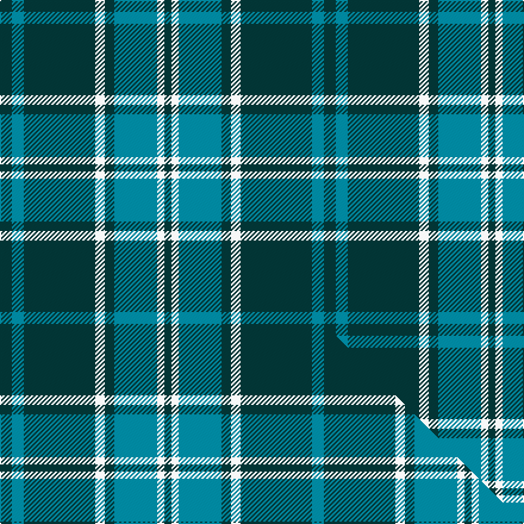

This is one **variant** — a specific cloth: this exact thread count and colourway, with its own
provenance below. It is one weaving of the [sett](/setts/dt5t5dt30w4dt4t18w3dt3/) (the scale-free proportion — the
same cloth at any scale or shade), whose colour order is pattern [BBBWBBWB](/stripes/bbbwbbwb/).

Part of the [Salem Scottish Dancers](/tartans/salem-scottish-dancers/) tartan — the named design grouping this sett with its other cloths.

Sourced from tartans-authority.  It is a [8 stripe tartan](/stripes/stripes8/).

Original link [https://www.tartanregister.gov.uk/tartanDetails.aspx?ref=4136](https://www.tartanregister.gov.uk/tartanDetails.aspx?ref=4136)

Dataset <small>— provenance for this record, inherited from the source manifest</small>

<dl class="dataset-prov">
<dt>source</dt><dd><a href="/sources/tartans-authority/">Scottish Tartans Authority</a></dd>
<dt>data captured from</dt><dd><a href="https://github.com/thetartan/tartan-database/blob/master/data/tartans-authority/data.csv">https://github.com/thetartan/tartan-database/blob/master/data/tartans-authority/data.csv</a></dd>
<dt>data date</dt><dd>2000 <small>(this record)</small></dd>
<dt>licence</dt><dd><a href="https://creativecommons.org/licenses/by-nc-nd/4.0/">CC BY-NC-ND 4.0</a></dd>
</dl>

Capture chain <small>— the hands this data passed through, oldest first; each capture carries its own licence</small>

<ol class="capture-chain">
<li><a href="https://www.tartansauthority.com/">Scottish Tartans Authority</a> <small>the heritage body's archive — its tartan-ferret record browser is retired (links repaired to the SRT, above)</small></li>
<li><a href="https://github.com/thetartan/tartan-database">thetartan/tartan-database</a> <small>2016-2017</small> · <a href="https://creativecommons.org/licenses/by-nc-nd/4.0/">CC BY-NC-ND 4.0</a> <small>Levko Kravets's frozen compilation — the capture we vendored, and where its CC licence text came from</small></li>
<li>this dictionary <small>captured 2026-06-10 · commit 5bf86c7566</small> <small>each re-capture is a git commit to data/sources</small></li>
</ol>

## Register references

External register numbers recorded for this tartan.

- Scottish Tartans Authority (ITI): 4136

## Thread count
DT/10 T10 DT60 W8 DT8 T36 W6 DT/6

One full sett is **272 threads**.

## Palette
<table><thead><tr><th>Colour</th><th>Shade</th><th>OKLCh</th></tr></thead><tbody><tr><td>T</td><td><code style="background-color:#00879F;">#00879F</code> <small style="color:#888">#00879F</small></td><td><small style="color:#888">oklch(57.4% 0.102 216.1)</small></td></tr><tr><td>DT</td><td><code style="background-color:#023535;">#023535</code> <small style="color:#888">#023535</small></td><td><small style="color:#888">oklch(29.8% 0.050 194.8)</small></td></tr><tr><td>W</td><td><code style="background-color:#F7F7F7;">#F7F7F7</code> <small style="color:#888">#F7F7F7</small></td><td><small style="color:#888">oklch(97.6% 0.000 89.9)</small></td></tr></tbody></table>

# Sample pattern

## Compared to the master

This cloth is one sett of its design; the master sett (the exemplar the design is anchored on) is below for comparison.

Its **ΔTartan distance** from the master is **0.00** — the same measure the nearest-tartans table ranks by (0 is identical; a re-scale of the same cloth is near 0, a recolour or a different proportion further).

<figure class="master-compare" style="margin:0">

this sett
master sett ★

<figcaption style="color:#888;font-size:smaller">One weave of this sett against the <a href="/setts/dt5t5dt30w4dt4t18w3dt3w3t18dt4w4dt30t5/">master sett ★</a>, split on the diagonal: a shared proportion runs seamlessly across it with only the shades shifting; a different proportion breaks on it.</figcaption>
</figure>

## Nearest tartan variants

The nearest existing variants by ΔTartan distance, with this cloth at the top so the swatches line up against it.

ΔTartan

Threads

Variant

Sett

—

272

<a href="/variants/s8/dt5t5dt30w4dt4t18w3dt3~x2/">Salem Scottish Dancers (Corporate)</a>

<a href="/ttd/edit/#slug=g2db15n5g2db2g7w2~x4&amp;base=dt5t5dt30w4dt4t18w3dt3~x2" title="compare in the TTD">2.21</a>

264

<a href="/variants/s7/g2db15n5g2db2g7w2~x4/">Chambers Bay</a>

2.49

524

<a href="/variants/s14/dt5t5dt30w4dt4t18w3dt3w3t18dt4w4dt30t5~x2/">Salem Scottish Dancers (Dance) #2</a>

<a href="/ttd/edit/#slug=g4dt36lg6g16dt16g3~x2~dt1204274&amp;base=dt5t5dt30w4dt4t18w3dt3~x2" title="compare in the TTD">2.73</a>

310

<a href="/variants/s6/g4db36lg6g16db16g3~x2~db1204274/">City of Kincardine</a>

<a href="/ttd/edit/#slug=g4db36lg6g16db16g3~x2&amp;base=dt5t5dt30w4dt4t18w3dt3~x2" title="compare in the TTD">2.76</a>

310

<a href="/variants/s6/g4db36lg6g16db16g3~x2/">City of Kincardine (District)</a>

<a href="/ttd/edit/#slug=dg18dr6dg75b6dg13ly35dg12b6&amp;base=dt5t5dt30w4dt4t18w3dt3~x2" title="compare in the TTD">3.12</a>

318

<a href="/variants/s8/dg18dr6dg75b6dg13ly35dg12b6/">Glenlivet Check (Corporate)</a>

<a href="/ttd/edit/#slug=db24g3db3g3lo2g18dr2~x2&amp;base=dt5t5dt30w4dt4t18w3dt3~x2" title="compare in the TTD">3.15</a>

168

<a href="/variants/s7/db24g3db3g3lo2g18dr2~x2/">Greenways Marketing Intl (Corporate)</a>

<a href="/ttd/edit/#slug=db1g12db4lb1db4g4db1~x4&amp;base=dt5t5dt30w4dt4t18w3dt3~x2" title="compare in the TTD">3.39</a>

208

<a href="/variants/s7/db1g12db4lb1db4g4db1~x4/">St. Dennis &amp; Cranley School</a>

<a href="/ttd/edit/#slug=db4w1db12g12db1g4~x2&amp;base=dt5t5dt30w4dt4t18w3dt3~x2" title="compare in the TTD">3.46</a>

120

<a href="/variants/s6/db4w1db12g12db1g4~x2/">Unidentified Tweed</a>

<a href="/ttd/edit/#slug=lb9dt3lb1dt12y1~x4&amp;base=dt5t5dt30w4dt4t18w3dt3~x2" title="compare in the TTD">3.48</a>

168

<a href="/variants/s5/lb9dt3lb1dt12y1~x4/">North Sea Commission</a>

<a href="/ttd/edit/#slug=g37w2g6db23y6db2y3db2~x2&amp;base=dt5t5dt30w4dt4t18w3dt3~x2" title="compare in the TTD">3.53</a>

246

<a href="/variants/s8/g37w2g6db23y6db2y3db2~x2/">MacAuliffe (Name)</a>

## Neighbour map

Every grey dot is one of 13621 variants placed by the first two principal components of the ΔTartan feature space (42% of its variance). Red is this tartan; blue dots are its nearest — click one to open its page.

<svg viewBox="0 0 640 380" role="img" style="max-width:100%;height:auto;border:1px solid #e0e0e0;border-radius:4px;display:block" xmlns="http://www.w3.org/2000/svg"><image href="/nn/cloud.v1.png" width="640" height="380"/><a href="/variants/s7/g2db15n5g2db2g7w2~x4/"><circle cx="277.8" cy="235.6" r="4" fill="#3465a4"><title>Chambers Bay</title></circle></a><a href="/variants/s14/dt5t5dt30w4dt4t18w3dt3w3t18dt4w4dt30t5~x2/"><circle cx="357.2" cy="215.2" r="4" fill="#3465a4"><title>Salem Scottish Dancers (Dance) #2</title></circle></a><a href="/variants/s6/g4db36lg6g16db16g3~x2~db1204274/"><circle cx="403.2" cy="234.9" r="4" fill="#3465a4"><title>City of Kincardine</title></circle></a><a href="/variants/s6/g4db36lg6g16db16g3~x2/"><circle cx="400.5" cy="236.3" r="4" fill="#3465a4"><title>City of Kincardine (District)</title></circle></a><a href="/variants/s8/dg18dr6dg75b6dg13ly35dg12b6/"><circle cx="408.3" cy="191.3" r="4" fill="#3465a4"><title>Glenlivet Check (Corporate)</title></circle></a><a href="/variants/s7/db24g3db3g3lo2g18dr2~x2/"><circle cx="334.8" cy="206.6" r="4" fill="#3465a4"><title>Greenways Marketing Intl (Corporate)</title></circle></a><a href="/variants/s7/db1g12db4lb1db4g4db1~x4/"><circle cx="395.4" cy="232.5" r="4" fill="#3465a4"><title>St. Dennis &amp; Cranley School</title></circle></a><a href="/variants/s6/db4w1db12g12db1g4~x2/"><circle cx="348.7" cy="245.2" r="4" fill="#3465a4"><title>Unidentified Tweed</title></circle></a><a href="/variants/s5/lb9dt3lb1dt12y1~x4/"><circle cx="366.7" cy="237.0" r="4" fill="#3465a4"><title>North Sea Commission</title></circle></a><a href="/variants/s8/g37w2g6db23y6db2y3db2~x2/"><circle cx="358.5" cy="181.8" r="4" fill="#3465a4"><title>MacAuliffe (Name)</title></circle></a><circle cx="386.2" cy="234.3" r="5" fill="#c00000"/><text x="320" y="376" text-anchor="middle" font-size="11" fill="#999">ground</text><text x="11" y="190" text-anchor="middle" font-size="11" fill="#999" transform="rotate(-90 11 190)">complexity</text></svg>

ID: /variants/s8/dt5t5dt30w4dt4t18w3dt3~x2/
