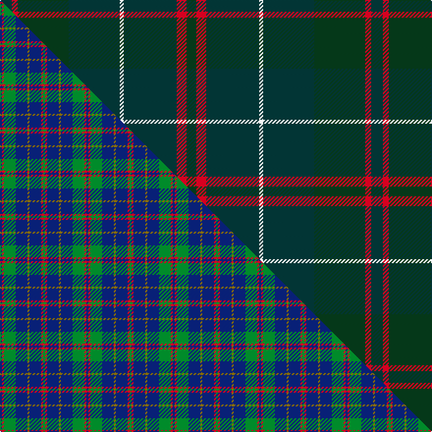

This is one **variant** — a specific cloth: this exact thread count and colourway, with its own
provenance below. It is one weaving of the [sett](/setts/dt6r3dg26dt26w2dt27r5dg5/) (the scale-free proportion — the
same cloth at any scale or shade), whose colour order is pattern [BRGBWBRG](/stripes/brgbwbrg/).

Part of the [MacHardy](/tartans/machardy/) tartan — the named design grouping this sett with its other cloths.

Sourced from tartans-authority.  It is a [8 stripe tartan](/stripes/stripes8/).

Original link [https://www.tartanregister.gov.uk/tartanDetails.aspx?ref=514](https://www.tartanregister.gov.uk/tartanDetails.aspx?ref=514)

2 attestations — the source records this cloth was collapsed from (oldest owns this page)

<ul>
<li>pre 1860 — MacHardy (Clan) (tartans-authority, <a href="https://www.tartanregister.gov.uk/tartanDetails.aspx?ref=514">record</a>)  <em>The following is from an 1860 manuscript written by a Charles Andrew McHardy who was the Chief Constable of Dumbarton and an historian. "The McHardy Tartan, for Kilting and Plaiding, according to coloured thread scale is as follows:-Warp, 6 red; 58 green; 58 blue; 4 white; 58 blue; 6 red; 6 green; 6 red; 58 blue; 4 white; 58 blue; 58 green; 6 red; 6 blue; 6 red; 58 green; 58 blue; 4 white; 58 blue; 6 red; 6 green; 6 red; 58 blue; 4 white; 58 blue; 58 green; 6 red; 6 blue; 6 red &c. The ordinary width of a web of tartan is about two feet two inches, and if made of double width the sets, as above, are to be repeated until the full width be obtained. The threads in the Woof must correspond with those in the Warp, and if this be attended to the sets and checks will be correct. Sample in STA Johnston Collection. The structure of the Culloden tartan is very similar to this and Coulsen Bonner calls it Culloden or Ancient MacHardy. The possibility therefore arises that the Culloden - which was an unknown tartan found at Culloden - might have been an early form of MacHardy.</em></li>
<li>01/01/1973 — MacHardy Black (register-of-tartans, <a href="https://www.tartanregister.gov.uk/tartanDetails.aspx?ref=2468">record</a>)  <em>From both Pendleton Woolen Mill and West Coast Woolen Mills. Appears in W & A K Johnston book Tartans of the Clans & Septs of Scotland 1906. WCWM Sample in Scottish Tartans Authority Johnston Collection. Not known why it's called 'Black'</em></li>
</ul>

Dataset <small>— provenance for this record, inherited from the source manifest</small>

<dl class="dataset-prov">
<dt>source</dt><dd><a href="/sources/tartans-authority/">Scottish Tartans Authority</a></dd>
<dt>data captured from</dt><dd><a href="https://github.com/thetartan/tartan-database/blob/master/data/tartans-authority/data.csv">https://github.com/thetartan/tartan-database/blob/master/data/tartans-authority/data.csv</a></dd>
<dt>data date</dt><dd>pre 1860 <small>(this record)</small></dd>
<dt>licence</dt><dd><a href="https://creativecommons.org/licenses/by-nc-nd/4.0/">CC BY-NC-ND 4.0</a></dd>
</dl>

Capture chain <small>— the hands this data passed through, oldest first; each capture carries its own licence</small>

<ol class="capture-chain">
<li><a href="https://www.tartansauthority.com/">Scottish Tartans Authority</a> <small>the heritage body's archive — its tartan-ferret record browser is retired (links repaired to the SRT, above)</small></li>
<li><a href="https://github.com/thetartan/tartan-database">thetartan/tartan-database</a> <small>2016-2017</small> · <a href="https://creativecommons.org/licenses/by-nc-nd/4.0/">CC BY-NC-ND 4.0</a> <small>Levko Kravets's frozen compilation — the capture we vendored, and where its CC licence text came from</small></li>
<li>this dictionary <small>captured 2026-06-10 · commit 5bf86c7566</small> <small>each re-capture is a git commit to data/sources</small></li>
</ol>

## Register references

External register numbers recorded for this tartan.

- Scottish Register of Tartans: [2468](https://www.tartanregister.gov.uk/tartanDetails.aspx?ref=2468)
- Scottish Tartans Authority (ITI): 514
- Scottish Tartans World Register: 514

## Thread count
DT/12 R6 DG52 DT52 W4 DT54 R10 DG/10

One full sett is **378 threads**.

## Palette
<table><thead><tr><th>Colour</th><th>Shade</th><th>OKLCh</th></tr></thead><tbody><tr><td>DT</td><td><code style="background-color:#023535;">#023535</code> <small style="color:#888">#023535</small></td><td><small style="color:#888">oklch(29.8% 0.050 194.8)</small></td></tr><tr><td>DG</td><td><code style="background-color:#053819;">#053819</code> <small style="color:#888">#053819</small></td><td><small style="color:#888">oklch(30.0% 0.075 151.3)</small></td></tr><tr><td>W</td><td><code style="background-color:#F7F7F7;">#F7F7F7</code> <small style="color:#888">#F7F7F7</small></td><td><small style="color:#888">oklch(97.6% 0.000 89.9)</small></td></tr><tr><td>R</td><td><code style="background-color:#D60020;">#D60020</code> <small style="color:#888">#D60020</small></td><td><small style="color:#888">oklch(55.2% 0.224 25.5)</small></td></tr></tbody></table>

# Sample pattern

## Compared to the master

This cloth is one sett of its design; the master sett (the exemplar the design is anchored on) is below for comparison.

Its **ΔTartan distance** from the master is **9.66** — the same measure the nearest-tartans table ranks by (0 is identical; a re-scale of the same cloth is near 0, a recolour or a different proportion further).

<figure class="master-compare" style="margin:0">

this sett
master sett ★

<figcaption style="color:#888;font-size:smaller">One weave of this sett against the <a href="/setts/db1r1g6db6y1db6r1g1/">master sett ★</a>, split on the diagonal: a shared proportion runs seamlessly across it with only the shades shifting; a different proportion breaks on it.</figcaption>
</figure>

## Nearest tartan variants

The nearest existing variants by ΔTartan distance, with this cloth at the top so the swatches line up against it.

ΔTartan

Threads

Variant

Sett

—

378

<a href="/variants/s8/dt6r3dg26dt26w2dt27r5dg5~x2/">MacHardy (Clan)</a>

<a href="/ttd/edit/#slug=dg2g2dgi7dg10dgi1g1~x4~g2408144-dgi1806142&amp;base=dt6r3dg26dt26w2dt27r5dg5~x2" title="compare in the TTD">3.31</a>

172

<a href="/variants/s6/dg2g2dgi7dg10dgi1g1~x4~g2408144-dgi1806142/">Emerald, The</a>

<a href="/ttd/edit/#slug=dr3dg24k4dg10g3dg10dr5dy3n3~x2&amp;base=dt6r3dg26dt26w2dt27r5dg5~x2" title="compare in the TTD">3.38</a>

248

<a href="/variants/s9/dr3dg24k4dg10g3dg10dr5dy3n3~x2/">Battle of the Somme Centenary</a>

<a href="/ttd/edit/#slug=g4dg18dgi6dg6dgi24k3~x2~dgi1605139&amp;base=dt6r3dg26dt26w2dt27r5dg5~x2" title="compare in the TTD">3.53</a>

230

<a href="/variants/s6/g4dg18dgi6dg6dgi24k3~x2~dgi1605139/">Park Estate</a>

<a href="/ttd/edit/#slug=g4dg18dgi6dg6dgi24ly3~x2~dgi1605139&amp;base=dt6r3dg26dt26w2dt27r5dg5~x2" title="compare in the TTD">3.55</a>

230

<a href="/variants/s6/g4dg18dgi6dg6dgi24ly3~x2~dgi1605139/">Park (Estate Check)</a>

<a href="/ttd/edit/#slug=dgi4ly2dgi17dg2dr4dg2dgi3dg11dgi2~x2~dgi1603171&amp;base=dt6r3dg26dt26w2dt27r5dg5~x2" title="compare in the TTD">3.89</a>

176

<a href="/variants/s9/dgi4ly2dgi17dg2dr4dg2dgi3dg11dgi2~x2~dgi1603171/">Armagh, County</a>

## Neighbour map

Every grey dot is one of 13621 variants placed by the first two principal components of the ΔTartan feature space (42% of its variance). Red is this tartan; blue dots are its nearest — click one to open its page.

<svg viewBox="0 0 640 380" role="img" style="max-width:100%;height:auto;border:1px solid #e0e0e0;border-radius:4px;display:block" xmlns="http://www.w3.org/2000/svg"><image href="/nn/cloud.v1.png" width="640" height="380"/><a href="/variants/s6/dg2g2dgi7dg10dgi1g1~x4~g2408144-dgi1806142/"><circle cx="461.1" cy="290.7" r="4" fill="#3465a4"><title>Emerald, The</title></circle></a><a href="/variants/s9/dr3dg24k4dg10g3dg10dr5dy3n3~x2/"><circle cx="423.7" cy="202.6" r="4" fill="#3465a4"><title>Battle of the Somme Centenary</title></circle></a><a href="/variants/s6/g4dg18dgi6dg6dgi24k3~x2~dgi1605139/"><circle cx="395.0" cy="274.2" r="4" fill="#3465a4"><title>Park Estate</title></circle></a><a href="/variants/s6/g4dg18dgi6dg6dgi24ly3~x2~dgi1605139/"><circle cx="418.4" cy="295.6" r="4" fill="#3465a4"><title>Park (Estate Check)</title></circle></a><a href="/variants/s9/dgi4ly2dgi17dg2dr4dg2dgi3dg11dgi2~x2~dgi1603171/"><circle cx="472.7" cy="269.6" r="4" fill="#3465a4"><title>Armagh, County</title></circle></a><circle cx="456.6" cy="237.9" r="5" fill="#c00000"/><text x="320" y="376" text-anchor="middle" font-size="11" fill="#999">ground</text><text x="11" y="190" text-anchor="middle" font-size="11" fill="#999" transform="rotate(-90 11 190)">complexity</text></svg>

ID: /variants/s8/dt6r3dg26dt26w2dt27r5dg5~x2/
