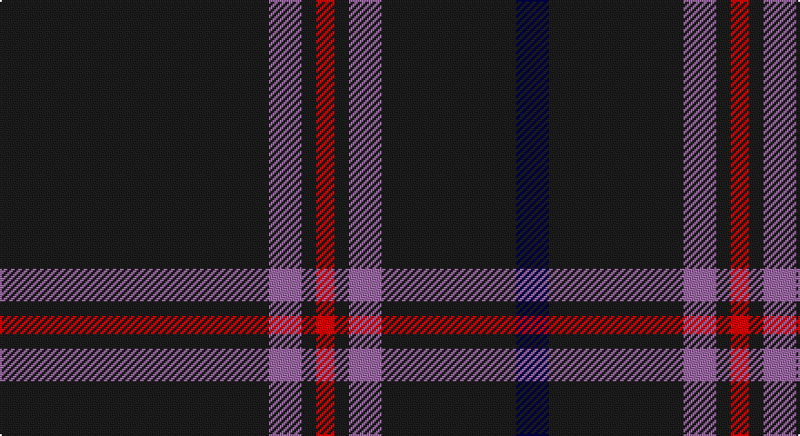

This page is one **sett** — a single exact thread-count. It belongs to the [tartan](/setts/dt74m9dt4r5dt4m9dt37db9/)
(the same proportion at any scale), whose colour order is pattern [BBRBRBRB](/stripes/bbrbrbrb/).

Sourced from register-of-tartans.  It is a [8 stripe tartan](/stripes/stripes8/).

Original link https://www.tartanregister.gov.uk/tartanDetails.aspx?ref=10860

## Register references

External register numbers recorded for this tartan.

- Scottish Register of Tartans: [10860](https://www.tartanregister.gov.uk/tartanDetails.aspx?ref=10860)

## Thread count
K/148 LP18 K8 R10 K8 LP18 K74 DB/18

One full sett is **438 threads**.

## Palette

Palette: <strong>Tartan Register</strong>
<table><thead><tr><th>Colour</th><th>Threads</th><th>Shade</th><th>Base</th><th>OKLCh</th></tr></thead><tbody><tr><td>K/</td><td style="text-align:right;font-variant-numeric:tabular-nums">148</td><td><code style="background-color:#1C1C1C;">#1C1C1C</code> <small style="color:#888">#1C1C1C</small></td><td>B <code style="background-color:#2A418A;">#2A418A</code></td><td><small style="color:#888">oklch(22.6% 0.000 89.9)</small></td></tr><tr><td>LP</td><td style="text-align:right;font-variant-numeric:tabular-nums">18</td><td><code style="background-color:#9C68A4;">#9C68A4</code> <small style="color:#888">#9C68A4</small></td><td>R <code style="background-color:#CC0000;">#CC0000</code></td><td><small style="color:#888">oklch(59.4% 0.107 322.0)</small></td></tr><tr><td>K</td><td style="text-align:right;font-variant-numeric:tabular-nums">8</td><td><code style="background-color:#1C1C1C;">#1C1C1C</code> <small style="color:#888">#1C1C1C</small></td><td>B <code style="background-color:#2A418A;">#2A418A</code></td><td><small style="color:#888">oklch(22.6% 0.000 89.9)</small></td></tr><tr><td>R</td><td style="text-align:right;font-variant-numeric:tabular-nums">10</td><td><code style="background-color:#FF0000;">#FF0000</code> <small style="color:#888">#FF0000</small></td><td>R <code style="background-color:#CC0000;">#CC0000</code></td><td><small style="color:#888">oklch(62.8% 0.258 29.2)</small></td></tr><tr><td>K</td><td style="text-align:right;font-variant-numeric:tabular-nums">8</td><td><code style="background-color:#1C1C1C;">#1C1C1C</code> <small style="color:#888">#1C1C1C</small></td><td>B <code style="background-color:#2A418A;">#2A418A</code></td><td><small style="color:#888">oklch(22.6% 0.000 89.9)</small></td></tr><tr><td>LP</td><td style="text-align:right;font-variant-numeric:tabular-nums">18</td><td><code style="background-color:#9C68A4;">#9C68A4</code> <small style="color:#888">#9C68A4</small></td><td>R <code style="background-color:#CC0000;">#CC0000</code></td><td><small style="color:#888">oklch(59.4% 0.107 322.0)</small></td></tr><tr><td>K</td><td style="text-align:right;font-variant-numeric:tabular-nums">74</td><td><code style="background-color:#1C1C1C;">#1C1C1C</code> <small style="color:#888">#1C1C1C</small></td><td>B <code style="background-color:#2A418A;">#2A418A</code></td><td><small style="color:#888">oklch(22.6% 0.000 89.9)</small></td></tr><tr><td>DB/</td><td style="text-align:right;font-variant-numeric:tabular-nums">18</td><td><code style="background-color:#000048;">#000048</code> <small style="color:#888">#000048</small></td><td>B <code style="background-color:#2A418A;">#2A418A</code></td><td><small style="color:#888">oklch(18.2% 0.126 264.1)</small></td></tr></tbody></table>

# Sample pattern

## Nearest tartans

The nearest existing variants by ΔTartan distance, with this tartan at the top so the swatches line up against it.

ΔTartan

Tartan

Sett

—

<a href="/ttd/edit/#slug=dt74m9dt4r5dt4m9dt37db9~x2">Rikaco Vintage</a> <a class="nn-out" href="/variants/s8/dt74m9dt4r5dt4m9dt37db9~x2/" title="open its dictionary page">↗</a>

0.56

<a href="/ttd/edit/#slug=k10n2k2n8k40r4k5ri2~x2&amp;base=dt74m9dt4r5dt4m9dt37db9~x2">Laird Abdullah (Personal)</a> <a class="nn-out" href="/variants/s8/k10n2k2n8k40r4k5ri2~x2/" title="open its dictionary page">↗</a>

0.90

<a href="/ttd/edit/#slug=k21dp2o1k1o1dp2k6db2o1~x4&amp;base=dt74m9dt4r5dt4m9dt37db9~x2">Clan Inebriated</a> <a class="nn-out" href="/variants/s9/k21dp2o1k1o1dp2k6db2o1~x4/" title="open its dictionary page">↗</a>

0.98

<a href="/ttd/edit/#slug=k40dp2k6b2k2b2k10dp4w2dp5~x2&amp;base=dt74m9dt4r5dt4m9dt37db9~x2">Ironside (Personal)</a> <a class="nn-out" href="/variants/s10/k40dp2k6b2k2b2k10dp4w2dp5~x2/" title="open its dictionary page">↗</a>

1.04

<a href="/ttd/edit/#slug=k49o8k4n6oi4n6k4o8k49oi2&amp;base=dt74m9dt4r5dt4m9dt37db9~x2">Harley Davidson</a> <a class="nn-out" href="/variants/s10/k49o8k4n6oi4n6k4o8k49oi2/" title="open its dictionary page">↗</a>

1.31

<a href="/ttd/edit/#slug=dt32r3dt4k2lo3~x2&amp;base=dt74m9dt4r5dt4m9dt37db9~x2">MacLaine of Lochbuie Hunting</a> <a class="nn-out" href="/variants/s5/dt32r3dt4k2lo3~x2/" title="open its dictionary page">↗</a>

1.35

<a href="/ttd/edit/#slug=k14n2k2n5k25w1n9m3k3w1k14~x2&amp;base=dt74m9dt4r5dt4m9dt37db9~x2">Springbank</a> <a class="nn-out" href="/variants/s11/k14n2k2n5k25w1n9m3k3w1k14~x2/" title="open its dictionary page">↗</a>

1.37

<a href="/ttd/edit/#slug=k42t2r3k5r16k8ly2k3~x2&amp;base=dt74m9dt4r5dt4m9dt37db9~x2">Highland Brewing Company</a> <a class="nn-out" href="/variants/s8/k42t2r3k5r16k8ly2k3~x2/" title="open its dictionary page">↗</a>

1.39

<a href="/ttd/edit/#slug=k60r3k15r3lb2r5db3r2~x2&amp;base=dt74m9dt4r5dt4m9dt37db9~x2">Whitaker (2014)</a> <a class="nn-out" href="/variants/s8/k60r3k15r3lb2r5db3r2~x2/" title="open its dictionary page">↗</a>

1.39

<a href="/ttd/edit/#slug=k40dg15k10r2k10lo2k10~x2&amp;base=dt74m9dt4r5dt4m9dt37db9~x2">Langhein, Alex (Personal)</a> <a class="nn-out" href="/variants/s7/k40dg15k10r2k10lo2k10~x2/" title="open its dictionary page">↗</a>

1.46

<a href="/ttd/edit/#slug=k14n2k2n5k25w1n9p3k3w1k14~x2&amp;base=dt74m9dt4r5dt4m9dt37db9~x2">Springbank</a> <a class="nn-out" href="/variants/s11/k14n2k2n5k25w1n9p3k3w1k14~x2/" title="open its dictionary page">↗</a>

## Neighbour map

Every grey dot is one of 14360 variants placed by the first two principal components of the ΔTartan feature space (44% of its variance). Red is this tartan; blue dots are its nearest — click one to open its page.

<svg viewBox="0 0 640 380" role="img" style="max-width:100%;height:auto;border:1px solid #e0e0e0;border-radius:4px;display:block" xmlns="http://www.w3.org/2000/svg"><image href="/nn/cloud.v1.png" width="640" height="380"/><a href="/variants/s8/k10n2k2n8k40r4k5ri2~x2/"><circle cx="537.7" cy="174.3" r="4" fill="#3465a4"><title>Laird Abdullah (Personal)</title></circle></a><a href="/variants/s9/k21dp2o1k1o1dp2k6db2o1~x4/"><circle cx="529.7" cy="161.8" r="4" fill="#3465a4"><title>Clan Inebriated</title></circle></a><a href="/variants/s10/k40dp2k6b2k2b2k10dp4w2dp5~x2/"><circle cx="524.5" cy="151.7" r="4" fill="#3465a4"><title>Ironside (Personal)</title></circle></a><a href="/variants/s10/k49o8k4n6oi4n6k4o8k49oi2/"><circle cx="507.3" cy="155.0" r="4" fill="#3465a4"><title>Harley Davidson</title></circle></a><a href="/variants/s5/dt32r3dt4k2lo3~x2/"><circle cx="584.8" cy="213.0" r="4" fill="#3465a4"><title>MacLaine of Lochbuie Hunting</title></circle></a><a href="/variants/s11/k14n2k2n5k25w1n9m3k3w1k14~x2/"><circle cx="475.3" cy="166.3" r="4" fill="#3465a4"><title>Springbank</title></circle></a><a href="/variants/s8/k42t2r3k5r16k8ly2k3~x2/"><circle cx="480.6" cy="162.1" r="4" fill="#3465a4"><title>Highland Brewing Company</title></circle></a><a href="/variants/s8/k60r3k15r3lb2r5db3r2~x2/"><circle cx="578.9" cy="140.1" r="4" fill="#3465a4"><title>Whitaker (2014)</title></circle></a><a href="/variants/s7/k40dg15k10r2k10lo2k10~x2/"><circle cx="547.6" cy="220.6" r="4" fill="#3465a4"><title>Langhein, Alex (Personal)</title></circle></a><a href="/variants/s11/k14n2k2n5k25w1n9p3k3w1k14~x2/"><circle cx="466.6" cy="161.5" r="4" fill="#3465a4"><title>Springbank</title></circle></a><circle cx="538.7" cy="182.9" r="5" fill="#c00000"/></svg>

ID: /variants/s8/dt74m9dt4r5dt4m9dt37db9~x2/
