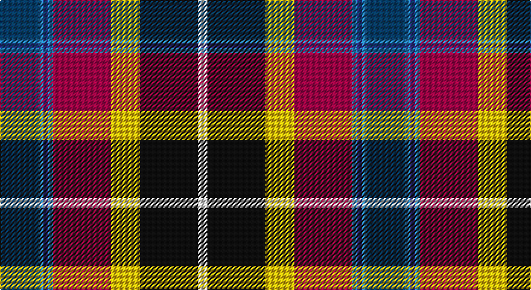

This page is one **sett** — a single exact thread-count. It belongs to the [tartan](/setts/dt8t1db1t1m12ly6k12w2/)
(the same proportion at any scale), whose colour order is pattern [BBBBRYKW](/stripes/bbbbrykw/).

Sourced from register-of-tartans.  It is a [8 stripe tartan](/stripes/stripes8/).

Original link https://www.tartanregister.gov.uk/tartanDetails.aspx?ref=2847

2 attestations — the source records this cloth was collapsed from (oldest owns this page)

<ul>
<li>01/01/2003 — Maryland (register-of-tartans, <a href="https://www.tartanregister.gov.uk/tartanDetails.aspx?ref=2847">record</a>)</li>
<li>2003 — Maryland (Commemorative) (tartans-authority, <a href="http://www.tartansauthority.com/tartan-ferret/display/5920/">record</a>)</li>
</ul>

## Register references

External register numbers recorded for this tartan.

- Scottish Register of Tartans: [2847](https://www.tartanregister.gov.uk/tartanDetails.aspx?ref=2847)
- Scottish Tartans Authority (ITI): 5920

## Thread count
DBa/32 B4 DB4 B4 R48 Y24 K48 LN/8

One full sett is **304 threads**.

## Palette

Palette: <strong>Tartan Register</strong>
<table><thead><tr><th>Colour</th><th>Threads</th><th>Shade</th><th>Base</th><th>OKLCh</th></tr></thead><tbody><tr><td>DBa/</td><td style="text-align:right;font-variant-numeric:tabular-nums">32</td><td><code style="background-color:#003C64;">#003C64</code> <small style="color:#888">#003C64</small></td><td>B <code style="background-color:#2A418A;">#2A418A</code></td><td><small style="color:#888">oklch(34.5% 0.089 246.0)</small></td></tr><tr><td>B</td><td style="text-align:right;font-variant-numeric:tabular-nums">4</td><td><code style="background-color:#2888C4;">#2888C4</code> <small style="color:#888">#2888C4</small></td><td>B <code style="background-color:#2A418A;">#2A418A</code></td><td><small style="color:#888">oklch(60.1% 0.125 241.5)</small></td></tr><tr><td>DB</td><td style="text-align:right;font-variant-numeric:tabular-nums">4</td><td><code style="background-color:#2C2C80;">#2C2C80</code> <small style="color:#888">#2C2C80</small></td><td>B <code style="background-color:#2A418A;">#2A418A</code></td><td><small style="color:#888">oklch(35.0% 0.138 276.6)</small></td></tr><tr><td>B</td><td style="text-align:right;font-variant-numeric:tabular-nums">4</td><td><code style="background-color:#2888C4;">#2888C4</code> <small style="color:#888">#2888C4</small></td><td>B <code style="background-color:#2A418A;">#2A418A</code></td><td><small style="color:#888">oklch(60.1% 0.125 241.5)</small></td></tr><tr><td>R</td><td style="text-align:right;font-variant-numeric:tabular-nums">48</td><td><code style="background-color:#A00048;">#A00048</code> <small style="color:#888">#A00048</small></td><td>R <code style="background-color:#CC0000;">#CC0000</code></td><td><small style="color:#888">oklch(45.4% 0.182 5.3)</small></td></tr><tr><td>Y</td><td style="text-align:right;font-variant-numeric:tabular-nums">24</td><td><code style="background-color:#E8C000;">#E8C000</code> <small style="color:#888">#E8C000</small></td><td>Y <code style="background-color:#F2BF00;">#F2BF00</code></td><td><small style="color:#888">oklch(81.9% 0.168 93.7)</small></td></tr><tr><td>K</td><td style="text-align:right;font-variant-numeric:tabular-nums">48</td><td><code style="background-color:#101010;">#101010</code> <small style="color:#888">#101010</small></td><td>K <code style="background-color:#000000;">#000000</code></td><td><small style="color:#888">oklch(17.3% 0.000 89.9)</small></td></tr><tr><td>LN/</td><td style="text-align:right;font-variant-numeric:tabular-nums">8</td><td><code style="background-color:#E0E0E0;">#E0E0E0</code> <small style="color:#888">#E0E0E0</small></td><td>W <code style="background-color:#F7F7F7;">#F7F7F7</code></td><td><small style="color:#888">oklch(90.7% 0.000 89.9)</small></td></tr></tbody></table>

# Sample pattern

## Nearest tartans

The nearest existing variants by ΔTartan distance, with this tartan at the top so the swatches line up against it.

ΔTartan

Tartan

Sett

—

<a href="/ttd/edit/#slug=dt8t1db1t1m12ly6k12w2~x4">Maryland</a> <a class="nn-out" href="/variants/s8/dt8t1db1t1m12ly6k12w2~x4/" title="open its dictionary page">↗</a>

0.77

<a href="/ttd/edit/#slug=lp33ri7db9dp7g12r3k29~x2&amp;base=dt8t1db1t1m12ly6k12w2~x4">Hatcher (Personal)</a> <a class="nn-out" href="/variants/s7/lp33ri7db9dp7g12r3k29~x2/" title="open its dictionary page">↗</a>

0.85

<a href="/ttd/edit/#slug=k2t6k1db7dg13w1k11r14ly2~x2&amp;base=dt8t1db1t1m12ly6k12w2~x4">Teall of Teallach</a> <a class="nn-out" href="/variants/s9/k2t6k1db7dg13w1k11r14ly2~x2/" title="open its dictionary page">↗</a>

0.94

<a href="/ttd/edit/#slug=db4k1w2k3ly1y12o1k12o12r4~x2&amp;base=dt8t1db1t1m12ly6k12w2~x4">Campbell, hunting</a> <a class="nn-out" href="/variants/s10/db4k1w2k3ly1y12o1k12o12r4~x2/" title="open its dictionary page">↗</a>

0.95

<a href="/ttd/edit/#slug=r4dy12k12dy1o12ly1k3w2k1b4~x2&amp;base=dt8t1db1t1m12ly6k12w2~x4">Campbell Hunting</a> <a class="nn-out" href="/variants/s10/r4dy12k12dy1o12ly1k3w2k1b4~x2/" title="open its dictionary page">↗</a>

0.95

<a href="/ttd/edit/#slug=k2t6k1db7g13w1k11r14ly2~x2&amp;base=dt8t1db1t1m12ly6k12w2~x4">Teall of Teallach (Personal)</a> <a class="nn-out" href="/variants/s9/k2t6k1db7g13w1k11r14ly2~x2/" title="open its dictionary page">↗</a>

1.02

<a href="/ttd/edit/#slug=r5lb1dt10w2k10y10k1ly3~x4&amp;base=dt8t1db1t1m12ly6k12w2~x4">Culloden 1746 - Original</a> <a class="nn-out" href="/variants/s8/r5lb1dt10w2k10y10k1ly3~x4/" title="open its dictionary page">↗</a>

1.08

<a href="/ttd/edit/#slug=r5t2dp14w2k13lo13k2ly3~x2&amp;base=dt8t1db1t1m12ly6k12w2~x4">Culloden</a> <a class="nn-out" href="/variants/s8/r5t2dp14w2k13lo13k2ly3~x2/" title="open its dictionary page">↗</a>

1.10

<a href="/ttd/edit/#slug=r5t2dp14w2k13y13k2ly3~x2&amp;base=dt8t1db1t1m12ly6k12w2~x4">Culloden, Gold</a> <a class="nn-out" href="/variants/s8/r5t2dp14w2k13y13k2ly3~x2/" title="open its dictionary page">↗</a>

1.11

<a href="/ttd/edit/#slug=lp33r7dt9b7lg12ri3k29~x2&amp;base=dt8t1db1t1m12ly6k12w2~x4">Hatcher (Texas) (Personal)</a> <a class="nn-out" href="/variants/s7/lp33r7dt9b7lg12ri3k29~x2/" title="open its dictionary page">↗</a>

1.15

<a href="/ttd/edit/#slug=t3p10w3k3g19r14t3k2ly3~x2&amp;base=dt8t1db1t1m12ly6k12w2~x4">Wilson's, No 110</a> <a class="nn-out" href="/variants/s9/t3p10w3k3g19r14t3k2ly3~x2/" title="open its dictionary page">↗</a>

## Neighbour map

Every grey dot is one of 14360 variants placed by the first two principal components of the ΔTartan feature space (44% of its variance). Red is this tartan; blue dots are its nearest — click one to open its page.

<svg viewBox="0 0 640 380" role="img" style="max-width:100%;height:auto;border:1px solid #e0e0e0;border-radius:4px;display:block" xmlns="http://www.w3.org/2000/svg"><image href="/nn/cloud.v1.png" width="640" height="380"/><a href="/variants/s7/lp33ri7db9dp7g12r3k29~x2/"><circle cx="80.0" cy="142.7" r="4" fill="#3465a4"><title>Hatcher (Personal)</title></circle></a><a href="/variants/s9/k2t6k1db7dg13w1k11r14ly2~x2/"><circle cx="61.9" cy="129.6" r="4" fill="#3465a4"><title>Teall of Teallach</title></circle></a><a href="/variants/s10/db4k1w2k3ly1y12o1k12o12r4~x2/"><circle cx="76.5" cy="116.8" r="4" fill="#3465a4"><title>Campbell, hunting</title></circle></a><a href="/variants/s10/r4dy12k12dy1o12ly1k3w2k1b4~x2/"><circle cx="88.9" cy="123.0" r="4" fill="#3465a4"><title>Campbell Hunting</title></circle></a><a href="/variants/s9/k2t6k1db7g13w1k11r14ly2~x2/"><circle cx="60.9" cy="129.6" r="4" fill="#3465a4"><title>Teall of Teallach (Personal)</title></circle></a><a href="/variants/s8/r5lb1dt10w2k10y10k1ly3~x4/"><circle cx="44.1" cy="148.7" r="4" fill="#3465a4"><title>Culloden 1746 - Original</title></circle></a><a href="/variants/s8/r5t2dp14w2k13lo13k2ly3~x2/"><circle cx="43.0" cy="145.6" r="4" fill="#3465a4"><title>Culloden</title></circle></a><a href="/variants/s8/r5t2dp14w2k13y13k2ly3~x2/"><circle cx="35.0" cy="145.7" r="4" fill="#3465a4"><title>Culloden, Gold</title></circle></a><a href="/variants/s7/lp33r7dt9b7lg12ri3k29~x2/"><circle cx="57.9" cy="129.0" r="4" fill="#3465a4"><title>Hatcher (Texas) (Personal)</title></circle></a><a href="/variants/s9/t3p10w3k3g19r14t3k2ly3~x2/"><circle cx="66.0" cy="124.1" r="4" fill="#3465a4"><title>Wilson's, No 110</title></circle></a><circle cx="68.2" cy="126.4" r="5" fill="#c00000"/></svg>

ID: /variants/s8/dt8t1db1t1m12ly6k12w2~x4/
