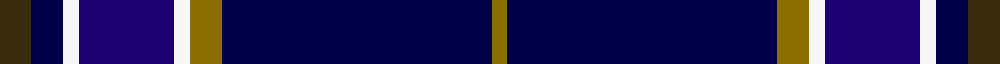

This page is one **sett** — a single exact thread-count. It belongs to the [tartan](/setts/dy2db2w1dbi6w1y2db17y1/)
(the same proportion at any scale), whose colour order is pattern [GBGWBWBG](/stripes/gbgwbwbg/).

Sourced from register-of-tartans.  It is a [8 stripe tartan](/stripes/stripes8/).

Original link https://www.tartanregister.gov.uk/tartanDetails.aspx?ref=10861

## Register references

External register numbers recorded for this tartan.

- Scottish Register of Tartans: [10861](https://www.tartanregister.gov.uk/tartanDetails.aspx?ref=10861)

## Thread count
DY/4 DB4 W2 DBi12 W2 Y4 DB34 Y/2

One full sett is **122 threads**.

## Palette
<table><thead><tr><th>Colour</th><th>Shade</th><th>OKLCh</th></tr></thead><tbody><tr><td>DB</td><td><code style="background-color:#000048;">#000048</code> <small style="color:#888">#000048</small></td><td><small style="color:#888">oklch(18.2% 0.126 264.1)</small></td></tr><tr><td>DBa</td><td><code style="background-color:#1C0070;">#1C0070</code> <small style="color:#888">#1C0070</small></td><td><small style="color:#888">oklch(26.3% 0.162 277.1)</small></td></tr><tr><td>DY</td><td><code style="background-color:#3A2B0D;">#3A2B0D</code> <small style="color:#888">#3A2B0D</small></td><td><small style="color:#888">oklch(30.0% 0.049 82.0)</small></td></tr><tr><td>W</td><td><code style="background-color:#F7F7F7;">#F7F7F7</code> <small style="color:#888">#F7F7F7</small></td><td><small style="color:#888">oklch(97.6% 0.000 89.9)</small></td></tr><tr><td>Y</td><td><code style="background-color:#8B6E00;">#8B6E00</code> <small style="color:#888">#8B6E00</small></td><td><small style="color:#888">oklch(55.1% 0.113 90.4)</small></td></tr></tbody></table>

# Sample pattern

## Nearest variants

The nearest existing variants by ΔTartan distance, with this cloth at the top so the swatches line up against it.

ΔTartan

Threads

Variant

Sett

—

122

<a href="/variants/s8/dy2db2w1dbi6w1y2db17y1~x2~db0705267-dbi1106275/">East Tennessee State University</a>

<a href="/ttd/edit/#slug=y3db34dg5w2dg2w10db4lo3~x2&amp;base=dy2db2w1dbi6w1y2db17y1~x2~db0705267-dbi1106275" title="compare in the TTD">2.40</a>

240

<a href="/variants/s8/y3db34dg5w2dg2w10db4lo3~x2/">Royal Troon Golf Club, The</a>

<a href="/ttd/edit/#slug=t27db9lb3dg6db33lb3dr3y2~x2~t2503227-lb3103284&amp;base=dy2db2w1dbi6w1y2db17y1~x2~db0705267-dbi1106275" title="compare in the TTD">2.46</a>

286

<a href="/variants/s8/t27db9lb3dg6db33lb3dr3y2~x2~t2503227-lb3103284/">Blue Ridge Highlands Heritage (Dist)</a>

<a href="/ttd/edit/#slug=g6n16db49lb14db2w6~x2~n1702249-db1106275&amp;base=dy2db2w1dbi6w1y2db17y1~x2~db0705267-dbi1106275" title="compare in the TTD">2.58</a>

348

<a href="/variants/s6/g6n16db49lb14db2w6~x2~n1702249-db1106275/">Gorman Family (Canada) (Personal)</a>

2.78

—

<a href="/variants/s8/db6w2b2w3db24r1dbi35r2~x2~db0805267-dbi1604274/">Raith Rovers F.C.</a>

<a href="/ttd/edit/#slug=y3db34dg5w2dg2w10db4lr3~x2&amp;base=dy2db2w1dbi6w1y2db17y1~x2~db0705267-dbi1106275" title="compare in the TTD">2.89</a>

240

<a href="/variants/s8/y3db34dg5w2dg2w10db4lr3~x2/">Royal Troon Golf Club, The</a>

<a href="/ttd/edit/#slug=db21n2lr1n2db1dr2db1y6~x4&amp;base=dy2db2w1dbi6w1y2db17y1~x2~db0705267-dbi1106275" title="compare in the TTD">2.95</a>

180

<a href="/variants/s8/db21n2lr1n2db1dr2db1y6~x4/">Blue Rust (Corporate)</a>

## Neighbour map

Every grey dot is one of 13620 variants placed by the first two principal components of the ΔTartan feature space (42% of its variance). Red is this tartan; blue dots are its nearest — click one to open its page.

<svg viewBox="0 0 640 380" role="img" style="max-width:100%;height:auto;border:1px solid #e0e0e0;border-radius:4px;display:block" xmlns="http://www.w3.org/2000/svg"><image href="/nn/cloud.v1.png" width="640" height="380"/><a href="/variants/s8/y3db34dg5w2dg2w10db4lo3~x2/"><circle cx="326.7" cy="142.2" r="4" fill="#3465a4"><title>Royal Troon Golf Club, The</title></circle></a><a href="/variants/s8/t27db9lb3dg6db33lb3dr3y2~x2~t2503227-lb3103284/"><circle cx="300.3" cy="167.5" r="4" fill="#3465a4"><title>Blue Ridge Highlands Heritage (Dist)</title></circle></a><a href="/variants/s6/g6n16db49lb14db2w6~x2~n1702249-db1106275/"><circle cx="312.7" cy="162.7" r="4" fill="#3465a4"><title>Gorman Family (Canada) (Personal)</title></circle></a><a href="/variants/s8/db6w2b2w3db24r1dbi35r2~x2~db0805267-dbi1604274/"><circle cx="322.9" cy="119.4" r="4" fill="#3465a4"><title>Raith Rovers F.C.</title></circle></a><a href="/variants/s8/y3db34dg5w2dg2w10db4lr3~x2/"><circle cx="327.3" cy="142.2" r="4" fill="#3465a4"><title>Royal Troon Golf Club, The</title></circle></a><a href="/variants/s8/db21n2lr1n2db1dr2db1y6~x4/"><circle cx="439.5" cy="150.1" r="4" fill="#3465a4"><title>Blue Rust (Corporate)</title></circle></a><circle cx="354.4" cy="151.4" r="5" fill="#c00000"/><text x="320" y="376" text-anchor="middle" font-size="11" fill="#999">ground</text><text x="11" y="190" text-anchor="middle" font-size="11" fill="#999" transform="rotate(-90 11 190)">complexity</text></svg>

ID: /variants/s8/dy2db2w1dbi6w1y2db17y1~x2~db0705267-dbi1106275/
