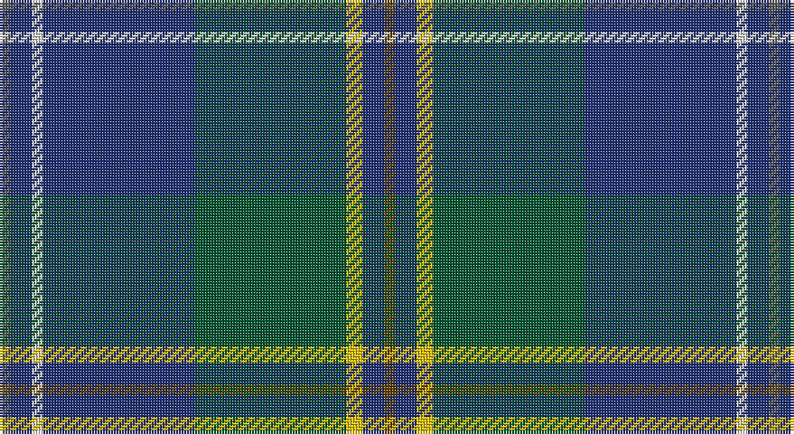

This page is one **sett** — a single exact thread-count. It belongs to the [tartan](/setts/dy2db4ly3dg28db28w2db4n2/)
(the same proportion at any scale), whose colour order is pattern [BBWBGYBG](/stripes/bbwbgybg/).

Sourced from register-of-tartans.  It is a [8 stripe tartan](/stripes/stripes8/).

Original link https://www.tartanregister.gov.uk/tartanDetails.aspx?ref=2060

2 attestations — the source records this cloth was collapsed from (oldest owns this page)

<ul>
<li>01/05/2007 — Laurentian University (register-of-tartans, <a href="https://www.tartanregister.gov.uk/tartanDetails.aspx?ref=2060">record</a>)</li>
<li>May 2007 — Laurentian University (Corporate) (tartans-authority, <a href="http://www.tartansauthority.com/tartan-ferret/display/7324/">record</a>)</li>
</ul>

## Register references

External register numbers recorded for this tartan.

- Scottish Register of Tartans: [2060](https://www.tartanregister.gov.uk/tartanDetails.aspx?ref=2060)
- Scottish Tartans Authority (ITI): 7324

## Thread count
N/4 DB8 LN4 DB56 G56 Y6 DB8 T/4

One full sett is **284 threads**.

## Palette

Palette: <strong>Tartan Register</strong> <small style="color:#888">(3 of 6 colours)</small>
<table><thead><tr><th>Colour</th><th>Threads</th><th>Shade</th><th>Base</th><th>OKLCh</th></tr></thead><tbody><tr><td>N/</td><td style="text-align:right;font-variant-numeric:tabular-nums">4</td><td><code style="background-color:#5C5C5C;">#5C5C5C</code> <small style="color:#888">#5C5C5C</small></td><td>B <code style="background-color:#2A418A;">#2A418A</code></td><td><small style="color:#888">oklch(47.5% 0.000 89.9)</small></td></tr><tr><td>DB</td><td style="text-align:right;font-variant-numeric:tabular-nums">8</td><td><code style="background-color:#203074;">#203074</code> <small style="color:#888">#203074</small></td><td>B <code style="background-color:#2A418A;">#2A418A</code></td><td><small style="color:#888">oklch(34.0% 0.118 269.1)</small></td></tr><tr><td>LN</td><td style="text-align:right;font-variant-numeric:tabular-nums">4</td><td><code style="background-color:#E0E0E0;">#E0E0E0</code> <small style="color:#888">#E0E0E0</small></td><td>W <code style="background-color:#F7F7F7;">#F7F7F7</code></td><td><small style="color:#888">oklch(90.7% 0.000 89.9)</small></td></tr><tr><td>DB</td><td style="text-align:right;font-variant-numeric:tabular-nums">56</td><td><code style="background-color:#203074;">#203074</code> <small style="color:#888">#203074</small></td><td>B <code style="background-color:#2A418A;">#2A418A</code></td><td><small style="color:#888">oklch(34.0% 0.118 269.1)</small></td></tr><tr><td>G</td><td style="text-align:right;font-variant-numeric:tabular-nums">56</td><td><code style="background-color:#005430;">#005430</code> <small style="color:#888">#005430</small></td><td>G <code style="background-color:#006100;">#006100</code></td><td><small style="color:#888">oklch(39.2% 0.094 156.7)</small></td></tr><tr><td>Y</td><td style="text-align:right;font-variant-numeric:tabular-nums">6</td><td><code style="background-color:#E8C000;">#E8C000</code> <small style="color:#888">#E8C000</small></td><td>Y <code style="background-color:#F2BF00;">#F2BF00</code></td><td><small style="color:#888">oklch(81.9% 0.168 93.7)</small></td></tr><tr><td>DB</td><td style="text-align:right;font-variant-numeric:tabular-nums">8</td><td><code style="background-color:#203074;">#203074</code> <small style="color:#888">#203074</small></td><td>B <code style="background-color:#2A418A;">#2A418A</code></td><td><small style="color:#888">oklch(34.0% 0.118 269.1)</small></td></tr><tr><td>T/</td><td style="text-align:right;font-variant-numeric:tabular-nums">4</td><td><code style="background-color:#604000;">#604000</code> <small style="color:#888">#604000</small></td><td>G <code style="background-color:#006100;">#006100</code></td><td><small style="color:#888">oklch(39.8% 0.083 76.8)</small></td></tr></tbody></table>

# Sample pattern

## Nearest tartans

The nearest existing variants by ΔTartan distance, with this tartan at the top so the swatches line up against it.

ΔTartan

Tartan

Sett

—

<a href="/ttd/edit/#slug=dy2db4ly3dg28db28w2db4n2~x2">Laurentian University</a> <a class="nn-out" href="/variants/s8/dy2db4ly3dg28db28w2db4n2~x2/" title="open its dictionary page">↗</a>

1.01

<a href="/ttd/edit/#slug=dt40r4dt10g10y22lo3y4ly3y4~x2&amp;base=dy2db4ly3dg28db28w2db4n2~x2">Keith Stanhope Society (Commem.)</a> <a class="nn-out" href="/variants/s9/dt40r4dt10g10y22lo3y4ly3y4~x2/" title="open its dictionary page">↗</a>

1.06

<a href="/ttd/edit/#slug=r4g73db73k4t4k4db73g73ly4&amp;base=dy2db4ly3dg28db28w2db4n2~x2">Cambridge (Fashion)</a> <a class="nn-out" href="/variants/s9/r4g73db73k4t4k4db73g73ly4/" title="open its dictionary page">↗</a>

1.10

<a href="/ttd/edit/#slug=dt40lb3dt3lb3dt3lb4dg8g8n8w2~x2&amp;base=dy2db4ly3dg28db28w2db4n2~x2">Greenshields, Simon (Personal)</a> <a class="nn-out" href="/variants/s10/dt40lb3dt3lb3dt3lb4dg8g8n8w2~x2/" title="open its dictionary page">↗</a>

1.16

<a href="/ttd/edit/#slug=dg10w2dt3g2m14dti26dg2dti6~x2&amp;base=dy2db4ly3dg28db28w2db4n2~x2">Spirit of Fife (Corporate)</a> <a class="nn-out" href="/variants/s8/dg10w2dt3g2m14dti26dg2dti6~x2/" title="open its dictionary page">↗</a>

1.16

<a href="/ttd/edit/#slug=db60loi3db5lo5db9do20loi4g32lb4~x2&amp;base=dy2db4ly3dg28db28w2db4n2~x2">State Seal of Ohio (Fashion)</a> <a class="nn-out" href="/variants/s9/db60loi3db5lo5db9do20loi4g32lb4~x2/" title="open its dictionary page">↗</a>

1.16

<a href="/ttd/edit/#slug=r4dg4k2dg29db21k3db3ly3~x2&amp;base=dy2db4ly3dg28db28w2db4n2~x2">Peter of Lee (Chief) (Personal)</a> <a class="nn-out" href="/variants/s8/r4dg4k2dg29db21k3db3ly3~x2/" title="open its dictionary page">↗</a>

1.17

<a href="/ttd/edit/#slug=k3r3dg4db7k3dt39db15w3~x2&amp;base=dy2db4ly3dg28db28w2db4n2~x2">American National</a> <a class="nn-out" href="/variants/s8/k3r3dg4db7k3dt39db15w3~x2/" title="open its dictionary page">↗</a>

1.17

<a href="/ttd/edit/#slug=dbi4db3r2db26k3dbi3g3dbi3g17lo3~x2&amp;base=dy2db4ly3dg28db28w2db4n2~x2">Boyle (Personal)</a> <a class="nn-out" href="/variants/s10/dbi4db3r2db26k3dbi3g3dbi3g17lo3~x2/" title="open its dictionary page">↗</a>

1.18

<a href="/ttd/edit/#slug=db4t3db6k2dbi12g2dbi2g24lb2~x2&amp;base=dy2db4ly3dg28db28w2db4n2~x2">Halcrow Howell (Name)</a> <a class="nn-out" href="/variants/s9/db4t3db6k2dbi12g2dbi2g24lb2~x2/" title="open its dictionary page">↗</a>

1.24

<a href="/ttd/edit/#slug=db30n10y10db5r3ly3g3~x2&amp;base=dy2db4ly3dg28db28w2db4n2~x2">Wrigglesworth Family Canada (Personal)</a> <a class="nn-out" href="/variants/s7/db30n10y10db5r3ly3g3~x2/" title="open its dictionary page">↗</a>

## Neighbour map

Every grey dot is one of 14360 variants placed by the first two principal components of the ΔTartan feature space (44% of its variance). Red is this tartan; blue dots are its nearest — click one to open its page.

<svg viewBox="0 0 640 380" role="img" style="max-width:100%;height:auto;border:1px solid #e0e0e0;border-radius:4px;display:block" xmlns="http://www.w3.org/2000/svg"><image href="/nn/cloud.v1.png" width="640" height="380"/><a href="/variants/s9/dt40r4dt10g10y22lo3y4ly3y4~x2/"><circle cx="278.3" cy="164.3" r="4" fill="#3465a4"><title>Keith Stanhope Society (Commem.)</title></circle></a><a href="/variants/s9/r4g73db73k4t4k4db73g73ly4/"><circle cx="300.6" cy="160.2" r="4" fill="#3465a4"><title>Cambridge (Fashion)</title></circle></a><a href="/variants/s10/dt40lb3dt3lb3dt3lb4dg8g8n8w2~x2/"><circle cx="311.0" cy="124.1" r="4" fill="#3465a4"><title>Greenshields, Simon (Personal)</title></circle></a><a href="/variants/s8/dg10w2dt3g2m14dti26dg2dti6~x2/"><circle cx="252.2" cy="168.3" r="4" fill="#3465a4"><title>Spirit of Fife (Corporate)</title></circle></a><a href="/variants/s9/db60loi3db5lo5db9do20loi4g32lb4~x2/"><circle cx="285.6" cy="132.1" r="4" fill="#3465a4"><title>State Seal of Ohio (Fashion)</title></circle></a><a href="/variants/s8/r4dg4k2dg29db21k3db3ly3~x2/"><circle cx="297.5" cy="177.0" r="4" fill="#3465a4"><title>Peter of Lee (Chief) (Personal)</title></circle></a><a href="/variants/s8/k3r3dg4db7k3dt39db15w3~x2/"><circle cx="292.9" cy="163.2" r="4" fill="#3465a4"><title>American National</title></circle></a><a href="/variants/s10/dbi4db3r2db26k3dbi3g3dbi3g17lo3~x2/"><circle cx="243.8" cy="157.4" r="4" fill="#3465a4"><title>Boyle (Personal)</title></circle></a><a href="/variants/s9/db4t3db6k2dbi12g2dbi2g24lb2~x2/"><circle cx="228.4" cy="160.1" r="4" fill="#3465a4"><title>Halcrow Howell (Name)</title></circle></a><a href="/variants/s7/db30n10y10db5r3ly3g3~x2/"><circle cx="275.2" cy="181.9" r="4" fill="#3465a4"><title>Wrigglesworth Family Canada (Personal)</title></circle></a><circle cx="300.5" cy="161.4" r="5" fill="#c00000"/></svg>

ID: /variants/s8/dy2db4ly3dg28db28w2db4n2~x2/
