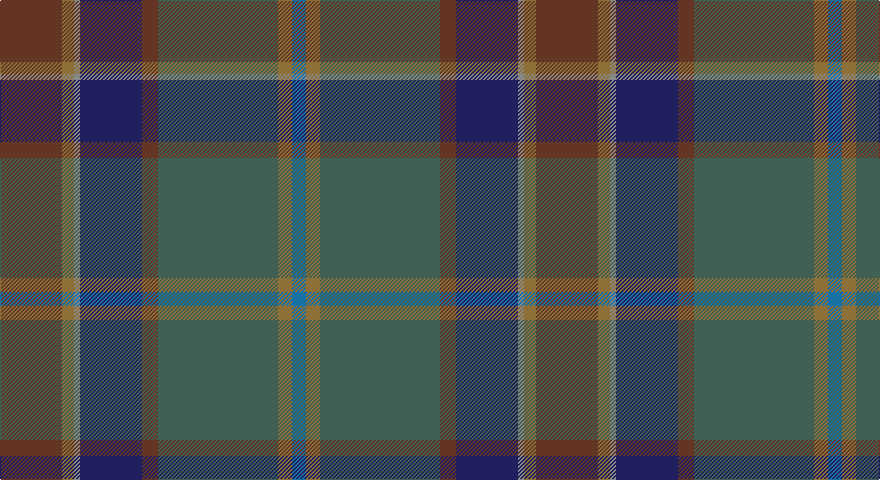

This page is one **sett** — a single exact thread-count. It belongs to the [tartan](/setts/dy31y6o3db31dy8yi60y7b7/)
(the same proportion at any scale), whose colour order is pattern [BGGGBRGG](/stripes/bgggbrgg/).

Part of the [Little-Dowse Wedding](/tartans/little-dowse-wedding/) tartan — the named design grouping this sett with its other cloths.

Sourced from tartans-authority.  It is a [8 stripe tartan](/stripes/stripes8/).

Original link http://www.tartansauthority.com/tartan-ferret/display/11075/

## Register references

External register numbers recorded for this tartan.

- Scottish Register of Tartans: [11075](https://www.tartanregister.gov.uk/tartanDetails?ref=11075)
- Scottish Tartans Authority (ITI): 11075

## Thread count
T/62 LT12 N6 DB62 T16 Na120 LT14 B/14

One full sett is **536 threads**.

## Palette

Palette: <strong>Tartan Register</strong> <small style="color:#888">(4 of 6 colours)</small>
<table><thead><tr><th>Colour</th><th>Threads</th><th>Shade</th><th>Base</th><th>OKLCh</th></tr></thead><tbody><tr><td>T/</td><td style="text-align:right;font-variant-numeric:tabular-nums">62</td><td><code style="background-color:#643424;">#643424</code> <small style="color:#888">#643424</small></td><td>G <code style="background-color:#006100;">#006100</code></td><td><small style="color:#888">oklch(38.3% 0.074 39.1)</small></td></tr><tr><td>LT</td><td style="text-align:right;font-variant-numeric:tabular-nums">12</td><td><code style="background-color:#8C7038;">#8C7038</code> <small style="color:#888">#8C7038</small></td><td>G <code style="background-color:#006100;">#006100</code></td><td><small style="color:#888">oklch(56.0% 0.082 83.0)</small></td></tr><tr><td>N</td><td style="text-align:right;font-variant-numeric:tabular-nums">6</td><td><code style="background-color:#888888;">#888888</code> <small style="color:#888">#888888</small></td><td>R <code style="background-color:#CC0000;">#CC0000</code></td><td><small style="color:#888">oklch(62.7% 0.000 89.9)</small></td></tr><tr><td>DB</td><td style="text-align:right;font-variant-numeric:tabular-nums">62</td><td><code style="background-color:#202060;">#202060</code> <small style="color:#888">#202060</small></td><td>B <code style="background-color:#2A418A;">#2A418A</code></td><td><small style="color:#888">oklch(28.9% 0.111 276.9)</small></td></tr><tr><td>T</td><td style="text-align:right;font-variant-numeric:tabular-nums">16</td><td><code style="background-color:#643424;">#643424</code> <small style="color:#888">#643424</small></td><td>G <code style="background-color:#006100;">#006100</code></td><td><small style="color:#888">oklch(38.3% 0.074 39.1)</small></td></tr><tr><td>Na</td><td style="text-align:right;font-variant-numeric:tabular-nums">120</td><td><code style="background-color:#406054;">#406054</code> <small style="color:#888">#406054</small></td><td>G <code style="background-color:#006100;">#006100</code></td><td><small style="color:#888">oklch(46.0% 0.042 169.0)</small></td></tr><tr><td>LT</td><td style="text-align:right;font-variant-numeric:tabular-nums">14</td><td><code style="background-color:#8C7038;">#8C7038</code> <small style="color:#888">#8C7038</small></td><td>G <code style="background-color:#006100;">#006100</code></td><td><small style="color:#888">oklch(56.0% 0.082 83.0)</small></td></tr><tr><td>B/</td><td style="text-align:right;font-variant-numeric:tabular-nums">14</td><td><code style="background-color:#1870A4;">#1870A4</code> <small style="color:#888">#1870A4</small></td><td>B <code style="background-color:#2A418A;">#2A418A</code></td><td><small style="color:#888">oklch(52.2% 0.113 241.2)</small></td></tr></tbody></table>

# Sample pattern

## Compared to the master

This cloth is one sett of its design; the master sett (the exemplar the design is anchored on) is below for comparison.

<figure style="margin:0"><figcaption style="color:#888;font-size:smaller">this sett</figcaption></figure>
<figure style="margin:0"><figcaption style="color:#888;font-size:smaller"><a href="/setts/do31lo6lr3db36do8dg60lo7t7/">master sett →</a></figcaption></figure>

## Nearest tartans

The nearest existing variants by ΔTartan distance, with this tartan at the top so the swatches line up against it.

ΔTartan

Tartan

Sett

—

<a href="/ttd/edit/#slug=dy31y6o3db31dy8yi60y7b7~x2">Little-Dowse Wedding</a> <a class="nn-out" href="/variants/s8/dy31y6o3db31dy8yi60y7b7~x2/" title="open its dictionary page">↗</a>

1.01

<a href="/ttd/edit/#slug=do31lo6lr3db36do8dg60lo7t7~x2&amp;base=dy31y6o3db31dy8yi60y7b7~x2">Little-Dowse Wedding</a> <a class="nn-out" href="/variants/s8/do31lo6lr3db36do8dg60lo7t7~x2/" title="open its dictionary page">↗</a>

1.18

<a href="/ttd/edit/#slug=o7dg20y2dg4k5db4k2db20k3w1~x2&amp;base=dy31y6o3db31dy8yi60y7b7~x2">McMeeken</a> <a class="nn-out" href="/variants/s10/o7dg20y2dg4k5db4k2db20k3w1~x2/" title="open its dictionary page">↗</a>

1.50

<a href="/ttd/edit/#slug=dpi10k2dg10dp30dg30dgi55k4r8&amp;base=dy31y6o3db31dy8yi60y7b7~x2">Batten of Argyll (Baddenach)</a> <a class="nn-out" href="/variants/s8/dpi10k2dg10dp30dg30dgi55k4r8/" title="open its dictionary page">↗</a>

1.55

<a href="/ttd/edit/#slug=n8k2o26lo1o6k3dg10lg1k3n22lg1~x2&amp;base=dy31y6o3db31dy8yi60y7b7~x2">Faulkner (Personal)</a> <a class="nn-out" href="/variants/s11/n8k2o26lo1o6k3dg10lg1k3n22lg1~x2/" title="open its dictionary page">↗</a>

1.62

<a href="/variants/s7/o5r8dp13dgi21dg34dgii55o3/">Lunting Papi (Personal)</a>

1.62

<a href="/ttd/edit/#slug=n3dgi10n2dt25do3lr4do3dg10dt3n2lr3n1~x2&amp;base=dy31y6o3db31dy8yi60y7b7~x2">Bowhunter</a> <a class="nn-out" href="/variants/s12/n3dgi10n2dt25do3lr4do3dg10dt3n2lr3n1~x2/" title="open its dictionary page">↗</a>

1.63

<a href="/ttd/edit/#slug=dy20dp2dy2dp2dy3dp8dg9g8y8dg1lr2~x2&amp;base=dy31y6o3db31dy8yi60y7b7~x2">Isle of Skye District Tartan</a> <a class="nn-out" href="/variants/s11/dy20dp2dy2dp2dy3dp8dg9g8y8dg1lr2~x2/" title="open its dictionary page">↗</a>

1.63

<a href="/ttd/edit/#slug=db9k2db4k2dr6o3dy2db2dr11dy23t1k8~x2&amp;base=dy31y6o3db31dy8yi60y7b7~x2">Kelvin Family (Personal)</a> <a class="nn-out" href="/variants/s12/db9k2db4k2dr6o3dy2db2dr11dy23t1k8~x2/" title="open its dictionary page">↗</a>

1.65

<a href="/ttd/edit/#slug=r1dy2dt12dy8db16lo1~x2&amp;base=dy31y6o3db31dy8yi60y7b7~x2">Bobby Jones (Personal)</a> <a class="nn-out" href="/variants/s6/r1dy2dt12dy8db16lo1~x2/" title="open its dictionary page">↗</a>

1.66

<a href="/ttd/edit/#slug=db2r1dg26ly1k18db26y1r1db2~x2&amp;base=dy31y6o3db31dy8yi60y7b7~x2">Robb Hunting (Personal)</a> <a class="nn-out" href="/variants/s9/db2r1dg26ly1k18db26y1r1db2~x2/" title="open its dictionary page">↗</a>

## Neighbour map

Every grey dot is one of 14360 variants placed by the first two principal components of the ΔTartan feature space (44% of its variance). Red is this tartan; blue dots are its nearest — click one to open its page.

<svg viewBox="0 0 640 380" role="img" style="max-width:100%;height:auto;border:1px solid #e0e0e0;border-radius:4px;display:block" xmlns="http://www.w3.org/2000/svg"><image href="/nn/cloud.v1.png" width="640" height="380"/><a href="/variants/s8/do31lo6lr3db36do8dg60lo7t7~x2/"><circle cx="254.2" cy="177.3" r="4" fill="#3465a4"><title>Little-Dowse Wedding</title></circle></a><a href="/variants/s10/o7dg20y2dg4k5db4k2db20k3w1~x2/"><circle cx="253.2" cy="170.1" r="4" fill="#3465a4"><title>McMeeken</title></circle></a><a href="/variants/s8/dpi10k2dg10dp30dg30dgi55k4r8/"><circle cx="256.0" cy="168.3" r="4" fill="#3465a4"><title>Batten of Argyll (Baddenach)</title></circle></a><a href="/variants/s11/n8k2o26lo1o6k3dg10lg1k3n22lg1~x2/"><circle cx="310.4" cy="149.8" r="4" fill="#3465a4"><title>Faulkner (Personal)</title></circle></a><a href="/variants/s7/o5r8dp13dgi21dg34dgii55o3/"><circle cx="283.9" cy="218.2" r="4" fill="#3465a4"><title>Lunting Papi (Personal)</title></circle></a><a href="/variants/s12/n3dgi10n2dt25do3lr4do3dg10dt3n2lr3n1~x2/"><circle cx="252.1" cy="133.0" r="4" fill="#3465a4"><title>Bowhunter</title></circle></a><a href="/variants/s11/dy20dp2dy2dp2dy3dp8dg9g8y8dg1lr2~x2/"><circle cx="227.7" cy="155.2" r="4" fill="#3465a4"><title>Isle of Skye District Tartan</title></circle></a><a href="/variants/s12/db9k2db4k2dr6o3dy2db2dr11dy23t1k8~x2/"><circle cx="242.8" cy="150.3" r="4" fill="#3465a4"><title>Kelvin Family (Personal)</title></circle></a><a href="/variants/s6/r1dy2dt12dy8db16lo1~x2/"><circle cx="306.2" cy="229.7" r="4" fill="#3465a4"><title>Bobby Jones (Personal)</title></circle></a><a href="/variants/s9/db2r1dg26ly1k18db26y1r1db2~x2/"><circle cx="311.1" cy="160.8" r="4" fill="#3465a4"><title>Robb Hunting (Personal)</title></circle></a><circle cx="285.8" cy="185.7" r="5" fill="#c00000"/></svg>

ID: /variants/s8/dy31y6o3db31dy8yi60y7b7~x2/
