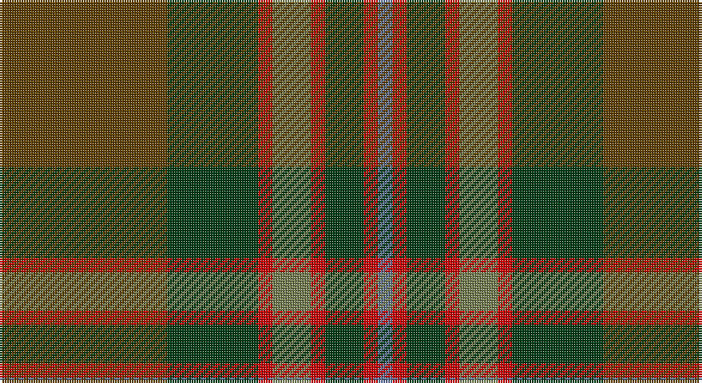

This page is one **sett** — a single exact thread-count. It belongs to the [tartan](/setts/dy35dg19r3y8r3dg8r3t3/)
(the same proportion at any scale), whose colour order is pattern [BRGRGRGG](/stripes/brgrgrgg/).

Part of the [John Muir Way](/tartans/john-muir-way/) tartan — the named design grouping this sett with its other cloths.

Sourced from register-of-tartans.  It is a [8 stripe tartan](/stripes/stripes8/).

Original link https://www.tartanregister.gov.uk/tartanDetails.aspx?ref=11022

## Register references

External register numbers recorded for this tartan.

- Scottish Register of Tartans: [11022](https://www.tartanregister.gov.uk/tartanDetails.aspx?ref=11022)

## Thread count
T/70 DG38 R6 G16 R6 DG16 R6 B/6

One full sett is **252 threads**.

## Palette

Palette: <strong>Tartan Register</strong>
<table><thead><tr><th>Colour</th><th>Threads</th><th>Shade</th><th>Base</th><th>OKLCh</th></tr></thead><tbody><tr><td>T/</td><td style="text-align:right;font-variant-numeric:tabular-nums">70</td><td><code style="background-color:#604000;">#604000</code> <small style="color:#888">#604000</small></td><td>G <code style="background-color:#006100;">#006100</code></td><td><small style="color:#888">oklch(39.8% 0.083 76.8)</small></td></tr><tr><td>DG</td><td style="text-align:right;font-variant-numeric:tabular-nums">38</td><td><code style="background-color:#003C14;">#003C14</code> <small style="color:#888">#003C14</small></td><td>G <code style="background-color:#006100;">#006100</code></td><td><small style="color:#888">oklch(31.1% 0.089 148.5)</small></td></tr><tr><td>R</td><td style="text-align:right;font-variant-numeric:tabular-nums">6</td><td><code style="background-color:#C80000;">#C80000</code> <small style="color:#888">#C80000</small></td><td>R <code style="background-color:#CC0000;">#CC0000</code></td><td><small style="color:#888">oklch(52.3% 0.215 29.2)</small></td></tr><tr><td>G</td><td style="text-align:right;font-variant-numeric:tabular-nums">16</td><td><code style="background-color:#767E52;">#767E52</code> <small style="color:#888">#767E52</small></td><td>G <code style="background-color:#006100;">#006100</code></td><td><small style="color:#888">oklch(57.5% 0.064 116.8)</small></td></tr><tr><td>R</td><td style="text-align:right;font-variant-numeric:tabular-nums">6</td><td><code style="background-color:#C80000;">#C80000</code> <small style="color:#888">#C80000</small></td><td>R <code style="background-color:#CC0000;">#CC0000</code></td><td><small style="color:#888">oklch(52.3% 0.215 29.2)</small></td></tr><tr><td>DG</td><td style="text-align:right;font-variant-numeric:tabular-nums">16</td><td><code style="background-color:#003C14;">#003C14</code> <small style="color:#888">#003C14</small></td><td>G <code style="background-color:#006100;">#006100</code></td><td><small style="color:#888">oklch(31.1% 0.089 148.5)</small></td></tr><tr><td>R</td><td style="text-align:right;font-variant-numeric:tabular-nums">6</td><td><code style="background-color:#C80000;">#C80000</code> <small style="color:#888">#C80000</small></td><td>R <code style="background-color:#CC0000;">#CC0000</code></td><td><small style="color:#888">oklch(52.3% 0.215 29.2)</small></td></tr><tr><td>B/</td><td style="text-align:right;font-variant-numeric:tabular-nums">6</td><td><code style="background-color:#5F749C;">#5F749C</code> <small style="color:#888">#5F749C</small></td><td>B <code style="background-color:#2A418A;">#2A418A</code></td><td><small style="color:#888">oklch(55.8% 0.067 262.9)</small></td></tr></tbody></table>

# Sample pattern

## Nearest tartans

The nearest existing variants by ΔTartan distance, with this tartan at the top so the swatches line up against it.

ΔTartan

Tartan

Sett

—

<a href="/ttd/edit/#slug=dy35dg19r3y8r3dg8r3t3~x2">John Muir Way</a> <a class="nn-out" href="/variants/s8/dy35dg19r3y8r3dg8r3t3~x2/" title="open its dictionary page">↗</a>

0.37

<a href="/ttd/edit/#slug=dy35dg19r3g8r3dg8r3db3~x2&amp;base=dy35dg19r3y8r3dg8r3t3~x2">John Muir Way</a> <a class="nn-out" href="/variants/s8/dy35dg19r3g8r3dg8r3db3~x2/" title="open its dictionary page">↗</a>

0.45

<a href="/ttd/edit/#slug=do6lg3do18dy2do2dy10y28r2y4~x2&amp;base=dy35dg19r3y8r3dg8r3t3~x2">Scottish Crofting Foundation</a> <a class="nn-out" href="/variants/s9/do6lg3do18dy2do2dy10y28r2y4~x2/" title="open its dictionary page">↗</a>

0.73

<a href="/ttd/edit/#slug=r4g46r10db10dy33db5dy4lo3~x2&amp;base=dy35dg19r3y8r3dg8r3t3~x2">State Seal of Minnesota (Fashion)</a> <a class="nn-out" href="/variants/s8/r4g46r10db10dy33db5dy4lo3~x2/" title="open its dictionary page">↗</a>

1.06

<a href="/ttd/edit/#slug=g1r7g7n2r1dg15lb1~x4&amp;base=dy35dg19r3y8r3dg8r3t3~x2">Ramsay (Green Fashion)</a> <a class="nn-out" href="/variants/s7/g1r7g7n2r1dg15lb1~x4/" title="open its dictionary page">↗</a>

1.11

<a href="/ttd/edit/#slug=g3dy4g2dy22n5r16ly3~x2&amp;base=dy35dg19r3y8r3dg8r3t3~x2">Pubcrawlers (Corporate)</a> <a class="nn-out" href="/variants/s7/g3dy4g2dy22n5r16ly3~x2/" title="open its dictionary page">↗</a>

1.11

<a href="/ttd/edit/#slug=r2dg3dy18r2dy2r21y6dg2y2dg24lo2~x2&amp;base=dy35dg19r3y8r3dg8r3t3~x2">Methven</a> <a class="nn-out" href="/variants/s11/r2dg3dy18r2dy2r21y6dg2y2dg24lo2~x2/" title="open its dictionary page">↗</a>

1.12

<a href="/ttd/edit/#slug=dy7k1dg1r1k1r7dg15k1lo1~x4&amp;base=dy35dg19r3y8r3dg8r3t3~x2">Cozumel</a> <a class="nn-out" href="/variants/s9/dy7k1dg1r1k1r7dg15k1lo1~x4/" title="open its dictionary page">↗</a>

1.29

<a href="/ttd/edit/#slug=g4r1db2r1g10y5r3y10ly1~x4&amp;base=dy35dg19r3y8r3dg8r3t3~x2">Moncton, City of</a> <a class="nn-out" href="/variants/s9/g4r1db2r1g10y5r3y10ly1~x4/" title="open its dictionary page">↗</a>

1.32

<a href="/ttd/edit/#slug=r4n38k4n6k41dg62y4&amp;base=dy35dg19r3y8r3dg8r3t3~x2">Bennett, John Paul (Personal)</a> <a class="nn-out" href="/variants/s7/r4n38k4n6k41dg62y4/" title="open its dictionary page">↗</a>

1.35

<a href="/ttd/edit/#slug=dy16r16lr3dg16o2r1o2dy6r2~x4&amp;base=dy35dg19r3y8r3dg8r3t3~x2">Henry, W. A.</a> <a class="nn-out" href="/variants/s9/dy16r16lr3dg16o2r1o2dy6r2~x4/" title="open its dictionary page">↗</a>

## Neighbour map

Every grey dot is one of 14360 variants placed by the first two principal components of the ΔTartan feature space (44% of its variance). Red is this tartan; blue dots are its nearest — click one to open its page.

<svg viewBox="0 0 640 380" role="img" style="max-width:100%;height:auto;border:1px solid #e0e0e0;border-radius:4px;display:block" xmlns="http://www.w3.org/2000/svg"><image href="/nn/cloud.v1.png" width="640" height="380"/><a href="/variants/s8/dy35dg19r3g8r3dg8r3db3~x2/"><circle cx="300.3" cy="205.9" r="4" fill="#3465a4"><title>John Muir Way</title></circle></a><a href="/variants/s9/do6lg3do18dy2do2dy10y28r2y4~x2/"><circle cx="309.6" cy="194.6" r="4" fill="#3465a4"><title>Scottish Crofting Foundation</title></circle></a><a href="/variants/s8/r4g46r10db10dy33db5dy4lo3~x2/"><circle cx="289.3" cy="195.3" r="4" fill="#3465a4"><title>State Seal of Minnesota (Fashion)</title></circle></a><a href="/variants/s7/g1r7g7n2r1dg15lb1~x4/"><circle cx="314.2" cy="212.4" r="4" fill="#3465a4"><title>Ramsay (Green Fashion)</title></circle></a><a href="/variants/s7/g3dy4g2dy22n5r16ly3~x2/"><circle cx="316.8" cy="215.8" r="4" fill="#3465a4"><title>Pubcrawlers (Corporate)</title></circle></a><a href="/variants/s11/r2dg3dy18r2dy2r21y6dg2y2dg24lo2~x2/"><circle cx="251.4" cy="180.1" r="4" fill="#3465a4"><title>Methven</title></circle></a><a href="/variants/s9/dy7k1dg1r1k1r7dg15k1lo1~x4/"><circle cx="309.3" cy="174.6" r="4" fill="#3465a4"><title>Cozumel</title></circle></a><a href="/variants/s9/g4r1db2r1g10y5r3y10ly1~x4/"><circle cx="256.7" cy="209.1" r="4" fill="#3465a4"><title>Moncton, City of</title></circle></a><a href="/variants/s7/r4n38k4n6k41dg62y4/"><circle cx="291.6" cy="212.1" r="4" fill="#3465a4"><title>Bennett, John Paul (Personal)</title></circle></a><a href="/variants/s9/dy16r16lr3dg16o2r1o2dy6r2~x4/"><circle cx="237.8" cy="183.3" r="4" fill="#3465a4"><title>Henry, W. A.</title></circle></a><circle cx="301.9" cy="206.3" r="5" fill="#c00000"/></svg>

ID: /variants/s8/dy35dg19r3y8r3dg8r3t3~x2/
