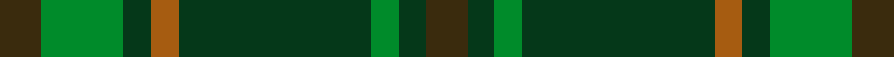

This is one **variant** — a specific cloth: this exact thread count and colourway, with its own
provenance below. It is one weaving of the [sett](/setts/dy3g6dg2o2dg14g2dg2dy3/) (the scale-free proportion — the
same cloth at any scale or shade), whose colour order is pattern [GGGGRGGG](/stripes/ggggrggg/).

Sourced from register-of-tartans.  It is a [8 stripe tartan](/stripes/stripes8/).

Original link [https://www.tartanregister.gov.uk/tartanDetails.aspx?ref=872](https://www.tartanregister.gov.uk/tartanDetails.aspx?ref=872)

Dataset <small>— provenance for this record, inherited from the source manifest</small>

<dl class="dataset-prov">
<dt>source</dt><dd><a href="/sources/register-of-tartans/">Scottish Register of Tartans</a></dd>
<dt>data captured from</dt><dd><a href="https://github.com/thetartan/tartan-database/blob/master/data/register-of-tartans/data.csv">https://github.com/thetartan/tartan-database/blob/master/data/register-of-tartans/data.csv</a></dd>
<dt>data date</dt><dd>2002 <small>(this record)</small></dd>
<dt>licence</dt><dd><a href="https://www.tartanregister.gov.uk/copyright">Crown copyright</a></dd>
</dl>

Capture chain <small>— the hands this data passed through, oldest first; each capture carries its own licence</small>

<ol class="capture-chain">
<li><a href="https://www.tartanregister.gov.uk/">Scottish Register of Tartans</a> · <a href="https://www.tartanregister.gov.uk/copyright">Crown copyright</a> <small>the living register — still published by National Records of Scotland</small></li>
<li><a href="https://github.com/thetartan/tartan-database">thetartan/tartan-database</a> <small>2016-2017</small> · <a href="https://creativecommons.org/licenses/by-nc-nd/4.0/">CC BY-NC-ND 4.0</a> <small>Levko Kravets's frozen compilation — the capture we vendored, and where its CC licence text came from</small></li>
<li>this dictionary <small>captured 2026-06-10 · commit 5bf86c7566</small> <small>each re-capture is a git commit to data/sources</small></li>
</ol>

## Register references

External register numbers recorded for this tartan.

- Scottish Register of Tartans: [872](https://www.tartanregister.gov.uk/tartanDetails.aspx?ref=872)
- Scottish Tartans Authority (ITI): 1732
- Scottish Tartans World Register: 1732

## Thread count
DY/6 G12 DG4 O4 DG28 G4 DG4 DY/6

One full sett is **124 threads**.

## Palette
<table><thead><tr><th>Colour</th><th>Shade</th><th>OKLCh</th></tr></thead><tbody><tr><td>DG</td><td><code style="background-color:#053819;">#053819</code> <small style="color:#888">#053819</small></td><td><small style="color:#888">oklch(30.0% 0.075 151.3)</small></td></tr><tr><td>G</td><td><code style="background-color:#008B2A;">#008B2A</code> <small style="color:#888">#008B2A</small></td><td><small style="color:#888">oklch(55.4% 0.170 145.9)</small></td></tr><tr><td>O</td><td><code style="background-color:#A65C11;">#A65C11</code> <small style="color:#888">#A65C11</small></td><td><small style="color:#888">oklch(55.0% 0.125 58.3)</small></td></tr><tr><td>DY</td><td><code style="background-color:#3A2B0D;">#3A2B0D</code> <small style="color:#888">#3A2B0D</small></td><td><small style="color:#888">oklch(30.0% 0.049 82.0)</small></td></tr></tbody></table>

# Sample pattern

## Nearest tartan variants

The nearest existing variants by ΔTartan distance, with this cloth at the top so the swatches line up against it.

ΔTartan

Threads

Variant

Sett

—

124

<a href="/variants/s8/dy3g6dg2o2dg14g2dg2dy3~x2/">Daks (Muted Loden)</a>

<a href="/ttd/edit/#slug=dg5dt2dg18ly2dt5ly2o5dt17dg2ly4~x2&amp;base=dy3g6dg2o2dg14g2dg2dy3~x2" title="compare in the TTD">3.02</a>

230

<a href="/variants/s10/dg5dt2dg18ly2dt5ly2o5dt17dg2ly4~x2/">Antrim, County</a>

<a href="/ttd/edit/#slug=dy5r3dy31dg20dy3g22r5~x2&amp;base=dy3g6dg2o2dg14g2dg2dy3~x2" title="compare in the TTD">3.60</a>

336

<a href="/variants/s7/dy5r3dy31dg20dy3g22r5~x2/">Ballantrae (Dalgety)</a>

<a href="/ttd/edit/#slug=g4dg18dgi6dg6dgi24ly3~x2~dgi1605139&amp;base=dy3g6dg2o2dg14g2dg2dy3~x2" title="compare in the TTD">3.61</a>

230

<a href="/variants/s6/g4dg18dgi6dg6dgi24ly3~x2~dgi1605139/">Park (Estate Check)</a>

<a href="/ttd/edit/#slug=dy10r5dy62dg40dy5g44r10&amp;base=dy3g6dg2o2dg14g2dg2dy3~x2" title="compare in the TTD">3.74</a>

332

<a href="/variants/s7/dy10r5dy62dg40dy5g44r10/">Ballintrae Trade Tartan</a>

<a href="/ttd/edit/#slug=g25y6dg5r3y10~x4&amp;base=dy3g6dg2o2dg14g2dg2dy3~x2" title="compare in the TTD">3.83</a>

252

<a href="/variants/s5/g25y6dg5r3y10~x4/">Pendlebury, Andrew (Personal)</a>

## Neighbour map

Every grey dot is one of 13621 variants placed by the first two principal components of the ΔTartan feature space (42% of its variance). Red is this tartan; blue dots are its nearest — click one to open its page.

<svg viewBox="0 0 640 380" role="img" style="max-width:100%;height:auto;border:1px solid #e0e0e0;border-radius:4px;display:block" xmlns="http://www.w3.org/2000/svg"><image href="/nn/cloud.v1.png" width="640" height="380"/><a href="/variants/s10/dg5dt2dg18ly2dt5ly2o5dt17dg2ly4~x2/"><circle cx="268.4" cy="215.4" r="4" fill="#3465a4"><title>Antrim, County</title></circle></a><a href="/variants/s7/dy5r3dy31dg20dy3g22r5~x2/"><circle cx="301.3" cy="236.1" r="4" fill="#3465a4"><title>Ballantrae (Dalgety)</title></circle></a><a href="/variants/s6/g4dg18dgi6dg6dgi24ly3~x2~dgi1605139/"><circle cx="418.4" cy="295.6" r="4" fill="#3465a4"><title>Park (Estate Check)</title></circle></a><a href="/variants/s7/dy10r5dy62dg40dy5g44r10/"><circle cx="309.6" cy="228.3" r="4" fill="#3465a4"><title>Ballintrae Trade Tartan</title></circle></a><a href="/variants/s5/g25y6dg5r3y10~x4/"><circle cx="394.9" cy="280.1" r="4" fill="#3465a4"><title>Pendlebury, Andrew (Personal)</title></circle></a><circle cx="371.8" cy="251.5" r="5" fill="#c00000"/><text x="320" y="376" text-anchor="middle" font-size="11" fill="#999">ground</text><text x="11" y="190" text-anchor="middle" font-size="11" fill="#999" transform="rotate(-90 11 190)">complexity</text></svg>

ID: /variants/s8/dy3g6dg2o2dg14g2dg2dy3~x2/
