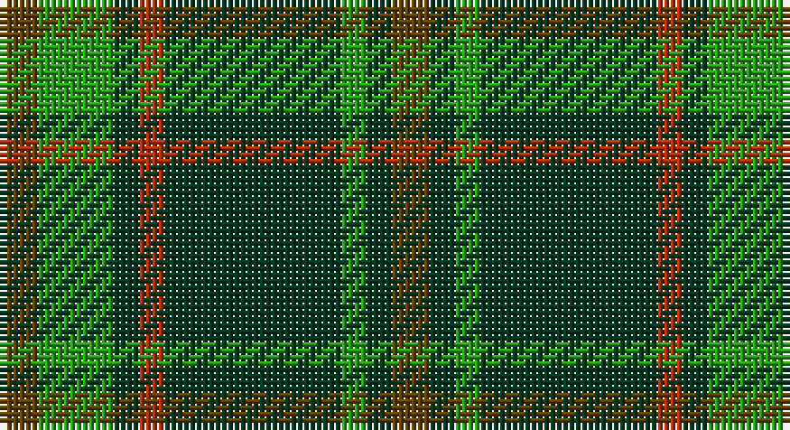

This page is one **sett** — a single exact thread-count. It belongs to the [tartan](/setts/dy3g6dg2r2dg14g2dg2dy3/)
(the same proportion at any scale), whose colour order is pattern [GGGGRGGG](/stripes/ggggrggg/).

Part of the [Daks](/tartans/daks/) tartan — the named design grouping this sett with its other cloths.

Sourced from register-of-tartans.  It is a [8 stripe tartan](/stripes/stripes8/).

Original link https://www.tartanregister.gov.uk/tartanDetails.aspx?ref=872

## Also known as

This cloth is also recorded under:

- Daks Muted blue
- Daks, Black
- Daks, Muted blue

## Register references

External register numbers recorded for this tartan.

- Scottish Register of Tartans: [872](https://www.tartanregister.gov.uk/tartanDetails.aspx?ref=872)
- Scottish Tartans Authority (ITI): 1732
- Scottish Tartans World Register: 1732

## Thread count
T/6 G12 DG4 R4 DG28 G4 DG4 T/6

One full sett is **124 threads**.

## Palette

Palette: <strong>Tartan Register</strong>
<table><thead><tr><th>Colour</th><th>Threads</th><th>Shade</th><th>Base</th><th>OKLCh</th></tr></thead><tbody><tr><td>T/</td><td style="text-align:right;font-variant-numeric:tabular-nums">6</td><td><code style="background-color:#604000;">#604000</code> <small style="color:#888">#604000</small></td><td>G <code style="background-color:#006100;">#006100</code></td><td><small style="color:#888">oklch(39.8% 0.083 76.8)</small></td></tr><tr><td>G</td><td style="text-align:right;font-variant-numeric:tabular-nums">12</td><td><code style="background-color:#289C18;">#289C18</code> <small style="color:#888">#289C18</small></td><td>G <code style="background-color:#006100;">#006100</code></td><td><small style="color:#888">oklch(60.6% 0.191 141.6)</small></td></tr><tr><td>DG</td><td style="text-align:right;font-variant-numeric:tabular-nums">4</td><td><code style="background-color:#003820;">#003820</code> <small style="color:#888">#003820</small></td><td>G <code style="background-color:#006100;">#006100</code></td><td><small style="color:#888">oklch(30.0% 0.070 158.3)</small></td></tr><tr><td>R</td><td style="text-align:right;font-variant-numeric:tabular-nums">4</td><td><code style="background-color:#B03000;">#B03000</code> <small style="color:#888">#B03000</small></td><td>R <code style="background-color:#CC0000;">#CC0000</code></td><td><small style="color:#888">oklch(50.3% 0.171 36.3)</small></td></tr><tr><td>DG</td><td style="text-align:right;font-variant-numeric:tabular-nums">28</td><td><code style="background-color:#003820;">#003820</code> <small style="color:#888">#003820</small></td><td>G <code style="background-color:#006100;">#006100</code></td><td><small style="color:#888">oklch(30.0% 0.070 158.3)</small></td></tr><tr><td>G</td><td style="text-align:right;font-variant-numeric:tabular-nums">4</td><td><code style="background-color:#289C18;">#289C18</code> <small style="color:#888">#289C18</small></td><td>G <code style="background-color:#006100;">#006100</code></td><td><small style="color:#888">oklch(60.6% 0.191 141.6)</small></td></tr><tr><td>DG</td><td style="text-align:right;font-variant-numeric:tabular-nums">4</td><td><code style="background-color:#003820;">#003820</code> <small style="color:#888">#003820</small></td><td>G <code style="background-color:#006100;">#006100</code></td><td><small style="color:#888">oklch(30.0% 0.070 158.3)</small></td></tr><tr><td>T/</td><td style="text-align:right;font-variant-numeric:tabular-nums">6</td><td><code style="background-color:#604000;">#604000</code> <small style="color:#888">#604000</small></td><td>G <code style="background-color:#006100;">#006100</code></td><td><small style="color:#888">oklch(39.8% 0.083 76.8)</small></td></tr></tbody></table>

# Sample pattern

## Compared to the master

This cloth is one sett of its design; the master sett (the exemplar the design is anchored on) is below for comparison.

<figure style="margin:0"><figcaption style="color:#888;font-size:smaller">this sett</figcaption></figure>
<figure style="margin:0"><figcaption style="color:#888;font-size:smaller"><a href="/setts/db3dy7g2y2g14dy2g2db3/">master sett →</a></figcaption></figure>

## Nearest tartans

The nearest existing variants by ΔTartan distance, with this tartan at the top so the swatches line up against it.

ΔTartan

Tartan

Sett

—

<a href="/ttd/edit/#slug=dy3g6dg2r2dg14g2dg2dy3~x2">Daks (Muted Loden)</a> <a class="nn-out" href="/variants/s8/dy3g6dg2r2dg14g2dg2dy3~x2/" title="open its dictionary page">↗</a>

0.99

<a href="/ttd/edit/#slug=g14r2g2r3g7db12g2dr2~x2&amp;base=dy3g6dg2r2dg14g2dg2dy3~x2">Glen Nevis #3</a> <a class="nn-out" href="/variants/s8/g14r2g2r3g7db12g2dr2~x2/" title="open its dictionary page">↗</a>

1.10

<a href="/ttd/edit/#slug=y24dp3y3dp3y3dp7dg20r3~x2&amp;base=dy3g6dg2r2dg14g2dg2dy3~x2">Crantock</a> <a class="nn-out" href="/variants/s8/y24dp3y3dp3y3dp7dg20r3~x2/" title="open its dictionary page">↗</a>

1.11

<a href="/ttd/edit/#slug=g24r9g4dg19ly2dg6g7~x2&amp;base=dy3g6dg2r2dg14g2dg2dy3~x2">Doyle</a> <a class="nn-out" href="/variants/s7/g24r9g4dg19ly2dg6g7~x2/" title="open its dictionary page">↗</a>

1.11

<a href="/ttd/edit/#slug=o5g12dg4r4dg27g3dg4o5&amp;base=dy3g6dg2r2dg14g2dg2dy3~x2">Daks, Muted Loden</a> <a class="nn-out" href="/variants/s8/o5g12dg4r4dg27g3dg4o5/" title="open its dictionary page">↗</a>

1.11

<a href="/ttd/edit/#slug=db3o7g2r2g14o2g2db3~x2&amp;base=dy3g6dg2r2dg14g2dg2dy3~x2">Daks, Tartan-Loden</a> <a class="nn-out" href="/variants/s8/db3o7g2r2g14o2g2db3~x2/" title="open its dictionary page">↗</a>

1.19

<a href="/ttd/edit/#slug=r5dt12g3db4g20dt3g3r5~x4&amp;base=dy3g6dg2r2dg14g2dg2dy3~x2">Daks (0600150)</a> <a class="nn-out" href="/variants/s8/r5dt12g3db4g20dt3g3r5~x4/" title="open its dictionary page">↗</a>

1.20

<a href="/ttd/edit/#slug=dg2n8dg2k3dg12r2~x2&amp;base=dy3g6dg2r2dg14g2dg2dy3~x2">Wcwm 1045</a> <a class="nn-out" href="/variants/s6/dg2n8dg2k3dg12r2~x2/" title="open its dictionary page">↗</a>

1.33

<a href="/ttd/edit/#slug=r1k6g1k1g8k1g8db1g1db6r1~x2&amp;base=dy3g6dg2r2dg14g2dg2dy3~x2">Davidson</a> <a class="nn-out" href="/variants/s11/r1k6g1k1g8k1g8db1g1db6r1~x2/" title="open its dictionary page">↗</a>

1.33

<a href="/ttd/edit/#slug=r1k6g1k1g8k1g8db1g1db6r1~x4&amp;base=dy3g6dg2r2dg14g2dg2dy3~x2">Davidson - 1842 (Clan)</a> <a class="nn-out" href="/variants/s11/r1k6g1k1g8k1g8db1g1db6r1~x4/" title="open its dictionary page">↗</a>

1.37

<a href="/ttd/edit/#slug=g3db8g3k4g15r2~x2&amp;base=dy3g6dg2r2dg14g2dg2dy3~x2">Lauder (Family)</a> <a class="nn-out" href="/variants/s6/g3db8g3k4g15r2~x2/" title="open its dictionary page">↗</a>

## Neighbour map

Every grey dot is one of 14360 variants placed by the first two principal components of the ΔTartan feature space (44% of its variance). Red is this tartan; blue dots are its nearest — click one to open its page.

<svg viewBox="0 0 640 380" role="img" style="max-width:100%;height:auto;border:1px solid #e0e0e0;border-radius:4px;display:block" xmlns="http://www.w3.org/2000/svg"><image href="/nn/cloud.v1.png" width="640" height="380"/><a href="/variants/s8/g14r2g2r3g7db12g2dr2~x2/"><circle cx="322.2" cy="242.1" r="4" fill="#3465a4"><title>Glen Nevis #3</title></circle></a><a href="/variants/s8/y24dp3y3dp3y3dp7dg20r3~x2/"><circle cx="268.1" cy="216.0" r="4" fill="#3465a4"><title>Crantock</title></circle></a><a href="/variants/s7/g24r9g4dg19ly2dg6g7~x2/"><circle cx="303.3" cy="237.7" r="4" fill="#3465a4"><title>Doyle</title></circle></a><a href="/variants/s8/o5g12dg4r4dg27g3dg4o5/"><circle cx="291.9" cy="208.1" r="4" fill="#3465a4"><title>Daks, Muted Loden</title></circle></a><a href="/variants/s8/db3o7g2r2g14o2g2db3~x2/"><circle cx="304.6" cy="239.6" r="4" fill="#3465a4"><title>Daks, Tartan-Loden</title></circle></a><a href="/variants/s8/r5dt12g3db4g20dt3g3r5~x4/"><circle cx="248.2" cy="232.3" r="4" fill="#3465a4"><title>Daks (0600150)</title></circle></a><a href="/variants/s6/dg2n8dg2k3dg12r2~x2/"><circle cx="294.2" cy="260.3" r="4" fill="#3465a4"><title>Wcwm 1045</title></circle></a><a href="/variants/s11/r1k6g1k1g8k1g8db1g1db6r1~x2/"><circle cx="271.9" cy="208.2" r="4" fill="#3465a4"><title>Davidson</title></circle></a><a href="/variants/s11/r1k6g1k1g8k1g8db1g1db6r1~x4/"><circle cx="271.9" cy="208.2" r="4" fill="#3465a4"><title>Davidson - 1842 (Clan)</title></circle></a><a href="/variants/s6/g3db8g3k4g15r2~x2/"><circle cx="328.7" cy="254.2" r="4" fill="#3465a4"><title>Lauder (Family)</title></circle></a><circle cx="296.7" cy="234.8" r="5" fill="#c00000"/></svg>

ID: /variants/s8/dy3g6dg2r2dg14g2dg2dy3~x2/
