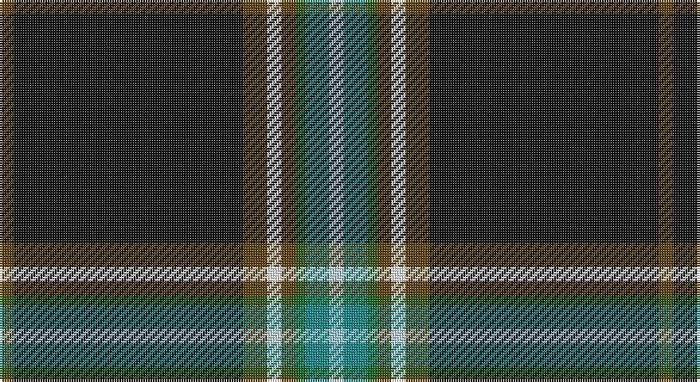

This page is one **sett** — a single exact thread-count. It belongs to the [tartan](/setts/dy3k48dy5w3dy3g2gi5lb3/)
(the same proportion at any scale), whose colour order is pattern [GKGWGGGW](/stripes/gkgwgggw/).

Sourced from tartans-authority.  It is a [8 stripe tartan](/stripes/stripes8/).

Original link http://www.tartansauthority.com/tartan-ferret/display/11144/

## Register references

External register numbers recorded for this tartan.

- Scottish Register of Tartans: [11144](https://www.tartanregister.gov.uk/tartanDetails?ref=11144)
- Scottish Tartans Authority (ITI): 11144

## Thread count
T/6 K96 T10 W6 T6 G4 B10 LB/6

One full sett is **276 threads**.

## Palette

Palette: <strong>Tartan Register</strong>
<table><thead><tr><th>Colour</th><th>Threads</th><th>Shade</th><th>Base</th><th>OKLCh</th></tr></thead><tbody><tr><td>T/</td><td style="text-align:right;font-variant-numeric:tabular-nums">6</td><td><code style="background-color:#604000;">#604000</code> <small style="color:#888">#604000</small></td><td>G <code style="background-color:#006100;">#006100</code></td><td><small style="color:#888">oklch(39.8% 0.083 76.8)</small></td></tr><tr><td>K</td><td style="text-align:right;font-variant-numeric:tabular-nums">96</td><td><code style="background-color:#101010;">#101010</code> <small style="color:#888">#101010</small></td><td>K <code style="background-color:#000000;">#000000</code></td><td><small style="color:#888">oklch(17.3% 0.000 89.9)</small></td></tr><tr><td>T</td><td style="text-align:right;font-variant-numeric:tabular-nums">10</td><td><code style="background-color:#604000;">#604000</code> <small style="color:#888">#604000</small></td><td>G <code style="background-color:#006100;">#006100</code></td><td><small style="color:#888">oklch(39.8% 0.083 76.8)</small></td></tr><tr><td>W</td><td style="text-align:right;font-variant-numeric:tabular-nums">6</td><td><code style="background-color:#FCFCFC;">#FCFCFC</code> <small style="color:#888">#FCFCFC</small></td><td>W <code style="background-color:#F7F7F7;">#F7F7F7</code></td><td><small style="color:#888">oklch(99.1% 0.000 89.9)</small></td></tr><tr><td>T</td><td style="text-align:right;font-variant-numeric:tabular-nums">6</td><td><code style="background-color:#604000;">#604000</code> <small style="color:#888">#604000</small></td><td>G <code style="background-color:#006100;">#006100</code></td><td><small style="color:#888">oklch(39.8% 0.083 76.8)</small></td></tr><tr><td>G</td><td style="text-align:right;font-variant-numeric:tabular-nums">4</td><td><code style="background-color:#006818;">#006818</code> <small style="color:#888">#006818</small></td><td>G <code style="background-color:#006100;">#006100</code></td><td><small style="color:#888">oklch(45.0% 0.142 145.0)</small></td></tr><tr><td>B</td><td style="text-align:right;font-variant-numeric:tabular-nums">10</td><td><code style="background-color:#048888;">#048888</code> <small style="color:#888">#048888</small></td><td>G <code style="background-color:#006100;">#006100</code></td><td><small style="color:#888">oklch(56.8% 0.096 194.8)</small></td></tr><tr><td>LB/</td><td style="text-align:right;font-variant-numeric:tabular-nums">6</td><td><code style="background-color:#98C8E8;">#98C8E8</code> <small style="color:#888">#98C8E8</small></td><td>W <code style="background-color:#F7F7F7;">#F7F7F7</code></td><td><small style="color:#888">oklch(81.0% 0.068 237.9)</small></td></tr></tbody></table>

# Sample pattern

## Nearest tartans

The nearest existing variants by ΔTartan distance, with this tartan at the top so the swatches line up against it.

ΔTartan

Tartan

Sett

—

<a href="/ttd/edit/#slug=dy3k48dy5w3dy3g2gi5lb3~x2">Pavelka Ltd</a> <a class="nn-out" href="/variants/s8/dy3k48dy5w3dy3g2gi5lb3~x2/" title="open its dictionary page">↗</a>

0.64

<a href="/ttd/edit/#slug=w2do3g5k50g4do3w2db3k2ly2~x2&amp;base=dy3k48dy5w3dy3g2gi5lb3~x2">Hawks (2014)</a> <a class="nn-out" href="/variants/s10/w2do3g5k50g4do3w2db3k2ly2~x2/" title="open its dictionary page">↗</a>

0.68

<a href="/ttd/edit/#slug=w2do3g5k50g4do3w2t3k2ly2~x2&amp;base=dy3k48dy5w3dy3g2gi5lb3~x2">Hawes (2014)</a> <a class="nn-out" href="/variants/s10/w2do3g5k50g4do3w2t3k2ly2~x2/" title="open its dictionary page">↗</a>

0.69

<a href="/ttd/edit/#slug=w2dr3g5k50g4dr3w2t3k2lo2~x2&amp;base=dy3k48dy5w3dy3g2gi5lb3~x2">Hawes (Personal)</a> <a class="nn-out" href="/variants/s10/w2dr3g5k50g4dr3w2t3k2lo2~x2/" title="open its dictionary page">↗</a>

0.82

<a href="/ttd/edit/#slug=w3k48lo5w3lo3gi2g5lt3~x2&amp;base=dy3k48dy5w3dy3g2gi5lb3~x2">Pavelka Limited</a> <a class="nn-out" href="/variants/s8/w3k48lo5w3lo3gi2g5lt3~x2/" title="open its dictionary page">↗</a>

0.87

<a href="/ttd/edit/#slug=k2r3k36n2k5n7ly3lt5lg2~x2&amp;base=dy3k48dy5w3dy3g2gi5lb3~x2">Victory</a> <a class="nn-out" href="/variants/s9/k2r3k36n2k5n7ly3lt5lg2~x2/" title="open its dictionary page">↗</a>

0.91

<a href="/ttd/edit/#slug=k48db4k8ly2k3w3k3g12r6k3r3w3~x2&amp;base=dy3k48dy5w3dy3g2gi5lb3~x2">Stewart Black Clan Tartan</a> <a class="nn-out" href="/variants/s12/k48db4k8ly2k3w3k3g12r6k3r3w3~x2/" title="open its dictionary page">↗</a>

0.94

<a href="/ttd/edit/#slug=k44ly3k4ly3k4db4w2db4r2w2dg4ly2~x2&amp;base=dy3k48dy5w3dy3g2gi5lb3~x2">Clan An Caigeann (Corporate)</a> <a class="nn-out" href="/variants/s12/k44ly3k4ly3k4db4w2db4r2w2dg4ly2~x2/" title="open its dictionary page">↗</a>

1.00

<a href="/ttd/edit/#slug=dt5k35b3k2r3k2g3k2w3k2~x2&amp;base=dy3k48dy5w3dy3g2gi5lb3~x2">Thin Blue Line UK</a> <a class="nn-out" href="/variants/s10/dt5k35b3k2r3k2g3k2w3k2~x2/" title="open its dictionary page">↗</a>

1.08

<a href="/ttd/edit/#slug=k24b2k3lo1k1lr1k1g4r2k1r2lr1~x4&amp;base=dy3k48dy5w3dy3g2gi5lb3~x2">Stewart/Stuart (Black)</a> <a class="nn-out" href="/variants/s12/k24b2k3lo1k1lr1k1g4r2k1r2lr1~x4/" title="open its dictionary page">↗</a>

1.17

<a href="/ttd/edit/#slug=k50g6db6r6n6w3~x2&amp;base=dy3k48dy5w3dy3g2gi5lb3~x2">Friends of Nordegg</a> <a class="nn-out" href="/variants/s6/k50g6db6r6n6w3~x2/" title="open its dictionary page">↗</a>

## Neighbour map

Every grey dot is one of 14360 variants placed by the first two principal components of the ΔTartan feature space (44% of its variance). Red is this tartan; blue dots are its nearest — click one to open its page.

<svg viewBox="0 0 640 380" role="img" style="max-width:100%;height:auto;border:1px solid #e0e0e0;border-radius:4px;display:block" xmlns="http://www.w3.org/2000/svg"><image href="/nn/cloud.v1.png" width="640" height="380"/><a href="/variants/s10/w2do3g5k50g4do3w2db3k2ly2~x2/"><circle cx="405.4" cy="81.8" r="4" fill="#3465a4"><title>Hawks (2014)</title></circle></a><a href="/variants/s10/w2do3g5k50g4do3w2t3k2ly2~x2/"><circle cx="396.8" cy="77.1" r="4" fill="#3465a4"><title>Hawes (2014)</title></circle></a><a href="/variants/s10/w2dr3g5k50g4dr3w2t3k2lo2~x2/"><circle cx="412.3" cy="84.7" r="4" fill="#3465a4"><title>Hawes (Personal)</title></circle></a><a href="/variants/s8/w3k48lo5w3lo3gi2g5lt3~x2/"><circle cx="362.0" cy="85.9" r="4" fill="#3465a4"><title>Pavelka Limited</title></circle></a><a href="/variants/s9/k2r3k36n2k5n7ly3lt5lg2~x2/"><circle cx="345.1" cy="102.1" r="4" fill="#3465a4"><title>Victory</title></circle></a><a href="/variants/s12/k48db4k8ly2k3w3k3g12r6k3r3w3~x2/"><circle cx="367.3" cy="83.0" r="4" fill="#3465a4"><title>Stewart Black Clan Tartan</title></circle></a><a href="/variants/s12/k44ly3k4ly3k4db4w2db4r2w2dg4ly2~x2/"><circle cx="368.6" cy="74.2" r="4" fill="#3465a4"><title>Clan An Caigeann (Corporate)</title></circle></a><a href="/variants/s10/dt5k35b3k2r3k2g3k2w3k2~x2/"><circle cx="401.1" cy="100.6" r="4" fill="#3465a4"><title>Thin Blue Line UK</title></circle></a><a href="/variants/s12/k24b2k3lo1k1lr1k1g4r2k1r2lr1~x4/"><circle cx="420.5" cy="85.6" r="4" fill="#3465a4"><title>Stewart/Stuart (Black)</title></circle></a><a href="/variants/s6/k50g6db6r6n6w3~x2/"><circle cx="339.5" cy="132.0" r="4" fill="#3465a4"><title>Friends of Nordegg</title></circle></a><circle cx="386.8" cy="98.2" r="5" fill="#c00000"/></svg>

ID: /variants/s8/dy3k48dy5w3dy3g2gi5lb3~x2/
