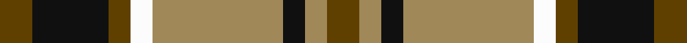
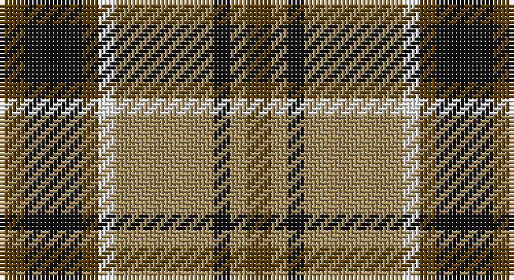

This page is one **sett** — a single exact thread-count. It belongs to the [tartan](/setts/dy3k7dy2w2lo12k2lo2dy3/)
(the same proportion at any scale), whose colour order is pattern [GKGWYKYG](/stripes/gkgwykyg/).

Part of the [Daks](/tartans/daks/) tartan — the named design grouping this sett with its other cloths.

Sourced from register-of-tartans.  It is a [8 stripe tartan](/stripes/stripes8/).

Original link https://www.tartanregister.gov.uk/tartanDetails.aspx?ref=867

## Also known as

This cloth is also recorded under:

- Daks Muted blue
- Daks, Black
- Daks, Muted blue

## Register references

External register numbers recorded for this tartan.

- Scottish Register of Tartans: [867](https://www.tartanregister.gov.uk/tartanDetails.aspx?ref=867)
- Scottish Tartans Authority (ITI): 1740
- Scottish Tartans World Register: 1740

## Thread count
T/6 K14 T4 W4 LT24 K4 LT4 T/6

One full sett is **120 threads**.

## Palette

Palette: <strong>Tartan Register</strong>
<table><thead><tr><th>Colour</th><th>Threads</th><th>Shade</th><th>Base</th><th>OKLCh</th></tr></thead><tbody><tr><td>T/</td><td style="text-align:right;font-variant-numeric:tabular-nums">6</td><td><code style="background-color:#604000;">#604000</code> <small style="color:#888">#604000</small></td><td>G <code style="background-color:#006100;">#006100</code></td><td><small style="color:#888">oklch(39.8% 0.083 76.8)</small></td></tr><tr><td>K</td><td style="text-align:right;font-variant-numeric:tabular-nums">14</td><td><code style="background-color:#101010;">#101010</code> <small style="color:#888">#101010</small></td><td>K <code style="background-color:#000000;">#000000</code></td><td><small style="color:#888">oklch(17.3% 0.000 89.9)</small></td></tr><tr><td>T</td><td style="text-align:right;font-variant-numeric:tabular-nums">4</td><td><code style="background-color:#604000;">#604000</code> <small style="color:#888">#604000</small></td><td>G <code style="background-color:#006100;">#006100</code></td><td><small style="color:#888">oklch(39.8% 0.083 76.8)</small></td></tr><tr><td>W</td><td style="text-align:right;font-variant-numeric:tabular-nums">4</td><td><code style="background-color:#FCFCFC;">#FCFCFC</code> <small style="color:#888">#FCFCFC</small></td><td>W <code style="background-color:#F7F7F7;">#F7F7F7</code></td><td><small style="color:#888">oklch(99.1% 0.000 89.9)</small></td></tr><tr><td>LT</td><td style="text-align:right;font-variant-numeric:tabular-nums">24</td><td><code style="background-color:#A08858;">#A08858</code> <small style="color:#888">#A08858</small></td><td>Y <code style="background-color:#F2BF00;">#F2BF00</code></td><td><small style="color:#888">oklch(63.7% 0.071 84.0)</small></td></tr><tr><td>K</td><td style="text-align:right;font-variant-numeric:tabular-nums">4</td><td><code style="background-color:#101010;">#101010</code> <small style="color:#888">#101010</small></td><td>K <code style="background-color:#000000;">#000000</code></td><td><small style="color:#888">oklch(17.3% 0.000 89.9)</small></td></tr><tr><td>LT</td><td style="text-align:right;font-variant-numeric:tabular-nums">4</td><td><code style="background-color:#A08858;">#A08858</code> <small style="color:#888">#A08858</small></td><td>Y <code style="background-color:#F2BF00;">#F2BF00</code></td><td><small style="color:#888">oklch(63.7% 0.071 84.0)</small></td></tr><tr><td>T/</td><td style="text-align:right;font-variant-numeric:tabular-nums">6</td><td><code style="background-color:#604000;">#604000</code> <small style="color:#888">#604000</small></td><td>G <code style="background-color:#006100;">#006100</code></td><td><small style="color:#888">oklch(39.8% 0.083 76.8)</small></td></tr></tbody></table>

# Sample pattern

## Compared to the master

This cloth is one sett of its design; the master sett (the exemplar the design is anchored on) is below for comparison.

<figure style="margin:0"><figcaption style="color:#888;font-size:smaller">this sett</figcaption></figure>
<figure style="margin:0"><figcaption style="color:#888;font-size:smaller"><a href="/setts/db3dy7g2y2g14dy2g2db3/">master sett →</a></figcaption></figure>

## Nearest tartans

The nearest existing variants by ΔTartan distance, with this tartan at the top so the swatches line up against it.

ΔTartan

Tartan

Sett

—

<a href="/ttd/edit/#slug=dy3k7dy2w2lo12k2lo2dy3~x2">Daks (Brown)</a> <a class="nn-out" href="/variants/s8/dy3k7dy2w2lo12k2lo2dy3~x2/" title="open its dictionary page">↗</a>

0.78

<a href="/ttd/edit/#slug=oi3k7oi2w2o12k2o2oi3~x2&amp;base=dy3k7dy2w2lo12k2lo2dy3~x2">Daks</a> <a class="nn-out" href="/variants/s8/oi3k7oi2w2o12k2o2oi3~x2/" title="open its dictionary page">↗</a>

0.93

<a href="/ttd/edit/#slug=lb13k3lb3k3lb3k15dy18r3~x2&amp;base=dy3k7dy2w2lo12k2lo2dy3~x2">Holden Brown (Corporate)</a> <a class="nn-out" href="/variants/s8/lb13k3lb3k3lb3k15dy18r3~x2/" title="open its dictionary page">↗</a>

1.04

<a href="/variants/s8/g6k1r1t2r2~x4/">Wilson's No.193</a>

1.08

<a href="/ttd/edit/#slug=db1g4db1r1db1ly1db5r6db1ly1~x2&amp;base=dy3k7dy2w2lo12k2lo2dy3~x2">Unidentified, specimen</a> <a class="nn-out" href="/variants/s10/db1g4db1r1db1ly1db5r6db1ly1~x2/" title="open its dictionary page">↗</a>

1.08

<a href="/ttd/edit/#slug=r3w8db4dg14r4db2~x4&amp;base=dy3k7dy2w2lo12k2lo2dy3~x2">MacKintosh Dress (Scott Adie)</a> <a class="nn-out" href="/variants/s6/r3w8db4dg14r4db2~x4/" title="open its dictionary page">↗</a>

1.09

<a href="/ttd/edit/#slug=lb23k4lb4k4lb4k22o23lo5~x2&amp;base=dy3k7dy2w2lo12k2lo2dy3~x2">Aberlour</a> <a class="nn-out" href="/variants/s8/lb23k4lb4k4lb4k22o23lo5~x2/" title="open its dictionary page">↗</a>

1.10

<a href="/ttd/edit/#slug=r3y27k6lo13k14r3~x2&amp;base=dy3k7dy2w2lo12k2lo2dy3~x2">Thompson/Thomson/MacTavish special grey</a> <a class="nn-out" href="/variants/s6/r3y27k6lo13k14r3~x2/" title="open its dictionary page">↗</a>

1.10

<a href="/ttd/edit/#slug=lb13k3lb3k3lb3k15lo18r3~x2&amp;base=dy3k7dy2w2lo12k2lo2dy3~x2">Holden Beige (Corporate)</a> <a class="nn-out" href="/variants/s8/lb13k3lb3k3lb3k15lo18r3~x2/" title="open its dictionary page">↗</a>

1.11

<a href="/ttd/edit/#slug=r10dy60dt13lb24dt24dy8&amp;base=dy3k7dy2w2lo12k2lo2dy3~x2">Bronte House Check (Fashion)</a> <a class="nn-out" href="/variants/s6/r10dy60dt13lb24dt24dy8/" title="open its dictionary page">↗</a>

1.14

<a href="/ttd/edit/#slug=k3g25o3k15lr24g3~x2&amp;base=dy3k7dy2w2lo12k2lo2dy3~x2">Un-named (D C Dalgliesh) #3</a> <a class="nn-out" href="/variants/s6/k3g25o3k15lr24g3~x2/" title="open its dictionary page">↗</a>

## Neighbour map

Every grey dot is one of 14360 variants placed by the first two principal components of the ΔTartan feature space (44% of its variance). Red is this tartan; blue dots are its nearest — click one to open its page.

<svg viewBox="0 0 640 380" role="img" style="max-width:100%;height:auto;border:1px solid #e0e0e0;border-radius:4px;display:block" xmlns="http://www.w3.org/2000/svg"><image href="/nn/cloud.v1.png" width="640" height="380"/><a href="/variants/s8/oi3k7oi2w2o12k2o2oi3~x2/"><circle cx="174.2" cy="203.5" r="4" fill="#3465a4"><title>Daks</title></circle></a><a href="/variants/s8/lb13k3lb3k3lb3k15dy18r3~x2/"><circle cx="132.4" cy="196.7" r="4" fill="#3465a4"><title>Holden Brown (Corporate)</title></circle></a><a href="/variants/s8/g6k1r1t2r2~x4/"><circle cx="164.0" cy="219.3" r="4" fill="#3465a4"><title>Wilson's No.193</title></circle></a><a href="/variants/s10/db1g4db1r1db1ly1db5r6db1ly1~x2/"><circle cx="188.2" cy="197.1" r="4" fill="#3465a4"><title>Unidentified, specimen</title></circle></a><a href="/variants/s6/r3w8db4dg14r4db2~x4/"><circle cx="150.0" cy="215.1" r="4" fill="#3465a4"><title>MacKintosh Dress (Scott Adie)</title></circle></a><a href="/variants/s8/lb23k4lb4k4lb4k22o23lo5~x2/"><circle cx="130.3" cy="193.0" r="4" fill="#3465a4"><title>Aberlour</title></circle></a><a href="/variants/s6/r3y27k6lo13k14r3~x2/"><circle cx="191.8" cy="207.7" r="4" fill="#3465a4"><title>Thompson/Thomson/MacTavish special grey</title></circle></a><a href="/variants/s8/lb13k3lb3k3lb3k15lo18r3~x2/"><circle cx="128.2" cy="192.3" r="4" fill="#3465a4"><title>Holden Beige (Corporate)</title></circle></a><a href="/variants/s6/r10dy60dt13lb24dt24dy8/"><circle cx="231.6" cy="221.3" r="4" fill="#3465a4"><title>Bronte House Check (Fashion)</title></circle></a><a href="/variants/s6/k3g25o3k15lr24g3~x2/"><circle cx="179.5" cy="206.9" r="4" fill="#3465a4"><title>Un-named (D C Dalgliesh) #3</title></circle></a><circle cx="178.8" cy="205.2" r="5" fill="#c00000"/></svg>

ID: /variants/s8/dy3k7dy2w2lo12k2lo2dy3~x2/
