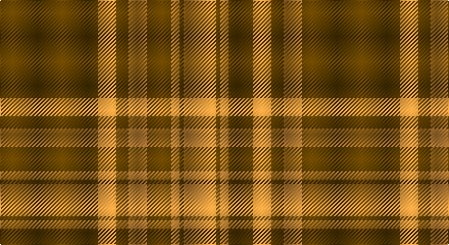

This page is one **sett** — a single exact thread-count. It belongs to the [tartan](/setts/dy48lo9dy6lo9dy12lo4dy2lo16/)
(the same proportion at any scale), whose colour order is pattern [GYGYGYGY](/stripes/gygygygy/).

Sourced from tartans-authority.  It is a [8 stripe tartan](/stripes/stripes8/).

Original link http://www.tartansauthority.com/tartan-ferret/display/10761/

## Register references

External register numbers recorded for this tartan.

- Scottish Tartans Authority (ITI): 10761

## Thread count
T/96 O18 T12 O18 T24 O8 T4 O/32

One full sett is **296 threads**.

## Palette

Palette: <strong>Tartan Register</strong>
<table><thead><tr><th>Colour</th><th>Threads</th><th>Shade</th><th>Base</th><th>OKLCh</th></tr></thead><tbody><tr><td>T/</td><td style="text-align:right;font-variant-numeric:tabular-nums">96</td><td><code style="background-color:#604000;">#604000</code> <small style="color:#888">#604000</small></td><td>G <code style="background-color:#006100;">#006100</code></td><td><small style="color:#888">oklch(39.8% 0.083 76.8)</small></td></tr><tr><td>O</td><td style="text-align:right;font-variant-numeric:tabular-nums">18</td><td><code style="background-color:#DC943C;">#DC943C</code> <small style="color:#888">#DC943C</small></td><td>Y <code style="background-color:#F2BF00;">#F2BF00</code></td><td><small style="color:#888">oklch(72.3% 0.133 67.9)</small></td></tr><tr><td>T</td><td style="text-align:right;font-variant-numeric:tabular-nums">12</td><td><code style="background-color:#604000;">#604000</code> <small style="color:#888">#604000</small></td><td>G <code style="background-color:#006100;">#006100</code></td><td><small style="color:#888">oklch(39.8% 0.083 76.8)</small></td></tr><tr><td>O</td><td style="text-align:right;font-variant-numeric:tabular-nums">18</td><td><code style="background-color:#DC943C;">#DC943C</code> <small style="color:#888">#DC943C</small></td><td>Y <code style="background-color:#F2BF00;">#F2BF00</code></td><td><small style="color:#888">oklch(72.3% 0.133 67.9)</small></td></tr><tr><td>T</td><td style="text-align:right;font-variant-numeric:tabular-nums">24</td><td><code style="background-color:#604000;">#604000</code> <small style="color:#888">#604000</small></td><td>G <code style="background-color:#006100;">#006100</code></td><td><small style="color:#888">oklch(39.8% 0.083 76.8)</small></td></tr><tr><td>O</td><td style="text-align:right;font-variant-numeric:tabular-nums">8</td><td><code style="background-color:#DC943C;">#DC943C</code> <small style="color:#888">#DC943C</small></td><td>Y <code style="background-color:#F2BF00;">#F2BF00</code></td><td><small style="color:#888">oklch(72.3% 0.133 67.9)</small></td></tr><tr><td>T</td><td style="text-align:right;font-variant-numeric:tabular-nums">4</td><td><code style="background-color:#604000;">#604000</code> <small style="color:#888">#604000</small></td><td>G <code style="background-color:#006100;">#006100</code></td><td><small style="color:#888">oklch(39.8% 0.083 76.8)</small></td></tr><tr><td>O/</td><td style="text-align:right;font-variant-numeric:tabular-nums">32</td><td><code style="background-color:#DC943C;">#DC943C</code> <small style="color:#888">#DC943C</small></td><td>Y <code style="background-color:#F2BF00;">#F2BF00</code></td><td><small style="color:#888">oklch(72.3% 0.133 67.9)</small></td></tr></tbody></table>

# Sample pattern

## Nearest tartans

The nearest existing variants by ΔTartan distance, with this tartan at the top so the swatches line up against it.

ΔTartan

Tartan

Sett

—

<a href="/ttd/edit/#slug=dy48lo9dy6lo9dy12lo4dy2lo16~x2">Yellow Pencil (Corporate)</a> <a class="nn-out" href="/variants/s8/dy48lo9dy6lo9dy12lo4dy2lo16~x2/" title="open its dictionary page">↗</a>

1.07

<a href="/ttd/edit/#slug=r24g2r2g40r25g2r2g2r2g20~x2&amp;base=dy48lo9dy6lo9dy12lo4dy2lo16~x2">Donachie</a> <a class="nn-out" href="/variants/s10/r24g2r2g40r25g2r2g2r2g20~x2/" title="open its dictionary page">↗</a>

1.14

<a href="/ttd/edit/#slug=g14r4g2r2g2r4g19r30g2r9~x2&amp;base=dy48lo9dy6lo9dy12lo4dy2lo16~x2">Livingstone</a> <a class="nn-out" href="/variants/s10/g14r4g2r2g2r4g19r30g2r9~x2/" title="open its dictionary page">↗</a>

1.23

<a href="/ttd/edit/#slug=r16g1r1g1r4g12~x4&amp;base=dy48lo9dy6lo9dy12lo4dy2lo16~x2">MacQuarrie #5</a> <a class="nn-out" href="/variants/s6/r16g1r1g1r4g12~x4/" title="open its dictionary page">↗</a>

1.27

<a href="/ttd/edit/#slug=dy48ly9dy6ly9dy12ly4dy2ly16~x2&amp;base=dy48lo9dy6lo9dy12lo4dy2lo16~x2">Yellow Pencil</a> <a class="nn-out" href="/variants/s8/dy48ly9dy6ly9dy12ly4dy2ly16~x2/" title="open its dictionary page">↗</a>

1.40

<a href="/ttd/edit/#slug=r16dg1r1dg1r4dg12&amp;base=dy48lo9dy6lo9dy12lo4dy2lo16~x2">MacQuarrie</a> <a class="nn-out" href="/variants/s6/r16dg1r1dg1r4dg12/" title="open its dictionary page">↗</a>

1.43

<a href="/ttd/edit/#slug=dg6r1dg24r28dg1r4~x2&amp;base=dy48lo9dy6lo9dy12lo4dy2lo16~x2">Erskine</a> <a class="nn-out" href="/variants/s6/dg6r1dg24r28dg1r4~x2/" title="open its dictionary page">↗</a>

1.44

<a href="/ttd/edit/#slug=g6r1g24r28g1r4~x2&amp;base=dy48lo9dy6lo9dy12lo4dy2lo16~x2">Erskine (Vestiarium Scoticum)</a> <a class="nn-out" href="/variants/s6/g6r1g24r28g1r4~x2/" title="open its dictionary page">↗</a>

1.45

<a href="/ttd/edit/#slug=r48db2r3g28r4db2~x2&amp;base=dy48lo9dy6lo9dy12lo4dy2lo16~x2">MacKintosh 2</a> <a class="nn-out" href="/variants/s6/r48db2r3g28r4db2~x2/" title="open its dictionary page">↗</a>

1.48

<a href="/ttd/edit/#slug=r2g6r2g6r16ly1~x2&amp;base=dy48lo9dy6lo9dy12lo4dy2lo16~x2">Cameron</a> <a class="nn-out" href="/variants/s6/r2g6r2g6r16ly1~x2/" title="open its dictionary page">↗</a>

1.53

<a href="/ttd/edit/#slug=dg14r4dg2r2dg2r4dg19r30dg2r9~x2&amp;base=dy48lo9dy6lo9dy12lo4dy2lo16~x2">Livingstone</a> <a class="nn-out" href="/variants/s10/dg14r4dg2r2dg2r4dg19r30dg2r9~x2/" title="open its dictionary page">↗</a>

## Neighbour map

Every grey dot is one of 14360 variants placed by the first two principal components of the ΔTartan feature space (44% of its variance). Red is this tartan; blue dots are its nearest — click one to open its page.

<svg viewBox="0 0 640 380" role="img" style="max-width:100%;height:auto;border:1px solid #e0e0e0;border-radius:4px;display:block" xmlns="http://www.w3.org/2000/svg"><image href="/nn/cloud.v1.png" width="640" height="380"/><a href="/variants/s10/r24g2r2g40r25g2r2g2r2g20~x2/"><circle cx="423.4" cy="183.9" r="4" fill="#3465a4"><title>Donachie</title></circle></a><a href="/variants/s10/g14r4g2r2g2r4g19r30g2r9~x2/"><circle cx="413.9" cy="195.1" r="4" fill="#3465a4"><title>Livingstone</title></circle></a><a href="/variants/s6/r16g1r1g1r4g12~x4/"><circle cx="455.5" cy="215.6" r="4" fill="#3465a4"><title>MacQuarrie #5</title></circle></a><a href="/variants/s8/dy48ly9dy6ly9dy12ly4dy2ly16~x2/"><circle cx="437.0" cy="170.3" r="4" fill="#3465a4"><title>Yellow Pencil</title></circle></a><a href="/variants/s6/r16dg1r1dg1r4dg12/"><circle cx="450.8" cy="213.4" r="4" fill="#3465a4"><title>MacQuarrie</title></circle></a><a href="/variants/s6/dg6r1dg24r28dg1r4~x2/"><circle cx="433.2" cy="195.6" r="4" fill="#3465a4"><title>Erskine</title></circle></a><a href="/variants/s6/g6r1g24r28g1r4~x2/"><circle cx="443.6" cy="200.0" r="4" fill="#3465a4"><title>Erskine (Vestiarium Scoticum)</title></circle></a><a href="/variants/s6/r48db2r3g28r4db2~x2/"><circle cx="465.6" cy="170.5" r="4" fill="#3465a4"><title>MacKintosh 2</title></circle></a><a href="/variants/s6/r2g6r2g6r16ly1~x2/"><circle cx="415.5" cy="201.3" r="4" fill="#3465a4"><title>Cameron</title></circle></a><a href="/variants/s10/dg14r4dg2r2dg2r4dg19r30dg2r9~x2/"><circle cx="407.9" cy="188.2" r="4" fill="#3465a4"><title>Livingstone</title></circle></a><circle cx="475.3" cy="189.2" r="5" fill="#c00000"/></svg>

ID: /variants/s8/dy48lo9dy6lo9dy12lo4dy2lo16~x2/
