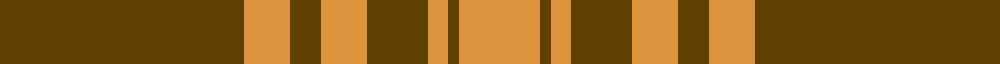

This is one **variant** — a specific cloth: this exact thread count and colourway, with its own
provenance below. It is one weaving of the [sett](/tartans/y/ye/yellow-pencil-2/) (the scale-free proportion — the
same cloth at any scale or shade), whose colour order is pattern [GYGYGYGY](/stripes/gygygygy/).

Part of the [Yellow Pencil](/tartans/y/ye/yellow-pencil-2/) tartan — the named design grouping this sett with its other cloths.

Sourced from tartans-authority.  It is a [8 stripe tartan](/stripes/stripes8/).

Original link <code>http://www.tartansauthority.com/tartan-ferret/display/10761/</code> — retired · [Internet Archive copy](https://web.archive.org/web/*/http://www.tartansauthority.com/tartan-ferret/display/10761/*)

Dataset <small>— provenance for this record, inherited from the source manifest</small>

<dl class="dataset-prov">
<dt>source</dt><dd><a href="/sources/tartans-authority/">Scottish Tartans Authority</a></dd>
<dt>data captured from</dt><dd><a href="https://github.com/thetartan/tartan-database/blob/master/data/tartans-authority/data.csv">https://github.com/thetartan/tartan-database/blob/master/data/tartans-authority/data.csv</a></dd>
<dt>data date</dt><dd>01/12/2002 <small>(this record)</small></dd>
<dt>licence</dt><dd><a href="https://creativecommons.org/licenses/by-nc-nd/4.0/">CC BY-NC-ND 4.0</a></dd>
</dl>

Capture chain <small>— the hands this data passed through, oldest first; each capture carries its own licence</small>

<ol class="capture-chain">
<li><a href="https://www.tartansauthority.com/">Scottish Tartans Authority</a> <small>the heritage body’s archive — its tartan-ferret record browser is retired; dead record links are shown unlinked, with an Internet Archive copy (ITI numbers are not SRT references)</small></li>
<li><a href="https://github.com/thetartan/tartan-database">thetartan/tartan-database</a> <small>2016-2017</small> · <a href="https://creativecommons.org/licenses/by-nc-nd/4.0/">CC BY-NC-ND 4.0</a> <small>Levko Kravets's frozen compilation — the capture we vendored, and where its CC licence text came from</small></li>
<li>this dictionary <small>captured 2026-06-10 · commit 5bf86c7566</small> <small>each re-capture is a git commit to data/sources</small></li>
</ol>

## Register references

External register numbers recorded for this tartan.

- Scottish Tartans Authority (ITI): 10761

## Thread count
DY/96 LO18 DY12 LO18 DY24 LO8 DY4 LO/32

One full sett is **296 threads**.

## Palette
<table><thead><tr><th>Colour</th><th>Shade</th><th>OKLCh</th></tr></thead><tbody><tr><td>LO</td><td><code style="background-color:#FF9C34;">#FF9C34</code> <small style="color:#888">#FF9C34</small></td><td><small style="color:#888">oklch(77.9% 0.161 61.8)</small></td></tr><tr><td>DY</td><td><code style="background-color:#3A2B0D;">#3A2B0D</code> <small style="color:#888">#3A2B0D</small></td><td><small style="color:#888">oklch(30.0% 0.049 82.0)</small></td></tr></tbody></table>

# Sample pattern

## Nearest tartan variants

The nearest existing variants by ΔTartan distance, with this cloth at the top so the swatches line up against it.

ΔTartan

Threads

Variant

Sett

—

296

<a href="/variants/s8/dy48lo9dy6lo9dy12lo4dy2lo16~x2/">Yellow Pencil (Corporate)</a>

<a href="/ttd/edit/#slug=dr3lo3dr6lo18dr1lo2dr2~x4~dr1004029-lo2905070&amp;base=dy48lo9dy6lo9dy12lo4dy2lo16~x2" title="compare in the TTD">3.35</a>

260

<a href="/variants/s7/dr3lo3dr6lo18dr1lo2dr2~x4~dr1004029-lo2905070/">Loughheed (Personal)</a>

<a href="/ttd/edit/#slug=dy31w5dy2w5dy4w3dy2w7~x2&amp;base=dy48lo9dy6lo9dy12lo4dy2lo16~x2" title="compare in the TTD">3.58</a>

160

<a href="/variants/s8/dy31w5dy2w5dy4w3dy2w7~x2/">Menzies Brown &amp; White Trade Tartan</a>

## Neighbour map

Every grey dot is one of 13657 variants placed by the first two principal components of the ΔTartan feature space (42% of its variance). Red is this tartan; blue dots are its nearest — click one to open its page. The map is a flat projection of a many-dimensional space — [how to read it](/posts/neighbourhood-maps/).

<svg viewBox="0 0 640 380" role="img" style="max-width:100%;height:auto;border:1px solid #e0e0e0;border-radius:4px;display:block" xmlns="http://www.w3.org/2000/svg"><image href="/nn/cloud.v1.png" width="640" height="380"/><a href="/variants/s7/dr3lo3dr6lo18dr1lo2dr2~x4~dr1004029-lo2905070/"><circle cx="484.9" cy="209.1" r="4" fill="#3465a4"><title>Loughheed (Personal)</title></circle></a><a href="/variants/s8/dy31w5dy2w5dy4w3dy2w7~x2/"><circle cx="434.2" cy="188.1" r="4" fill="#3465a4"><title>Menzies Brown &amp; White Trade Tartan</title></circle></a><circle cx="451.9" cy="186.4" r="5" fill="#c00000"/><text x="320" y="376" text-anchor="middle" font-size="11" fill="#999">ground</text><text x="11" y="190" text-anchor="middle" font-size="11" fill="#999" transform="rotate(-90 11 190)">complexity</text></svg>

ID: /variants/s8/dy48lo9dy6lo9dy12lo4dy2lo16~x2/
