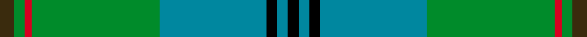

This page is one **sett** — a single exact thread-count. It belongs to the [tartan](/setts/dy4g3r2g36t30k3t3k3/)
(the same proportion at any scale), whose colour order is pattern [GGRGBKBK](/stripes/ggrgbkbk/).

Sourced from register-of-tartans.  It is a [8 stripe tartan](/stripes/stripes8/).

Original link https://www.tartanregister.gov.uk/tartanDetails.aspx?ref=4862

2 attestations — the source records this cloth was collapsed from (oldest owns this page)

<ul>
<li>undated — Chartered Accountants of Scotland (register-of-tartans, <a href="https://www.tartanregister.gov.uk/tartanDetails.aspx?ref=4862">record</a>)  <em>Designed in 2000 for Mr Grenville Johnston of Accountants, Johnston & Carmichael, Elgin to mark his appointment as Chairman of the Institute of Chartered Accountants of Scotland.</em></li>
<li>Unknown — Chartered Accountants of Scotland (C (tartans-authority, <a href="http://www.tartansauthority.com/tartan-ferret/display/3950/">record</a>)  <em>Designed in 2000 for Mr Grenville Johnston of Accountants, Johnston & Carmichael, Elgin to mark his appointment as Chairman of the Institute of Chartered Accountants of Scotland.</em></li>
</ul>

## Register references

External register numbers recorded for this tartan.

- Scottish Register of Tartans: [4862](https://www.tartanregister.gov.uk/tartanDetails.aspx?ref=4862)
- Scottish Tartans Authority (ITI): 3950

## Thread count
DY/8 G6 R4 G72 T60 K6 T6 K/6

One full sett is **322 threads**.

## Palette
<table><thead><tr><th>Colour</th><th>Shade</th><th>OKLCh</th></tr></thead><tbody><tr><td>B</td><td><code style="background-color:#00879F;">#00879F</code> <small style="color:#888">#00879F</small></td><td><small style="color:#888">oklch(57.4% 0.102 216.1)</small></td></tr><tr><td>G</td><td><code style="background-color:#008B2A;">#008B2A</code> <small style="color:#888">#008B2A</small></td><td><small style="color:#888">oklch(55.4% 0.170 145.9)</small></td></tr><tr><td>K</td><td><code style="background-color:#000000;">#000000</code> <small style="color:#888">#000000</small></td><td><small style="color:#888">oklch(0.0% 0.000 0.0)</small></td></tr><tr><td>R</td><td><code style="background-color:#D60020;">#D60020</code> <small style="color:#888">#D60020</small></td><td><small style="color:#888">oklch(55.2% 0.224 25.5)</small></td></tr><tr><td>Y</td><td><code style="background-color:#3A2B0D;">#3A2B0D</code> <small style="color:#888">#3A2B0D</small></td><td><small style="color:#888">oklch(30.0% 0.049 82.0)</small></td></tr></tbody></table>

# Sample pattern

## Nearest variants

The nearest existing variants by ΔTartan distance, with this cloth at the top so the swatches line up against it.

ΔTartan

Threads

Variant

Sett

—

322

<a href="/variants/s8/dy4g3r2g36t30k3t3k3~x2/">Chartered Accountants of Scotland</a>

<a href="/ttd/edit/#slug=y3g2k1g30t24k2t2k2~x2&amp;base=dy4g3r2g36t30k3t3k3~x2" title="compare in the TTD">0.73</a>

254

<a href="/variants/s8/y3g2k1g30t24k2t2k2~x2/">Johnston (Clan)</a>

0.74

—

<a href="/variants/s8/k1t1k1t12g12k1g1ly1~x4~t2105244/">Banff Centennial</a>

<a href="/ttd/edit/#slug=k1t1k1t7g8k1g1ly1~x4&amp;base=dy4g3r2g36t30k3t3k3~x2" title="compare in the TTD">0.83</a>

160

<a href="/variants/s8/k1t1k1t7g8k1g1ly1~x4/">Banff Centennial (Commemorative)</a>

<a href="/ttd/edit/#slug=r3g1k1g12t12k1t1k1~x4&amp;base=dy4g3r2g36t30k3t3k3~x2" title="compare in the TTD">1.02</a>

240

<a href="/variants/s8/r3g1k1g12t12k1t1k1~x4/">Peter of Lee (Personal)</a>

<a href="/ttd/edit/#slug=dg4w1dg26t26k2t4~x4&amp;base=dy4g3r2g36t30k3t3k3~x2" title="compare in the TTD">1.41</a>

472

<a href="/variants/s6/dg4w1dg26t26k2t4~x4/">Melville (Two black lines)</a>

<a href="/ttd/edit/#slug=t32k12t12g6r6g18k2y3~x2&amp;base=dy4g3r2g36t30k3t3k3~x2" title="compare in the TTD">1.57</a>

294

<a href="/variants/s8/t32k12t12g6r6g18k2y3~x2/">Gillies (House of Edgar)</a>

<a href="/ttd/edit/#slug=dp6y2dp1g25db16k2db4~x2~dp1105325&amp;base=dy4g3r2g36t30k3t3k3~x2" title="compare in the TTD">1.89</a>

204

<a href="/variants/s7/dp6y2dp1g25db16k2db4~x2~dp1105325/">Lowry Clan Tartan</a>

<a href="/ttd/edit/#slug=dp6dy2dp1g25db16k2db4~x2~dp1105325&amp;base=dy4g3r2g36t30k3t3k3~x2" title="compare in the TTD">1.89</a>

204

<a href="/variants/s7/dp6dy2dp1g25db16k2db4~x2~dp1105325/">Lawrie Clan Tartan</a>

<a href="/ttd/edit/#slug=k3g36db28r2db2y3~x2&amp;base=dy4g3r2g36t30k3t3k3~x2" title="compare in the TTD">1.99</a>

284

<a href="/variants/s6/k3g36db28r2db2y3~x2/">Carmichael</a>

<a href="/ttd/edit/#slug=r4k2g36k2t18y3t18k2~x2&amp;base=dy4g3r2g36t30k3t3k3~x2" title="compare in the TTD">2.49</a>

328

<a href="/variants/s8/r4k2g36k2t18y3t18k2~x2/">Fox Hunting</a>

## Neighbour map

Every grey dot is one of 13620 variants placed by the first two principal components of the ΔTartan feature space (42% of its variance). Red is this tartan; blue dots are its nearest — click one to open its page.

<svg viewBox="0 0 640 380" role="img" style="max-width:100%;height:auto;border:1px solid #e0e0e0;border-radius:4px;display:block" xmlns="http://www.w3.org/2000/svg"><image href="/nn/cloud.v1.png" width="640" height="380"/><a href="/variants/s8/y3g2k1g30t24k2t2k2~x2/"><circle cx="350.4" cy="143.7" r="4" fill="#3465a4"><title>Johnston (Clan)</title></circle></a><a href="/variants/s8/k1t1k1t12g12k1g1ly1~x4~t2105244/"><circle cx="266.9" cy="167.1" r="4" fill="#3465a4"><title>Banff Centennial</title></circle></a><a href="/variants/s8/k1t1k1t7g8k1g1ly1~x4/"><circle cx="215.8" cy="189.7" r="4" fill="#3465a4"><title>Banff Centennial (Commemorative)</title></circle></a><a href="/variants/s8/r3g1k1g12t12k1t1k1~x4/"><circle cx="238.9" cy="170.9" r="4" fill="#3465a4"><title>Peter of Lee (Personal)</title></circle></a><a href="/variants/s6/dg4w1dg26t26k2t4~x4/"><circle cx="345.2" cy="168.4" r="4" fill="#3465a4"><title>Melville (Two black lines)</title></circle></a><a href="/variants/s8/t32k12t12g6r6g18k2y3~x2/"><circle cx="212.1" cy="165.1" r="4" fill="#3465a4"><title>Gillies (House of Edgar)</title></circle></a><a href="/variants/s7/dp6y2dp1g25db16k2db4~x2~dp1105325/"><circle cx="255.4" cy="141.7" r="4" fill="#3465a4"><title>Lowry Clan Tartan</title></circle></a><a href="/variants/s7/dp6dy2dp1g25db16k2db4~x2~dp1105325/"><circle cx="256.8" cy="142.0" r="4" fill="#3465a4"><title>Lawrie Clan Tartan</title></circle></a><a href="/variants/s6/k3g36db28r2db2y3~x2/"><circle cx="278.6" cy="150.5" r="4" fill="#3465a4"><title>Carmichael</title></circle></a><a href="/variants/s8/r4k2g36k2t18y3t18k2~x2/"><circle cx="266.5" cy="156.8" r="4" fill="#3465a4"><title>Fox Hunting</title></circle></a><circle cx="290.5" cy="148.5" r="5" fill="#c00000"/><text x="320" y="376" text-anchor="middle" font-size="11" fill="#999">ground</text><text x="11" y="190" text-anchor="middle" font-size="11" fill="#999" transform="rotate(-90 11 190)">complexity</text></svg>

ID: /variants/s8/dy4g3r2g36t30k3t3k3~x2/
