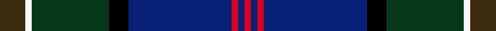

This is one **variant** — a specific cloth: this exact thread count and colourway, with its own
provenance below. It is one weaving of the [sett](/tartans/p/pu/purves/) (the scale-free proportion — the
same cloth at any scale or shade), whose colour order is pattern [GWGKBRBR](/stripes/gwgkbrbr/).

Part of the [Purves](/tartans/p/pu/purves/) tartan — the named design grouping this sett with its other cloths.

Sourced from register-of-tartans.  It is a [8 stripe tartan](/stripes/stripes8/).

Original link [https://www.tartanregister.gov.uk/tartanDetails.aspx?ref=11173](https://www.tartanregister.gov.uk/tartanDetails.aspx?ref=11173)

Dataset <small>— provenance for this record, inherited from the source manifest</small>

<dl class="dataset-prov">
<dt>source</dt><dd><a href="/sources/register-of-tartans/">Scottish Register of Tartans</a></dd>
<dt>data captured from</dt><dd><a href="https://github.com/thetartan/tartan-database/blob/master/data/register-of-tartans/data.csv">https://github.com/thetartan/tartan-database/blob/master/data/register-of-tartans/data.csv</a></dd>
<dt>data date</dt><dd>12/10/2014 <small>(this record)</small></dd>
<dt>licence</dt><dd><a href="https://www.tartanregister.gov.uk/copyright">Crown copyright</a></dd>
</dl>

Capture chain <small>— the hands this data passed through, oldest first; each capture carries its own licence</small>

<ol class="capture-chain">
<li><a href="https://www.tartanregister.gov.uk/">Scottish Register of Tartans</a> · <a href="https://www.tartanregister.gov.uk/copyright">Crown copyright</a> <small>the living register — still published by National Records of Scotland</small></li>
<li><a href="https://github.com/thetartan/tartan-database">thetartan/tartan-database</a> <small>2016-2017</small> · <a href="https://creativecommons.org/licenses/by-nc-nd/4.0/">CC BY-NC-ND 4.0</a> <small>Levko Kravets's frozen compilation — the capture we vendored, and where its CC licence text came from</small></li>
<li>this dictionary <small>captured 2026-06-10 · commit 5bf86c7566</small> <small>each re-capture is a git commit to data/sources</small></li>
</ol>

## Register references

External register numbers recorded for this tartan.

- Scottish Register of Tartans: [11173](https://www.tartanregister.gov.uk/tartanDetails.aspx?ref=11173)

## Thread count
DY/8 W2 DG24 K6 DB32 R2 DB2 R/2

One full sett is **146 threads**.

## Palette
<table><thead><tr><th>Colour</th><th>Shade</th><th>OKLCh</th></tr></thead><tbody><tr><td>DB</td><td><code style="background-color:#082077;">#082077</code> <small style="color:#888">#082077</small></td><td><small style="color:#888">oklch(30.0% 0.149 265.1)</small></td></tr><tr><td>DG</td><td><code style="background-color:#053819;">#053819</code> <small style="color:#888">#053819</small></td><td><small style="color:#888">oklch(30.0% 0.075 151.3)</small></td></tr><tr><td>K</td><td><code style="background-color:#000000;">#000000</code> <small style="color:#888">#000000</small></td><td><small style="color:#888">oklch(0.0% 0.000 0.0)</small></td></tr><tr><td>R</td><td><code style="background-color:#D60020;">#D60020</code> <small style="color:#888">#D60020</small></td><td><small style="color:#888">oklch(55.2% 0.224 25.5)</small></td></tr><tr><td>DY</td><td><code style="background-color:#3A2B0D;">#3A2B0D</code> <small style="color:#888">#3A2B0D</small></td><td><small style="color:#888">oklch(30.0% 0.049 82.0)</small></td></tr><tr><td>W</td><td><code style="background-color:#F7F7F7;">#F7F7F7</code> <small style="color:#888">#F7F7F7</small></td><td><small style="color:#888">oklch(97.6% 0.000 89.9)</small></td></tr></tbody></table>

# Sample pattern

## Nearest tartan variants

The nearest existing variants by ΔTartan distance, with this cloth at the top so the swatches line up against it.

ΔTartan

Threads

Variant

Sett

—

146

<a href="/variants/s8/dy4w1dg12k3db16r1db1r1~x2/">Purves (2014)</a>

<a href="/ttd/edit/#slug=ki4w1dg12k3db16r1db1r1~x2~ki2008030-k17&amp;base=dy4w1dg12k3db16r1db1r1~x2" title="compare in the TTD">0.90</a>

146

<a href="/variants/s8/ki4w1dg12k3db16r1db1r1~x2~ki2008030-k17/">Purves (2014)</a>

<a href="/ttd/edit/#slug=db3r2db18k6dg18y2g3~x2&amp;base=dy4w1dg12k3db16r1db1r1~x2" title="compare in the TTD">1.10</a>

196

<a href="/variants/s7/db3r2db18k6dg18y2g3~x2/">McComb</a>

<a href="/ttd/edit/#slug=db3r2db18k6dg18y2g3~x2~dg4514144-g5408159&amp;base=dy4w1dg12k3db16r1db1r1~x2" title="compare in the TTD">1.10</a>

196

<a href="/variants/s7/db3r2db18k6dg18y2g3~x2~dg4514144-g5408159/">McComb (Personal)</a>

<a href="/ttd/edit/#slug=db3b2db21k12dg24r1ly3~x2~db2014264-k17&amp;base=dy4w1dg12k3db16r1db1r1~x2" title="compare in the TTD">1.54</a>

252

<a href="/variants/s7/db3b2db21k12dg24r1ly3~x2~db2014264-k17/">Nova Scotia Int. Tattoo (Corporate)</a>

<a href="/ttd/edit/#slug=o3db24k16dt3g2dt2g2dt28lb3~x2&amp;base=dy4w1dg12k3db16r1db1r1~x2" title="compare in the TTD">1.57</a>

320

<a href="/variants/s9/o3db24k16dt3g2dt2g2dt28lb3~x2/">Thistle of Scotland</a>

<a href="/ttd/edit/#slug=y1db2y1db12k1g6dp3w1~x4&amp;base=dy4w1dg12k3db16r1db1r1~x2" title="compare in the TTD">1.60</a>

208

<a href="/variants/s8/y1db2y1db12k1g6dp3w1~x4/">Lambert, Patrice (Personal)</a>

<a href="/ttd/edit/#slug=r3w6r2dg32db36k2db4y2~x2&amp;base=dy4w1dg12k3db16r1db1r1~x2" title="compare in the TTD">1.85</a>

338

<a href="/variants/s8/r3w6r2dg32db36k2db4y2~x2/">Canadian Centennial</a>

<a href="/ttd/edit/#slug=r3w6r2dg32db36k2db4lo2~x2&amp;base=dy4w1dg12k3db16r1db1r1~x2" title="compare in the TTD">1.85</a>

338

<a href="/variants/s8/r3w6r2dg32db36k2db4lo2~x2/">Canadian Centennial (Commemorative)</a>

<a href="/ttd/edit/#slug=dp6ly2dp1dg25db16k2db4~x2&amp;base=dy4w1dg12k3db16r1db1r1~x2" title="compare in the TTD">1.90</a>

204

<a href="/variants/s7/dp6ly2dp1dg25db16k2db4~x2/">Lowry</a>

<a href="/ttd/edit/#slug=dg5lp3dg32k16db32r3db5~x2&amp;base=dy4w1dg12k3db16r1db1r1~x2" title="compare in the TTD">2.11</a>

364

<a href="/variants/s7/dg5lp3dg32k16db32r3db5~x2/">MacThomas (Clan)</a>

## Neighbour map

Every grey dot is one of 13662 variants placed by the first two principal components of the ΔTartan feature space (42% of its variance). Red is this tartan; blue dots are its nearest — click one to open its page. The map is a flat projection of a many-dimensional space — [how to read it](/posts/neighbourhood-maps/).

<svg viewBox="0 0 640 380" role="img" style="max-width:100%;height:auto;border:1px solid #e0e0e0;border-radius:4px;display:block" xmlns="http://www.w3.org/2000/svg"><image href="/nn/cloud.v1.png" width="640" height="380"/><a href="/variants/s8/ki4w1dg12k3db16r1db1r1~x2~ki2008030-k17/"><circle cx="251.1" cy="142.7" r="4" fill="#3465a4"><title>Purves (2014)</title></circle></a><a href="/variants/s7/db3r2db18k6dg18y2g3~x2/"><circle cx="200.3" cy="181.5" r="4" fill="#3465a4"><title>McComb</title></circle></a><a href="/variants/s7/db3r2db18k6dg18y2g3~x2~dg4514144-g5408159/"><circle cx="176.1" cy="175.0" r="4" fill="#3465a4"><title>McComb (Personal)</title></circle></a><a href="/variants/s7/db3b2db21k12dg24r1ly3~x2~db2014264-k17/"><circle cx="236.8" cy="150.5" r="4" fill="#3465a4"><title>Nova Scotia Int. Tattoo (Corporate)</title></circle></a><a href="/variants/s9/o3db24k16dt3g2dt2g2dt28lb3~x2/"><circle cx="199.2" cy="141.6" r="4" fill="#3465a4"><title>Thistle of Scotland</title></circle></a><a href="/variants/s8/y1db2y1db12k1g6dp3w1~x4/"><circle cx="226.4" cy="139.8" r="4" fill="#3465a4"><title>Lambert, Patrice (Personal)</title></circle></a><a href="/variants/s8/r3w6r2dg32db36k2db4y2~x2/"><circle cx="241.5" cy="118.6" r="4" fill="#3465a4"><title>Canadian Centennial</title></circle></a><a href="/variants/s8/r3w6r2dg32db36k2db4lo2~x2/"><circle cx="236.0" cy="116.5" r="4" fill="#3465a4"><title>Canadian Centennial (Commemorative)</title></circle></a><a href="/variants/s7/dp6ly2dp1dg25db16k2db4~x2/"><circle cx="326.6" cy="162.8" r="4" fill="#3465a4"><title>Lowry</title></circle></a><a href="/variants/s7/dg5lp3dg32k16db32r3db5~x2/"><circle cx="219.3" cy="188.7" r="4" fill="#3465a4"><title>MacThomas (Clan)</title></circle></a><circle cx="240.6" cy="141.0" r="5" fill="#c00000"/><text x="320" y="376" text-anchor="middle" font-size="11" fill="#999">ground</text><text x="11" y="190" text-anchor="middle" font-size="11" fill="#999" transform="rotate(-90 11 190)">complexity</text></svg>

ID: /variants/s8/dy4w1dg12k3db16r1db1r1~x2/
