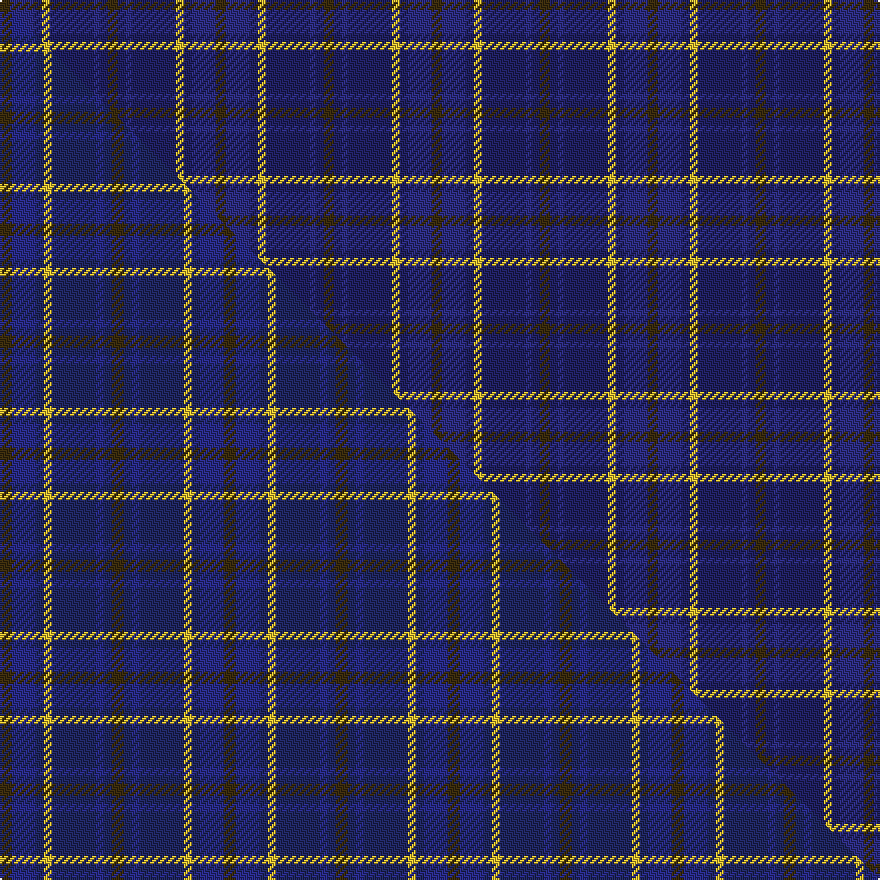

This is one **variant** — a specific cloth: this exact thread count and colourway, with its own
provenance below. It is one weaving of the [sett](/setts/dy5dbi12db4ly4db22dbi3db4dy5/) (the scale-free proportion — the
same cloth at any scale or shade), whose colour order is pattern [GBBBYBBG](/stripes/gbbbybbg/).

Part of the [Daks](/tartans/d/da/daks-4/) tartan — the named design grouping this sett with its other cloths.

Sourced from house-of-tartan.  It is a [8 stripe tartan](/stripes/stripes8/).

Original link [http://www.house-of-tartan.scotland.net/house/TartanViewjs.asp?colr=Def&tnam=1725](http://www.house-of-tartan.scotland.net/house/TartanViewjs.asp?colr=Def&tnam=1725)

## Provenance

Earliest known date: 1987 Submitted in 1981 as a potential Currie sett.

Dataset <small>— provenance for this record, inherited from the source manifest</small>

<dl class="dataset-prov">
<dt>source</dt><dd><a href="/sources/house-of-tartan/">House of Tartan</a></dd>
<dt>data captured from</dt><dd><a href="https://github.com/thetartan/tartan-database/blob/master/data/house-of-tartan/data.csv">https://github.com/thetartan/tartan-database/blob/master/data/house-of-tartan/data.csv</a></dd>
<dt>data date</dt><dd>1987 <small>(this record)</small></dd>
<dt>licence</dt><dd><a href="https://creativecommons.org/licenses/by-nc-nd/4.0/">CC BY-NC-ND 4.0</a></dd>
</dl>

Capture chain <small>— the hands this data passed through, oldest first; each capture carries its own licence</small>

<ol class="capture-chain">
<li><a href="http://www.house-of-tartan.scotland.net/">House of Tartan</a> <small>the weaver/retailer's database — the site is now offline; the URL is kept as the ultimate source's identity</small></li>
<li><a href="https://github.com/thetartan/tartan-database">thetartan/tartan-database</a> <small>2016-2017</small> · <a href="https://creativecommons.org/licenses/by-nc-nd/4.0/">CC BY-NC-ND 4.0</a> <small>Levko Kravets's frozen compilation — the capture we vendored, and where its CC licence text came from</small></li>
<li>this dictionary <small>captured 2026-06-10 · commit 5bf86c7566</small> <small>each re-capture is a git commit to data/sources</small></li>
</ol>

## Thread count
DY/5 DBi12 DB4 LY4 DB22 DBi3 DB4 DY/5

One full sett is **108 threads**.

## Palette
<table><thead><tr><th>Colour</th><th>Shade</th><th>OKLCh</th></tr></thead><tbody><tr><td>DB</td><td><code style="background-color:#2C2C80;">#2C2C80</code> <small style="color:#888">#2C2C80</small></td><td><small style="color:#888">oklch(35.0% 0.138 276.6)</small></td></tr><tr><td>DB</td><td><code style="background-color:#202060;">#202060</code> <small style="color:#888">#202060</small></td><td><small style="color:#888">oklch(28.9% 0.111 276.9)</small></td></tr><tr><td>LY</td><td><code style="background-color:#DCBC32;">#DCBC32</code> <small style="color:#888">#DCBC32</small></td><td><small style="color:#888">oklch(80.0% 0.150 95.2)</small></td></tr><tr><td>DY</td><td><code style="background-color:#3A2B0D;">#3A2B0D</code> <small style="color:#888">#3A2B0D</small></td><td><small style="color:#888">oklch(30.0% 0.049 82.0)</small></td></tr></tbody></table>

# Sample pattern

## Compared to the master

This cloth is one sett of its design; the master sett (the exemplar the design is anchored on) is below for comparison.

Its **ΔTartan distance** from the master is **0.32** — the same measure the nearest-tartans table ranks by (0 is identical; a re-scale of the same cloth is near 0, a recolour or a different proportion further).

<figure class="master-compare" style="margin:0">

this sett
master sett ★

<figcaption style="color:#888;font-size:smaller">One weave of this sett against the <a href="/setts/dy3dbi6db2ly2db11dbi2db2dy3/">master sett ★</a>, split on the diagonal: a shared proportion runs seamlessly across it with only the shades shifting; a different proportion breaks on it.</figcaption>
</figure>

## Nearest tartan variants

The nearest existing variants by ΔTartan distance, with this cloth at the top so the swatches line up against it.

ΔTartan

Threads

Variant

Sett

—

108

<a href="/variants/s8/dy5dbi12db4ly4db22dbi3db4dy5~dbi1406275-db1204274/">Daks Muted blue Trade Tartan</a>

<a href="/ttd/edit/#slug=dy3db6dt2ly2dt11db2dt2dy3~x2~db1406275-dt1204274&amp;base=dy5dbi12db4ly4db22dbi3db4dy5~dbi1406275-db1204274" title="compare in the TTD">0.30</a>

112

<a href="/variants/s8/dy3dbi6db2ly2db11dbi2db2dy3~x2~dbi1406275-db1204274/">Daks (Blue)</a>

<a href="/ttd/edit/#slug=dg7dbi3dg7db22dbi22w3dbi5~x2~dbi1406275-db1404245&amp;base=dy5dbi12db4ly4db22dbi3db4dy5~dbi1406275-db1204274" title="compare in the TTD">2.32</a>

252

<a href="/variants/s7/dg7dbi3dg7db22dbi22w3dbi5~x2~dbi1406275-db1404245/">United Colours of Scotland (Corporat</a>

<a href="/ttd/edit/#slug=o5n12db4oi4db22n3db4o5~o2102055-n1604274-db0805267-oi2104058&amp;base=dy5dbi12db4ly4db22dbi3db4dy5~dbi1406275-db1204274" title="compare in the TTD">2.44</a>

108

<a href="/variants/s8/o5dbi12db4oi4db22dbi3db4o5~o2102055-dbi1604274-db0805267-oi2104058/">Daks, Muted blue</a>

<a href="/ttd/edit/#slug=dt5dp1dt4db4dt7db8w1db2y1~x4&amp;base=dy5dbi12db4ly4db22dbi3db4dy5~dbi1406275-db1204274" title="compare in the TTD">3.19</a>

240

<a href="/variants/s9/dt5dp1dt4db4dt7db8w1db2y1~x4/">Romantic Scotland (Madonna)</a>

<a href="/ttd/edit/#slug=dy12db2dy2db30dt3db2dt13w4~x2~db1406275-dt1204274&amp;base=dy5dbi12db4ly4db22dbi3db4dy5~dbi1406275-db1204274" title="compare in the TTD">3.21</a>

240

<a href="/variants/s8/dy12dbi2dy2dbi30db3dbi2db13w4~x2~dbi1406275-db1204274/">Highlands School (N. Carolina) Corporate Tartan</a>

<a href="/ttd/edit/#slug=ly3dbi24db4dbi4db20g4dp4ly2~x2~dbi1706275-db1404245&amp;base=dy5dbi12db4ly4db22dbi3db4dy5~dbi1406275-db1204274" title="compare in the TTD">3.27</a>

250

<a href="/variants/s8/ly3dbi24db4dbi4db20g4dp4ly2~x2~dbi1706275-db1404245/">Blue Peter</a>

<a href="/ttd/edit/#slug=db16dr2db2dr2db2dr6dg13ly2dg3~x2&amp;base=dy5dbi12db4ly4db22dbi3db4dy5~dbi1406275-db1204274" title="compare in the TTD">3.40</a>

154

<a href="/variants/s9/db16dr2db2dr2db2dr6dg13ly2dg3~x2/">Dewar, Christian (Personal)</a>

<a href="/ttd/edit/#slug=dp30db30n4db4n4db5r6~x2&amp;base=dy5dbi12db4ly4db22dbi3db4dy5~dbi1406275-db1204274" title="compare in the TTD">3.47</a>

260

<a href="/variants/s7/dp30db30n4db4n4db5r6~x2/">Komissarov, Dmitry (Personal)</a>

<a href="/ttd/edit/#slug=dp9db6w1dg4dp2~x4&amp;base=dy5dbi12db4ly4db22dbi3db4dy5~dbi1406275-db1204274" title="compare in the TTD">3.75</a>

132

<a href="/variants/s5/dp9db6w1dg4dp2~x4/">Cathro</a>

<a href="/ttd/edit/#slug=dbi12lb6dbi52db41o12dp6o12~dbi1406275-db1404245&amp;base=dy5dbi12db4ly4db22dbi3db4dy5~dbi1406275-db1204274" title="compare in the TTD">3.75</a>

258

<a href="/variants/s7/dbi12lb6dbi52db41o12dp6o12~dbi1406275-db1404245/">Great Scot</a>

## Neighbour map

Every grey dot is one of 13621 variants placed by the first two principal components of the ΔTartan feature space (42% of its variance). Red is this tartan; blue dots are its nearest — click one to open its page.

<svg viewBox="0 0 640 380" role="img" style="max-width:100%;height:auto;border:1px solid #e0e0e0;border-radius:4px;display:block" xmlns="http://www.w3.org/2000/svg"><image href="/nn/cloud.v1.png" width="640" height="380"/><a href="/variants/s8/dy3dbi6db2ly2db11dbi2db2dy3~x2~dbi1406275-db1204274/"><circle cx="348.4" cy="280.4" r="4" fill="#3465a4"><title>Daks (Blue)</title></circle></a><a href="/variants/s7/dg7dbi3dg7db22dbi22w3dbi5~x2~dbi1406275-db1404245/"><circle cx="354.0" cy="282.6" r="4" fill="#3465a4"><title>United Colours of Scotland (Corporat</title></circle></a><a href="/variants/s8/o5dbi12db4oi4db22dbi3db4o5~o2102055-dbi1604274-db0805267-oi2104058/"><circle cx="312.7" cy="233.0" r="4" fill="#3465a4"><title>Daks, Muted blue</title></circle></a><a href="/variants/s9/dt5dp1dt4db4dt7db8w1db2y1~x4/"><circle cx="359.1" cy="261.1" r="4" fill="#3465a4"><title>Romantic Scotland (Madonna)</title></circle></a><a href="/variants/s8/dy12dbi2dy2dbi30db3dbi2db13w4~x2~dbi1406275-db1204274/"><circle cx="379.4" cy="210.0" r="4" fill="#3465a4"><title>Highlands School (N. Carolina) Corporate Tartan</title></circle></a><a href="/variants/s8/ly3dbi24db4dbi4db20g4dp4ly2~x2~dbi1706275-db1404245/"><circle cx="330.6" cy="216.4" r="4" fill="#3465a4"><title>Blue Peter</title></circle></a><a href="/variants/s9/db16dr2db2dr2db2dr6dg13ly2dg3~x2/"><circle cx="328.1" cy="243.0" r="4" fill="#3465a4"><title>Dewar, Christian (Personal)</title></circle></a><a href="/variants/s7/dp30db30n4db4n4db5r6~x2/"><circle cx="380.8" cy="246.8" r="4" fill="#3465a4"><title>Komissarov, Dmitry (Personal)</title></circle></a><a href="/variants/s5/dp9db6w1dg4dp2~x4/"><circle cx="346.6" cy="277.9" r="4" fill="#3465a4"><title>Cathro</title></circle></a><a href="/variants/s7/dbi12lb6dbi52db41o12dp6o12~dbi1406275-db1404245/"><circle cx="310.1" cy="217.2" r="4" fill="#3465a4"><title>Great Scot</title></circle></a><circle cx="370.4" cy="262.4" r="5" fill="#c00000"/><text x="320" y="376" text-anchor="middle" font-size="11" fill="#999">ground</text><text x="11" y="190" text-anchor="middle" font-size="11" fill="#999" transform="rotate(-90 11 190)">complexity</text></svg>

ID: /variants/s8/dy5dbi12db4ly4db22dbi3db4dy5~dbi1406275-db1204274/
