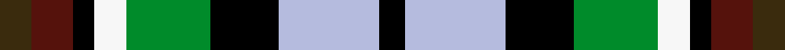

This is one **variant** — a specific cloth: this exact thread count and colourway, with its own
provenance below. It is one weaving of the [sett](/setts/dy6dr8k4w6g16k13lb19k5/) (the scale-free proportion — the
same cloth at any scale or shade), whose colour order is pattern [GBKWGKWK](/stripes/gbkwgkwk/).

Part of the [Kilkenny County, Crest Range](/tartans/k/ki/kilkenny-county-crest-range/) tartan — the named design grouping this sett with its other cloths.

Sourced from register-of-tartans.  It is a [8 stripe tartan](/stripes/stripes8/).

Original link [https://www.tartanregister.gov.uk/tartanDetails.aspx?ref=5363](https://www.tartanregister.gov.uk/tartanDetails.aspx?ref=5363)

Dataset <small>— provenance for this record, inherited from the source manifest</small>

<dl class="dataset-prov">
<dt>source</dt><dd><a href="/sources/register-of-tartans/">Scottish Register of Tartans</a></dd>
<dt>data captured from</dt><dd><a href="https://github.com/thetartan/tartan-database/blob/master/data/register-of-tartans/data.csv">https://github.com/thetartan/tartan-database/blob/master/data/register-of-tartans/data.csv</a></dd>
<dt>data date</dt><dd>01/05/2005 <small>(this record)</small></dd>
<dt>licence</dt><dd><a href="https://www.tartanregister.gov.uk/copyright">Crown copyright</a></dd>
</dl>

Capture chain <small>— the hands this data passed through, oldest first; each capture carries its own licence</small>

<ol class="capture-chain">
<li><a href="https://www.tartanregister.gov.uk/">Scottish Register of Tartans</a> · <a href="https://www.tartanregister.gov.uk/copyright">Crown copyright</a> <small>the living register — still published by National Records of Scotland</small></li>
<li><a href="https://github.com/thetartan/tartan-database">thetartan/tartan-database</a> <small>2016-2017</small> · <a href="https://creativecommons.org/licenses/by-nc-nd/4.0/">CC BY-NC-ND 4.0</a> <small>Levko Kravets's frozen compilation — the capture we vendored, and where its CC licence text came from</small></li>
<li>this dictionary <small>captured 2026-06-10 · commit 5bf86c7566</small> <small>each re-capture is a git commit to data/sources</small></li>
</ol>

## Register references

External register numbers recorded for this tartan.

- Scottish Register of Tartans: [5363](https://www.tartanregister.gov.uk/tartanDetails.aspx?ref=5363)
- Scottish Tartans Authority (ITI): 7405
- Scottish Tartans World Register: 3088

## Thread count
DY/12 DR16 K8 W12 G32 K26 LB38 K/10

One full sett is **286 threads**.

## Palette
<table><thead><tr><th>Colour</th><th>Shade</th><th>OKLCh</th></tr></thead><tbody><tr><td>DR</td><td><code style="background-color:#55120C;">#55120C</code> <small style="color:#888">#55120C</small></td><td><small style="color:#888">oklch(30.0% 0.099 29.3)</small></td></tr><tr><td>DY</td><td><code style="background-color:#3A2B0D;">#3A2B0D</code> <small style="color:#888">#3A2B0D</small></td><td><small style="color:#888">oklch(30.0% 0.049 82.0)</small></td></tr><tr><td>G</td><td><code style="background-color:#008B2A;">#008B2A</code> <small style="color:#888">#008B2A</small></td><td><small style="color:#888">oklch(55.4% 0.170 145.9)</small></td></tr><tr><td>K</td><td><code style="background-color:#000000;">#000000</code> <small style="color:#888">#000000</small></td><td><small style="color:#888">oklch(0.0% 0.000 0.0)</small></td></tr><tr><td>W</td><td><code style="background-color:#F7F7F7;">#F7F7F7</code> <small style="color:#888">#F7F7F7</small></td><td><small style="color:#888">oklch(97.6% 0.000 89.9)</small></td></tr><tr><td>LB</td><td><code style="background-color:#B5BBDE;">#B5BBDE</code> <small style="color:#888">#B5BBDE</small></td><td><small style="color:#888">oklch(79.9% 0.050 277.6)</small></td></tr></tbody></table>

# Sample pattern

## Nearest tartan variants

The nearest existing variants by ΔTartan distance, with this cloth at the top so the swatches line up against it.

ΔTartan

Threads

Variant

Sett

—

286

<a href="/variants/s8/dy6dr8k4w6g16k13lb19k5~x2/">Kilkenny County, Crest Range</a>

<a href="/ttd/edit/#slug=ly6dr8k4w6g16k13lb19k5~x2&amp;base=dy6dr8k4w6g16k13lb19k5~x2" title="compare in the TTD">0.08</a>

286

<a href="/variants/s8/ly6dr8k4w6g16k13lb19k5~x2/">Kilkenny County Crest (Fashion)</a>

<a href="/ttd/edit/#slug=r3dp8g20k20db17k3lg3~x2&amp;base=dy6dr8k4w6g16k13lb19k5~x2" title="compare in the TTD">2.11</a>

284

<a href="/variants/s7/r3dp8g20k20db17k3lg3~x2/">Gracey (2013)</a>

<a href="/ttd/edit/#slug=k13y4g15w4r13w4g15w4db13~x2&amp;base=dy6dr8k4w6g16k13lb19k5~x2" title="compare in the TTD">2.15</a>

288

<a href="/variants/s9/k13y4g15w4r13w4g15w4db13~x2/">Spirit of 1994</a>

<a href="/ttd/edit/#slug=r2k1db6k2g6o2~x4&amp;base=dy6dr8k4w6g16k13lb19k5~x2" title="compare in the TTD">2.18</a>

136

<a href="/variants/s6/r2k1db6k2g6o2~x4/">MacCaughan or MacEachain Clan Tartan</a>

<a href="/ttd/edit/#slug=dr10lb36k24dr30ly8k16w18db16ly9&amp;base=dy6dr8k4w6g16k13lb19k5~x2" title="compare in the TTD">2.21</a>

315

<a href="/variants/s9/dr10lb36k24dr30ly8k16w18db16ly9/">Tipperary County Crest (Fashion)</a>

<a href="/ttd/edit/#slug=y3lp9k3lp4k9g15k9db11w2~x4&amp;base=dy6dr8k4w6g16k13lb19k5~x2" title="compare in the TTD">2.24</a>

500

<a href="/variants/s9/y3lp9k3lp4k9g15k9db11w2~x4/">Hoban (Name)</a>

<a href="/ttd/edit/#slug=k13ly4g15w4r13w4g15w4db13~x2&amp;base=dy6dr8k4w6g16k13lb19k5~x2" title="compare in the TTD">2.29</a>

288

<a href="/variants/s9/k13ly4g15w4r13w4g15w4db13~x2/">Spirit of 1994 (Fashion)</a>

<a href="/ttd/edit/#slug=k4dg16k14ly3t16r4~x2&amp;base=dy6dr8k4w6g16k13lb19k5~x2" title="compare in the TTD">2.30</a>

212

<a href="/variants/s6/k4dg16k14ly3t16r4~x2/">Birse</a>

<a href="/ttd/edit/#slug=dr10lb36k24dr30dy8k16w18db16dy9&amp;base=dy6dr8k4w6g16k13lb19k5~x2" title="compare in the TTD">2.43</a>

315

<a href="/variants/s9/dr10lb36k24dr30dy8k16w18db16dy9/">Tipperary County, Crest Range</a>

<a href="/ttd/edit/#slug=k6lb2db12g8r5k2g3~x4&amp;base=dy6dr8k4w6g16k13lb19k5~x2" title="compare in the TTD">2.45</a>

268

<a href="/variants/s7/k6lb2db12g8r5k2g3~x4/">Cooke (Personal)</a>

## Neighbour map

Every grey dot is one of 13621 variants placed by the first two principal components of the ΔTartan feature space (42% of its variance). Red is this tartan; blue dots are its nearest — click one to open its page.

<svg viewBox="0 0 640 380" role="img" style="max-width:100%;height:auto;border:1px solid #e0e0e0;border-radius:4px;display:block" xmlns="http://www.w3.org/2000/svg"><image href="/nn/cloud.v1.png" width="640" height="380"/><a href="/variants/s8/ly6dr8k4w6g16k13lb19k5~x2/"><circle cx="14.0" cy="212.2" r="4" fill="#3465a4"><title>Kilkenny County Crest (Fashion)</title></circle></a><a href="/variants/s7/r3dp8g20k20db17k3lg3~x2/"><circle cx="64.7" cy="191.2" r="4" fill="#3465a4"><title>Gracey (2013)</title></circle></a><a href="/variants/s9/k13y4g15w4r13w4g15w4db13~x2/"><circle cx="16.9" cy="219.8" r="4" fill="#3465a4"><title>Spirit of 1994</title></circle></a><a href="/variants/s6/r2k1db6k2g6o2~x4/"><circle cx="85.2" cy="221.9" r="4" fill="#3465a4"><title>MacCaughan or MacEachain Clan Tartan</title></circle></a><a href="/variants/s9/dr10lb36k24dr30ly8k16w18db16ly9/"><circle cx="14.0" cy="215.8" r="4" fill="#3465a4"><title>Tipperary County Crest (Fashion)</title></circle></a><a href="/variants/s9/y3lp9k3lp4k9g15k9db11w2~x4/"><circle cx="33.6" cy="184.6" r="4" fill="#3465a4"><title>Hoban (Name)</title></circle></a><a href="/variants/s9/k13ly4g15w4r13w4g15w4db13~x2/"><circle cx="19.9" cy="222.6" r="4" fill="#3465a4"><title>Spirit of 1994 (Fashion)</title></circle></a><a href="/variants/s6/k4dg16k14ly3t16r4~x2/"><circle cx="77.6" cy="226.8" r="4" fill="#3465a4"><title>Birse</title></circle></a><a href="/variants/s9/dr10lb36k24dr30dy8k16w18db16dy9/"><circle cx="14.0" cy="213.8" r="4" fill="#3465a4"><title>Tipperary County, Crest Range</title></circle></a><a href="/variants/s7/k6lb2db12g8r5k2g3~x4/"><circle cx="70.8" cy="214.8" r="4" fill="#3465a4"><title>Cooke (Personal)</title></circle></a><circle cx="14.0" cy="211.5" r="5" fill="#c00000"/><text x="320" y="376" text-anchor="middle" font-size="11" fill="#999">ground</text><text x="11" y="190" text-anchor="middle" font-size="11" fill="#999" transform="rotate(-90 11 190)">complexity</text></svg>

ID: /variants/s8/dy6dr8k4w6g16k13lb19k5~x2/
